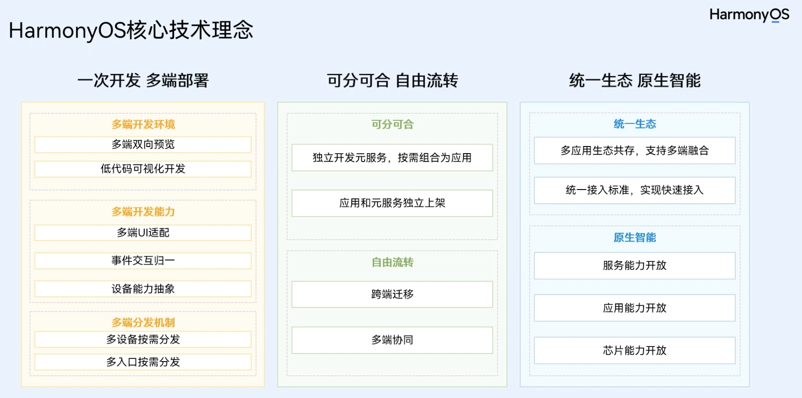
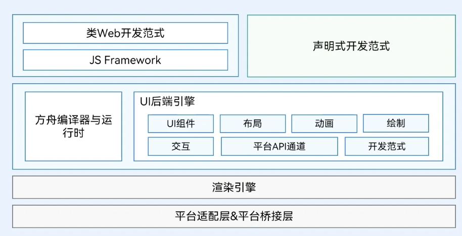
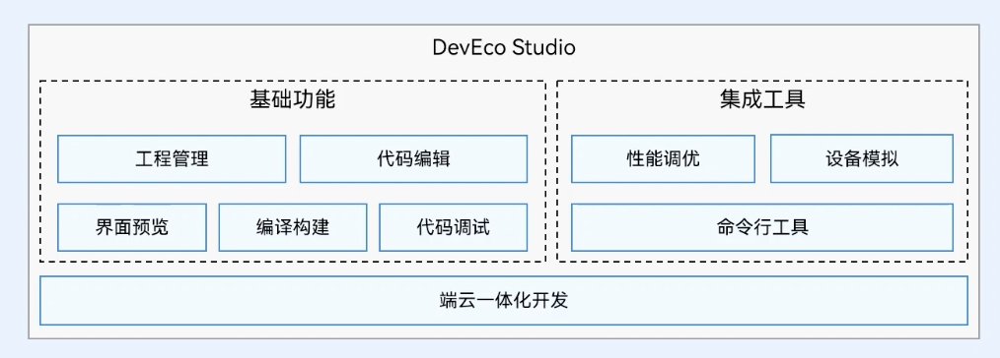
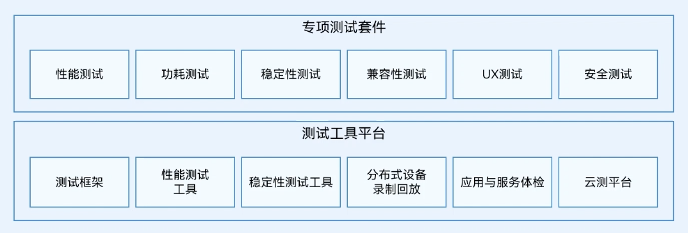
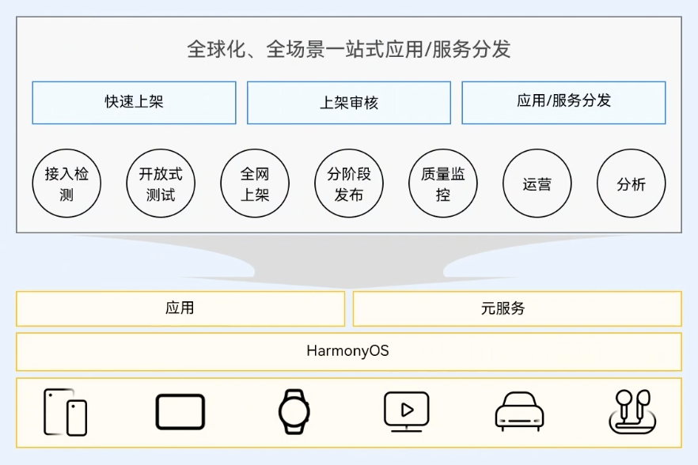

### 一、应用开发的基于、挑战和趋势

---

新的应用生态应该具备如下特征：

- **单一设备延伸到多设备**：应用一次开发就能在多个设备上运行，软件实体能够从单一设备转移到其他设备上，且多个设备间能够协同运行，给消费者提供全新的分布式体验。
- **厚重应用模式到轻量化服务模式**：提供轻量化的服务，最小化资源消耗，一步直达，快速完成消费者特定场景的任务。
- **集中化分发到AI加持下的智慧分发**：为消费者提供智慧场景服务，实现“服务找人”。
- **纯软件到软硬芯协同的AI能力**：提供软硬芯协同优化的原生AI能力，全面满足应用高性能诉求。

HarmonyOS是新一代的智能终端操作系统，为不同设备的智能化、互联与协同提供了统一的语言，为用户带来简捷，流畅，连续，安全可靠的全场景交互体验。

### 二、HarmonyOS核新技术理念

---

HarmonyOS结合移动生态发展的趋势，提出了三大技术理念：

1. **一次开发，多端部署；**
2. **可分可合，自由流转；**
3. **统一生态，原生智能。**

核心技术理念详细内容可参考[《鸿蒙生态应用开发白皮书》](https://developer.huawei.com/consumer/cn/doc/guidebook/harmonyecoapp-guidebook-0000001761818040)，此白皮书全面阐释了HarmonyOS生态下应用开发核心理念、关键能力以及创新体验，旨在帮助开发者快速、准确、全面的了解HarmonyOS开发套件给开发者提供的能力全景和未来的愿景。

另外，[《鸿蒙生态应用安全技术白皮书》](https://developer.huawei.com/consumer/cn/doc/guidebook/harmonyecoappsecurity-guidebook-0000001808819033)全面阐述了HarmonyOS生态下应用安全核心理念；通过应用开发、应用发布、应用安装运行三个阶段，构建关键安全能力，从始至终贯彻应用安全核心理念，帮助开发者快速理解HarmonyOS生态应用安全设计，提升应用开发安全质量。

### 三、高效开发和测试

---

#### 3.1 ArkUI框架

#### 3.2 集成开发环境

#### 3.3 测试工具

### 四、上架与分发

---

HUAWEI AppGallery Connect

