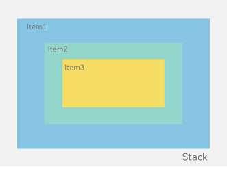
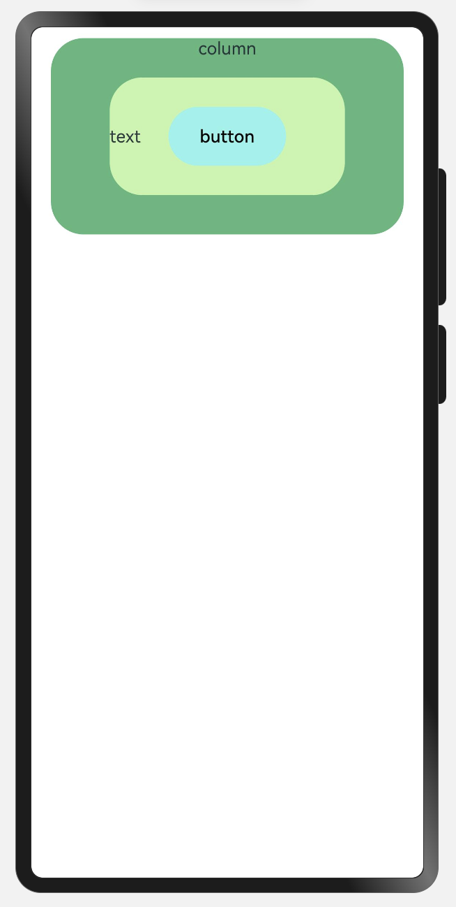
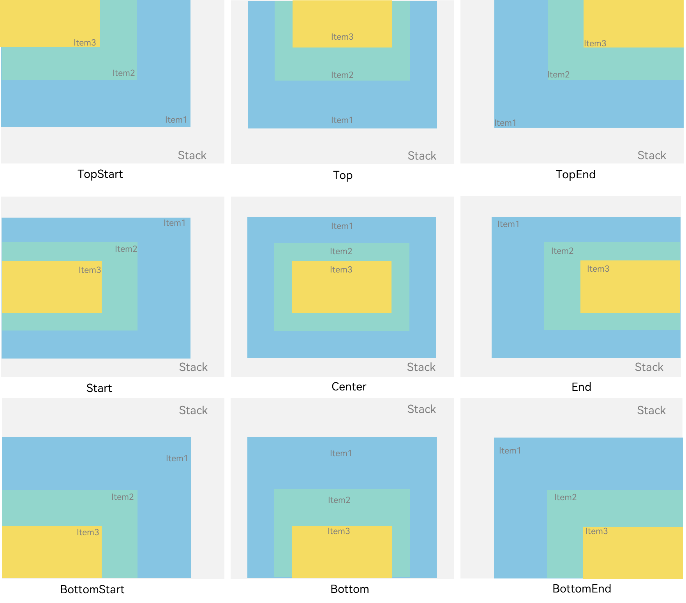

### 一、概述

---

层叠布局（StackLayout）用于在屏幕上预留一块区域来显示组件中的元素，提供元素可以重叠的布局。层叠布局通过[Stack](https://developer.huawei.com/consumer/cn/doc/harmonyos-references-V5/ts-container-stack-V5)容器组件实现位置的固定定位与层叠，容器中的子元素依次入栈，后一个子元素覆盖前一个子元素，子元素可以叠加，也可以设置位置。

层叠布局具有较强的页面层叠、位置定位能力，其使用场景有**广告**、**卡片层叠效果**等。

Stack作为容器，容器内的子元素的顺序为Item1->Item2->Item3。




### 二、开发布局

---

Stack组件为容器组件，容器内可包含各种子元素。其中子元素默认进行居中堆叠。子元素被约束在Stack下，进行自己的样式定义以及排列。

```typescript
let MTop: Record<string, number> = { 'top': 10 }

@Entry
@Component
struct StackLayout {
  build() {
    Stack({ alignContent: Alignment.Center }) {
      Column() {
        Text('column')
      }.width('90%').height('100%').backgroundColor('#ff58b87c').borderRadius(30)

      Text('text').width('60%').height('60%').backgroundColor('#ffc3f6aa').borderRadius(30)
      Button('button').width('30%').height('30%').backgroundColor('#ff8ff3eb').fontColor('#000')
    }.width('100%').height(180).margin(MTop)

  }
}
```




### 三、对齐方式

---

Stack组件通过[alignContent参数](https://developer.huawei.com/consumer/cn/doc/harmonyos-references-V5/ts-appendix-enums-V5#alignment)实现位置的相对移动。如图2所示，支持九种对齐方式。




### 四、Z序控制

---

Stack容器中兄弟组件显示层级关系可以通过[Z序控制](https://developer.huawei.com/consumer/cn/doc/harmonyos-references-V5/ts-universal-attributes-z-order-V5)的zIndex属性改变。zIndex值越大，显示层级越高，即**zIndex值大的组件会覆盖在zIndex值小的组件上方**。

在层叠布局中，如果后面子元素尺寸大于前面子元素尺寸，则前面子元素完全隐藏。