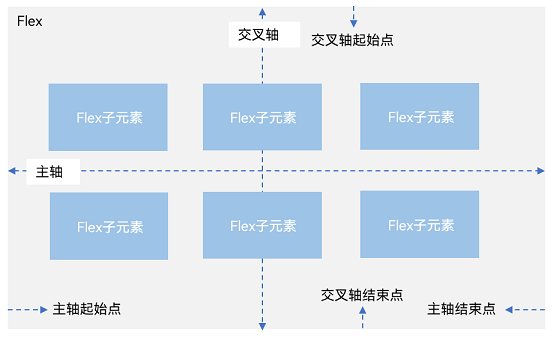
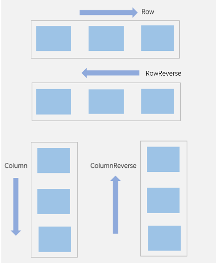

### 一、概述

---

弹性布局（[Flex](https://developer.huawei.com/consumer/cn/doc/harmonyos-references-V5/ts-container-flex-V5)）提供更加有效的方式对容器中的子元素进行排列、对齐和分配剩余空间。常用于页面头部导航栏的均匀分布、页面框架的搭建、多行数据的排列等。

容器默认存在主轴与交叉轴，子元素默认沿主轴排列，子元素在主轴方向的尺寸称为主轴尺寸，在交叉轴方向的尺寸称为交叉轴尺寸。

### 二、基本概念

---

- 主轴：Flex组件布局方向的轴线，子元素默认沿着主轴排列。主轴开始的位置称为主轴起始点，结束位置称为主轴结束点。
- 交叉轴：垂直于主轴方向的轴线。交叉轴开始的位置称为交叉轴起始点，结束位置称为交叉轴结束点。

### 三、布局方向

---

在弹性布局中，容器的子元素可以按照任意方向排列。通过设置参数direction，可以决定主轴的方向，从而控制子元素的排列方向。

- FlexDirection.Row（默认值）：主轴为水平方向，子元素从起始端沿着水平方向开始排布。
- FlexDirection.RowReverse：主轴为水平方向，子元素从终点端沿着FlexDirection. Row相反的方向开始排布。
- FlexDirection.Column：主轴为垂直方向，子元素从起始端沿着垂直方向开始排布。
- FlexDirection.ColumnReverse：主轴为垂直方向，子元素从终点端沿着FlexDirection. Column相反的方向开始排布。

### 四、布局换行

---

弹性布局分为**单行布局**和**多行布局**。

默认情况下，Flex容器中的子元素都排在一条线（又称“轴线”）上。wrap属性控制当子元素主轴尺寸之和大于容器主轴尺寸时，Flex是单行布局还是多行布局。在多行布局时，通过交叉轴方向，确认新行排列方向。

- FlexWrap. NoWrap（默认值）：不换行。如果子元素的宽度总和大于父元素的宽度，则子元素会被压缩宽度。
- FlexWrap. Wrap：换行，每一行子元素按照主轴方向排列。
- FlexWrap. WrapReverse：换行，每一行子元素按照主轴反方向排列。

### 五、主轴对齐方式

---

通过justifyContent参数设置子元素在主轴方向的对齐方式。

- FlexAlign.Start（默认值）：子元素在主轴方向起始端对齐， 第一个子元素与父元素边沿对齐，其他元素与前一个元素对齐。
- FlexAlign.Center：子元素在主轴方向居中对齐。
- FlexAlign.End：子元素在主轴方向终点端对齐, 最后一个子元素与父元素边沿对齐，其他元素与后一个元素对齐。
- FlexAlign.SpaceBetween：Flex主轴方向均匀分配弹性元素，相邻子元素之间距离相同。第一个子元素和最后一个子元素与父元素边沿对齐。
- FlexAlign.SpaceAround：Flex主轴方向均匀分配弹性元素，相邻子元素之间距离相同。第一个子元素到主轴起始端的距离和最后一个子元素到主轴终点端的距离是相邻元素之间距离的一半。
- FlexAlign.SpaceEvenly：Flex主轴方向元素等间距布局，相邻子元素之间的间距、第一个子元素与主轴起始端的间距、最后一个子元素到主轴终点端的间距均相等。

### 六、交叉轴对齐方式

---

容器和子元素都可以设置交叉轴对齐方式，且子元素设置的对齐方式优先级较高。

#### 6.1 

