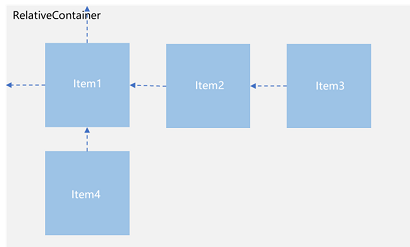
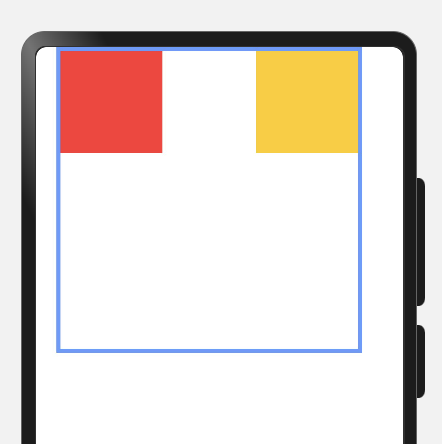
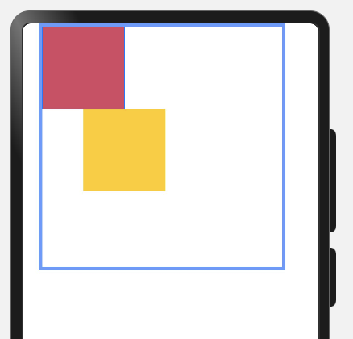
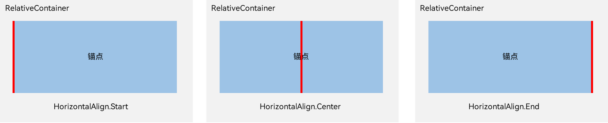
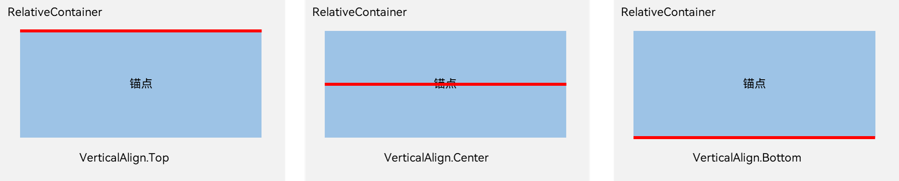

### 一、概述

---

RelativeContainer为采用相对布局的容器，支持容器内部的子元素设置相对位置关系，适用于界面复杂场景的情况，对多个子组件进行对齐和排列。子元素支持指定兄弟元素作为锚点，也支持指定父容器作为锚点，基于锚点做相对位置布局。下图是一个RelativeContainer的概念图，图中的虚线表示位置的依赖关系。



子元素并不完全是上图中的依赖关系。比如，Item4可以以Item2为依赖锚点，也可以以RelativeContainer父容器为依赖锚点。


### 二、基本概念

---

- 锚点：通过锚点设置当前元素基于哪个元素确定位置。
- 对齐方式：通过对齐方式，设置当前元素是基于锚点的上中下对齐，还是基于锚点的左中右对齐。


### 三、设置依赖关系

---

#### 3.1 锚点设置

锚点设置是指设置子元素相对于父元素或兄弟元素的位置依赖关系。在水平方向上，可以设置left、middle、right的锚点。在竖直方向上，可以设置top、center、bottom的锚点。

为了明确定义锚点，必须为RelativeContainer及其子元素设置ID，用于指定锚点信息。ID默认为“__container__”，其余子元素的ID通过id属性设置。未设置ID的子元素在RelativeContainer中不会显示。互相依赖，环形依赖时容器内子组件全部不绘制。同方向上两个以上位置设置锚点，但锚点位置逆序时此子组件大小为0，即不绘制。

- RelativeContainer父组件为锚点，__container__代表父容器的ID。

  ```typescript
  let AlignRus: Record<string, Record<string, string | VerticalAlign | HorizontalAlign>> = {
    'top': { 'anchor': '__container__', 'align': VerticalAlign.Top },
    'left': { 'anchor': '__container__', 'align': HorizontalAlign.Start }
  }
  let AlignRue: Record<string, Record<string, string | VerticalAlign | HorizontalAlign>> = {
    'top': { 'anchor': '__container__', 'align': VerticalAlign.Top },
    'right': { 'anchor': '__container__', 'align': HorizontalAlign.End }
  }
  
  @Entry
  @Component
  struct RelativeContainerLayout {
    build() {
      RelativeContainer() {
        Row()
          .width(100)
          .height(100)
          .backgroundColor('#FF3333')
          .alignRules(AlignRus)
          .id('row1')
  
        Row()
          .width(100)
          .height(100)
          .backgroundColor('#FFCC00')
          .alignRules(AlignRue)
          .id('row2')
  
      }.width(300).height(300).margin({ left: 20 }).border({ width: 4, color: '#6699FF' })
    }
  }
  ```

  

- 以兄弟元素为锚点

  ```typescript
  let AlignRus: Record<string, Record<string, string | VerticalAlign | HorizontalAlign>> = {
    'top': { 'anchor': '__container__', 'align': VerticalAlign.Top },
    'left': { 'anchor': '__container__', 'align': HorizontalAlign.Start }
  }
  
  let RelConB: Record<string, Record<string, string | VerticalAlign | HorizontalAlign>> = {
    'top': { 'anchor': 'row1', 'align': VerticalAlign.Bottom },
    'left': { 'anchor': 'row1', 'align': HorizontalAlign.Center }
  }
  
  @Entry
  @Component
  struct RelativeContainerLayout {
    build() {
      RelativeContainer() {
        Row()
          .width(100)
          .height(100)
          .backgroundColor('#FF3333')
          .alignRules(AlignRus)
          .id('row1')
  
        Row()
          .width(100)
          .height(100)
          .backgroundColor('#FFCC00')
          .alignRules(RelConB)
          .id('row2')
  
      }.width(300).height(300).margin({ left: 20 }).border({ width: 4, color: '#6699FF' })
    }
  }
  ```

  

- 子组件锚点可以任意选择，但需注意不要相互依赖。

#### 3.2 设置相对于锚点的对齐位置

设置了锚点之后，可以通过align设置相对于锚点的对齐位置。

在水平方向上，对齐位置可以设置为HorizontalAlign.Start、HorizontalAlign.Center、HorizontalAlign.End。



在竖直方向上，对齐位置可以设置为VerticalAlign.Top、VerticalAlign.Center、VerticalAlign.Bottom。



#### 3.3 子组件位置偏移

子组件经过相对位置对齐后，位置可能还不是目标位置，开发者可根据需要进行额外偏移设置offset。

```typescript
```


