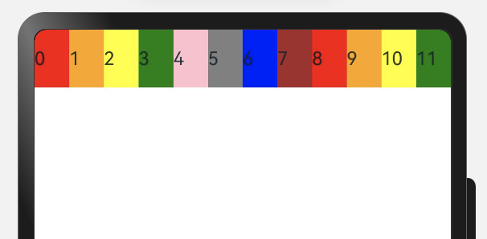

### 一、概述

---

栅格布局是一种通用的辅助定位工具，对移动设备的界面设计有较好的借鉴作用。主要优势包括：

1. 提供可循的规律：栅格布局可以为布局提供规律性的结构，解决多尺寸多设备的动态布局问题。通过将页面划分为等宽的列数和行数，可以方便地对页面元素进行定位和排版。
2. 统一的定位标注：栅格布局可以为系统提供一种统一的定位标注，保证不同设备上各个模块的布局一致性。这可以减少设计和开发的复杂度，提高工作效率。
3. 灵活的间距调整方法：栅格布局可以提供一种灵活的间距调整方法，满足特殊场景布局调整的需求。通过调整列与列之间和行与行之间的间距，可以控制整个页面的排版效果。
4. 自动换行和自适应：栅格布局可以完成一对多布局的自动换行和自适应。当页面元素的数量超出了一行或一列的容量时，他们会自动换到下一行或下一列，并且在不同的设备上自适应排版，使得页面布局更加灵活和适应性强。

[GridRow](https://developer.huawei.com/consumer/cn/doc/harmonyos-references-V5/ts-container-gridrow-V5)为栅格容器组件，需与栅格子组件[GridCol](https://developer.huawei.com/consumer/cn/doc/harmonyos-references-V5/ts-container-gridcol-V5)在栅格布局场景中联合使用。


### 二、栅格容器GridRow

---

#### 2.1 栅格系统断点

栅格系统以设备的水平宽度（**屏幕密度像素值**，单位vp）作为断点依据，定义设备的宽度类型，形成了一套断点规则。开发者可根据需求在不同的断点区间实现不同的页面布局效果。

栅格系统默认断点将设备宽度分为xs、sm、md、lg四类，尺寸范围如下：

| 断点名称 | 取值范围（vp） | 设备描述           |
| -------- | -------------- | ------------------ |
| xs       | [0, 320）      | 最小宽度类型设备。 |
| sm       | [320, 520)     | 小宽度类型设备。   |
| md       | [520, 840)     | 中等宽度类型设备。 |
| lg       | [840, +∞)      | 大宽度类型设备。   |


在GridRow栅格组件中，允许开发者使用breakpoints自定义修改断点的取值范围，最多支持6个端点，除了默认的四个断点外，还可以启用xl，xxl两个断点，支持六种不同尺寸（xs，sm，md，lg，xl，xxl）设备的布局设置。

| 断点名称 | 设备描述           |
| -------- | ------------------ |
| xs       | 最小宽度类型设备。 |
| sm       | 小宽度类型设备。   |
| md       | 中等宽度类型设备。 |
| lg       | 大宽度类型设备。   |
| xl       | 特大宽度类型设备。 |
| xxl      | 超大宽度类型设备。 |

- 针对断点位置，开发者根据实际使用场景，通过一个单调递增数组设置。由于breakpoints最多支持六个断点，单调递增数组长度最大为5。

  ```typescript
  breakpoints: {value: ['100vp', '200vp']}
  ```

  表示启用xs、sm、md共3个断点，小于100vp为xs，100vp-200vp为sm，大于200vp为md。

  ```typescript
  breakpoints: {value: ['320vp', '520vp', '840vp', '1080vp']}
  ```

  表示启用xs、sm、md、lg、xl共5个断点，小于320vp为xs，320vp-520vp为sm，520vp-840vp为md，840vp-1080vp为lg，大于1080vp为xl。

- 栅格系统通过监听窗口或容器的尺寸变化进行断点，通过reference设置断点切换参考物。 考虑到应用可能以非全屏窗口的形式显示，以应用窗口宽度为参照物更为通用。

例如，使用栅格的默认列数12列，通过断点设置将应用宽度分成六个区间，在各区间中，每个栅格子元素占用的列数均不同。

```typescript
@Entry
@Component
struct GridLayout {
  @State bgColors: Color[] =
    [Color.Red, Color.Orange, Color.Yellow, Color.Green, Color.Pink, Color.Grey, Color.Blue, Color.Brown];

  build() {
    GridRow({
      breakpoints: {
        value: ['200vp', '300vp', '400vp', '500vp', '600vp'],
        reference: BreakpointsReference.WindowSize
      }
    }) {
      ForEach(this.bgColors, (color: Color, index?: number | undefined) => {
        GridCol({
          span: {
            xs: 2, // 在最小宽度类型设备上，栅格子组件占据的栅格容器2列。
            sm: 3, // 在小宽度类型设备上，栅格子组件占据的栅格容器3列。
            md: 4, // 在中等宽度类型设备上，栅格子组件占据的栅格容器4列。
            lg: 6, // 在大宽度类型设备上，栅格子组件占据的栅格容器6列。
            xl: 8, // 在特大宽度类型设备上，栅格子组件占据的栅格容器8列。
            xxl: 12 // 在超大宽度类型设备上，栅格子组件占据的栅格容器12列。
          }
        }) {
          Row() {
            Text(`${index}`)
          }.width("100%").height('50vp')
        }.backgroundColor(color)
      })
    }
  }
}
```

#### 2.2 布局的总列数

GridRow中通过columns设置栅格布局的总列数。

- columns默认值为12，即在未设置columns时，任何断点下，栅格布局被分成12列。

  ```typescript
  @State bgColors: Color[] = [Color.Red, Color.Orange, Color.Yellow, Color.Green, Color.Pink, Color.Grey, Color.Blue, Color.Brown,Color.Red, Color.Orange, Color.Yellow, Color.Green];
  
  GridRow() {
    ForEach(this.bgColors, (item:Color, index?:number|undefined) => {
      GridCol() {
        Row() {
            Text(`${index}`)
        }.width('100%').height('50')
      }.backgroundColor(item)
    })
  }           
  ```

  

- 当columns为自定义值，栅格布局在任何尺寸设备下都被分为columns列。下面分别设置栅格布局列数为4和8，子元素默认占一列，效果如下：

  ```typescript
  class CurrTmp{
    currentBp: string = 'unknown';
    set(val:string){
      this.currentBp = val
    }
  }
  let BorderWH:Record<string,Color|number> = { 'color': Color.Blue, 'width': 2 }
  @State bgColors: Color[] = [Color.Red, Color.Orange, Color.Yellow, Color.Green, Color.Pink, Color.Grey, Color.Blue, Color.Brown];
  @State currentBp: string = 'unknown';
  ...
  Row() {
    GridRow({ columns: 4 }) {
      ForEach(this.bgColors, (item:Color, index?:number|undefined) => {
        GridCol() {
          Row() {
            Text(`${index}`)
          }.width('100%').height('50')
        }.backgroundColor(item)
      })
    }
    .width('100%').height('100%')
    .onBreakpointChange((breakpoint:string) => {
      let CurrSet:CurrTmp = new CurrTmp()
      CurrSet.set(breakpoint)
    })
  }
  .height(160)
  .border(BorderWH)
  .width('90%')
  
  Row() {
    GridRow({ columns: 8 }) {
      ForEach(this.bgColors, (item:Color, index?:number|undefined) => {
          GridCol() {
            Row() {
              Text(`${index}`)
            }.width('100%').height('50')
          }.backgroundColor(item)
      })
    }
    .width('100%').height('100%')
    .onBreakpointChange((breakpoint:string) => {
      let CurrSet:CurrTmp = new CurrTmp()
      CurrSet.set(breakpoint)
    })
  }
  .height(160)
  .border(BorderWH)
  .width('90%')
  ```

- 


