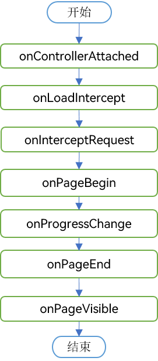

### 一、概述

---

开发者可以使用Web组件**加载本地或者在线网页**。

Web组件提供了丰富的组件生命周期回调接口，通过这些回调接口，开发者可以感知Web组件的生命周期状态变化，进行相关的业务处理。

Web组件的状态主要包括：Controller绑定到Web组件、网页加载开始、网页加载进度、网页加载结束、页面即将可见等。

web组件网页正常加载过程中的回调事件：

### 二、Web组件网页加载的状态说明

---

- **aboutToAppear函数**：在创建自定义组件的新实例后，在执行其build函数前执行。一般建议在此设置WebDebug调试模式setWebDebuggingAccess、设置Web内核自定义协议URL的跨域请求与fetch请求的权限 customizeSchemes、设置Cookie configCookie等。
- 

