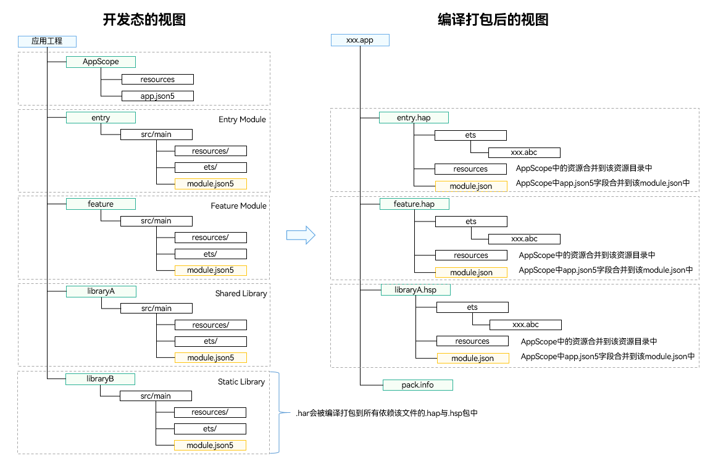
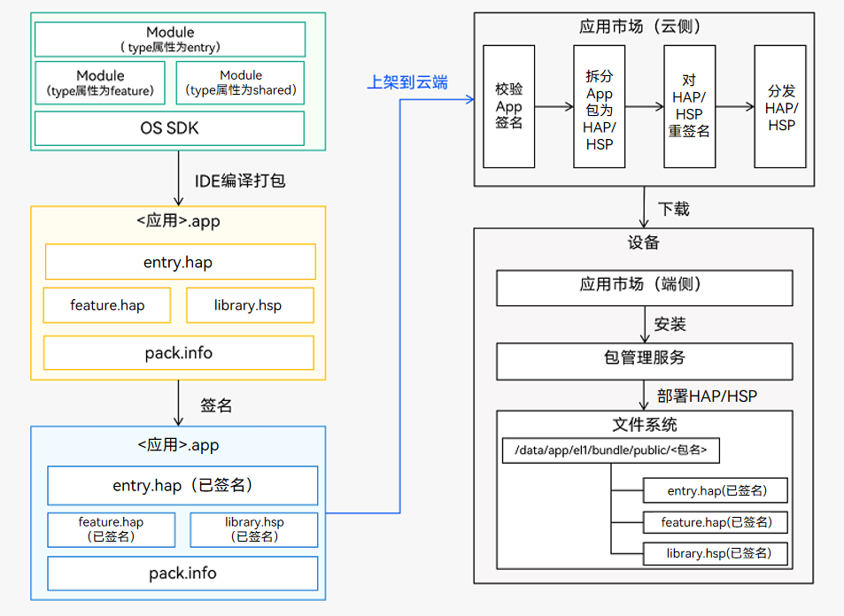

### 一、应用程序包概述

---

#### 1.1应用的多Module设计机制

- **支持模块化开发：** 一个应用通常会包含多种功能，将不同的功能特性按模块来划分和管理是一种良好的设计方式。在开发过程中，我们可以将每个功能模块作为一个独立的Module进行开发，Module中可以包含源代码、资源文件、第三方库、配置文件等，每一个Module可以独立编译，实现特定的功能。这种模块化、松耦合的应用管理方式有助于应用的开发、维护与扩展。
- **支持多设备适配：** 一个应用往往需要适配多种设备类型，在采用多Module设计的应用中，每个Module都会标注所支持的设备类型。有些Module支持全部类型的设备，有些Module只支持某一种或几种型的设备（比如平板），那么在应用市场分发应用包时，也能够根据设备类型做精准的筛选和匹配，从而将不同的包合理的组合和部署到对应的设备上。

#### 1.2 Module类型

Module按照使用场景可以分为两种类型：

1. **Ability类型**：用于实现应用的功能和特性。每一个Ability类型的Module编译后，会生成一个以`.hap`为后缀的文件，我们称其为HAP（Harmony Ability Package）包。HAP包可以独立安装和运行，是应用安装的基本单位，一个应用中可以包含一个或多个HAP包，具体包含如下两种类型。
   - **entry类型**的Module：**应用的主模块**，包含应用的入口界面、入口图标和主功能特性，编译后生成entry类型的HAP。每一个应用分发到同一类型的设备上的应用程序包，只能包含唯一一个entry类型的HAP。
   - **feature类型**的Module：**应用的动态特性模块**，编译后生成feature类型的HAP。一个应用中可以包含一个或多个feature类型的HAP，也可以不包含。
2. **Library类型**：用于实现代码和资源的共享。同一个Library类型的Module可以被其他的Module多次引用，合理地使用该类型的Module，能够降低开发和维护成本。Library类型的Module分为Static和Shared两种类型，编译后会生成共享包。
   - **Static Library**：静态共享库。编译后会生成一个以`.har`为后缀的文件，即静态共享包HAR（Harmony Archive）。
   - **Shared Library**：动态共享库。编译后会生成一个以`.hsp`为后缀的文件，即动态共享包HSP（Harmony Shared Package）。

>实际上，Shared Library编译后除了会生成一个.hsp文件，还会生成一个.har文件。这个.har文件中包含了HSP对外导出的接口，应用中的其他模块需要通过.har文件来引用HSP的功能。为了表述方便，我们通常认为Shared Library编译后生成HSP。

#### 1.3 HAR与HSP两种共享包的主要区别

| 共享包类型 | 编译和运行方式                                               | 发布和引用方式                                               |
| ---------- | ------------------------------------------------------------ | ------------------------------------------------------------ |
| HAR        | HAR中的代码和资源跟随使用方编译，如果有多个使用方，它们的编译产物中会存在多份相同拷贝。 | HAR除了支持应用内引用，还可以独立打包发布，供其他应用引用。  |
| HSP        | HSP中的代码和资源可以独立编译，运行时在一个进程中代码也只会存在一份。 | HSP一般随应用进行打包，当前支持应用内和集成态HSP。应用内HSP只支持应用内引用，集成态HSP支持发布到ohpm私仓和跨应用引用。 |


### 二、应用程序包结构

---

#### 2.1 Stage模型应用程序包结构

##### 2.1.1 开发态包结构


>- AppScope 目录是由DevEco Studio自动生成，不可更改。
>- Module目录名称可以由DevEco Studio自动生成（比如entry、library等），也可以自定义。为了便于说明，下表中统一采用Module_name表示。

| 文件类型      | 说明                                                         |
| ------------- | ------------------------------------------------------------ |
| 配置文件      | 包括应用级配置信息、以及Module级配置信息：<br/>AppScope > app.json5：**app.json5**配置文件，用于声明应用的全局配置信息，比如应用Bundle名称、应用名称、应用图标、应用版本号等。<br/>Module_name > src > main > module.json5：**module.json5**配置文件，用于声明Module基本信息、支持的设备类型、所含的组件信息、运行所需申请的权限等。 |
| ArkTS源码文件 | Module_name > src > main > ets：用于存放Module的ArkTS源码文件（.ets文件）。 |
| 资源文件      | 包括应用级资源文件、以及Module级资源文件，支持图形、多媒体、字符串、布局文件等，详见[资源分类与访问](https://developer.huawei.com/consumer/cn/doc/harmonyos-guides-V5/resource-categories-and-access-V5)。<br/>AppScope > resources ：用于存放应用需要用到的资源文件。<br/>Module_name > src > main > resources ：用于存放该Module需要用到的资源文件。 |
| 其他配置文件  | 用于编译构建，包括构建配置文件、编译构建任务脚本、混淆规则文件、依赖的共享包信息等。<br/>**build-profile.json5**：工程级或Module级的构建配置文件，包括应用签名、产品配置等。<br/>**hvigorfile.ts**：应用级或Module级的编译构建任务脚本，开发者可以自定义编译构建工具版本、控制构建行为的配置参数。<br/>**obfuscation-rules.txt**：混淆规则文件。混淆开启后，在使用Release模式进行编译时，会对代码进行编译、混淆及压缩处理，保护代码资产。<br/>**oh-package.json5**：用于存放依赖库的信息，包括所依赖的三方库和共享包。 |

**app.json5**

```json
/*应用级配置信息*/
{
  "app": {
    // 应用包名
    "bundleName": "com.example.helloworld",
    //指定应用的供应商或者厂商名称
    "vendor": "chance",
    //应用版本代码
    "versionCode": 1000000,
    //应用版本名称
    "versionName": "1.0.0",
    //应用图标
    "icon": "$media:app_icon",
    //应用名称
    "label": "$string:app_name"
  }
}
```

**module.json5**

```json
/*Module级配置信息*/
{
  "module": {
    //模块名称
    "name": "entry",
    //entry表明此模块作为应用程序的入口点
    "type": "entry",
    //模块描述
    "description": "$string:module_desc",
    //指定应用的主要入口能力组件。
    "mainElement": "EntryAbility",
    //列出该模块支持的设备类型
    "deviceTypes": [
      "phone",
      "tablet",
      "2in1"
    ],
    //应用在分发时会自动安装
    "deliveryWithInstall": true,
    //表示应用需要安装才能运行，不是免安装的
    "installationFree": false,
    //应用页面的配置，通常从资源文件中引用
    "pages": "$profile:main_pages",
    //定义应用的能力组件
    "abilities": [
      {
        // 界面能力
        "name": "EntryAbility",
        //指向该能力组件的源代码路径
        "srcEntry": "./ets/entryability/EntryAbility.ets",
        "description": "$string:EntryAbility_desc",
        "icon": "$media:layered_image",
        "label": "$string:EntryAbility_label",
        "startWindowIcon": "$media:startIcon",
        "startWindowBackground": "$color:start_window_background",
        //表示该能力可以被其他应用访问
        "exported": true,
        //定义能力组件能够响应的动作和实体
        "skills": [
          {
            "entities": [
              "entity.system.home"
            ],
            "actions": [
              "action.system.home"
            ]
          }
        ]
      }
    ],
    //扩展能力
    "extensionAbilities": [
      {
        //备份类型的扩展能力
        "name": "EntryBackupAbility",
        "srcEntry": "./ets/entrybackupability/EntryBackupAbility.ets",
        "type": "backup",
        //不对外公开
        "exported": false,
        "metadata": [
          {
            "name": "ohos.extension.backup",
            "resource": "$profile:backup_config"
          }
        ],
      }
    ]
  }
}
```

##### 2.1.2 编译态包结构

不同类型的Module编译后会生成对应的HAP、HAR、HSP等文件，开发态视图与编译态视图的对照关系如下：



从开发态到编译态，Module中的文件会发生如下变更：

- **ets目录**：ArkTS源码编译生成`.abc`文件。
- **resources目录**：AppScope目录下的资源文件会合入到Module下面资源目录中，如果两个目录下的存在重名文件，编译打包后只会保留AppScope目录下的资源文件。
- **module配置文件**：AppScope目录下的app.json5文件字段会合入到Module下面的module.json5文件之中，编译后生成HAP或HSP最终的module.json文件。

>在编译HAP和HSP时，会把他们所依赖的HAR直接编译到HAP和HSP中。

##### 2.1.3 发布态包结构

每个应用中**至少包含一个.hap文件**，可能包含若干个.hsp文件、也可能不含，一个应用中的所有.hap与.hsp文件合在一起称为**Bundle**，其对应的bundleName是应用的唯一标识（详见app.json5配置文件中的bundleName标签）。

当应用发布上架到应用市场时，需要将Bundle打包为一个.app后缀的文件用于上架，这个.app文件称为**App Pack**（Application Package），与此同时，DevEco Studio工具自动会生成一个**pack.info**文件。**pack.info**文件描述了App Pack中每个HAP和HSP的属性，包含APP中的bundleName和versionCode信息、以及Module中的name、type和abilities等信息。

>- App Pack是发布上架到应用市场的基本单元，但是不能在设备上直接安装和运行。
>- 在应用签名、云端分发、端侧安装时，都是以HAP/HSP为单位进行签名、分发和安装的。

##### 2.1.4 编译发布与上架部署流程图



##### 2.1.5 选择合适的包类型

HAP、HAR、HSP三者的功能和使用场景总结对比如下：

| Module类型     | 包类型 | 说明                                                         |
| -------------- | ------ | ------------------------------------------------------------ |
| Ability        | HAP    | 应用的功能模块，可以独立安装和运行，必须包含一个entry类型的HAP，可选包含一个或多个feature类型的HAP。 |
| Static Library | HAR    | 静态共享包，编译态复用。<br/>支持应用内共享，也可以发布后供其他应用使用。<br/>作为二方库，发布到OHPM私仓，供公司内部其他应用使用。<br/>作为三方库，发布到OHPM中心仓，供其他应用使用。<br/>多包（HAP/HSP）引用相同的HAR时，会造成多包间代码和资源的重复拷贝，从而导致应用包膨大。 |
| Shared Lirary  | HSP    | 动态共享包，运行时复用。<br/>当前仅支持应用内共享。<br/>当多包（HAP/HSP）同时引用同一个共享包时，采用HSP替代HAR，可以避免HAR造成的多包间代码和资源的重复拷贝，从而减小应用包大小。 |

| 规格                                                         | HAP  | HAR  | HSP  |
| ------------------------------------------------------------ | ---- | ---- | ---- |
| 支持在配置文件中声明 UIAbility 组件与ExtensionAbility组件    | √    | ×    | ×    |
| 支持在配置文件中声明[pages](https://developer.huawei.com/consumer/cn/doc/harmonyos-guides-V5/module-configuration-file-V5#pages标签)页面 | √    | ×    | √    |
| 支持包含资源文件与.so文件                                    | √    | √    | √    |
| 支持依赖其他HAR文件                                          | √    | √    | √    |
| 支持依赖其他HSP文件                                          | √    | √    | √    |
| 支持在设备上独立安装运行                                     | √    | ×    | ×    |

#### 2.2 FA模型应用程序包结构


FA模型与Stage模型不同之处在于HAP内部文件存放位置不同，FA模型将所有的资源文件、库文件和代码文件都放在assets文件夹中，在文件夹内部进一步区分。

- config.json是应用配置文件，IDE会自动生成一部分模块代码，开发者按需修改其中的配置。详细字段请参见[应用配置文件](https://developer.huawei.com/consumer/cn/doc/harmonyos-guides-V5/app-structure-V5)。
- assets是HAP所有的资源文件、库文件和代码文件的集合，内部可以分为entry和js文件夹。entry文件夹中存放的是resources目录和resources.index文件。
- resources目录用于存放应用的资源文件（字符串、图片等），便于开发者使用和维护，详见[资源文件的使用](https://developer.huawei.com/consumer/cn/doc/harmonyos-guides-V5/resource-categories-and-access-V5)。
- resources.index是资源索引表，由IDE调用SDK工具生成。
- js文件夹中存放的是编译后的代码文件。
- pack.info是Bundle中用于描述每个HAP属性的文件，例如app中的bundleName和versionCode信息、module中的name、type和abilities等信息，由IDE工具构建Bundle包时自动生成。


### 三、应用程序包开发与使用

---

#### 3.1 HAP

（Harmony Ability Package）是应用安装和运行的基本单元。HAP包是由代码、资源、第三方库、配置文件等打包生成的模块包，其主要分为两种类型：

- **entry**：应用的主模块，作为应用的入口，提供了应用的基础功能。
- **feature**：应用的动态特性模块，作为应用能力的扩展，可以根据用户的需求和设备类型进行选择性安装。

应用程序包可以只包含一个基础的entry包，也可以包含一个基础的entry包和多个功能性的feature包。

##### 3.1.1 使用场景

- 单HAP场景：如果只包含UIAbility组件，无需使用ExtensionAbility组件，优先采用单HAP（即一个entry包）来实现应用开发。虽然一个HAP中可以包含一个或多个UIAbility组件，为了避免不必要的资源加载，推荐采用“一个UIAbility+多个页面”的方式。
- 多HAP场景：如果应用的功能比较复杂，需要使用ExtensionAbility组件，可以采用多HAP（即一个entry包+多个feature包）来实现应用开发，每个HAP中包含一个UIAbility组件或者一个ExtensionAbility组件。在这种场景下，可能会存在多个HAP引用相同的库文件，导致重复打包的问题。

##### 3.1.2 约束限制

- 不支持导出接口和ArkUI组件，给其他模块使用。
- 多HAP场景下，App Pack包中同一设备类型的所有HAP中必须有且只有一个Entry类型的HAP，Feature类型的HAP可以有一个或者多个，也可以没有。
- 多HAP场景下，同一应用中的所有HAP的配置文件中的bundleName、versionCode、versionName、minCompatibleVersionCode、debug、minAPIVersion、targetAPIVersion、apiReleaseType相同，同一设备类型的所有HAP对应的moduleName标签必须唯一。HAP打包生成App Pack包时，会对上述参数配置进行校验。
- 多HAP场景下，同一应用的所有HAP、HSP的签名证书要保持一致。上架应用市场是以App Pack形式上架，应用市场分发时会将所有HAP从App Pack中拆分出来，同时对其中的所有HAP进行重签名，这样保证了所有HAP签名证书的一致性。在调试阶段，开发者通过命令行或DevEco Studio将HAP安装到设备上时，要保证所有HAP签名证书一致，否则会出现安装失败的问题。

##### 3.1.3 创建

1. 创建工程。
2. 在工程目录上单击右键，选择**New > Module**。
3. 在弹出的对话框中选择**Empty Ability**模板，单击**Next**。
4. 在Module配置界面，配置**Module name**，选择**Module Type**和**Device Type**，然后单击**Next**。
5. 在Ability配置界面，配置**Ability name**，然后单击**Finish**完成创建。

##### 3.1.4 开发

- HAP中支持添加UIAbility组件或ExtensionAbility组件，添加pages页面。具体操作可参考[应用/服务开发](https://developer.huawei.com/consumer/cn/doc/harmonyos-guides-V5/ide-add-new-ability-0000001053183674-V5)。
- HAP中支持引用HAR或HSP共享包，详见[HAR的使用](https://developer.huawei.com/consumer/cn/doc/harmonyos-guides-V5/har-package-V5#使用)、[HSP的使用](https://developer.huawei.com/consumer/cn/doc/harmonyos-guides-V5/in-app-hsp-V5#使用)。

#### 3.2 HAR

（Harmony Archive）是静态共享包，可以包含代码、C++库、资源和配置文件。通过HAR可以实现多个模块或多个工程共享ArkUI组件、资源等相关代码。

##### 3.2.1 使用场景

- 作为二方库，发布到[OHPM](https://ohpm.openharmony.cn/)私仓，供公司内部其他应用使用。
- 作为三方库，发布到[OHPM](https://ohpm.openharmony.cn/)中心仓，供其他应用使用。

##### 3.2.2 约束限制

- HAR不支持在设备上单独安装/运行，只能作为应用模块的依赖项被引用。
- HAR不支持在配置文件中声明[UIAbility](https://developer.huawei.com/consumer/cn/doc/harmonyos-guides-V5/uiability-overview-V5)组件与[ExtensionAbility](https://developer.huawei.com/consumer/cn/doc/harmonyos-guides-V5/extensionability-overview-V5)组件。
- HAR不支持在配置文件中声明[pages](https://developer.huawei.com/consumer/cn/doc/harmonyos-guides-V5/module-configuration-file-V5#pages标签)页面，但是可以包含pages页面，并通过[命名路由](https://developer.huawei.com/consumer/cn/doc/harmonyos-guides-V5/arkts-routing-V5#命名路由)的方式进行跳转。
- HAR不支持引用AppScope目录中的资源。在编译构建时，AppScope中的内容不会打包到HAR中，因此会导致HAR资源引用失败。
- HAR可以依赖其他HAR，但不支持循环依赖，也不支持依赖传递。

##### 3.2.3 开发

Index.ets文件是HAR导出声明文件的入口，HAR需要导出的接口，统一在Index.ets文件中导出。Index.ets文件是DevEco Studio默认自动生成的，用户也可以自定义，在模块的oh-package.json5文件中的main字段配置入口声明文件，配置如下所示：

```json
{
  "main": "Index.ets"
}
```

##### 3.2.4 导出ArkUI组件

```typescript
//library/src/main/ets/components/mainpage/MainPage.ets
@Component
export struct MainPage {
  @State message: string = 'HAR MainPage';

  build() {
    Column() {
      Row() {
        Text(this.message)
          .fontSize(32)
          .fontWeight(FontWeight.Bold)
      }
      .margin({ top: '32px' })
      .height(56)
      .width('624px')

      Flex({ justifyContent: FlexAlign.Center, alignItems: ItemAlign.Center, alignContent: FlexAlign.Center }) {
        Column() {
          Image($r('app.media.pic_empty')).width('33%')
          Text($r('app.string.empty'))
            .fontSize(14)
            .fontColor($r('app.color.text_color'))
        }
      }.width('100%')
       .height('90%')
    }
    .width('100%')
    .height('100%')
    .backgroundColor($r('app.color.page_background'))
  }
}
```

HAR对外暴露的接口，在Index.ets导出文件中声明如下所示：

```typescript
// library/Index.ets
export { MainPage } from './src/main/ets/components/mainpage/MainPage';
```

##### 3.2.5 导出ts类和方法

```typescript
// library/src/main/ts/test.ets
export class Log {
  static info(msg: string) {
    console.info(msg);
  }
}

export function func() {
  return 'har func';
}

export function func2() {
  return 'har func2';
}
```

HAR对外暴露的接口，在Index.ets导出文件中声明如下所示：

```typescript
// library/Index.ets
export { Log } from './src/main/ts/test';
export { func } from './src/main/ts/test';
export { func2 } from './src/main/ts/test';
```

##### 3.2.6 导出native方法

在HAR中也可以包含C++编写的so。对于so中的native方法，HAR通过以下方式导出：

```typescript
// library/src/main/ets/utils/nativeTest.ts
import native from 'liblibrary.so';

export function nativeAdd(a: number, b: number): number {
  let result: number = native.add(a, b);
  return result;
}
```

HAR对外暴露的接口，在Index.ets导出文件中声明如下所示：

```typescript
// library/Index.ets
export { nativeAdd } from './src/main/ets/utils/nativeTest';
```

##### 3.2.7 资源

在编译构建HAP时，DevEco Studio会从HAP模块及依赖的模块中收集资源文件，如果不同模块下的资源文件出现重名冲突时，DevEco Studio会按照以下优先级进行覆盖（优先级由高到低）：

- AppScope（仅API9的Stage模型支持）。
- HAP包自身模块。
- 依赖的HAR模块，如果依赖的多个HAR之间有资源冲突，会按照工程oh-package.json5中dependencies下的依赖顺序进行覆盖，依赖顺序在前的优先级较高。例如下方示例中dayjs和lottie中包含同名文件时，会优先使用dayjs中的资源。

##### 3.2.8 使用

配置HAR依赖，并引用HAR的ArkUI组件、接口、资源。

引用HAR前，需要先配置对HAR的依赖，详见[引用HAR文件和资源](https://developer.huawei.com/consumer/cn/doc/harmonyos-guides-V5/ide-har-import-0000001547293682-V5)。

在需要引入三方包的模块的oh-package.json5中设置三方包依赖，配置示例如下：

```json
"dependencies": {
  "@ohos/lottie": "^2.0.0"
}
```

依赖设置完后，需要执行以下命令安装依赖包，依赖包会安装到该模块的oh_modules目录下。

```shell
ohpm install
```

`Open Health Profile Manager`

**引用ArkUI组件：**

```typescript
// entry/src/main/ets/pages/IndexSec.ets
import { MainPage } from 'library';

@Entry
@Component
struct IndexSec {
  build() {
    Row() {
      // 引用HAR的ArkUI组件
      MainPage()
    }
    .height('100%')
  }
}
```

**引用HAR的ts类和方法：**

```typescript
// entry/src/main/ets/pages/Index.ets
import { Log } from 'library';
import { func } from 'library';

@Entry
@Component
struct Index {
  @State message: string = 'Hello World';

  build() {
    Column() {
      Text(this.message)
        .fontFamily('HarmonyHeiTi')
        .fontWeight(FontWeight.Bold)
        .fontSize(32)
        .fontWeight(700)
        .fontColor($r('app.color.text_color'))
        .textAlign(TextAlign.Start)
        .margin({ top: '32px' })
        .width('624px')

      //引用HAR的ts类和方法
      Button($r('app.string.button'))
        .id('button')
        .height(48)
        .width('624px')
        .margin({ top: '4%' })
        .type(ButtonType.Capsule)
        .fontFamily('HarmonyHeiTi')
        .borderRadius($r('sys.float.ohos_id_corner_radius_button'))
        .backgroundColor($r('app.color.button_background'))
        .fontColor($r('sys.color.ohos_id_color_foreground_contrary'))
        .fontSize($r('sys.float.ohos_id_text_size_button1'))
        .onClick(() => {
        // 引用HAR的类和方法
        Log.info('har msg');
        this.message = 'func return: ' + func();
      })
    }
    .width('100%')
      .backgroundColor($r('app.color.page_background'))
      .height('100%')
  }
}
```

**引入HAR的native方法：**

```typescript
// entry/src/main/ets/pages/Index.ets
import { nativeAdd } from 'library';

@Entry
@Component
struct Index {
  @State message: string = 'Hello World';

  build() {
    Column() {
      Text(this.message)
        .fontFamily('HarmonyHeiTi')
        .fontWeight(FontWeight.Bold)
        .fontSize(32)
        .fontWeight(700)
        .fontColor($r('app.color.text_color'))
        .textAlign(TextAlign.Start)
        .margin({ top: '32px' })
        .width('624px')

      //引用HAR的native方法
      Button($r('app.string.native_add'))
        .id('nativeAdd')
        .height(48)
        .width('624px')
        .margin({ top: '4%', bottom: '6%' })
        .type(ButtonType.Capsule)
        .fontFamily('HarmonyHeiTi')
        .borderRadius($r('sys.float.ohos_id_corner_radius_button'))
        .backgroundColor($r('app.color.button_background'))
        .fontColor($r('sys.color.ohos_id_color_foreground_contrary'))
        .fontSize($r('sys.float.ohos_id_text_size_button1'))
        .onClick(() => {
          this.message = 'result: ' + nativeAdd(1, 2);
        })
    }
    .width('100%')
    .backgroundColor($r('app.color.page_background'))
    .height('100%')
  }
}
```

**引用HAR的资源：**

通过`$r`引用HAR中的资源，例如在HAR模块的src/main/resources里添加字符串资源（在string.json中定义，name：hello_har）和图片资源（icon_har.png），然后在Entry模块中引用该字符串和图片资源的示例如下所示：

```typescript
// entry/src/main/ets/pages/Index.ets
@Entry
@Component
struct Index {
  @State message: string = 'Hello World';

  build() {
    Column() {
      // 引用HAR的字符串资源
      Text($r('app.string.hello_har'))
        .id('stringHar')
        .fontFamily('HarmonyHeiTi')
        .fontColor($r('app.color.text_color'))
        .fontSize(24)
        .fontWeight(500)
        .margin({ top: '40%' })

      List() {
        ListItem() {
          // 引用HAR的图片资源
          Image($r('app.media.icon_har'))
            .id('iconHar')
            .borderRadius('48px')
        }
        .margin({ top: '5%' })
        .width('312px')
      }
      .alignListItem(ListItemAlign.Center)
    }
    .width('100%')
    .backgroundColor($r('app.color.page_background'))
    .height('100%')
  }
}
```

#### 3.3 HSP

HSP（Harmony Shared Package）是动态共享包，可以包含代码、C++库、资源和配置文件，通过HSP可以实现代码和资源的共享。HSP不支持独立发布，而是跟随其宿主应用的APP包一起发布，与宿主应用同进程，具有相同的包名和生命周期。

##### 3.3.1 使用场景

- 多个HAP/HSP共用的代码和资源放在同一个HSP中，可以提高代码、资源的可重用性和可维护性，同时编译打包时也只保留一份HSP代码和资源，能够有效控制应用包大小。
- HSP在运行时按需加载，有助于提升应用性能。
- 同一个组织内部的多个应用之间，可以使用集成态HSP实现代码和资源的共享。

##### 3.3.2 约束限制

- HSP不支持在设备上单独安装/运行，需要与依赖该HSP的HAP一起安装/运行。HSP的版本号必须与HAP版本号一致。
- HSP不支持在配置文件中声明[UIAbility](https://developer.huawei.com/consumer/cn/doc/harmonyos-guides-V5/uiability-overview-V5)组件与[ExtensionAbility](https://developer.huawei.com/consumer/cn/doc/harmonyos-guides-V5/extensionability-overview-V5)组件。
- HSP可以依赖其他HAR或HSP，但不支持循环依赖，也不支持依赖传递。
- 集成态HSP只支持[Stage模型](https://developer.huawei.com/consumer/cn/doc/harmonyos-guides-V5/application-package-structure-stage-V5)。
- 集成态HSP需要API12及以上版本，使用标准化的OHMUrl格式。

##### 3.3.3 导出ArkUi组件

参考HAR

##### 3.3.4 导出ts类和方法

参考HAR

##### 3.3.5 导出native方法

参考HAR

##### 3.3.6 导出HSP中的资源

跨包访问HSP内资源时，推荐实现一个资源管理类，以封装对外导出的资源。采用这种方式，具有如下优点：

- HSP开发者可以控制自己需要导出的资源，不需要对外暴露的资源可以不用导出。
- 使用方无须感知HSP内部的资源名称。当HSP内部的资源名称发生变化时，也不需要使用方跟着修改。

将需要对外提供的资源封装为一个资源管理类：

```typescript
// library/src/main/ets/ResManager.ets
export class ResManager{
  static getPic(): Resource{
    return $r('app.media.pic');
  }
  static getDesc(): Resource{
    return $r('app.string.shared_desc');
  }
}
```

对外暴露的接口，需要在入口文件index.ets中声明：

```typescript
// library/index.ets
export { ResManager } from './src/main/ets/ResManager';
```

##### 3.3.7 使用

参考HAR。

**页面路由跳转：**

```typescript
若开发者想在entry模块中，添加一个按钮跳转至library模块中的menu页面（路径为：library/src/main/ets/pages/menu.ets），那么可以在使用方的代码（entry模块下的Index.ets，路径为：entry/src/main/ets/pages/Index.ets）里这样使用：

import { Log, add, MyTitleBar, ResManager, nativeMulti } from 'library';
import { BusinessError } from '@ohos.base';
import Logger from '../logger/Logger';
import router from '@ohos.router';

const TAG = 'Index';

@Entry
@Component
struct Index {
  @State message: string = '';

  build() {
    Column() {
      List() {
        ListItem() {
          Text($r('app.string.click_to_menu'))
            .fontSize(18)
            .textAlign(TextAlign.Start)
            .width('100%')
            .fontWeight(500)
            .height('100%')
        }
        .id('clickToMenu')
        .borderRadius(24)
        .width('685px')
        .height('84px')
        .backgroundColor($r('sys.color.ohos_id_color_foreground_contrary'))
        .margin({ top: 10, bottom: 10 })
        .padding({ left: 12, right: 12, top: 4, bottom: 4 })
        .onClick(() => {
          router.pushUrl({
            url: '@bundle:com.samples.hspsample/library/ets/pages/Menu'
          }).then(() => {
            console.log('push page success');
            Logger.info(TAG, 'push page success');
          }).catch((err: BusinessError) => {
            Logger.error(TAG, `pushUrl failed, code is ${err.code}, message is ${err.message}`);
          })
        })
      }
      .alignListItem(ListItemAlign.Center)
    }
    .width('100%')
    .backgroundColor($r('app.color.page_background'))
    .height('100%')
  }
}
```

**页面路由返回：**

如果当前处于HSP中的页面，需要返回之前的页面时，可以使用`router.back`方法，但是返回的页面必须是当前页面跳转路径上的页面。

```typescript
import router from '@ohos.router';

@Entry
@Component
struct Index3 { // 路径为：`library/src/main/ets/pages/Back.ets
  @State message: string = 'HSP back page';

  build() {
    Row() {
      Column() {
        Text(this.message)
          .fontFamily('HarmonyHeiTi')
          .fontWeight(FontWeight.Bold)
          .fontSize(32)
          .fontColor($r('app.color.text_color'))
          .margin({ top: '32px' })
          .width('624px')

        Button($r('app.string.back_to_HAP'))
          .id('backToHAP')
          .fontFamily('HarmonyHeiTi')
          .height(48)
          .width('624px')
          .margin({ top: 550 })
          .type(ButtonType.Capsule)
          .borderRadius($r('sys.float.ohos_id_corner_radius_button'))
          .backgroundColor($r('app.color.button_background'))
          .fontColor($r('sys.color.ohos_id_color_foreground_contrary'))
          .fontSize($r('sys.float.ohos_id_text_size_button1'))
            // 绑定点击事件
          .onClick(() => {
            router.back({ //  返回HAP的页面
              url: 'pages/Index' // 路径为：`entry/src/main/ets/pages/Index.ets`
            })
          })

        Button($r('app.string.back_to_HSP'))
          .id('backToHSP')
          .fontFamily('HarmonyHeiTi')
          .height(48)
          .width('624px')
          .margin({ top: '4%' , bottom: '6%' })
          .type(ButtonType.Capsule)
          .borderRadius($r('sys.float.ohos_id_corner_radius_button'))
          .backgroundColor($r('app.color.button_background'))
          .fontColor($r('sys.color.ohos_id_color_foreground_contrary'))
          .fontSize($r('sys.float.ohos_id_text_size_button1'))
            // 绑定点击事件
          .onClick(() => {
            router.back({ //  返回HSP的页面
              url: '@bundle:com.samples.hspsample/library/ets/pages/Menu' //路径为：`library/src/main/ets/pages/Menu.ets
            })
          })
      }
      .width('100%')
    }
    .backgroundColor($r('app.color.page_background'))
    .height('100%')
  }
}
```

页面返回router.back方法的入参中url说明：

- 如果从HSP页面返回HAP页面，url的内容为：'pages/Index'，url内容的模板为：'页面所在的文件名(不加.ets后缀)'
- 如果从HSP1的页面跳到HSP2的页面后，需要返回到HSP1的页面，url的内容为：'@bundle:com.samples.hspsample/library/ets/pages/Menu'，url内容的模板为：'@bundle:包名（bundleName）/模块名（moduleName）/路径/页面所在的文件名(不加.ets后缀)'

##### 3.3.8 集成态HSP

**配置HSP模块为集成态HSP：**

修改模块级构建配置文件build-profile.json5，设置配置项integratedHsp为true，指定构建的HSP模块为集成态HSP。

```json
{
  "apiType": "stageMode",
  "buildOption": {
    "arkOptions": {
      "integratedHsp": true
    }
  }
}
```

**配置工程使用标准化的OHMUrl格式：**

集成态HSP需要使用标准化的OHMUrl格式，修改工程级构建配置文件build-profile.json5，设置配置项useNormalizedOHMUrl为true，指定工程使用标准化的OHMUrl格式。

```json
{
  "app": {
    "products": {
      "name": "default",
      "signingConfig": "default",
      "compatibleSdkVersion": "5.0.0(12)",
      "runtimeOS": "HarmonyOS",
      "buildOption": {
        "strictMode": {
          "useNormalizedOHMUrl": true
        }
      }
    }
  }
}
```

#### 3.4 动态import

动态import支持**条件延迟加载**，支持**部分反射功能**，可以提升页面的加载速度；动态import支持加载HSP模块/HAR模块/OHPM包/Native库等，并且HAR模块间只有变量动态import时还可以进行模块解耦。

##### 3.4.1 技术适用场景介绍

下面是可能会需要动态导入的场景：

- 当静态导入的模块很明显的降低了代码的加载速度且被使用的可能性很低，或者并不需要马上使用它。
- 当静态导入的模块很明显的占用了大量的系统内存且被使用的可能性很低。
- 当被导入的模块，在加载时并不存在，需要异步获取。
- 当被导入的模块说明符，需要动态构建。（静态导入只能使用静态说明符）
- 当被导入的模块有副作用（这里的副作用，可以理解为模块中会直接运行的代码），这些副作用只有在触发了某些条件才被需要时。

实例如下，HAP动态import HAR包harlibrary，并调用静态成员函数staticAdd()、成员函数instanceAdd()，以及全局方法addHarlibrary()。

```typescript
// harlibrary's src/main/ets/utils/Calc.ets
export class Calc {
  public static staticAdd(a:number, b:number):number {
    let c = a + b;
    console.log('DynamicImport I am harlibrary in staticAdd, %d + %d = %d', a, b, c);
    return c;
  }

  public instanceAdd(a:number, b:number):number {
    let c = a + b;
    console.log('DynamicImport I am harlibrary in instanceAdd, %d + %d = %d', a, b, c);
    return c;
  }
}

export function addHarlibrary(a:number, b:number):number {
  let c = a + b;
  console.log('DynamicImport I am harlibrary in addHarlibrary, %d + %d = %d', a, b, c);
  return c;
}
// harlibrary's Index.ets
export { Calc, addHarlibrary } from './src/main/ets/utils/Calc'
// HAP's oh-package.json5
"dependencies": {
  "harlibrary": "file:../harlibrary"
}
// HAP's src/main/ets/pages/Index.ets
import('harlibrary').then((ns:ESObject) => {
  ns.Calc.staticAdd(8, 9);  // 调用静态成员函数staticAdd()
  let calc:ESObject = new ns.Calc();  // 实例化类Calc
  calc.instanceAdd(10, 11);  // 调用成员函数instanceAdd()
  ns.addHarlibrary(6, 7);  // 调用全局方法addHarlibrary()

  // 使用类、成员函数和方法的字符串名字进行反射调用
  let className = 'Calc';
  let methodName = 'instanceAdd';
  let staticMethod = 'staticAdd';
  let functionName = 'addHarlibrary';
  ns[className][staticMethod](12, 13);  // 调用静态成员函数staticAdd()
  let calc1:ESObject = new ns[className]();  // 实例化类Calc
  calc1[methodName](14, 15);  // 调用成员函数instanceAdd()
  ns[functionName](16, 17);  // 调用全局方法addHarlibrary()
});
```

##### 3.4.2 动态import实现方案介绍

动态import根据入参是常量还是变量，分成**动态import常量表达式**和**动态import变量表达式**两大特性规格。


### 四、应用程序包的安装卸载

---

开发者可以通过调试命令进行应用的安装和卸载，可参考[编译发布与上架部署流程图](https://developer.huawei.com/consumer/cn/doc/harmonyos-guides-V5/application-package-structure-stage-V5#发布态包结构)。

#### 4.1 应用程序包安装和卸载流程（开发者）


#### 4.2 应用程序包安装和卸载流程（终端设备用户）


#### 4.3 应用程序包的更新

应用程序包可以通过以下两种方式进行更新：

- 应用市场内更新：新版本应用通过应用市场上架后，应用市场通知终端用户该应用有新版本，终端用户可以根据通知到应用市场（客户端）进行应用升级。
- 应用内检测升级：终端用户启动应用时，应用市场检测到该应用有新版本会通知终端用户，可以到应用市场进行应用的下载更新。