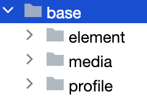

应用开发过程中，经常需要用到颜色、字体、间距、图片等资源，在不同的设备或配置中，这些资源的值可能不同。

- 应用资源：借助资源文件能力，开发者在应用中自定义资源，自行管理这些资源在不同的设备或配置中的表现。
- 系统资源：开发者直接使用系统预置的资源定义。

### 一、资源分类

---

应用开发中使用的各类资源文件，需要放入特定子目录中存储管理。资源目录的示例如下所示，base目录、限定词目录、rawfile目录、resfile目录称为资源目录，element、media、profile称为资源组目录。

>stage模型多工程情况下，共有的资源文件放到AppScope下的resources目录。

```
resources
|---base
|   |---element
|   |   |---string.json
|   |---media
|   |   |---icon.png
|   |---profile
|   |   |---test_profile.json
|---en_US  // 默认存在的目录，设备语言环境是美式英文时，优先匹配此目录下资源
|   |---element
|   |   |---string.json
|   |---media
|   |   |---icon.png
|   |---profile
|   |   |---test_profile.json
|---zh_CN  // 默认存在的目录，设备语言环境是简体中文时，优先匹配此目录下资源
|   |---element
|   |   |---string.json
|   |---media
|   |   |---icon.png
|   |---profile
|   |   |---test_profile.json
|---en_GB-vertical-car-mdpi // 自定义限定词目录示例，由开发者创建
|   |---element
|   |   |---string.json
|   |---media
|   |   |---icon.png
|   |---profile
|   |   |---test_profile.json
|---rawfile // 其他类型文件，原始文件形式保存，不会被集成到resources.index文件中。文件名可自定义。
|---resfile // 其他类型文件，原始文件形式保存，不会被集成到resources.index文件中。文件名可自定义。
```

#### 1.1 资源目录

##### 1.1.1 base目录



默认存在的目录，二级子目录

- element用于存放**字符串、颜色、布尔值**等基础元素
- media、profile存放**媒体、动画、布局**等资源文件。

##### 1.1.2 限定词目录

en_US和zh_CN是默认存在的两个限定词目录，其余限定词目录需要开发者根据开发需要自行创建。二级子目录element、media、profile用于存放字符串、颜色、布尔值等基础元素，以及媒体、动画、布局等资源文件。

同样，目录中的资源文件会被编译成二进制文件，并赋予资源文件ID。通过指定资源类型（type）和资源名称（name）来引用。

##### 1.2.3 限定词目录的命名要求

限定词目录可以由一个或多个表征应用场景或设备特征的限定词组合而成，包括移动国家码和移动网络码、语言、文字、国家或地区、横竖屏、设备类型、颜色模式和屏幕密度等维度，限定词之间通过下划线（_）或者中划线（-）连接。开发者在创建限定词目录时，需要遵守限定词目录的命名规则。

- 限定词的组合顺序：_移动国家码_移动网络码-语言_文字_国家或地区-横竖屏-设备类型-颜色模式-屏幕密度_。开发者可以根据应用的使用场景和设备特征，选择其中的一类或几类限定词组成目录名称。
- 限定词的连接方式：语言、文字、国家或地区之间采用下划线（_）连接，移动国家码和移动网络码之间也采用下划线（_）连接，除此之外的其他限定词之间均采用中划线（-）连接。例如：**zh_Hant_CN**、**zh_CN-car-ldpi**。
- 限定词的取值范围：每类限定词的取值必须符合限定词取值要求表中的条件，如表2。否则，将无法匹配目录中的资源文件。

| 限定词类型             | 含义与取值说明                                               |
| ---------------------- | ------------------------------------------------------------ |
| 移动国家码和移动网络码 | 移动国家码（MCC）和移动网络码（MNC）的值取自设备注册的网络。MCC可与MNC合并使用，使用下划线（_）连接，也可以单独使用。例如：mcc460表示中国，mcc460_mnc00表示中国_中国移动。详细取值范围，请查阅[**ITU-T E.212**](https://www.itu.int/rec/T-REC-E.212)（国际电联相关标准）。 |
| 语言                   | 表示设备使用的语言类型，由2~3个小写字母组成。例如：zh表示中文，en表示英语，mai表示迈蒂利语。详细取值范围，请查阅[**ISO 639**](https://www.iso.org/iso-639-language-code)（ISO制定的语言编码标准）。 |
| 文字                   | 表示设备使用的文字类型，由1个大写字母（首字母）和3个小写字母组成。例如：Hans表示简体中文，Hant表示繁体中文。详细取值范围，请查阅[**ISO 15924**](https://www.iso.org/standard/81905.html)（ISO制定的文字编码标准）。 |
| 国家或地区             | 表示用户所在的国家或地区，由2~3个大写字母或者3个数字组成。例如：CN表示中国，GB表示英国。详细取值范围，请查阅[**ISO 3166-1**](https://www.iso.org/iso-3166-country-codes.html)（ISO制定的国家和地区编码标准）。 |
| 横竖屏                 | 表示设备的屏幕方向，取值如下：- vertical：竖屏- horizontal：横屏 |
| 设备类型               | 表示设备的类型，取值如下：- car：车机- tablet：平板- tv：智慧屏- wearable：智能穿戴 |
| 颜色模式               | 表示设备的颜色模式，取值如下：- dark：深色模式- light：浅色模式 |
| 屏幕密度               | 表示设备的屏幕密度（单位为dpi），取值如下：- sdpi：表示小规模的屏幕密度（Small-scale Dots Per Inch），适用于dpi取值为(0, 120]的设备。- mdpi：表示中规模的屏幕密度（Medium-scale Dots Per Inch），适用于dpi取值为(120, 160]的设备。- ldpi：表示大规模的屏幕密度（Large-scale Dots Per Inch），适用于dpi取值为(160, 240]的设备。- xldpi：表示特大规模的屏幕密度（Extra Large-scale Dots Per Inch），适用于dpi取值为(240, 320]的设备。- xxldpi：表示超大规模的屏幕密度（Extra Extra Large-scale Dots Per Inch），适用于dpi取值为(320, 480]的设备。- xxxldpi：表示超特大规模的屏幕密度（Extra Extra Extra Large-scale Dots Per Inch），适用于dpi取值为(480, 640]的设备。 |

##### 1.2.4 rawfile目录

支持创建多层子目录，子目录名称可以自定义，文件夹内可以自由放置各类资源文件。

目录中的资源文件会被直接打包进应用，不经过编译，也不会被赋予资源文件ID。通过指定文件路径和文件名引用。

##### 1.2.5 resfile目录

支持创建多层子目录，子目录名称可以自定义，文件夹内可以自由放置各类资源文件。

目录中的资源文件会被直接打包进应用，不经过编译，也不会被赋予资源文件ID。应用安装后，resfile资源会被解压到应用沙箱路径，通过Context属性[resourceDir](https://developer.huawei.com/consumer/cn/doc/harmonyos-references-V5/js-apis-inner-application-context-V5#属性)获取到resfile资源目录后，可通过文件路径访问。

#### 1.2 资源组目录

资源组目录包括element、media、profile三种类型的资源文件，用于存放特定类型资源。

| 目录类型 | 说明                                                         | 资源文件                                                     |
| -------- | ------------------------------------------------------------ | ------------------------------------------------------------ |
| element  | 表示元素资源，以下每一类数据都采用相应的JSON文件来表征（目录下仅支持文件类型）。- boolean，布尔型- color，颜色- float，浮点型，范围是-2^128-2^128- intarray，整型数组- integer，整型，范围是-2^31-2^31-1- plural，复数形式- strarray，字符串数组- string，字符串，[格式化字符串请参考API文档](https://developer.huawei.com/consumer/cn/doc/harmonyos-references-V5/js-apis-resource-manager-V5#getstringsync10) | element目录中的文件名称建议与下面的文件名保持一致。每个文件中只能包含同一类型的数据。- boolean.json- color.json- float.json- intarray.json- integer.json- plural.json- strarray.json- string.json |
| media    | 表示媒体资源，包括图片、音频、视频等非文本格式的文件（目录下只支持文件类型）。图片和音视频的类型说明见表4和表5。 | 文件名可自定义，例如：icon.png。                             |
| profile  | 表示自定义配置文件，其文件内容可[通过包管理接口](https://developer.huawei.com/consumer/cn/doc/harmonyos-references-V5/js-apis-bundlemanager-V5#bundlemanagergetprofilebyability)获取（目录下只支持json文件类型）。 | 文件名可自定义，例如：test_profile.json。                    |

##### 1.2.1 媒体资源类型说明

| 格式 | 文件后缀名 |
| ---- | ---------- |
| JPEG | .jpg       |
| PNG  | .png       |
| GIF  | .gif       |
| SVG  | .svg       |
| WEBP | .webp      |
| BMP  | .bmp       |

##### 1.2.2 音视频资源类型说明

| 格式                  | 支持的文件类型 |
| --------------------- | -------------- |
| H.264 AVC             | .3gp           |
| Baseline Profile (BP) | .mp4           |

##### 1.2.3 示例

color.json文件的内容如下：

```json
{
    "color": [
        {
            "name": "color_hello",
            "value": "#ffff0000"
        },
        {
            "name": "color_world",
            "value": "#ff0000ff"
        }
    ]
}
```

float.json文件的内容如下：

```json
{
    "float":[
        {
            "name":"font_hello",
            "value":"28.0fp"
        },
          {
            "name":"font_world",
            "value":"20.0fp"
        }
    ]
}
```

string.json文件的内容如下：

```json
{
    "string":[
        {
            "name":"string_hello",
            "value":"Hello"
        },
          {
            "name":"string_world",
            "value":"World"
        },
          {
            "name":"message_arrive",
            "value":"We will arrive at %1$s."
        },
        {
            "name":"message_notification",
            "value":"Hello, %1$s!,You have %2$d new messages."
        }
    ]
}
```

plural.json文件的内容如下：

```json
{
    "plural":[
        {
            "name":"eat_apple",
            "value":[
                {
                    "quantity":"one",
                    "value":"%d apple"
                },
                {
                    "quantity":"other",
                    "value":"%d apples"
                }
            ]
        }
    ]
}
```


### 二、创建资源目录和资源文件

---

#### 2.1 创建资源目录和资源文件

#### 2.2 创建资源目录

#### 2.3 创建资源文件


### 三、资源可供翻译特性

---


### 四、资源访问

---

#### 4.1 单HAP包应用资源

**通过"`$r`"或"`$rawfile`"引用资源。**

- 对于“color”、“float”、“string”、“plural”、“media”、“profile”等类型的资源，通过"$r('app.type.name')"形式引用。其中，app为resources目录中定义的资源；type为资源类型或资源的存放位置；name为资源名，开发者定义资源时确定。
- 对于string.json中使用多个占位符的情况，通过$r('app.string.label','aaa','bbb',444)形式引用。
- 对于rawfile目录资源，通过"$rawfile('filename')"形式引用。其中，filename为rawfile目录下文件的相对路径，文件名需要包含后缀，路径开头不可以"/"开头。

**通过本应用上下文获取ResourceManager后，调用不同[资源管理接口](https://developer.huawei.com/consumer/cn/doc/harmonyos-references-V5/js-apis-resource-manager-V5)访问不同资源。**例如：

- getContext.resourceManager.getStringByNameSync('app.string.XXX') 可获取字符串资源；
- getContext.resourceManager.getRawFd('rawfilepath') 可获取Rawfile所在hap包的descriptor信息，访问rawfile文件时需{fd, offset, length}一起使用。

#### 4.2 跨HAP/HSP包应用资源

##### 4.2.1 bundle相同，跨module访问

- 通过createModuleContext(moduleName)接口创建同应用中不同module的上下文，获取resourceManager对象后，调用不同接口访问不同资源。

  ```typescript
  getContext.createModuleContext(moduleName).resourceManager.getStringByNameSync('app.string.XXX')
  ```

- 通过"$r"或"$rawfile"引用资源。具体操作如下：

  - 这里是列表文本[hsp].type.name获取资源。其中，hsp为hsp模块名，type为资源类型，name为资源名称。

    ```typescript
    Text($r('[hsp].string.test_string'))
      .fontSize($r('[hsp].float.font_size'))
      .fontColor($r('[hsp].color.font_color'))  
    Image($rawfile('[hsp].icon.png'))
    ```

  - 使用变量获取资源。

    ```typescript
    @Entry
    @Component
    struct Index {
      text: string = '[hsp].string.test_string';
      fontSize: string = '[hsp].float.font_size';
      fontColor: string = '[hsp].color.font_color';
      image: string = '[hsp].media.string';
      rawfile: string = '[hsp].icon.png';
    
      build() {
        Row() {
          Text($r(this.text))
            .fontSize($r(this.fontSize))
            .fontColor($r(this.fontColor))
    
          Image($r(this.image))
    
          Image($rawfile(this.rawfile))
        }
      }
    }
    ```

#### 4.3 系统资源

除了自定义资源，也可以使用系统中预定义的资源，统一应用的视觉风格。

在开发过程中，分层参数的用法与资源限定词基本一致。对于系统资源，可以通过“$r('sys.type.resource_id')”的形式引用。其中，sys为系统资源；type为资源类型，取值包括“color”、“float”、“string”、“media”；resource_id为资源id。

>- 仅声明式开发范式支持使用系统资源。
>- 对于系统预置应用，建议使用系统资源；对于三方应用，可以根据需要选择使用系统资源或自定义应用资源。
>- 界面加载的系统资源字体进行显示时，可以在配置中system/etc/fontconfig.json文件查看。默认字体为HarmonyOS Sans。

```typescript
Text('Hello')
  .fontColor($r('sys.color.ohos_id_color_emphasize'))
  .fontSize($r('sys.float.ohos_id_text_size_headline1'))
  .fontFamily($r('sys.string.ohos_id_text_font_family_medium'))
  .backgroundColor($r('sys.color.ohos_id_color_palette_aux1'))

Image($r('sys.media.ohos_app_icon'))
  .border({
    color: $r('sys.color.ohos_id_color_palette_aux1'),
    radius: $r('sys.float.ohos_id_corner_radius_button'), width: 2
  })
  .margin({
    top: $r('sys.float.ohos_id_elements_margin_horizontal_m'),
    bottom: $r('sys.float.ohos_id_elements_margin_horizontal_l')
  })
  .height(200)
  .width(300)
```


### 五、资源匹配

---

应用使用某资源时，系统会根据当前设备状态优先从相匹配的限定词目录中寻找该资源。只有当resources目录中没有与设备状态匹配的限定词目录，或者在限定词目录中找不到该资源时，才会去base目录中查找。rawfile是原始文件目录，不会根据设备状态去匹配不同的资源。

#### 5.1 限定词目录与设备状态的匹配规则

- 在为设备匹配对应的资源文件时，限定词目录匹配的优先级从高到低依次为：移动国家码和移动网络码 > 区域（可选组合：语言、语言_文字、语言_国家或地区、语言_文字_国家或地区）> 横竖屏 > 设备类型 > 颜色模式 > 屏幕密度。
- 如果限定词目录中包含移动国家码和移动网络码、语言、文字、横竖屏、设备类型、颜色模式限定词，则对应限定词的取值必须与当前的设备状态完全一致，该目录才能够参与设备的资源匹配。例如，限定词目录“zh_CN-car-ldpi”不能参与“en_US”设备的资源匹配。

#### 5.2 获取指定配置的资源

开发者可以在工程的resource目录下添加[限定词目录](https://developer.huawei.com/consumer/cn/doc/harmonyos-guides-V5/resource-categories-and-access-V5#限定词目录)，满足多语言、深浅色模式等不同类型的系统设置。然而，在获取资源时，由于限定词目录匹配规则，只能筛选出最匹配的资源，无法获取其它目录资源。

应用如果有获取指定配置的资源的诉求，可以通过以下方法进行获取。

| 接口名                                                       | 描述                                                         |
| ------------------------------------------------------------ | ------------------------------------------------------------ |
| [getOverrideResourceManager](https://developer.huawei.com/consumer/cn/doc/harmonyos-references-V5/js-apis-resource-manager-V5#getoverrideresourcemanager12)(configuration?: [Configuration](https://developer.huawei.com/consumer/cn/doc/harmonyos-references-V5/js-apis-resource-manager-V5#configuration)) : [ResourceManager](https://developer.huawei.com/consumer/cn/doc/harmonyos-references-V5/js-apis-resource-manager-V5#resourcemanager) | 获取可以加载指定配置的资源的资源管理对象，使用同步方式返回。 |
| [getOverrideConfiguration](https://developer.huawei.com/consumer/cn/doc/harmonyos-references-V5/js-apis-resource-manager-V5#getoverrideconfiguration12)() : [Configuration](https://developer.huawei.com/consumer/cn/doc/harmonyos-references-V5/js-apis-resource-manager-V5#configuration) | 获取指定的配置，使用同步方式返回                             |
| [updateOverrideConfiguration](https://developer.huawei.com/consumer/cn/doc/harmonyos-references-V5/js-apis-resource-manager-V5#updateoverrideconfiguration12)(configuration: [Configuration](https://developer.huawei.com/consumer/cn/doc/harmonyos-references-V5/js-apis-resource-manager-V5#configuration)) : void | 更新指定的配置                                               |

以获取非当前系统语言的资源为例，说明如何获取指定配置的资源，假设工程中中文、英文、德文的资源目录定义了如下同名资源： 

- entry/src/main/resources/zh_CN/element/string.json

```json
{
  "string": [
    {
      "name": "greetings",
      "value": "你好，世界"
    }
  ]
}
```

- entry/src/main/resources/en_US/element/string.json

```json
{
  "string": [
    {
      "name": "greetings",
      "value": "Hello, world"
    }
  ]
}
```

- entry/src/main/resources/de_DE/element/string.json

```json
{
  "string": [
    {
      "name": "greetings",
      "value": "Hallo, Welt"
    }
  ]
}
```

在Index.ets中，分别获取三种语言的资源并显示在文本框中，运行设备当前系统语言为中文，entry/src/main/ets/pages/Index.ets的代码如下：

```json
@Entry
@Component
struct Index {
  @State englishString: string = ""
  @State germanString: string = ""

  getString(): string {
    let resMgr = getContext().resourceManager
    let resId = $r('app.string.greetings').id

    //获取符合当前系统语言地区、颜色模式、分辨率等配置的资源
    let currentLanguageString = resMgr.getStringSync(resId)

    //获取符合当前系统颜色模式、分辨率等配置的英文资源
    let overrideConfig = resMgr.getOverrideConfiguration()
    overrideConfig.locale = "en_US" //指定资源的语言为英语，地区为美国
    let overrideResMgr = resMgr.getOverrideResourceManager(overrideConfig)
    this.englishString = overrideResMgr.getStringSync(resId)

    //获取符合当前系统颜色模式、分辨率等配置的德文资源
    overrideConfig.locale = "de_DE" //指定资源的语言为德语，地区为德国
    overrideResMgr.updateOverrideConfiguration(overrideConfig) //等效于resMgr.updateOverrideConfiguration(overrideConfig)
    this.germanString = overrideResMgr.getStringSync(resId)

    return currentLanguageString
  }

  build() {
    Row() {
      Column() {
        Text(this.getString())
          .fontSize(50)
          .fontWeight(FontWeight.Bold)
        Text(this.englishString)
          .fontSize(50)
          .fontWeight(FontWeight.Bold)
        Text(this.germanString)
          .fontSize(50)
          .fontWeight(FontWeight.Bold)
      }
      .width('100%')
    }
    .height('100%')
  }
}
```

#### 5.3 overlay机制

overylay是一种资源替换机制，针对不同品牌、产品的显示风格，开发者可以在不重新打包业务逻辑hap的情况下，通过配置和使用overlay资源包，实现应用界面风格变换。overlay资源包只包含资源文件、资源索引文件和配置文件。

- 动态overlay使用方式

1、对应的overlay资源包需要放在对应应用安装路径下，通过hdc install的方式安装。如应用com.example.overlay的安装路径：data/app/el1/bundle/public/com.example.overlay/。

2、应用通过[addResource(path)](https://developer.huawei.com/consumer/cn/doc/harmonyos-references-V5/js-apis-resource-manager-V5#addresource10)，实现资源覆盖；通过[removeResource(path)](https://developer.huawei.com/consumer/cn/doc/harmonyos-references-V5/js-apis-resource-manager-V5#removeresource10)，实现overlay删除。overlay资源路径需经过元能力的getContext().BundleCodeDir获取此应用对应的沙箱根目录，由应用的沙箱根目录+overlay资源包名称组成。如：let path = getContext().bundleCodeDir + "overlay资源包名称"，其对应沙箱路径为：/data/storage/el1/bundle/overlay资源包名称。

- 静态overlay配置方式，包内overlay资源包中的配置文件module.json5中支持的字段：

  ```json
  "app":{
    "bundleName": "com.example.myapplication.overlay",
    "vendor" : "example",
    "versinCode": "1000000",
    "versionName": "1.0.0.1",
    "icon": "$media:app_icon",
    "label": "$string:app_name",
  },
  "module":{
    "name": "entry_overlay_module_name",
    "type": "shared",
    "description": "$string:entry_overlay_desc",
    "deviceTypes": [
      "default",
      "tablet",
    ],
    "deliverywithInstall": true,
  
    "targetModuleName": "entry_module_name",
    "targetPriority": 1,
  }
  ```

在IDE中创建应用工程时，module的配置文件module.json5中包含targetModuleName和targetPriority字段时，该module将会在安装阶段被识别为overlay特征的module。overlay特征的module一般是为设备上存在的非overlay特征的module提供覆盖的资源文件，以便于targetModuleName指向的module在运行阶段可以使用overlay资源文件展示不同的颜色，标签，主题等等。