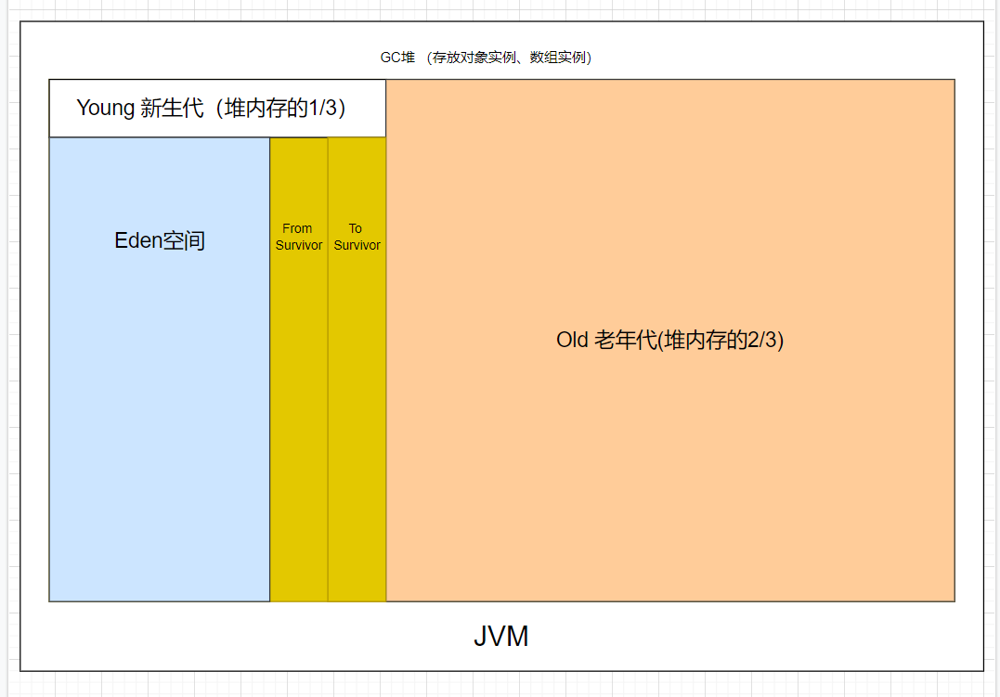

JVM 虚拟机的内存空间分为 5 个部分：

- **程序计数器**
- **Java 虚拟机栈**
- **本地方法栈**
- **堆**
- **方法区**


JDK 1.8 同 JDK 1.7 比，最大的差别就是：**元数据区取代了永久代**。元空间的本质和永久代类似，都是对 JVM 规范中方法区的实现。不过元空间与永久代之间最大的区别在于：**元数据空间并不在虚拟机中，而是使用本地内存**。


### 一、程序计数器（PC 寄存器）

---

#### 1.1 定义

程序计数器是一块较小的内存空间，是当前线程正在执行的那条字节码指令的地址。若当前线程正在执行的是一个本地方法，那么此时程序计数器为 `Undefined`。

#### 1.2 作用

- 字节码解释器通过改变程序计数器来一次读取指令，从而实现代码的流程控制。
- 在多线程情况下，程序计数器记录的是当前线程执行的位置，从而当线程切换回来时，就知道上次线程执行到哪了。

#### 1.3 特点

- 是一块较小的内存空间。
- 线程私有，每条线程都有自己的程序计数器。
- 生命周期：**随着线程的创建而创建，随着线程的结束而销毁**。
- 是唯一一个不会出现 `OutOfMemoryError` 的内存区域。


### 二、Java 虚拟机（Java 栈）

---

在 JVM 内存模型中，Java 栈是**线程私有的内存区域**，用于描述 Java 方法执行的内存模型。每个线程在创建时都会创建一个私有的 Java 栈，**栈的生命周期与线程一致**。


| 组件       | 描述                                                         |
| ---------- | ------------------------------------------------------------ |
| 栈帧       | 每个方法调用都会创建一个栈帧，包含局部变量表、操作数栈、动态链接、返回地址等 |
| 局部变量表 | 存放方法参数、局部变量等，以 Slot 为单位存储                 |
| 操作数栈   | 执行字节码指令时使用的临时数据栈                             |
| 动态链接   | 指向运行时常量池，用于支持运行时方法调用解析                 |
| 异常处理   | 栈溢出（StackOverflowError）、内存不足（OutOfMemoryError）   |

#### 2.1 栈帧（Stack Frame）

- 定义：每次方法调用时，JVM 会为该方法生成一个栈帧，并将其压入当前线程的 Java 栈中。
- 组成：
  - **局部变量表**：存放了编译期可知的各种基本数据类型（boolean, byte, char, short, int, float, long, double）、对象引用（reference类型，可能是一个指向对象起始地址的引用指针，也可能是指向一个代表对象的句柄或其他与此对象相关的位置）和returnAddress类型（指向了一条字节码指令的地址）。这些数据类型在局部变量表中的存储空间以局部变量槽（Slot）来表示，其中64位长度的long和double类型的数据会占用两个变量槽，其余的数据类型只占用一个。
  - **操作数栈**：也被称作操作栈，它是一个后进先出（Last-In-First-Out, LIFO）栈。当一个方法刚刚开始执行的时候，这个方法的操作数栈是空的，在方法的执行过程中，会有各种字节码指令往操作数栈中写入和提取内容，也就是入栈和出栈操作。
  - **动态链接**：每个栈帧都包含一个指向运行时常量池中该栈帧所属方法的引用，持有这个引用是为了支持方法调用过程中的动态链接。Class文件的常量池中有大量的符号引用，字节码中的方法调用指令就以常量池中指向方法的符号引用作为参数，这些符号引用一部分会在类加载阶段或第一次使用的时候转化为直接引用，这种转化称为静态解析。另一部分将在每一次运行期间转化为直接引用，这部分称为动态链接。
  - **方法出口信息**：当一个方法开始执行时，必须知道执行完该方法之后从哪里继续执行，即需要保存方法调用者的PC寄存器的值作为方法返回地址。一旦某个方法A调用了其他方法B，方法B执行结束后，要么返回至方法A中调用方法B处的下一条指令位置继续执行，要么异常发生导致方法退出。

#### 2.2 栈的特性

- **后进先出（LIFO）**：方法调用遵循 LIFO 原则，调用顺序决定栈帧的压栈和出栈顺序。
- **线程私有**：虚拟机栈是线程私有的，它的生命周期与线程相同。每个新线程启动时，都会创建一个对应的虚拟机栈。
- 异常情况：
  - StackOverflowError：当栈深度超过 JVM 允许的最大深度（如递归过深）时抛出。
  - OutOfMemoryError：若栈可动态扩展，但无法申请到足够的内存时抛出。

#### 2.3 简单方法调用与栈帧结构

```java
public class JVMStack {

    public static void main(String[] args) {
        int result = add(5, 7);
        System.out.println("Result: " + result);
    }

    public static int add(int a, int b) {
        int sum = a + b;
        return sum;
    }
}
```

1. **main 方法调用 add 方法**，此时会在虚拟机栈中创建一个新的栈帧。

2. add 方法的栈帧中包含：

   - 局部变量表：

     - `a`（int，值为 5）

     - `b`（int，值为 7）

     - `sum`（int，值为 12）

   - 操作数栈：
     - 加法操作时，先将 `a` 和 `b` 压入栈，执行 `iadd` 指令，结果压入栈顶，最后通过 `ireturn` 返回。

查看字节码：

```bash
# 编译上面的类
javac JVMStackExample.java

# 使用 javap 查看字节码
javap -c JVMStackExample
```

```java
public static int add(int a, int b);
	Code:
		0 iload_0			// 将局部变量表中索引为0的int变量（a）压入操作数栈
		1 iload_1			 // 将局部变量表中索引为1的int变量（b）压入操作数栈
		2 iadd			  // 弹出两个int相加，将结果压入栈顶
		3 istore_2		// 将栈顶int存入局部变量表索引为2的位置（sum）
		4 iload_2		   // 将sum压入栈顶
		5 ireturn			// 返回栈顶int值
```


### 三、本地方法栈（C栈）

---

#### 3.1 定义

本地方法栈是为 JVM 运行 Native 方法准备的空间，由于很多 Native 方法都是用 C 语言实现的，所以它通常又叫 C 栈。它与 Java 虚拟机栈实现的功能类似，只不过本地方法栈是**描述本地方法运行过程的内存模型**。

#### 3.2 栈帧变化过程

本地方法被执行时，在本地方法栈也会创建一块栈帧，用于存放该方法的局部变量表、操作数栈、动态链接、方法出口信息等。

方法执行结束后，相应的栈帧也会出栈，并释放内存空间。也会抛出 StackOverFlowError 和 OutOfMemoryError 异常。

>如果 Java 虚拟机本身不支持 Native 方法，或是本身不依赖于传统栈，那么可以不提供本地方法栈。如果支持本地方法栈，那么这个栈一般会在线程创建的时候按线程分配。


### 四、堆

---

#### 4.1 定义

堆是用来存放对象的内存空间，几乎所有的对象都存储在堆中。



#### 4.2 特点

- 线程共享，整个 Java 虚拟机只有一个堆，所有线程都访问同一个堆。而程序计数器、Java 虚拟机栈、本地方法栈都是一个线程对应一个
- 在虚拟机启动时创建。
- 是垃圾回收的主要场所。
- 堆可分为新生代（Eden 区：From Survivor）、老年代。
- Java虚拟机规范规定，堆可以处于物理上不连续的内存空间，但在逻辑上它应该被视为连续的。
- 关于 Survivior s0，s1 区，复制之后有交换，谁空谁是 to。

不同的区域存放不同生命周期的对象，这样可以根据不同的区域使用不同的垃圾回收算法，更具有针对性。

堆的大小既可以固定也可以扩展，但对于主流的虚拟机，堆的大小是可扩展的，因此当前线程请求分配内存，但堆已满，且内存已无法再扩展时，就抛出 OutOfMemoryError 异常。

>Java堆所使用的内存不需要保证是连续的。而由于堆是被所有线程共享的，所以对它的访问需要注意同步问题，方法和对应的属性都需要保证一致性。

####  4.3 新生代与老年代

- 老年代比新生代生命周期长。
- 新生代与老年代空间默认比例 `1:2`：JVM 调参数，`XX:NewRatio=2`，表示新生代占 1，老年代占 2，新生代占整个堆的 1/3。
- HotSpot 中，Eden 空间和另外两个 Survivor 空间缺省所占的比例是：`8:1:1`。
- 几乎所有的 Java 对象都是在 Eden 区被 new 出来的，Eden 放不了的大对象，就直接进入老年代了。

#### 4.4 对象分配过程

- new 的对象先放在 **Eden 区**，**大小有限制**。
- 如果创建新对象时，Eden 区填满了，就会触发 **Minor GC**，将 Eden 不再被其他对象引用的对象进行销毁，再加载新的对象放到 Eden 区，特备注意的是 Survivor 区满了是不会触发 Minor GC 的，而是 Eden 空间填满了，Minor GC 才顺便清理 Survivor 区。
- 将 Eden 中剩余的对象移到 Survivor0 区。
- 再次触发垃圾回收，此时上次 Survivor 下来的，放在 Survivor0 区的，如果没有回收，就会放到 Survivor1 区。
- 再次经历垃圾回收，又会将幸存者重新放回 Survivor0 区，依次类推。
- 默认是 15 次的循环，超过 15 次，则会将幸存者区幸存下来的转去老年区，jvm 参数设置次数：`-XX:MaxTenuringThreshold=N` 进行设置。
- 频繁在新生区收集，很少在养老区收集，几乎不在永久区/元空间收集。

#### 4.5 Full GC/Major GC 触发条件

- 显示调用`System.gc()`，老年代的空间不够，方法区的空间不够等都会触发 Full GC，同时对新生代和老年代回收，FUll GC 的 STW 的时间最长，应该要避免。
- 在出现 Major GC 之前，会先触发 Minor GC，如果老年代的空间还是不够就会触发 Major GC，STW 的时间长于 Minor GC。

#### 4.6 逃逸分析

- **标量替换**
  - 标量不可再分解的量，java 的**基本数据类型**就是标量，标量的对立就是可以被进一步分解的量，而这种量称之为**聚合量**。而在 JAVA 中对象就是可以被进一步分解的聚合量
  - 替换过程，通过逃逸分析确定该对象不会被外部访问，并且对象可以被进一步分解时，JVM 不会创建该对象，而会将该对象成员变量分解若干个被这个方法使用的成员变量所代替。这些代替的成员变量在栈帧或寄存器上分配空间。
- **对象和数组并非都是在对上分配内存的**
- 《深入理解 Java 虚拟机中》关于 Java 堆内存有这样一段描述：随着 JIT 编译期的发展与逃逸分析技术逐渐成熟，`栈上分配`,`标量替换`优化技术将会导致一些变化，所有的对象都分配到堆上也渐渐变得不那么"绝对"了。
- 这是一种可以有效减少 Java 内存堆分配压力的分析算法，通过逃逸分析，Java Hotspot 编译器能够分析出一个新的对象的引用的使用范围从而决定是否要将这个对象分配到堆上。
- 当一个对象在方法中被定义后，它可能被外部方法所引用，如作为调用参数传递到其他地方中，称为`方法逃逸`。
- 再如赋值给类变量或可以在其他线程中访问的实例变量，称为`线程逃逸`
- 使用逃逸分析，编译器可以对代码做如下优化：
  - 同步省略：如果一个对象被发现只能从一个线程被访问到，那么对于这个对象的操作可以不考虑同步。
  - 将堆分配转化为栈分配：如果一个对象在子程序中被分配，要使指向该对象的指针永远不会逃逸，对象可能是栈分配的候选，而不是堆分配。
  - 分离对象或标量替换：有的对象可能不需要作为一个连续的内存结构存在也可以被访问到，那么对象的部分（或全部）可以不存储在内存，而是存储在 CPU 寄存器中。

```java
public static StringBuffer createStringBuffer(String s1, String s2) {
    StringBuffer s = new StringBuffer();
    s.append(s1);
    s.append(s2);
    return s;
}
```

s 是一个方法内部变量，上边的代码中直接将 s 返回，这个 StringBuffer 的对象有可能被其他方法所改变，导致它的作用域就不只是在方法内部，即使它是一个局部变量，但还是逃逸到了方法外部，称为`方法逃逸`。

还有可能被外部线程访问到，譬如赋值给类变量或可以在其他线程中访问的实例变量，称为`线程逃逸`。

- 在编译期间，如果 JIT 经过逃逸分析，发现有些对象没有逃逸出方法，那么有可能堆内存分配会被优化成栈内存分配。
- jvm 参数设置，`-XX:+DoEscapeAnalysis` ：开启逃逸分析 ，`-XX:-DoEscapeAnalysis` ： 关闭逃逸分析
- 从 jdk 1.7 开始已经默认开始逃逸分析。

#### 4.7 TLAB

- TLAB 的全称是 Thread Local Allocation Buffer，即**线程本地分配缓存区**，是属于 Eden 区的，这是一个线程专用的内存分配区域，线程私有，默认开启的（也不是绝对的，也要看哪种类型的虚拟机）
- 堆是全局共享的，在同一时间，可能会有多个线程在堆上申请空间，但每次的对象分配需要同步的进行（虚拟机采用 CAS 配上失败重试的方式保证更新操作的原子性）但是效率却有点下降
- 所以用 TLAB 来避免多线程冲突，在给对象分配内存时，每个线程使用自己的 TLAB，这样可以使得线程同步，提高了对象分配的效率
- 当然并不是所有的对象都可以在 TLAB 中分配内存成功，如果失败了就会使用加锁的机制来保持操作的原子性
- `-XX:+UseTLAB `使用 TLAB，`-XX:+TLABSize` 设置 TLAB 大小

#### 4.8 四种引用方式

- 强引用：创建一个对象并把这个对象赋给一个引用变量，普通 new 出来对象的变量引用都是强引用，有引用变量指向时永远不会被垃圾回收，jvm 即使抛出 OOM，可以将引用赋值为 null，那么它所指向的对象就会被垃圾回收。
- 软引用：如果一个对象具有软引用，内存空间足够，垃圾回收器就不会回收它，如果内存空间不足了，就会回收这些对象的内存。只要垃圾回收器没有回收它，该对象就可以被程序使用。
- 弱引用：非必需对象，当 JVM 进行垃圾回收时，无论内存是否充足，都会回收被弱引用关联的对象。
- 虚引用：虚引用并不会决定对象的生命周期，如果一个对象仅持有虚引用，那么它就和没有任何引用一样，在任何时候都可能被垃圾回收器回收。


### 五、方法区

---

#### 5.1 定义

Java 虚拟机规范中定义方法区是堆的一个逻辑部分。方法区存放以下信息：

- 已经被虚拟机加载的类信息
- 常量
- 静态变量
- 即时编译器编译后的代码

#### 5.2 特点

- 线程共享。 方法区是堆的一个逻辑部分，因此和堆一样，都是线程共享的。整个虚拟机中只有一个方法区。
- **永久代**。 方法区中的信息一般需要长期存在，而且它又是堆的逻辑分区，因此用堆的划分方法，把方法区称为“永久代”。
- 内存回收效率低。 方法区中的信息一般需要长期存在，回收一遍之后可能只有少量信息无效。主要回收目标是：对常量池的回收；对类型的卸载。
- Java 虚拟机规范对方法区的要求比较宽松。 和堆一样，允许固定大小，也允许动态扩展，还允许不实现垃圾回收。

#### 5.3 运行时常量池

方法区中存放：类信息、常量、静态变量、即时编译器编译后的代码。常量就存放在运行时常量池中。

当类被 Java 虚拟机加载后， .class 文件中的常量就存放在方法区的运行时常量池中。而且在运行期间，可以向常量池中添加新的常量。如 String 类的 `intern()` 方法就能在运行期间向常量池中添加字符串常量。


### 六、直接内存（堆外内存）

---

直接内存是除 Java 虚拟机之外的内存，但也可能被 Java 使用。

#### 6.1 操作直接内存

在 NIO 中引入了一种基于通道和缓冲的 IO 方式。它可以通过调用本地方法直接分配 Java 虚拟机之外的内存，然后通过一个存储在堆中的`DirectByteBuffer`对象直接操作该内存，而无须先将外部内存中的数据复制到堆中再进行操作，从而提高了数据操作的效率。

直接内存的大小不受 Java 虚拟机控制，但既然是内存，当内存不足时就会抛出 OutOfMemoryError 异常。

#### 6.2 直接内存与堆内存比较

- 直接内存申请空间耗费更高的性能
- 直接内存读取 IO 的性能要优于普通的堆内存
- 直接内存作用链： 本地 IO -> 直接内存 -> 本地 IO
- 堆内存作用链：本地 IO -> 直接内存 -> 非直接内存 -> 直接内存 -> 本地 IO

>服务器管理员在配置虚拟机参数时，会根据实际内存设置`-Xmx`等参数信息，但经常忽略直接内存，使得各个内存区域总和大于物理内存限制，从而导致动态扩展时出现`OutOfMemoryError`异常。


