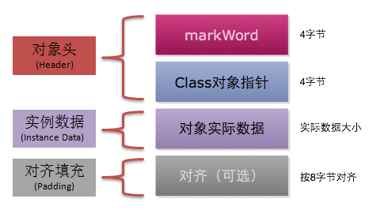

### 一、对象的内存布局

---

在 HotSpot 虚拟机中，对象的内存布局分为以下 3 块区域：

- 对象头（Header）
- 实例数据（Instance Data）
- 对齐填充（Padding）

#### 1.1 对象头	

对象头记录了对象在运行过程中所需要使用的一些数据：

- 哈希码
- GC 分代年龄
- 锁状态标志
- 线程持有的锁
- 偏向线程 ID
- 偏向时间戳

对象头可能包含类型指针，通过该指针能确定对象属于哪个类。如果对象是一个数组，那么对象头还会包括数组长度。

