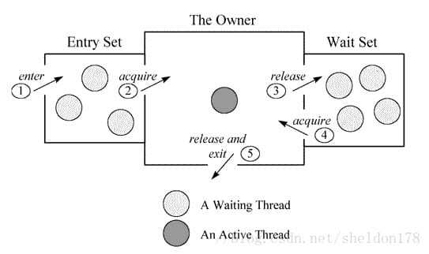

dump文件是进程的内存镜像。可以把程序的执行状态通过调试器保存到dump文件中。


### 一、获取JVM dump文件的2种方式

---

#### 1.1 方式一

JVM启动时增加两个参数（建议使用）

```
#出现 OOME 时生成堆 dump: 
-XX:+HeapDumpOnOutOfMemoryError
#生成堆文件地址：
-XX:HeapDumpPath=/usr/local/jvmlogs/heap.hprof
```

是一种事后方式，需要等待当前JVM出现问题后才能生成dmp文件，实时性不高。


#### 1.2 方式二

发现程序异常前通过执行指令，直接生成当前JVM的dmp文件

```shell
jmap -dump:format=b,file=/home/admin/logs/heap.hprof 6214
```

获得heap.hprof以后，就可以分析你的java线程里面对象占用堆内存的情况了。

在执行时，JVM是暂停服务的，所以**对线上的运行会产生影响**。


### 二、整个JVM内存状态

---

```shell
jmap -heap [pid]
```


### 三、JVM堆中对象详细占用情况

---

```shell
jmap -histo [pid]
```


### 四、导出整个JVM中内存信息，可以利用其它工具打开dump文件分析

---

```shell
jmap -dump:format=b,file=文件名 [pid]
```

format=b指定为二进制格式文件。


### 五、使用工具分析

---

```shell
# 查看当前运行的java进程的dump信息
jstack pid
```

#### 5.1 dump文件结构

```shell
2021-08-10 15:45:58
Full thread dump Java HotSpot(TM) 64-Bit Server VM (25.221-b11 mixed mode):

"RMI TCP Connection(2)-192.168.43.85" #43 daemon prio=5 os_prio=31 tid=0x00007faa2395a800 nid=0x8e03 runnable [0x0000700004c38000]
   java.lang.Thread.State: RUNNABLE
	at java.net.SocketInputStream.socketRead0(Native Method)
	at java.net.SocketInputStream.socketRead(SocketInputStream.java:116)
	at java.net.SocketInputStream.read(SocketInputStream.java:171)
	at java.net.SocketInputStream.read(SocketInputStream.java:141)
	at java.io.BufferedInputStream.fill(BufferedInputStream.java:246)
	at java.io.BufferedInputStream.read(BufferedInputStream.java:265)
	- locked <0x000000076b0ea630> (a java.io.BufferedInputStream)
	at java.io.FilterInputStream.read(FilterInputStream.java:83)
	at sun.rmi.transport.tcp.TCPTransport.handleMessages(TCPTransport.java:555)
	at sun.rmi.transport.tcp.TCPTransport$ConnectionHandler.run0(TCPTransport.java:834)
	at sun.rmi.transport.tcp.TCPTransport$ConnectionHandler.lambda$run$0(TCPTransport.java:688)
	at sun.rmi.transport.tcp.TCPTransport$ConnectionHandler$$Lambda$9/631541862.run(Unknown Source)
	at java.security.AccessController.doPrivileged(Native Method)
	at sun.rmi.transport.tcp.TCPTransport$ConnectionHandler.run(TCPTransport.java:687)
	at java.util.concurrent.ThreadPoolExecutor.runWorker(ThreadPoolExecutor.java:1149)
	at java.util.concurrent.ThreadPoolExecutor$Worker.run(ThreadPoolExecutor.java:624)
	at java.lang.Thread.run(Thread.java:748)

"DestroyJavaVM" #40 prio=5 os_prio=31 tid=0x00007faa2487e800 nid=0x1003 waiting on condition [0x0000000000000000]
   java.lang.Thread.State: RUNNABLE

"http-nio-8080-AsyncTimeout" #38 daemon prio=5 os_prio=31 tid=0x00007faa28bf5000 nid=0x6d03 waiting on condition [0x0000700004a33000]
   java.lang.Thread.State: TIMED_WAITING (sleeping)
	at java.lang.Thread.sleep(Native Method)
	at org.apache.coyote.AbstractProtocol$AsyncTimeout.run(AbstractProtocol.java:1211)
	at java.lang.Thread.run(Thread.java:748)

"http-nio-8080-Acceptor-0" #37 daemon prio=5 os_prio=31 tid=0x00007faa28c04800 nid=0x9003 runnable [0x0000700004930000]
   java.lang.Thread.State: RUNNABLE
	at sun.nio.ch.ServerSocketChannelImpl.accept0(Native Method)
	at sun.nio.ch.ServerSocketChannelImpl.accept(ServerSocketChannelImpl.java:422)
	at sun.nio.ch.ServerSocketChannelImpl.accept(ServerSocketChannelImpl.java:250)
	- locked <0x0000000772a85b10> (a java.lang.Object)
	at org.apache.tomcat.util.net.NioEndpoint$Acceptor.run(NioEndpoint.java:455)
	at java.lang.Thread.run(Thread.java:748)

"http-nio-8080-ClientPoller-1" #36 daemon prio=5 os_prio=31 tid=0x00007faa2589e800 nid=0x6b03 runnable [0x000070000482d000]
   java.lang.Thread.State: RUNNABLE
	at sun.nio.ch.KQueueArrayWrapper.kevent0(Native Method)
	at sun.nio.ch.KQueueArrayWrapper.poll(KQueueArrayWrapper.java:198)
	at sun.nio.ch.KQueueSelectorImpl.doSelect(KQueueSelectorImpl.java:117)
	at sun.nio.ch.SelectorImpl.lockAndDoSelect(SelectorImpl.java:86)
	- locked <0x000000076ab13530> (a sun.nio.ch.Util$3)
	- locked <0x000000076ab13520> (a java.util.Collections$UnmodifiableSet)
	- locked <0x000000076ab13400> (a sun.nio.ch.KQueueSelectorImpl)
	at sun.nio.ch.SelectorImpl.select(SelectorImpl.java:97)
	at org.apache.tomcat.util.net.NioEndpoint$Poller.run(NioEndpoint.java:793)
	at java.lang.Thread.run(Thread.java:748)

"http-nio-8080-ClientPoller-0" #35 daemon prio=5 os_prio=31 tid=0x00007faa231d0000 nid=0x6a03 runnable [0x000070000472a000]
   java.lang.Thread.State: RUNNABLE
	at sun.nio.ch.KQueueArrayWrapper.kevent0(Native Method)
	at sun.nio.ch.KQueueArrayWrapper.poll(KQueueArrayWrapper.java:198)
	at sun.nio.ch.KQueueSelectorImpl.doSelect(KQueueSelectorImpl.java:117)
	at sun.nio.ch.SelectorImpl.lockAndDoSelect(SelectorImpl.java:86)
	- locked <0x000000076ab12d68> (a sun.nio.ch.Util$3)
	- locked <0x000000076ab12d58> (a java.util.Collections$UnmodifiableSet)
	- locked <0x000000076ab12c38> (a sun.nio.ch.KQueueSelectorImpl)
	at sun.nio.ch.SelectorImpl.select(SelectorImpl.java:97)
	at org.apache.tomcat.util.net.NioEndpoint$Poller.run(NioEndpoint.java:793)
	at java.lang.Thread.run(Thread.java:748)

"http-nio-8080-exec-10" #34 daemon prio=5 os_prio=31 tid=0x00007faa258b5000 nid=0x9303 waiting on condition [0x0000700004627000]
   java.lang.Thread.State: WAITING (parking)
	at sun.misc.Unsafe.park(Native Method)
	- parking to wait for  <0x0000000772a1f698> (a java.util.concurrent.locks.AbstractQueuedSynchronizer$ConditionObject)
	at java.util.concurrent.locks.LockSupport.park(LockSupport.java:175)
	at java.util.concurrent.locks.AbstractQueuedSynchronizer$ConditionObject.await(AbstractQueuedSynchronizer.java:2039)
	at java.util.concurrent.LinkedBlockingQueue.take(LinkedBlockingQueue.java:442)
	at org.apache.tomcat.util.threads.TaskQueue.take(TaskQueue.java:103)
	at org.apache.tomcat.util.threads.TaskQueue.take(TaskQueue.java:31)
	at java.util.concurrent.ThreadPoolExecutor.getTask(ThreadPoolExecutor.java:1074)
	at java.util.concurrent.ThreadPoolExecutor.runWorker(ThreadPoolExecutor.java:1134)
	at java.util.concurrent.ThreadPoolExecutor$Worker.run(ThreadPoolExecutor.java:624)
	at org.apache.tomcat.util.threads.TaskThread$WrappingRunnable.run(TaskThread.java:61)
	at java.lang.Thread.run(Thread.java:748)

"http-nio-8080-exec-9" #33 daemon prio=5 os_prio=31 tid=0x00007faa258ae000 nid=0x6703 waiting on condition [0x0000700004524000]
   java.lang.Thread.State: WAITING (parking)
	at sun.misc.Unsafe.park(Native Method)
	- parking to wait for  <0x0000000772a1f698> (a java.util.concurrent.locks.AbstractQueuedSynchronizer$ConditionObject)
	at java.util.concurrent.locks.LockSupport.park(LockSupport.java:175)
	at java.util.concurrent.locks.AbstractQueuedSynchronizer$ConditionObject.await(AbstractQueuedSynchronizer.java:2039)
	at java.util.concurrent.LinkedBlockingQueue.take(LinkedBlockingQueue.java:442)
	at org.apache.tomcat.util.threads.TaskQueue.take(TaskQueue.java:103)
	at org.apache.tomcat.util.threads.TaskQueue.take(TaskQueue.java:31)
	at java.util.concurrent.ThreadPoolExecutor.getTask(ThreadPoolExecutor.java:1074)
	at java.util.concurrent.ThreadPoolExecutor.runWorker(ThreadPoolExecutor.java:1134)
	at java.util.concurrent.ThreadPoolExecutor$Worker.run(ThreadPoolExecutor.java:624)
	at org.apache.tomcat.util.threads.TaskThread$WrappingRunnable.run(TaskThread.java:61)
	at java.lang.Thread.run(Thread.java:748)

"http-nio-8080-exec-8" #32 daemon prio=5 os_prio=31 tid=0x00007faa258ad800 nid=0x9403 waiting on condition [0x0000700004421000]
   java.lang.Thread.State: WAITING (parking)
	at sun.misc.Unsafe.park(Native Method)
	- parking to wait for  <0x0000000772a1f698> (a java.util.concurrent.locks.AbstractQueuedSynchronizer$ConditionObject)
	at java.util.concurrent.locks.LockSupport.park(LockSupport.java:175)
	at java.util.concurrent.locks.AbstractQueuedSynchronizer$ConditionObject.await(AbstractQueuedSynchronizer.java:2039)
	at java.util.concurrent.LinkedBlockingQueue.take(LinkedBlockingQueue.java:442)
	at org.apache.tomcat.util.threads.TaskQueue.take(TaskQueue.java:103)
	at org.apache.tomcat.util.threads.TaskQueue.take(TaskQueue.java:31)
	at java.util.concurrent.ThreadPoolExecutor.getTask(ThreadPoolExecutor.java:1074)
	at java.util.concurrent.ThreadPoolExecutor.runWorker(ThreadPoolExecutor.java:1134)
	at java.util.concurrent.ThreadPoolExecutor$Worker.run(ThreadPoolExecutor.java:624)
	at org.apache.tomcat.util.threads.TaskThread$WrappingRunnable.run(TaskThread.java:61)
	at java.lang.Thread.run(Thread.java:748)

"http-nio-8080-exec-7" #31 daemon prio=5 os_prio=31 tid=0x00007faa258a3800 nid=0x9603 waiting on condition [0x000070000431e000]
   java.lang.Thread.State: WAITING (parking)
	at sun.misc.Unsafe.park(Native Method)
	- parking to wait for  <0x0000000772a1f698> (a java.util.concurrent.locks.AbstractQueuedSynchronizer$ConditionObject)
	at java.util.concurrent.locks.LockSupport.park(LockSupport.java:175)
	at java.util.concurrent.locks.AbstractQueuedSynchronizer$ConditionObject.await(AbstractQueuedSynchronizer.java:2039)
	at java.util.concurrent.LinkedBlockingQueue.take(LinkedBlockingQueue.java:442)
	at org.apache.tomcat.util.threads.TaskQueue.take(TaskQueue.java:103)
	at org.apache.tomcat.util.threads.TaskQueue.take(TaskQueue.java:31)
	at java.util.concurrent.ThreadPoolExecutor.getTask(ThreadPoolExecutor.java:1074)
	at java.util.concurrent.ThreadPoolExecutor.runWorker(ThreadPoolExecutor.java:1134)
	at java.util.concurrent.ThreadPoolExecutor$Worker.run(ThreadPoolExecutor.java:624)
	at org.apache.tomcat.util.threads.TaskThread$WrappingRunnable.run(TaskThread.java:61)
	at java.lang.Thread.run(Thread.java:748)

"http-nio-8080-exec-6" #30 daemon prio=5 os_prio=31 tid=0x00007faa2395a000 nid=0x9703 waiting on condition [0x000070000421b000]
   java.lang.Thread.State: WAITING (parking)
	at sun.misc.Unsafe.park(Native Method)
	- parking to wait for  <0x0000000772a1f698> (a java.util.concurrent.locks.AbstractQueuedSynchronizer$ConditionObject)
	at java.util.concurrent.locks.LockSupport.park(LockSupport.java:175)
	at java.util.concurrent.locks.AbstractQueuedSynchronizer$ConditionObject.await(AbstractQueuedSynchronizer.java:2039)
	at java.util.concurrent.LinkedBlockingQueue.take(LinkedBlockingQueue.java:442)
	at org.apache.tomcat.util.threads.TaskQueue.take(TaskQueue.java:103)
	at org.apache.tomcat.util.threads.TaskQueue.take(TaskQueue.java:31)
	at java.util.concurrent.ThreadPoolExecutor.getTask(ThreadPoolExecutor.java:1074)
	at java.util.concurrent.ThreadPoolExecutor.runWorker(ThreadPoolExecutor.java:1134)
	at java.util.concurrent.ThreadPoolExecutor$Worker.run(ThreadPoolExecutor.java:624)
	at org.apache.tomcat.util.threads.TaskThread$WrappingRunnable.run(TaskThread.java:61)
	at java.lang.Thread.run(Thread.java:748)

"http-nio-8080-exec-5" #29 daemon prio=5 os_prio=31 tid=0x00007faa23959000 nid=0x9803 waiting on condition [0x0000700004118000]
   java.lang.Thread.State: WAITING (parking)
	at sun.misc.Unsafe.park(Native Method)
	- parking to wait for  <0x0000000772a1f698> (a java.util.concurrent.locks.AbstractQueuedSynchronizer$ConditionObject)
	at java.util.concurrent.locks.LockSupport.park(LockSupport.java:175)
	at java.util.concurrent.locks.AbstractQueuedSynchronizer$ConditionObject.await(AbstractQueuedSynchronizer.java:2039)
	at java.util.concurrent.LinkedBlockingQueue.take(LinkedBlockingQueue.java:442)
	at org.apache.tomcat.util.threads.TaskQueue.take(TaskQueue.java:103)
	at org.apache.tomcat.util.threads.TaskQueue.take(TaskQueue.java:31)
	at java.util.concurrent.ThreadPoolExecutor.getTask(ThreadPoolExecutor.java:1074)
	at java.util.concurrent.ThreadPoolExecutor.runWorker(ThreadPoolExecutor.java:1134)
	at java.util.concurrent.ThreadPoolExecutor$Worker.run(ThreadPoolExecutor.java:624)
	at org.apache.tomcat.util.threads.TaskThread$WrappingRunnable.run(TaskThread.java:61)
	at java.lang.Thread.run(Thread.java:748)

"http-nio-8080-exec-4" #28 daemon prio=5 os_prio=31 tid=0x00007faa231cc800 nid=0x9a03 waiting on condition [0x0000700004015000]
   java.lang.Thread.State: WAITING (parking)
	at sun.misc.Unsafe.park(Native Method)
	- parking to wait for  <0x0000000772a1f698> (a java.util.concurrent.locks.AbstractQueuedSynchronizer$ConditionObject)
	at java.util.concurrent.locks.LockSupport.park(LockSupport.java:175)
	at java.util.concurrent.locks.AbstractQueuedSynchronizer$ConditionObject.await(AbstractQueuedSynchronizer.java:2039)
	at java.util.concurrent.LinkedBlockingQueue.take(LinkedBlockingQueue.java:442)
	at org.apache.tomcat.util.threads.TaskQueue.take(TaskQueue.java:103)
	at org.apache.tomcat.util.threads.TaskQueue.take(TaskQueue.java:31)
	at java.util.concurrent.ThreadPoolExecutor.getTask(ThreadPoolExecutor.java:1074)
	at java.util.concurrent.ThreadPoolExecutor.runWorker(ThreadPoolExecutor.java:1134)
	at java.util.concurrent.ThreadPoolExecutor$Worker.run(ThreadPoolExecutor.java:624)
	at org.apache.tomcat.util.threads.TaskThread$WrappingRunnable.run(TaskThread.java:61)
	at java.lang.Thread.run(Thread.java:748)

"http-nio-8080-exec-3" #27 daemon prio=5 os_prio=31 tid=0x00007faa28c04000 nid=0x9b03 waiting on condition [0x0000700003f12000]
   java.lang.Thread.State: WAITING (parking)
	at sun.misc.Unsafe.park(Native Method)
	- parking to wait for  <0x0000000772a1f698> (a java.util.concurrent.locks.AbstractQueuedSynchronizer$ConditionObject)
	at java.util.concurrent.locks.LockSupport.park(LockSupport.java:175)
	at java.util.concurrent.locks.AbstractQueuedSynchronizer$ConditionObject.await(AbstractQueuedSynchronizer.java:2039)
	at java.util.concurrent.LinkedBlockingQueue.take(LinkedBlockingQueue.java:442)
	at org.apache.tomcat.util.threads.TaskQueue.take(TaskQueue.java:103)
	at org.apache.tomcat.util.threads.TaskQueue.take(TaskQueue.java:31)
	at java.util.concurrent.ThreadPoolExecutor.getTask(ThreadPoolExecutor.java:1074)
	at java.util.concurrent.ThreadPoolExecutor.runWorker(ThreadPoolExecutor.java:1134)
	at java.util.concurrent.ThreadPoolExecutor$Worker.run(ThreadPoolExecutor.java:624)
	at org.apache.tomcat.util.threads.TaskThread$WrappingRunnable.run(TaskThread.java:61)
	at java.lang.Thread.run(Thread.java:748)

"http-nio-8080-exec-2" #26 daemon prio=5 os_prio=31 tid=0x00007faa28c03000 nid=0x9c03 waiting on condition [0x0000700003e0f000]
   java.lang.Thread.State: WAITING (parking)
	at sun.misc.Unsafe.park(Native Method)
	- parking to wait for  <0x0000000772a1f698> (a java.util.concurrent.locks.AbstractQueuedSynchronizer$ConditionObject)
	at java.util.concurrent.locks.LockSupport.park(LockSupport.java:175)
	at java.util.concurrent.locks.AbstractQueuedSynchronizer$ConditionObject.await(AbstractQueuedSynchronizer.java:2039)
	at java.util.concurrent.LinkedBlockingQueue.take(LinkedBlockingQueue.java:442)
	at org.apache.tomcat.util.threads.TaskQueue.take(TaskQueue.java:103)
	at org.apache.tomcat.util.threads.TaskQueue.take(TaskQueue.java:31)
	at java.util.concurrent.ThreadPoolExecutor.getTask(ThreadPoolExecutor.java:1074)
	at java.util.concurrent.ThreadPoolExecutor.runWorker(ThreadPoolExecutor.java:1134)
	at java.util.concurrent.ThreadPoolExecutor$Worker.run(ThreadPoolExecutor.java:624)
	at org.apache.tomcat.util.threads.TaskThread$WrappingRunnable.run(TaskThread.java:61)
	at java.lang.Thread.run(Thread.java:748)

"http-nio-8080-exec-1" #25 daemon prio=5 os_prio=31 tid=0x00007faa23958800 nid=0x6103 waiting on condition [0x0000700003d0c000]
   java.lang.Thread.State: WAITING (parking)
	at sun.misc.Unsafe.park(Native Method)
	- parking to wait for  <0x0000000772a1f698> (a java.util.concurrent.locks.AbstractQueuedSynchronizer$ConditionObject)
	at java.util.concurrent.locks.LockSupport.park(LockSupport.java:175)
	at java.util.concurrent.locks.AbstractQueuedSynchronizer$ConditionObject.await(AbstractQueuedSynchronizer.java:2039)
	at java.util.concurrent.LinkedBlockingQueue.take(LinkedBlockingQueue.java:442)
	at org.apache.tomcat.util.threads.TaskQueue.take(TaskQueue.java:103)
	at org.apache.tomcat.util.threads.TaskQueue.take(TaskQueue.java:31)
	at java.util.concurrent.ThreadPoolExecutor.getTask(ThreadPoolExecutor.java:1074)
	at java.util.concurrent.ThreadPoolExecutor.runWorker(ThreadPoolExecutor.java:1134)
	at java.util.concurrent.ThreadPoolExecutor$Worker.run(ThreadPoolExecutor.java:624)
	at org.apache.tomcat.util.threads.TaskThread$WrappingRunnable.run(TaskThread.java:61)
	at java.lang.Thread.run(Thread.java:748)

"NioBlockingSelector.BlockPoller-1" #24 daemon prio=5 os_prio=31 tid=0x00007faa28bdb800 nid=0x6007 runnable [0x0000700003c09000]
   java.lang.Thread.State: RUNNABLE
	at sun.nio.ch.KQueueArrayWrapper.kevent0(Native Method)
	at sun.nio.ch.KQueueArrayWrapper.poll(KQueueArrayWrapper.java:198)
	at sun.nio.ch.KQueueSelectorImpl.doSelect(KQueueSelectorImpl.java:117)
	at sun.nio.ch.SelectorImpl.lockAndDoSelect(SelectorImpl.java:86)
	- locked <0x0000000772a854c8> (a sun.nio.ch.Util$3)
	- locked <0x0000000772a854b8> (a java.util.Collections$UnmodifiableSet)
	- locked <0x0000000772a85378> (a sun.nio.ch.KQueueSelectorImpl)
	at sun.nio.ch.SelectorImpl.select(SelectorImpl.java:97)
	at org.apache.tomcat.util.net.NioBlockingSelector$BlockPoller.run(NioBlockingSelector.java:339)

"container-0" #22 prio=5 os_prio=31 tid=0x00007faa28bbd800 nid=0x9f03 waiting on condition [0x0000700003b06000]
   java.lang.Thread.State: TIMED_WAITING (sleeping)
	at java.lang.Thread.sleep(Native Method)
	at org.apache.catalina.core.StandardServer.await(StandardServer.java:427)
	at org.springframework.boot.context.embedded.tomcat.TomcatEmbeddedServletContainer$1.run(TomcatEmbeddedServletContainer.java:177)

"ContainerBackgroundProcessor[StandardEngine[Tomcat]]" #21 daemon prio=5 os_prio=31 tid=0x00007faa28bca000 nid=0x5e03 waiting on condition [0x0000700003a03000]
   java.lang.Thread.State: TIMED_WAITING (sleeping)
	at java.lang.Thread.sleep(Native Method)
	at org.apache.catalina.core.ContainerBase$ContainerBackgroundProcessor.run(ContainerBase.java:1355)
	at java.lang.Thread.run(Thread.java:748)

"RMI Scheduler(0)" #17 daemon prio=5 os_prio=31 tid=0x00007faa2883d800 nid=0x5803 waiting on condition [0x00007000036fa000]
   java.lang.Thread.State: TIMED_WAITING (parking)
	at sun.misc.Unsafe.park(Native Method)
	- parking to wait for  <0x00000006c0017e98> (a java.util.concurrent.locks.AbstractQueuedSynchronizer$ConditionObject)
	at java.util.concurrent.locks.LockSupport.parkNanos(LockSupport.java:215)
	at java.util.concurrent.locks.AbstractQueuedSynchronizer$ConditionObject.awaitNanos(AbstractQueuedSynchronizer.java:2078)
	at java.util.concurrent.ScheduledThreadPoolExecutor$DelayedWorkQueue.take(ScheduledThreadPoolExecutor.java:1093)
	at java.util.concurrent.ScheduledThreadPoolExecutor$DelayedWorkQueue.take(ScheduledThreadPoolExecutor.java:809)
	at java.util.concurrent.ThreadPoolExecutor.getTask(ThreadPoolExecutor.java:1074)
	at java.util.concurrent.ThreadPoolExecutor.runWorker(ThreadPoolExecutor.java:1134)
	at java.util.concurrent.ThreadPoolExecutor$Worker.run(ThreadPoolExecutor.java:624)
	at java.lang.Thread.run(Thread.java:748)

"RMI TCP Connection(1)-192.168.43.85" #16 daemon prio=5 os_prio=31 tid=0x00007faa2a0c5000 nid=0x5707 runnable [0x00007000035f6000]
   java.lang.Thread.State: RUNNABLE
	at java.net.SocketInputStream.socketRead0(Native Method)
	at java.net.SocketInputStream.socketRead(SocketInputStream.java:116)
	at java.net.SocketInputStream.read(SocketInputStream.java:171)
	at java.net.SocketInputStream.read(SocketInputStream.java:141)
	at java.io.BufferedInputStream.fill(BufferedInputStream.java:246)
	at java.io.BufferedInputStream.read(BufferedInputStream.java:265)
	- locked <0x00000006c0022000> (a java.io.BufferedInputStream)
	at java.io.FilterInputStream.read(FilterInputStream.java:83)
	at sun.rmi.transport.tcp.TCPTransport.handleMessages(TCPTransport.java:555)
	at sun.rmi.transport.tcp.TCPTransport$ConnectionHandler.run0(TCPTransport.java:834)
	at sun.rmi.transport.tcp.TCPTransport$ConnectionHandler.lambda$run$0(TCPTransport.java:688)
	at sun.rmi.transport.tcp.TCPTransport$ConnectionHandler$$Lambda$9/631541862.run(Unknown Source)
	at java.security.AccessController.doPrivileged(Native Method)
	at sun.rmi.transport.tcp.TCPTransport$ConnectionHandler.run(TCPTransport.java:687)
	at java.util.concurrent.ThreadPoolExecutor.runWorker(ThreadPoolExecutor.java:1149)
	at java.util.concurrent.ThreadPoolExecutor$Worker.run(ThreadPoolExecutor.java:624)
	at java.lang.Thread.run(Thread.java:748)

"Attach Listener" #15 daemon prio=9 os_prio=31 tid=0x00007faa238e4800 nid=0xa307 waiting on condition [0x0000000000000000]
   java.lang.Thread.State: RUNNABLE

"RMI TCP Accept-0" #12 daemon prio=5 os_prio=31 tid=0x00007faa23887000 nid=0x5603 runnable [0x00007000032ee000]
   java.lang.Thread.State: RUNNABLE
	at java.net.PlainSocketImpl.socketAccept(Native Method)
	at java.net.AbstractPlainSocketImpl.accept(AbstractPlainSocketImpl.java:409)
	at java.net.ServerSocket.implAccept(ServerSocket.java:545)
	at java.net.ServerSocket.accept(ServerSocket.java:513)
	at sun.management.jmxremote.LocalRMIServerSocketFactory$1.accept(LocalRMIServerSocketFactory.java:52)
	at sun.rmi.transport.tcp.TCPTransport$AcceptLoop.executeAcceptLoop(TCPTransport.java:405)
	at sun.rmi.transport.tcp.TCPTransport$AcceptLoop.run(TCPTransport.java:377)
	at java.lang.Thread.run(Thread.java:748)

"Service Thread" #10 daemon prio=9 os_prio=31 tid=0x00007faa2b814800 nid=0xa803 runnable [0x0000000000000000]
   java.lang.Thread.State: RUNNABLE

"C1 CompilerThread3" #9 daemon prio=9 os_prio=31 tid=0x00007faa2384a800 nid=0x5503 waiting on condition [0x0000000000000000]
   java.lang.Thread.State: RUNNABLE

"C2 CompilerThread2" #8 daemon prio=9 os_prio=31 tid=0x00007faa2a848800 nid=0x3f03 waiting on condition [0x0000000000000000]
   java.lang.Thread.State: RUNNABLE

"C2 CompilerThread1" #7 daemon prio=9 os_prio=31 tid=0x00007faa28876800 nid=0x4103 waiting on condition [0x0000000000000000]
   java.lang.Thread.State: RUNNABLE

"C2 CompilerThread0" #6 daemon prio=9 os_prio=31 tid=0x00007faa2880d800 nid=0x3d03 waiting on condition [0x0000000000000000]
   java.lang.Thread.State: RUNNABLE

"Monitor Ctrl-Break" #5 daemon prio=5 os_prio=31 tid=0x00007faa2880d000 nid=0x3c03 runnable [0x0000700002cdc000]
   java.lang.Thread.State: RUNNABLE
	at java.net.SocketInputStream.socketRead0(Native Method)
	at java.net.SocketInputStream.socketRead(SocketInputStream.java:116)
	at java.net.SocketInputStream.read(SocketInputStream.java:171)
	at java.net.SocketInputStream.read(SocketInputStream.java:141)
	at sun.nio.cs.StreamDecoder.readBytes(StreamDecoder.java:284)
	at sun.nio.cs.StreamDecoder.implRead(StreamDecoder.java:326)
	at sun.nio.cs.StreamDecoder.read(StreamDecoder.java:178)
	- locked <0x00000006c002dde0> (a java.io.InputStreamReader)
	at java.io.InputStreamReader.read(InputStreamReader.java:184)
	at java.io.BufferedReader.fill(BufferedReader.java:161)
	at java.io.BufferedReader.readLine(BufferedReader.java:324)
	- locked <0x00000006c002dde0> (a java.io.InputStreamReader)
	at java.io.BufferedReader.readLine(BufferedReader.java:389)
	at com.intellij.rt.execution.application.AppMainV2$1.run(AppMainV2.java:64)

"Signal Dispatcher" #4 daemon prio=9 os_prio=31 tid=0x00007faa25824000 nid=0x4503 runnable [0x0000000000000000]
   java.lang.Thread.State: RUNNABLE

"Finalizer" #3 daemon prio=8 os_prio=31 tid=0x00007faa23018800 nid=0x3403 in Object.wait() [0x00007000029d0000]
   java.lang.Thread.State: WAITING (on object monitor)
	at java.lang.Object.wait(Native Method)
	- waiting on <0x00000006c0030150> (a java.lang.ref.ReferenceQueue$Lock)
	at java.lang.ref.ReferenceQueue.remove(ReferenceQueue.java:144)
	- locked <0x00000006c0030150> (a java.lang.ref.ReferenceQueue$Lock)
	at java.lang.ref.ReferenceQueue.remove(ReferenceQueue.java:165)
	at java.lang.ref.Finalizer$FinalizerThread.run(Finalizer.java:216)

"Reference Handler" #2 daemon prio=10 os_prio=31 tid=0x00007faa25823000 nid=0x3303 in Object.wait() [0x00007000028cd000]
   java.lang.Thread.State: WAITING (on object monitor)
	at java.lang.Object.wait(Native Method)
	- waiting on <0x00000006c003f808> (a java.lang.ref.Reference$Lock)
	at java.lang.Object.wait(Object.java:502)
	at java.lang.ref.Reference.tryHandlePending(Reference.java:191)
	- locked <0x00000006c003f808> (a java.lang.ref.Reference$Lock)
	at java.lang.ref.Reference$ReferenceHandler.run(Reference.java:153)

"VM Thread" os_prio=31 tid=0x00007faa2581c800 nid=0x4e03 runnable

"GC task thread#0 (ParallelGC)" os_prio=31 tid=0x00007faa2580f800 nid=0x1d07 runnable

"GC task thread#1 (ParallelGC)" os_prio=31 tid=0x00007faa25810800 nid=0x2203 runnable

"GC task thread#2 (ParallelGC)" os_prio=31 tid=0x00007faa25811000 nid=0x2103 runnable

"GC task thread#3 (ParallelGC)" os_prio=31 tid=0x00007faa25811800 nid=0x2a03 runnable

"GC task thread#4 (ParallelGC)" os_prio=31 tid=0x00007faa25812000 nid=0x2c03 runnable

"GC task thread#5 (ParallelGC)" os_prio=31 tid=0x00007faa25813000 nid=0x5403 runnable

"GC task thread#6 (ParallelGC)" os_prio=31 tid=0x00007faa25813800 nid=0x5303 runnable

"GC task thread#7 (ParallelGC)" os_prio=31 tid=0x00007faa2380b800 nid=0x5103 runnable

"GC task thread#8 (ParallelGC)" os_prio=31 tid=0x00007faa2380c800 nid=0x2f03 runnable

"GC task thread#9 (ParallelGC)" os_prio=31 tid=0x00007faa24009800 nid=0x3003 runnable

"VM Periodic Task Thread" os_prio=31 tid=0x00007faa24965800 nid=0xa503 waiting on condition

JNI global references: 246
```

其中每个空行用于分隔一个线程，每个线程的信息是以堆栈信息的方式展开，显示了目前正在调用的方法以及所在的代码行。每个线程信息的第一行是描述该线程的基本信息，例如：

```shell
"http-nio-8080-AsyncTimeout" #38 daemon prio=5 os_prio=31 tid=0x00007faa28bf5000 nid=0x6d03 waiting on condition [0x0000700004a33000]
```

含义如下：

- “http-nio-8080-AsyncTimeout” 线程名称
- #38 线程编号
- daemon ==线程的类型==
- prio=5 线程的优先级别
- os_prio=31 系统级别的线程优先级
- tid=0x00007faa28bf5000 ==线程ID==
- nid=0x6d03 native线程的id
- waiting on condition [0x0000700004a33000] ==线程当前的状态==

> 线程当前的状态是我们主要关注的内容。

#### 5.2 dump文件中描述的线程状态

- runnable：运行中状态，在虚拟机内部执行，可能已经获取到了锁，可以观察是否有locked字样。
- blocked：被阻塞并等待锁的释放。
- wating：处于等待状态，等待特定的操作被唤醒，一般停留在park(), wait(), sleep(),join() 等语句里。
- time_wating：有时限的等待另一个线程的特定操作。
- terminated：线程已经退出。

#### 5.3 进程区域的划分



- 进入区（Entry Set）：等待获取对象锁，一旦对象释放锁，立即参与竞争；
- 拥有区（The Owner）：已经获取到锁；
- 等待区（Wait Set）：表示线程通过wait方法释放了对象锁，并在等待区等待被唤醒。

#### 5.4 方法调用修饰

- locked: 成功获取锁；
- waiting to lock：还未获取到锁，在进入去等待；
- waiting on：获取到锁之后，又释放锁，在等待区等待；
- parking to wait for：等待许可证； （参考LockSupport.park和unpark操作）

#### 5.5 结尾

以下名称为'http-nio-8080-exec-10'的线程当前正处于等待状态，等待其他线程释放许可证。（先了解LockSupport的park和unpark操作）

```shell
"http-nio-8080-exec-10" #34 daemon prio=5 os_prio=31 tid=0x00007faa258b5000 nid=0x9303 waiting on condition [0x0000700004627000]
   java.lang.Thread.State: WAITING (parking)
	at sun.misc.Unsafe.park(Native Method)
	- parking to wait for  <0x0000000772a1f698> (a java.util.concurrent.locks.AbstractQueuedSynchronizer$ConditionObject)
	at java.util.concurrent.locks.LockSupport.park(LockSupport.java:175)
	at java.util.concurrent.locks.AbstractQueuedSynchronizer$ConditionObject.await(AbstractQueuedSynchronizer.java:2039)
	at java.util.concurrent.LinkedBlockingQueue.take(LinkedBlockingQueue.java:442)
	at org.apache.tomcat.util.threads.TaskQueue.take(TaskQueue.java:103)
	at org.apache.tomcat.util.threads.TaskQueue.take(TaskQueue.java:31)
	at java.util.concurrent.ThreadPoolExecutor.getTask(ThreadPoolExecutor.java:1074)
	at java.util.concurrent.ThreadPoolExecutor.runWorker(ThreadPoolExecutor.java:1134)
	at java.util.concurrent.ThreadPoolExecutor$Worker.run(ThreadPoolExecutor.java:624)
	at org.apache.tomcat.util.threads.TaskThread$WrappingRunnable.run(TaskThread.java:61)
	at java.lang.Thread.run(Thread.java:748)
```

以下名称为'http-nio-8080-AsyncTimeout'的线程当前处于等待状态，经过一个特定的休眠时间之后将自动唤醒。

```shell
"http-nio-8080-AsyncTimeout" #38 daemon prio=5 os_prio=31 tid=0x00007faa28bf5000 nid=0x6d03 waiting on condition [0x0000700004a33000]
   java.lang.Thread.State: TIMED_WAITING (sleeping)
	at java.lang.Thread.sleep(Native Method)
	at org.apache.coyote.AbstractProtocol$AsyncTimeout.run(AbstractProtocol.java:1211)
	at java.lang.Thread.run(Thread.java:748)
```