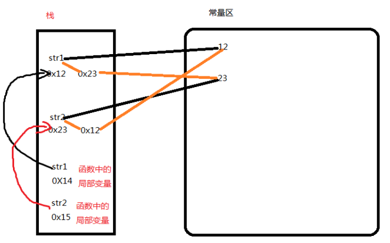

### 一、概述

---

向函数传递参数的类型分为三种：

1. 按值传递
2. 按引用传递
3. 按指针传递

- 按值传递表示方法（函数）接收的是调用者提供的变量的拷贝，不改变参数的值；
- 按引用传递表示方法（函数）接收的调用者提供的变量地址；
- 按指针传递表示方法（函数）接收的是调用者提供的指针的拷贝，不改变指针的值和地址，但可以改变指针所指向的地址。

Java中没有指针和引用传递，**只有值传递**，因此，**在函数中改变局部变量的参数不会影响到全局变量的值**。


### 二、函数中数据交换的实质

---


此时，虽然局部变量str1和str2与全局变量的str1和str2同名，但是，局部变量得到的仅仅是常量区值的地址的拷贝；如果交换局部变量的值，只是改变了局部变量的指向；不会影响大到全局变量。而方法区中的常量是final类型的，更是不会改变。

 示例如下： String x = new String("x111");

```java
String y = new String("y111");

swap(x,y);
System.out.println(x);
System.out.println(y);

public static void swap(String a, String b) {
  String temp = a;
  a = b;
  b = temp;
}

int[] arr = new int[3];
change(arr);
System.out.println(arr.length);
public static void change(int[] arr) {
  arr = Arrays.copyOf(arr, arr.length * 2);
}
```

输出的结果是：x111，y111，3

有人可能会说，String是一个final类型的类，太过特殊，那我们使用包装类试试。示例如下，得到的结果仍然是：3,4

```java
Integer inteA = new Integer("3");
Integer inteB = new Integer("4");
swapInte(inteA, inteB);
System.out.println(inteA);
System.out.println(inteB);

public static void swapInte(Integer InteA, Integer InteB) {
  Integer temp = 0;
  temp = InteA.intValue();
  InteB = InteA;
  InteA = temp;    
}
```

由此可见，不论java向方法中传递的是基本类型的数据还是引用类型的数据，其实质都是将该变量指向的地址拷贝一份传给了局部变量，本质上拷贝的该变量指向的一个值，随便局部变量如何玩耍，都不会波及全局变量。


### 三、C语言的指针传递和C#的引用传递

---

为了对比说明值传递与指针传递、引用传递的区别，下面结合C指针传递和C#的引用传递说明下；

 指针传递和引用传递的本质是将全局变量自身的地址传给了局部变量，因此，局部量修改时，同时也修改了全局变量的地址。



C语言的指针交换示例：

```c
#include <stdio.h>

void swop(char **str1, char **str2)
{
  char *temp = NULL;

  temp = *str1;
  *str1 = *str2;
  *str2 = temp;
}

int main()
{
  char *str1 = "hello";
  char *str2 = "world";

  printf("str1 = %s, str2 = %s
         ", str1, str2);
         swop(&str1, &str2);
         printf("str1 = %s, str2 = %s
                ", str1, str2);
                return 0;
                }
```

C#的引用传递

```c#
static void Main(string[] args)
{
  string x = "hello";
  string y = "world";
  Console.WriteLine("x={0},y={1}",x, y);
  Swap(ref x, ref  y);
  Console.WriteLine("x={0},y={1}", x, y);
  Console.ReadKey();
}
static void Swap(ref int x, ref int y)
{
  int temp = x;
  x = y;
  y = x;
}
static void Swap(ref string x, ref string y)
{
  string temp = x;
  x = y;
  y = x;
}
```


### 四、Java数据交换的三种方法

---

#### 4.1 使用数组

此时修改的是全局变量和局部变量共同指向的地址中的值，因此，二者的值都会改变。

```java
int[] arr = {3,4};
System.out.println(arr[0]);
System.out.println(arr[1]);
arr = swap(arr);
System.out.println(arr[0]);
System.out.println(arr[1]);
public static int[] swap(int[] arr){
  int temp = arr[0];
  arr[0] = arr[1];
  arr[1] = temp;
  return arr;
}
```

#### 4.2 使用反射

```java
Integer inteA = new Integer("3");
Integer inteB = new Integer("4");
try {
  swap(inteA, inteB);
} catch (Exception e) {
  e.printStackTrace();
}
System.out.println(inteA);
System.out.println(inteB);

public static void swap(Integer a1, Integer b1) throws Exception {
  Field value = Integer.class.getDeclaredField("value");
  value.setAccessible(true);
  int temp = a1.intValue();
  value.set(a1, b1.intValue());
  value.set(b1, temp);
}
```

#### 4.3 使用类封装的属性进行交换


### 五、总结

---

Java中方法的参数传递都是值传递，方法内局部变量的改变不会影响到全局变量。但是对局部变量和全局变量共同指向的值进行了修改的话，全局变量和局部变量的值都会改变。 