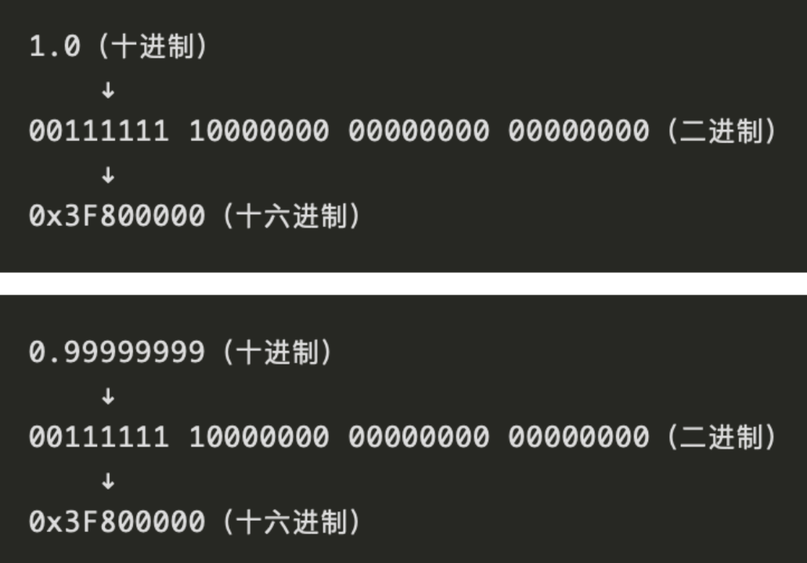
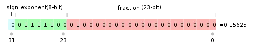
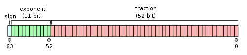

使用诸如float或者double这两种浮点型数据的处理时，典型现象。

- 条件判断超预期
- 数据转换超预期
- 基本运算超预期
- 数据自增超预期

```java
System.out.println(1f == 0.99999999f);
```

如上输出为true。

计算机底层在计算时都是基于像010100100100110011011这种二进制来完成的。把它转换到IEEE 754 Single precision 32-bit，也就float类型对应的精度。



很明显，它俩的二进制数字表示确实不一样，这是理所应当的结果。那么为什么0.99999999的底层二进制表示竟然是：00111111 10000000 00000000 00000000呢？这不明明是浮点数1.0的二进制表示吗？这就要谈一下浮点数的精度问题了。


### 一、浮点数的精度问题

---

浮点数在计算机中的存储方式遵循IEEE 754浮点数计数标准，可以如下数学公式表示：
$$
V=(-1)^S\times M\times 2^E
$$

- S表示sign，即符号。如果`S==0`，则浮点数V为正；如果`S==1`，则浮点数为负。
- M 表示有效数字，在 [1, 2) 之间。
- E 则是指数位。

在IEEE754标准中进行了单精度浮点数(float)和双精度数浮点数(double)的定义。float有32bit，double有64bit。它们的构成包括**符号位**、**指数位**和**尾数位**。



float——第31位(1bit)---第30-23位(8bit)---第22-0位(23bit)



> **取值范围**主要看指数部分：
>
> float的指数部分有8bit，由于是**有符号型**，所以得到对应的指数范围 `-128~128`（1 111 1111 ~ 0 111 1111），所以取值范围为 -2^128^到2^128^，约等于-3.4E38 ~ +3.4E38。
>
> **精度(有效数字)**主要看尾数位：
>
> float的尾数位是23bit，对应7~8位十进制数，所以有效数字**有的编译器是7位，也有的是8位**。

- **对于 32 位浮点数，可以准确表示的精度在 10^-6 这个量级。**换句话说，如果我们想要表示的小数，在小数点后 7 位还有有效数字的话，32 位的浮点数就不能精确表示了。
- **对于 64 位浮点数，可以准确表示的精度在 10^-15 这个量级。**换句话说，如果我们想要表示的小数，在小数点后 16 位还有有效数字的话，64 位的浮点数就不能精确表示了。


### 二、精度问题如何解决

---

如果涉及**商品金额**、**交易值**、**货币计算**等这种对精度要求很高的场景该怎么办呢？

#### 2.1 用字符串或者数组解决多位数问题

用字符串或者数组表示大数是一个典型的解题思路。

比如经典面试题：编写两个任意位数大数的加法、减法、乘法等运算。 

这时候我们可以用字符串或者数组来表示这种大数，然后按照四则运算的规则来手动模拟出具体计算过程，中间还需要考虑各种诸如：进位、借位、符号等等问题的处理，确实十分复杂，本文不做赘述。 

#### 2.2 Java的大数类

JDK提供了专用于高精度数值计算的大数类来方便我们使用。 

Java的大数类位于java.math包下：常用的 `BigInteger` 和 `BigDecimal`，像BigInteger 和 BigDecimal这种大数类的运算效率肯定是不如原生类型效率高，代价还是比较昂贵的，是否选用需要根据实际场景来评估。


### 三、BigDecimal类

---

#### 3.1 BigDecimal初始化

```java
BigDecimal num12 = new BigDecimal("0.005");
BigDecimal num22 = new BigDecimal("1000000");
```

**禁止使用构造方法BigDecimal(double)**的方式把double值转化为BigDecimal对象。（反编译出的字节码文件显示每次循环都会new出一个StringBuilder对象，然后进行append操作，最后通过toString方法返回String对象，造成内存资源浪费。）

#### 3.2 加减乘除

```java
// 加
BigDecimal result1 = num1.add(num2);

// 减
BigDecimal result2 = num1.subtract(num2);

// 乘
BigDecimal result3 = num1.multiply(num2);

// 绝对值
BigDecimal result4 = num3.abs();

// 除法
BigDecimal result5 = num2.divide(num1, 20, BigDecimal.ROUND_HALF_UP);
```

#### 3.3 注意点

使用BigDecimal类构造方法传入double类型时，计算的结果也是不精确的！

因为不是所有的浮点数都能够被精确的表示成一个double 类型值，有些浮点数值不能够被精确的表示成 double 类型值，因此它会被表示成与它最接近的 double 类型的值。必须改用传入String的构造方法。

#### 3.4 除法divide()参数

使用除法函数的时候要设置各种参数，要精确的小数位和摄入模式，不然会出现报错：

```java
public BigDecimal divide(BigDecimal divisor, int scale, int roundingMode)
```

除数，精确小数位，舍入模式

#### 3.5 8种舍入模式

| 舍入模式                     | 说明                                                         |
| ---------------------------- | ------------------------------------------------------------ |
| BigDecimal.ROUND_UP          | 始终对非零舍弃部分前面的数字加 1。注意，此舍入模式始终不会减少计算值的绝对值。 |
| BigDecimal.ROUND_DOWN        | 从不对舍弃部分前面的数字加 1（即截尾）。注意，此舍入模式始终不会增加计算值的绝对值。 |
| BigDecimal.ROUND_CEILING     | 如果结果为正，则舍入行为类似于 RoundingMode.UP；如果结果为负，则舍入行为类似于RoundingMode.DOWN。注意，此舍入模式始终不会减少计算值。 |
| BigDecimal.ROUND_FLOOR       | 如果结果为正，则舍入行为类似于 RoundingMode.DOWN；如果结果为负，则舍入行为类似于RoundingMode.UP。注意，此舍入模式始终不会增加计算值。 |
| BigDecimal.ROUND_HALF_UP     | 如果被舍弃部分 >= 0.5，则舍入行为同 RoundingMode.UP；否则舍入行为同RoundingMode.DOWN。注意，此舍入模式就是通常学校里讲的四舍五入。 |
| BigDecimal.ROUND_HALF_DOWN   | 如果被舍弃部分 > 0.5，则舍入行为同 RoundingMode.UP；否则舍入行为同RoundingMode.DOWN。注意，此舍入模式就是通常讲的五舍六入。 |
| BigDecimal.ROUND_HALF_EVEN   | 如果舍弃部分左边的数字为奇数，则舍入行为同 RoundingMode.HALF_UP；如果为偶数，则舍入行为同RoundingMode.HALF_DOWN。注意，在重复进行一系列计算时，根据统计学，此舍入模式可以在统计上将累加错误减到最小。此舍入模式也称为“银行家舍入法”，主要在美国使用。此舍入模式类似于 Java 中对float 和double 算法使用的舍入策略。 |
| BigDecimal.ROUND_UNNECESSARY | 计算结果是精确的，不需要舍入，否则抛出 ArithmeticException。 |

