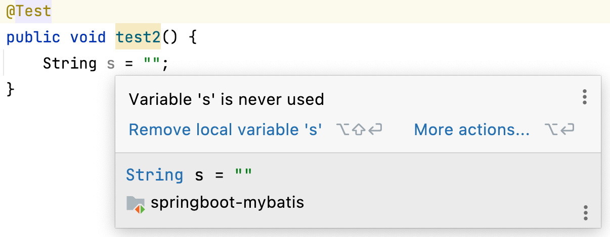
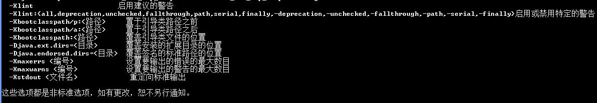

### 一、前言

---

编码时总会发现如下变量未被使用的警告提示：



上述代码编译通过且可以运行，在方法前添加@SuppressWarnings("unused") 去除警告信息。


### 二、@SuppressWarnings

---

用于抑制编译器产生警告信息。

1. 抑制单类型的警告

   ```java
   @SuppressWarnings("unchecked")

2. 抑制多类型的警告

   ```java
   @SuppressWarnings(value={"unchecked", "rawtypes"})
   ```

3. 一直所有类型的警告

   ```java
   @SuppressWarnings("all")
   ```


### 三、注解目标

---

 通过 @SuppressWarnings 的源码可知，其注解目标为类、字段、函数、函数入参、构造函数和函数的局部变量。

 建议注解应声明在最接近警告发生的位置。


### 四、抑制警告的关键字

---

| 关键字                   | 用途                                                         |
| ------------------------ | ------------------------------------------------------------ |
| all                      | 抑制所有警告                                                 |
| boxing                   | 抑制与装箱/拆箱操作相关的警告                                |
| cast                     | 抑制与强制转换操作相关的警告                                 |
| dep-ann                  | 抑制与已弃用注释相关的警告                                   |
| deprecation              | 抑制相对于弃用的警告                                         |
| fallthrough              | 抑制与switch语句中缺少断行相关的警告                         |
| finally                  | 抑制相对于未返回的finally块的警告                            |
| hiding                   | 来抑制相对于隐藏变量的局部变量的警告                         |
| incomplete-switch        | 禁用与switch语句中缺少的项相关的警告(enum情况)               |
| nls                      | 抑制相对于非nls字符串字面值的警告                            |
| null                     | 抑制与null分析相关的警告                                     |
| rawtypes                 | 在类参数上使用泛型时，抑制相对于非特定类型的警告             |
| restriction              | 对不鼓励使用或禁止使用的参考文献不予警告                     |
| serial                   | 对于可序列化的类，抑制与丢失的serialVersionUID字段相关的警告 |
| serial-access            | 抑制与不正确的静态访问相关的警告                             |
| synthetic-access         | 抑制与来自内部类的未优化访问相关的警告                       |
| unchecked                | 抑制与未检查操作相关的警告                                   |
| unqualified-field-access | 抑制与字段访问不合格相关的警告                               |
| unused                   | 抑制与未使用代码相关的警告                                   |


### 五、Java Lint选项

---

#### 5.1 Lint含义

用于在编译程序的过程中，进行更细节的额外检查。

#### 5.2 javac的标准选项和非标准选项

- **标准选项：**是指当前版本和未来版本中都支持的选项，如 -cp 和 -d 等。
- **非标准选项：**是指当前版本支持，但未来不一定支持的选项。通过 javac -X 查看当前版本支持的非标准选项。



#### 5.3 查看警告信息

默认情况下执行 javac 仅仅显示警告的扼要信息，也不过阻止编译过程。若想查看警告的详细信息，则需要执行 javac -Xlint:keyword 来编译源码了。