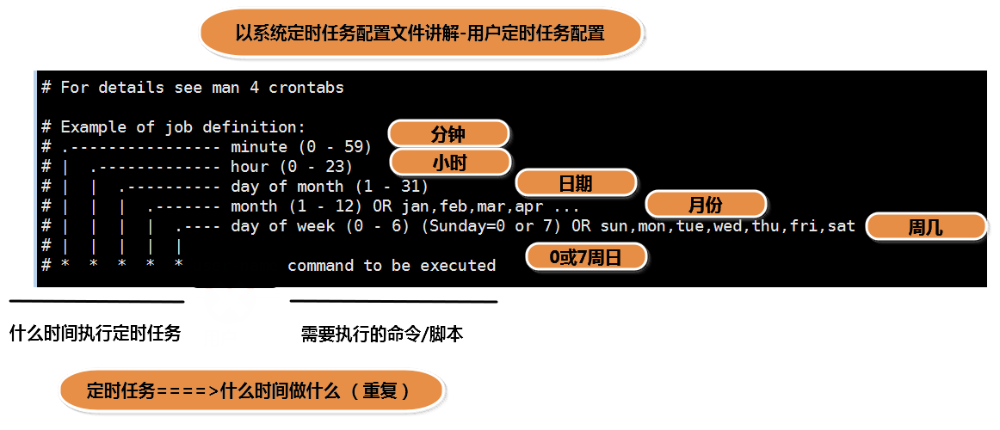

### 一、系统定时任务

---

#### 1.1 每小时

控制定时任务目录：`/etc/cron.hourly`

1. 进入定时任务目录

   ```shell
   cd /etc/cron.hourly
   ```

2. 创建普通文件

   ```shell
   touch 1.sh
   ```

3. 增加可执行权限

   ```shell
   chmod +x 1.sh

4. hourly内的可执行文件，每小时都会从头到尾的执行一遍

#### 1.2 每一天

控制定时任务目录：`/etc/cron.daily`

步骤同上

#### 1.3 每一周

控制定时任务目录：`/etc/cron.weekly`

步骤同上

#### 1.4 每个月

控制定时任务目录：`/etc/cron.monthly`

步骤同上


### 二、系统定时任务配置文件(crontab)

---

1. 定时任务配置文件路径：`/etc/crontab`

2. crontab表达式：

   ```
   *(分)*(时)*(天)*(月)*(周)
   ```

3. 定时任务软件（crontab），crontab 能检查表达式是否正确，但无法检查命令是否正确。




### 三、增加定时任务

---

进入增加定时任务命令：

```shell
crontab -e
45 19 * * * /root/1.sh
```

vim 1.sh 编写

```shell
vim 1.sh
echo 'hello world' >> /root/2.txt
```

vim 2.txt 编写

```shell
hello world
```


### 四、查看定时任务

---

```shell
crontab -l
```


### 五、定时任务配置文件(root最终结论)

---

定时任务配置文件：`/var/spool/cron/root`

- 每一个用户的定时任务是相对隔离的，在 /var/spool/cron 目录下，以当前用户的用户名命名的文件，每一个用户都会在这个目录以它的用户名命名。
- 执行定时任务属主就是用户名自己，每一个用户的定时任务都是以它当前用户的用户信息去执行的。

不能执行到root下，root文件表示是root用户设置的定时任务。当python需要设置定时任务 以用户名root命名即可 不需要crontab。


### 六、定时任务日志文件

---

定时任务运行记录日志文件：`/var/log/cron`

定时任务禁止用户运行黑名单：`/etc/cron.deny`


### 七、日常使用命令

---

```
head : 从头开始查看文件，默认查看10行
	-n : 指定查看多少行

tail : 从尾部开始查看文件，默认查看10行
	-n ： 指定查看多少行
	[root@localhost ~]# tail -n 20 /var/log/cron
	-f : 实时监控文变化
	[root@localhost ~]# tail -f /var/log/cron

less : 类似于vim的方式查看文件
	less /var/log/cron
	解析less:
		类似于文件
			q : 退出
```


### 八、定时任务格式

---

crontab (表达式) 

\* * * * *

1. 每隔2分钟执行 `*/2 * * * *` 
2. 每天的2，4，6，8，10这4个小时的1分钟执行 `01 2,4,6,8,10 * * *`
3. 每天的2到6点执行 `* 2-6 * * *`
4. 每天的2到6点中每隔2小时执行 `* 2-6/2 * * *`
5. 每天的2点时执行，但是这天必须是周二 `* 02 * * 02`