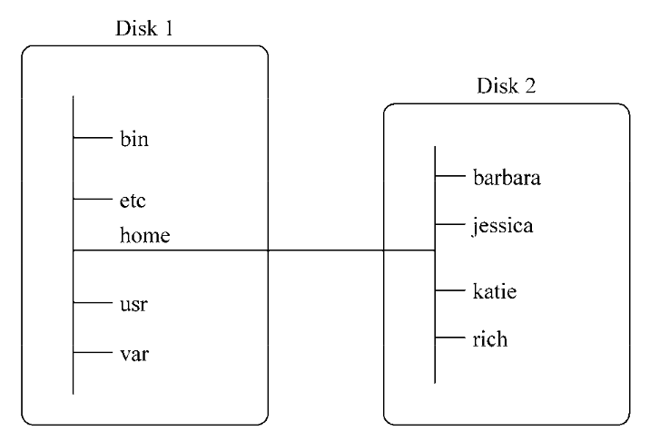

大多数Linux发行版的默认shell都是**GNU bash shell**。

### 一、启动shell

---

GNU bash shell能提供对Linux系统的交互式访问。它是作为普通程序运行的，通常是在用户登录终端时启动。登录时系统启动的shell依赖于用户账户的配置。

**/etc/passwd文件**包含了所有系统用户账户列表以及每个用户的基本配置信息。以下是从 /etc/passwd文件中取出的样例条目：

```shell
christin:x:501:501:Christine Bresnahan:/home/christine:/bin/bash
```

系统使用字段中的数据来赋予用户账户某些特定特性。先将注意力放在最后一个字段上，该字段指定了用户使用的shell程序。

上述示例中，用户christine使用/bin/bash作为自己的默认shell程序。这意味着当christine登录Linux系统后，bash shell会自动启动。


### 二、shell提示符

---

默认bash shell提示符是美元符号($)，这个符号表明shell在等待用户输入。不同的Linux发行版采用不同格式的提示符。在Ubuntu Linux系统上，shell提示符看起来是这样的：`christine@server01:~$`。在CentOS系统上是这样的：`[christine@server01 ~]$`

提示符还能够提供其他的辅助信息。在上面的两个例子中，提示符中显示了当前用户ID名christine。另外还包括系统名server01。


### 三、bash手册

---

在想要查找的工具的名称前面输入man命令，就可以找到那个工具相应的手册条目。

```shell
man ps
```

当使用man命令查看命令手册页的时候，这些手册页是由**分页程序(pager)**来显示的。分页程序是一种实用工具，能够逐页显示文本。可以通过点击**空格键进行翻页**，或是使用**回车键逐行查看**。

Linux手册页惯用的节名：

| 节            | 描述                       |
| ------------- | -------------------------- |
| Name          | 显示命令名和一段简短的描述 |
| Synopsis      | 命令的语法                 |
| Configuration | 命令配置信息               |
| Description   | 命令的一般性描述           |
| Options       | 命令选项描述               |
| Exit Status   | 命令的退出状态指示         |
| Return Value  | 命令的返回值               |
| Errors        | 命令的错误消息             |
| Environment   | 描述所使用的环境变量       |
| Files         | 命令用到的文件             |
| Versions      | 命令的版本信息             |
| Conforming To | 命名所遵从的标准           |
| Notes         | 其他有帮助的资料           |
| Bugs          | 提供提交bug的途径          |
| Example       | 展示命令的用法             |
| Authors       | 命令开发人员的信息         |
| Copyright     | 命令源代码的版权状况       |
| See Also      | 与该命令类型的其他命令     |

>如果不记得命令名，可以使用关键字搜索手册页。语法是：`man -k` 关键字。例如，要查找与终端相关的命令，可以输入`man -k terminal`。


### 四、浏览文件系统

---

#### 4.1 Linux文件系统

在Windows中，PC上安装的物理驱动器决定了文件的路径名。Windows会为每个物理磁盘驱动器分配一个盘符，每个驱动器都会有自己的目录结构，以便访问存储其中的文件。

**Linux将文件存储在单个目录结构中**，这个目录被称为**虚拟目录(virtual directory)**。虚拟目录将安装在PC上的所有存储设备的文件路径纳入单个目录结构中。Linux虚拟目录结构只包含一个称为**根(root)目录**的基础目录。根目录下的目录和文件会按照访问它们的目录路径一一列出。

>Linux使用正斜线`/`在文件路径中划分目录。**在Linux中，反斜线用来标识转义字符**，要是用在文件路径中的话会导致各种各样的问题。

在Linux中，你会看到下面这种路径：`/home/Rich/Documents/test.doc`。这表明文件test.doc位于Documents目录，Documents又位于rich目录中，rich则在home目录中。注意：**路径本身并没有提供任何有关文件究竟存放在哪个物理磁盘上的信息**。

Linux虚拟目录中比较复杂的部分是它如何协调管理各个存储设备。在Linux PC上安装的第一块硬盘称为根驱动器。根驱动器包含了虚拟目录的核心，其他目录都是从那里开始构建的。

Linux会在根驱动器上创建一些特别的目录，称之为**挂载点(mount point)**。**挂载点是虚拟目录中用于分配额外存储设备的目录**。虚拟目录会让文件和目录出现在这些挂载点目录中，然而实际上它们却存储在另外一个驱动器中。

通常系统文件会存储在根驱动器中，而用户文件则存储在另一驱动器中，如下图所示：



**上图展示了计算机中的两块硬盘。一块硬盘和虚拟目录的根目录（/）关联起来。剩下的硬盘就可以挂载到虚拟目录结构中的任何地方**。第二块硬盘被挂载到了`/home`位置，用户目录都位于这个位置。

在Linux文件系统中，通用的目录名用于表示一些常见的功能。下表列出了一些较常见的Linux顶层虚拟目录名及其内容。

| 目录      | 用途                                                         |
| --------- | ------------------------------------------------------------ |
| /         | 虚拟目录的根目录，通常不会再这里存储文件                     |
| /bin      | 二进制目录，存放用户级的GNU工具                              |
| /boot     | 启动目录，存放启动文件                                       |
| /dev      | 设备目录，Linux在这里创建设备节点                            |
| **/etc**  | **系统配置文件目录**                                         |
| /home     | 主目录，Linux在这里创建设备节点                              |
| /lib      | 库目录，存放系统和应用程序的库文件                           |
| /media    | 媒体目录，可移动媒体设备的常用挂载点                         |
| /mnt      | 挂载目录，另一个可移动媒体设备的常用挂载点                   |
| **/opt**  | **可选目录，常用于存放第三方软件包和数据文件**               |
| **/proc** | **进程目录，存放现有硬件及当前进程的相关信息**               |
| /root     | root用户的目录                                               |
| **/sbin** | **系统二进制目录，存放GNU管理员级工具**                      |
| /run      | 运行目录，存放系统运作时的运行数据                           |
| /srv      | 服务目录，存放本地服务相关文件                               |
| /sys      | 系统目录，存放系统硬件信息的相关文件                         |
| /tmp      | 临时目录，可以在该目录中创建和删除临时工作文件               |
| **/usr**  | **用户二进制目录，大量用户级的GNU工具和数据文件都存储在这里** |
| /var      | 可变目录，用以存放经常变化的文件，比如日志文件               |

>常见的目录名均基于**文件系统层级标准(filesystem hierarchy standard，FHS)**。很多Linux发行版都遵循了FHS。
>
>**Filesystem Hierarchy Standard（文件系统层次化标准）**：这是一个广泛应用于类Unix系统（特别是Linux发行版）的标准，用于组织目录结构和文件。FHS定义了系统中每个主要目录的用途、应存放的文件类型以及目录的基本结构，确保了系统文件和第三方应用程序文件的组织一致性。这有助于用户和系统管理员更容易地定位和管理文件。FHS分为两层规范，规定了根目录（/）下各主要目录的内容，以及对/usr和/var等目录的更详细要求。

#### 4.2 遍历目录

- `cd destination`：切换目录。
- `pwd`：显示出shell会话的当前目录。

两个特殊字符可用于相对文件路径中：

- `单点符(.)`：当前目录。
- `双点符(..)`：当前目录的父目录。


### 五、文件和目录列表

---

#### 5.1 基本列表功能

- `ls -F`：区分文件和目录。
- `ls -a`：所有以点号开头的隐藏文件都显示出来。
- `ls -R`：递归选项，列出当前目录下包含的子目录中的文件。

#### 5.2 显示长列表

- `ls -l`：长列表格式输出，包含目录中每个文件的更多相关信息

```shell
drwxr-xr-x@ 30 chance  staff      960  8 16 06:20 rocketmq-all-4.9.1-source-release
-rw-r--r--@  1 chance  staff  4392335 10 25 15:11 rocketmq-all-4.9.1-source-release.zip
```

输出的第一行显示了在目录中包含的总块数。在此之后，每一行都包含了关于文件(或 目录)的下述信息：

- 文件类型：
  - 目录(d)
  - 普通文件(-)
  - 字符型文件(c)：用于传输数据流，支持顺序访问，如键盘、鼠标、串口等。
  - 块设备(b)：用于存储数据，支持随机访问，如硬盘、分区、LUN等。
  - 套接字文件(s)：用于进程间通信，通常与网络服务相关联。
  - 命名管道(FIFO)(p)：也是用于进程间通信，但它遵循先进先出的原则。
  - 符号链接文件(l)：指向另一个文件或目录的链接，类似于Windows的快捷方式。
  - 门(D)：Solaris系统中的特殊文件类型，但在Linux中并不常见。
- 文件的权限；
- 文件的硬链接总数；
- 文件属主的用户名；
- 文件属组的组名；
- 文件的大小(以字节为单位)；
- 文件的上次修改时间；
- 文件名或目录名。

#### 5.3 过滤输出列表

ls命令支持在命令行中定义过滤器。它会用过滤器来决定应该在输出中显示哪些文件或目录。

这个过滤器就是一个进行简单文本匹配的字符串。可以在要用的命令行参数之后添加这个过滤器：`ls -l my_script`

当用户指定特定文件的名称作为过滤器时，ls命令只会显示该文件的信息。有时你可能不知道要找的那个文件的确切名称。ls命令能够识别标准通配符，并在过滤器中用它们进行模式匹配：

- ?代表一个字符；
- *代表零个或多个字符；

在过滤器中使用星号和问号被称为文件扩展匹配(file globbing)，指的是使用通配符进行模 式匹配的过程。通配符正式的名称叫作**元字符通配符(metacharacter wildcards)**。除了星号和问号之外，还有更多的元字符通配符可用于文件扩展匹配。可以使用中括号。

中括号表示一个字符位置并给出多个可能的选择。可以像上面的例子那样将待选的字符列出来，也可以指 定字符范围，例如字母范围`[a – i]`。

另外，可以使用感叹号(!)将不需要的内容排除在外`[!a]`。


### 六、处理文件

---

#### 6.1 创建文件

`touch`：创建空文件，并将你的用户名作为文件的属主；该命令还可以改变文件的修改时间（`-m`选项表示只修改修改时间（mtime）而不改变访问时间（atime），`-d`选项指定一个特定的日期和时间）。

```shell
touch -m -d "2024-06-08 10:30:00" example.txt
```

#### 6.2 复制文件

- `cp source destination`：复制文件，当source和destination参数都是文件名时，该命令将源文件复制成一个新文件，并且以destination命名。如果目标文件已经存在，最好加上-i选项，强制shell询问是否需要覆盖已有文件。
- `cp -R source destination`：可以用它在一条命令中递归地复制整个目录的内容。

#### 6.3 链接文件

如需要在系统上维护同一文件的两份或多份副本，除了保存多份单独的物理文件副本之外，还可以采用保存一份物理文件副本和多个虚拟副本的方法。这种虚拟的副本就称为链接。**链接是目录中指向文件真实位置的占位符**。

**符号链接（软连接）**就是一个实实在在的文件，它指向存放在虚拟目录结构中某个地方的另一个文件。这两个通过符号链接在一起的文件，彼此的内容并不相同。

````shell
ln -s 源文件（或目录） 软链接文件名
````

**创建符号链接，原始文件必须事先存在。**

```shell
ln -s my-gateway_info.log sl_my-gateway_info.l
og

-rw-r--r--  1 chenyang  staff   5.3K 11  3  2022 my-gateway_info.log
lrwxr-xr-x  1 chenyang  staff    19B  6 11 10:26 sl_my-gateway_info.log -> my-gateway_info.log
```

`sl_my-gateway_info.log -> my-gateway_info.log`表示sl_my-gateway_info.log是链接到文件my-gateway_info.log上的一个符号链接。符号链接sl_my-gateway_info.log只有19个字节，而my-gateway_info.log有5427.2字节。这是因为sl_my-gateway_info.log仅仅只是指向my-gateway_info.log而已。它们的内容并不相同，是两个完全不同的文件。

另一种证明链接文件是独立文件的方法是查看**inode编号**。**文件或目录的inode编号是一个用于标识的唯一数字，这个数字由内核分配给文件系统中的每一个对象**。要查看文件或目录的inode 编号，可以给ls命令加入-i参数。

```shell
ls -i *broker.log

51599270 broker.log    74238465 sl_broker.log
```

**硬链接**会创建独立的虚拟文件，其中包含了原始文件的信息及位置。但是它们从根本上而言是同一个文件。引用硬链接文件等同于引用了源文件。要创建硬链接，原始文件也必须事先存在，只不过这次使用ln命令时不需要加入额外的参数了。

```shell
ln 源文件 硬链接文件名
```

> 硬链接的应用场景
>
>1. **数据保护**：当需要防止文件因误删而丢失时，可以创建硬链接作为文件的备份。即便原始文件被删除，通过硬链接仍可访问文件内容。
>2. **多入口访问**：如果你希望一个文件可以通过多个路径访问，但又不希望复制文件占用额外空间，硬链接可以提供这样的便利。这对于配置文件、共享库等非常有用。
>3. **版本控制**：在开发过程中，可以通过硬链接为代码或文档创建快照，以便在不同阶段快速切换，同时保持文件系统的高效。
>4. **系统维护**：在升级或迁移文件前，创建硬链接作为临时保险措施，确保在操作失败时可以迅速恢复。
>
>软链接的应用场景
>
>1. **配置文件共享**：软链接常用于将配置文件链接到统一的位置，便于管理和更新，尤其适合多用户或多服务共享配置的情况。
>2. **程序快捷方式**：创建程序或脚本的软链接，方便用户从标准目录（如`/usr/local/bin`）访问，而实际文件可以存放在其他位置。
>3. **动态库版本兼容**：通过软链接指向不同版本的动态库，可以灵活地调整应用程序使用的库版本，而不必修改应用本身。
>4. **目录结构简化**：通过创建目录的软链接，可以简化复杂的文件结构，使路径更易于管理和记忆。
>5. **跨文件系统共享**：软链接可以跨越不同的文件系统，这对于分布式文件系统或网络存储的管理非常有用。
>6. **开发环境配置**：在开发环境中，使用软链接指向开发版本的库或框架，便于快速切换开发环境而不必每次复制文件。

#### 6.4 重命名文件

重命名文件称为移动（moving）。mv命令可以将文件和目录移动到另一个位置或重新命名。

mv不会改变inode编号和时间戳。

#### 6.5 删除文件

删除(deleting)叫作移除(removing)。删除文件的命令是rm。

- -i命令参数提示你是不是要真的删除该文件； 
- -f参数强制删除；


### 七、处理目录

---

#### 7.1 创建目录


