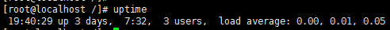
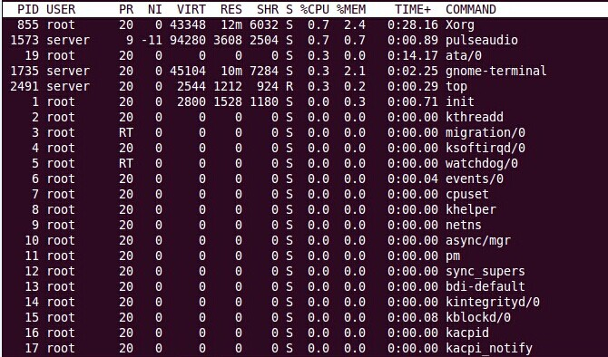

### 一、uptime

---



19:40:29  //当前时间

up 3 days, 7:32  //系统运行时间

3users  //正在登录用户数

最后三个数依次是 1分钟，5分钟，15分钟系统的平均负载（load average）。

#### 1.1 选项

- -p：格式化输出
- -s：显示系统启动日期/时间
- -V：版本信息
- -h：获取帮助信息


### 二、平均负载

---

平均负载是指单位时间内，系统处于可运行状态和不可中断状态的平均进程数，也就是平均活跃进程数，它和CPU使用率并没有直接关系。

>系统负载是处于可运行runnable或不可中断uninterruptable状态的进程的平均数。可运行状态的进程要么正在使用 CPU 要么在等待使用 CPU。 不可中断状态的进程则正在等待某些 I/O 访问，例如等待磁盘 IO。
>有三个时间间隔的平均值。负载均值的意义根据系统中 CPU 的数量不同而不同，负载为 1 对于一个只有单 CPU 的系统来说意味着负载满了，而对于一个拥有 4 CPU 的系统来说则意味着 75% 的时间里都是空闲的。

#### 2.1 最理想的平均活跃进程数

就是刚好每个CPU上都刚好运行着一个进程，这样每个CPU都得到了充分的利用。比如平均负载为4时意味着什么呢？

- 在只有4个CPU的系统上，意味着所有的CPU都刚好被完全占用。
- 在8个CPU的系统上，意味着CPU有50%的空闲。
- 而在有2个CPU系统上，意味着有一半的进程竞争不到CPU。

#### 2.2 平均负载为多少合适

平均负载比CPU个数大的时候，系统就已经出现了过载。

- 如果1分钟，5分钟，15分钟的三个值基本相同，或者相差不大，那就说明系统负载很平稳。
- 如果1分钟的值远小于15分钟的值，就说明系统最近1分钟负载在减少，而过去15分钟内却有很大负载。
- 反之则相反，如果1分钟的值远大于15分钟的值，说明近1分钟负载在增加，这种情况可能是临时性的，也可能还会持续，要持续观察，一旦1分钟的平均负载超过了CPU的数量，意味着系统正在发生过载的问题。

#### 2.3 实际生产中，平均负载多高时需要关注呢 

平均负载高于CPU数量70%时，就应该分析排查负载高问题了。

#### 2.4 平均负载与CPU使用率

- CPU密集型进程，使用大量CPU会导致平均负载升高，此时两者是一致的。
- I/O密集型进程，等待I/O也会导致平均负载升高，但CPU使用率不一定很高。
- 大量等待CPU的进程调度也会导致平均负载升高，此时的CPU使用率也会比较高。


### 三、top

---

```bash
top [-] [d] [p] [q] [c] [C] [S] [s] [n]
```

参数说明：

- d：指定每两次屏幕信息刷新之间的时间间隔。当然用户可以使用s交互命令来改变之。
- p：通过指定监控进程ID来仅仅监控某个进程的状态。
- q：该选项将使top没有任何延迟的进行刷新。如果调用程序有超级用户权限，那么top将以尽可能高的优先级运行。
- S：指定累计模式。
- s：使top命令在安全模式中运行。这将去除交互命令所带来的潜在危险。
- i：使top不显示任何闲置或者僵死进程。
- c：显示整个命令行而不只是显示命令名。
- n : 更新的次数，完成后将会退出 top
- b : 批次档模式，搭配 "n" 参数一起使用，可以用来将 top 的结果输出到档案内

#### 3.1 系统运行时间和负载

顶部显示与uptime命令相似的输出。


#### 3.2 任务


Tasks — 任务（进程），系统现在共有144个进程，其中处于运行中的有1个，143个在休眠（sleep），stoped状态的有0个，zombie状态（僵尸）的有0个。

第二行显示的是任务或者进程的总结。进程可以处于不同的状态。这里显示了全部进程的数量。除此之外，还有正在运行、睡眠、停止、僵尸进程的数量（僵尸是一种进程的状态）。这些进程概括信息可以用**'t'切换**显示

#### 3.3 CPU状态


这里显示不同模式下所占cpu时间百分比，这些不同的cpu时间表示：

- 1.3% us — 用户空间占用CPU的百分比。
- 1.0% sy — 内核空间占用CPU的百分比。
- 0.0% ni — 用户空间改变过优先级的进程占用CPU的百分比
- 97.3% id — 空闲CPU百分比
- 0.0% wa — IO等待占用CPU的百分比
- 0.3% hi — 硬中断（Hardware IRQ）占用CPU的百分比
- 0.0% si — 软中断（Software Interrupts）占用CPU的百分比
- 0.0% st— 这个虚拟机被hypervisor偷去的CPU时间（译注：如果当前处于一个hypervisor下的vm，实际上hypervisor也是要消耗一部分CPU处理时间的）。

#### 3.4 内存使用


物理内存显示如下：全部可用内存、已使用内存、空闲内存、缓冲内存。相似地：交换部分显示的是：全部、已使用、空闲和缓冲交换空间。

内存显示可以用**'m'命令**切换。

509248k total — 物理内存总量（509M）
495964k used — 使用中的内存总量（495M）
13284k free — 空闲内存总量（13M）
25364k buffers — 缓存的内存量 （25M）


swap交换分区
492536k total — 交换区总量（492M）
11856k used — 使用的交换区总量（11M）
480680k free — 空闲交换区总量（480M）
202224k cached — 缓冲的交换区总量（202M）


这里要说明的是**不能用windows的内存概念理解这些数据**，如果按windows的方式此台服务器“危矣”：8G的内存总量只剩下530M的可用内存。Linux的内存管理有其特殊性。

第四行中使用中的内存总量（used）指的是现在系统内核控制的内存数，空闲内存总量（free）是内核还未纳入其管控范围的数量。纳入内核管理的内存不见得都在使用中，还包括过去使用过的现在可以被重复利用的内存，内核并不把这些可被重新使用的内存交还到free中去，因此在linux上free内存会越来越少，但不用为此担心。

如果出于习惯去计算可用内存数，这里有个近似的计算公式：**第四行的free + 第四行的buffers + 第五行的cached**，按这个公式此台服务器的可用内存：

13284+25364+202224 = 240M。

所谓缓冲的交换区总量，即内存中的内容被换出到交换区，而后又被换入到内存，但使用过的交换区尚未被覆盖，该数值即为这些内容已存在于内存中的交换区的大小。相应的内存再次被换出时可不必再对交换区写入。

对于内存监控，在top里我们要**时刻监控第五行swap交换分区的used，如果这个数值在不断的变化，说明内核在不断进行内存和swap的数据交换，这是真正的内存不够用了**。

#### 3.5 各进程的状态监控



- PID 进程id
- USER 进程所有者的用户名
- PR 优先级
- NI nice值。负值表示高优先级，正值表示低优先级
- VIRT 进程使用的虚拟内存总量，单位kb。VIRT=SWAP+RES
- RES 进程使用的、未被换出的物理内存大小，单位kb。RES=CODE+DATA
- SHR 共享内存大小，单位kb
- S 进程状态。（D=不可中断的睡眠状态，R=运行，S=睡眠，T=跟踪/停止，Z=僵尸进程）
- %CPU 上次更新到现在的CPU时间占用百分比
- %MEM 进程使用的物理内存百分比
- TIME 进程使用的CPU时间总计，单位秒
- COMMAND 命令名/命令行

默认情况下仅显示比较重要的 PID、USER、PR、NI、VIRT、RES、SHR、S、%CPU、%MEM、TIME+、COMMAND 列。可以通过下面的快捷键来更改显示内容。

> 通过 f 键可以选择显示的内容。按 f 键之后会显示列的列表，按 a-z 即可显示或隐藏对应的列，最后按回车键确定。
>
> 按 o 键可以改变列的显示顺序。按小写的 a-z 可以将相应的列向右移动，而大写的 A-Z 可以将相应的列向左移动。最后按回车键确定。
>
> 按大写的 F 或 O 键，然后按 a-z 可以将进程按照相应的列进行排序。而大写的 R 键可以将当前的排序倒转。

#### 3.6 交互命令

- 可以用h或？显示交互命令的帮助菜单。
- 要手动刷新，用户可以输入回车或者空格。
- 按键盘数字“1”，可监控每个逻辑CPU的状况
- 默认进入top时，各进程是按照CPU的占用量来排序的，在【top视图 01】中进程ID为14210的Java进程排在第一（cpu占用100%），进程ID为14183的java进程排在第二（cpu占用12%）。可通过键盘指令来改变排序字段，比如想监控哪个进程占用MEM最多，敲击键盘“b”（打开/关闭加亮效果）
- 通过敲击“y”键关闭或打开运行态进程的加亮效果
- 敲击键盘**“x”**（打开/关闭排序列的加亮效果），可以看到，top默认的排序列是“%CPU”
- 通过**”shift + >”**或”shift + <”可以向右或左改变排序列
- 敲击“f”键，top进入另一个视图，在这里可以编排基本视图中的显示字段。有”*”并且标注为大写字母的字段是可显示的，没有”*”并且是小写字母的字段是不显示的。如果要在基本视图中显示“CODE”和“DATA”两个字段，可以通过敲击“r”和“s”键，“回车”返回基本视图，可以看到多了“CODE”和“DATA”两个字段


### 四、top命令的补充

---

top监控有很大的局限性。top命令的监控最小单位是进程，所以看不到我关心的java线程数和客户连接数，而这两个指标是java的web服务非常重要的指标，通常我用ps和netstate两个命令来补充top的不足。

#### 4.1 监控java线程数

```bash
ps -eLf | grep java | wc -l
```

#### 4.2 监控网络客户连接数

```bash
netstat -n | grep tcp | grep 侦听端口 | wc -l
```

#### 4.3 文件

在Linux系统“一切都是文件”的思想贯彻指导下，所有进程的运行状态都可以用文件来获取。系统根目录/proc中，每一个数字子目录的名字都是运行中的进程的PID，进入任一个进程目录，可通过其中文件或目录来观察进程的各项运行指标，例如task目录就是用来描述进程中线程的，因此也可以通过下面的方法获取某进程中运行中的线程数量（PID指的是进程ID）：

```bash
ls /proc/PID/task | wc -l
```

#### 4.4 分析线程堆栈

```bash
pmap PID
```

#### 4.5 查看多核CPU命令

```bash
mpstat -P ALL 和 sar -P ALL
```


### 五、虚拟内存统计

---

vmstat是Virtual Meomory Statistics（虚拟内存统计）的缩写，可对操作系统的虚拟内存、进程、IO读写、CPU活动等进行监视。它是对系统的整体情况进行统计，不足之处是无法对某个进程进行深入分析。

```bash
vmstat [-a] [-n] [-S unit] [delay [ count]]
vmstat [-s] [-n] [-S unit]
vmstat [-m] [-n] [delay [ count]]
vmstat [-d] [-n] [delay [ count]]
vmstat [-p disk partition] [-n] [delay [ count]]
vmstat [-f]
vmstat [-V]
```

一般vmstat工具的使用是通过两个数字参数来完成的，第一个参数是采样的时间间隔数，单位是秒，第二个参数是采样的次数，如：

```bash
vmstat 2 1
```

2表示每个两秒采集一次服务器状态，1表示只采集一次。

实际上，在应用过程中，我们会在一段时间内一直监控，不想监控直接结束vmstat就行了，例如：

```bash
vmstat 2  
```

这表示vmstat每2秒采集数据，一直采集，直到结束程序。


### 六、dstat

---

Vmstat是对系统的整体情况进行统计，不足之处是无法对某个进程进行深入分析，所以我们再引入另一个工具dstat。dstat是一个可以取代vmstat、iostat、netstat和ifstat这些命令的多功能产品。dstat克服了这些命令的局限并增加了一些功能和监控项，也变得更灵活了。dstat可以很方便监控系统运行状况并用于基准测试和排除故障。

```bash
yum install dstat
```

```bash
dstat 3 10
```

在dstat命令中有很多参数可选，你可以通过man dstat命令查看，大多数常用的参数有这些：

-l ：显示负载统计量
-m ：显示内存使用率（包括used，buffer，cache，free值）
-r ：显示I/O统计
-s ：显示交换分区使用情况
-t ：将当前时间显示在第一行
–fs ：显示文件系统统计数据（包括文件总数量和inodes值）
–nocolor ：不显示颜色（有时候有用）
–socket ：显示网络统计数据
–tcp ：显示常用的TCP统计
–udp ：显示监听的UDP接口及其当前用量的一些动态数据
当然不止这些用法，dstat附带了一些插件很大程度地扩展了它的功能。你可以通过查看/usr/share/dstat目录来查看它们的一些使用方法，常用的有这些：
-–disk-util ：显示某一时间磁盘的忙碌状况
-–freespace ：显示当前磁盘空间使用率
-–proc-count ：显示正在运行的程序数量
-–top-bio ：指出块I/O最大的进程
-–top-cpu ：图形化显示CPU占用最大的进程
-–top-io ：显示正常I/O最大的进程
-–top-mem ：显示占用最多内存的进程

举一个我常用的例子，显示哪些进程在占用IO、内存、CPU：

```bash
dstat -l -m -r -c --top-io --top-mem --top-cpu
```

如何输出一个csv文件
想输出一个csv格式的文件用于以后，可以通过下面的命令：

```bash
dstat –output /tmp/sampleoutput.csv -cdn
```