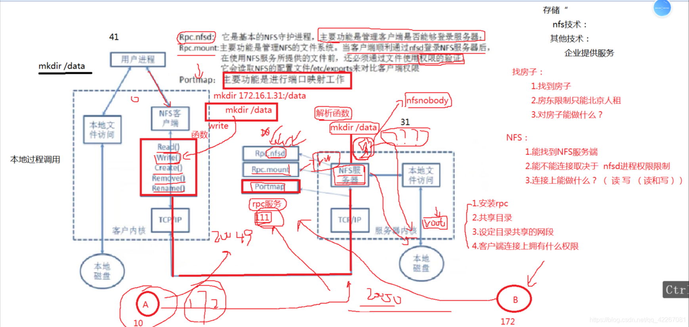

### 一、NFS概述

---

#### 1.1 什么是nfs

`NFS（Network File System）`即网络文件系统。 NFS共享存储

#### 1.2 nfs能干什么

主要功能：通过网络（局域网）让不同的主机系统之间可以共享文件或目录。


#### 1.3 为什么要使用nfs

NFS网络文件系统一般被用来存储共享视频，图片，附件等静态资源文件。

#### 1.4 nfs能解决什么问题

1. 解决多台web静态资源的共享(所有客户端都挂载服务端，看到的数据都一样)
2. 解决多台web静态资源一致性(如果客户端A删除NFS服务上的test文件，客户端B上也会看不见test文件)
3. 解决多台web磁盘空间的浪费
4. 快速迭代web服务器的代码

#### 1.5 使用nfs的注意事项

增加nfs会增加资源访问的延时 • 建议：使用cdn对静态资源加速 —>cdn原理

#### 1.6 nfs实现的原理解析




NFS实现原理(需要先了解[程序|进程|线程])

1. NFS客户端执行增、删等操作，客户端会使用不同的函数对该操作进行封装。
2. NFS客户端会通过TCP/IP的方式传递给NFS服务端。
3. NFS服务端接收到请求后，会先调用portmap进程进行端口映射。
4. `nfsd进程`用于判断NFS客户端是否拥有权限连接NFS服务端。
5. `Rpc.mount进程`判断客户端是否有对应的权限进行验证。
6. `idmap进程`实现用户映射和压缩。
7. 最后NFS服务端会将客户端的函数转换为本地能执行的命令，然后将命令传递至内核，由内核驱动硬件。

注意: rpc是一个远程过程调用，那么使用nfs必须有rpc服务(yum 安装 nfs-utils时安装了rpc服务)

#### 1.7 NFS作用

解决多web节点静态资源的共享（所有客户机都挂载服务端，共享静态资源。）

解决多节点浪费

注意：

web获取静态资源每次都会连接NFS，会造成网络开销，以及网络延时，所以增加NFS服务并不能带来访问速度提升

提速方案----->ＮＦＳ服务器端的静态资源可以统一储存至ＣＤＮ以此实现资源加速。


### 二、NFS部署

---

#### 网络规划

| 环境准备              | 服务器 |
| --------------------- | ------ |
| 10.0.0.7 172.16.1.7   | web01  |
| 10.0.0.31 172.16.1.31 | nfs    |

#### 2.1 服务端安装

172.16.1.31

```bash
yum install rpcbind nfs-utils -y
```

#### 2.2 配置 /etc/exports

将nfs服务端的/data目录共享给172.16.1.0/24网段内的所有主机
　　1) 所有客户端主机都拥有读写权限
　　2) 在将数据写入到NFS服务器的硬盘中后才会结束操作，最大限度保证数据不丢失
　　3) 将所有用户映射为本地的匿名用户(nfsnobody)

```bash
cat /etc/exports
/data 172.16.1.0/24(rw,sync,all_squash)
```

#### 2.3 根据配置创建对应的目录

```bash
mkdir /data
chown -R nfsnobody.nfsnobody /data/
```

#### 2.4 启动

```bash
systemctl enable nfs
systemctl start nfs
```

#### 2.5 客户端测试

1. 先安装软件包

```bash
yum install nfs-utils -y
```

2. 检查172.16.1.31 服务端共享的目录详情

```bash
showmount -e 172.16.1.31
Export list for 172.16.1.31:
/data 172.16.1.0/24
```

3. 客户端执行挂载操作

```bash
mount -t nfs 172.16.1.31:/data /mnt
```

4. 检查挂载是否OK

```bash
df -h
文件系统                    容量  已用  可用 已用% 挂载点
172.16.1.31:/data         17G  2.9G   15G   17% /mnt
```


### 三、NFS共享参数

```bash
vim /etc/exports
```

| nfs共享参数    | 作用                                                         |
| -------------- | ------------------------------------------------------------ |
| rw             | 读写权限                                                     |
| ro             | 只读权限                                                     |
| sync           | 同时将数据写入到内存与硬盘中，保证不丢失数据                 |
| async          | 优先将数据保存到内存，然后再写入硬盘；这样效率更高，但可能会丢失数据 |
| root_squash    | 客户端以root管理员访问NFS时，映射为NFS服务器的匿名用户(不常用) |
| no_root_squash | 客户端以root管理员访问时，映射为NFS服务器的root管理员(不常用) |
| no_all_squash  | 无论NFS客户端使用什么账户访问，都不进行压缩（ kvm热迁移 ）也不做用户改变（id号相同才是相同用户） |
| all_squash     | 无论客户端使用什么账户访问NFS服务，均映射为NFS服务器的匿名用户(常用，可指定uid，gid) |

修改默认映射用户信息 nfsnobody–> id号

anongid	配置all_squash使用,指定NFS的组的UID,必须存在系统

#### 3.1 常用参数实践

```bash
1.验证ro权限实践
[root@nfs ~]# cat /etc/exports
/data1 172.16.1.0/24(ro,sync,all_squash)

[root@nfs ~]# mkdir /data1
[root@nfs ~]# chown nfsnobody.nfsnobody /data1/
[root@nfs ~]# systemctl restart nfs

[root@web01 ~]# mount -t nfs 172.16.1.31:/data1 /mnt
[root@web01 ~]# echo "123" >> /mnt/test
-bash: /mnt/test: 只读文件系统

2.验证all_squash、anonuid、anongid权限
[root@nfs ~]# cat /etc/exports
/data 172.16.1.0/24(rw,sync,all_squash,anonuid=666,anongid=666)

创建系统用户
[root@nfs ~]# groupadd -g 666 www
[root@nfs ~]# useradd -u 666 -g 666 www

[root@nfs ~]# mkdir -p /data
[root@nfs ~]# chown -R www.www /data
[root@nfs ~]# systemctl restart nfs-server

客户端挂载
[root@web01 ~]# mount -t nfs 172.16.1.31:/data /mnt
[root@web01 ~]# echo "123" >> /mnt/test

检查服务端：
[root@nfs ~]# ll /data
-rw-r--r-- 1 www www 4 4月  16 11:11 test

查看客户端：
[root@web01 ~]# ll -d /mnt/
-rw-r--r-- 1 666 666 4 Apr 16 11:11 test

```

PS： 为了避免程序在操作NFS时。
权限会出现错误，我们将进程运行的用户，与nfs存储压缩的用户保持一致。

```bash
[root@web01 ~]# groupadd -g 666 www
[root@web01 ~]# useradd -u 666 www -g www
[root@web01 ~]# ll /mnt/
rw-r--r-- 1 www www 4 Apr 16 11:11 test
```


### 四、NFS使用总结

---

1. NFS存储优点
   - NFS简单易用、方便部署、数据可靠、服务稳定、满足中小企业需求。
   - NFS的数据都在文件系统之上，所有数据都是能看得见。
2. NFS存储局限
   - 存在单点故障,他不支持集群模式。 如果构建高可用维护麻烦 web->nfs()->backup 推荐使用(glusterfs、tfs、moosefs、fastdfs、ceph…）
   - NFS数据都是明文， 并不对数据做任何校验，也没有密码验证(强烈建议内网使用)。
3. NFS应用建议
   - 生产场景应将静态数据(jpg\png\mp4\avi\css\js)尽可能放置CDN场景进行环境, 以此来减少后端存储压力
   - 如果没有缓存或架构、代码等，本身历史遗留问题太大，在多存储也没意义


### 五、练习

---

准备3台虚拟机服务器，并且请按照要求搭建配置NFS服务。

```bash
NFS服务端（A）
NFS客户端（B）
NFS客户端（C）
1.在NFS服务端(A)上共享/data/w(可写)及/data/r(只读)
2.在NFS客户端(B/C)上进行挂载
环境准备
服务器系统	角色	IP
CentOS 7.6	NfsServer(A)	172.16.1.31
CentOS 7.6	NfsClient(B)	172.16.1.41
CentOS 7.6	NfsClient(C)	172.16.1.7
172.16.1.31作为服务端， 需要共享   /data/w  (rw)  /data/r (ro)


操作步骤：
1.配置文件
[root@nfs ~]# cat /etc/exports
/data/w 172.16.1.0/24(rw,sync,all_squash,anonuid=666,anongid=666)
/data/r 172.16.1.0/24(ro)

2.创建备份目录
[root@nfs ~]# mkdir /data/w -p  &&   chown -R www.www /data/w/
[root@nfs ~]# mkdir /data/r -p   &&    chown -R www.www /data/r/

3.重启nfs生效
[root@nfs  ~]# systemctl restart nfs

4.客户端B：挂载
[root@web01  ~]# mount -t nfs 172.16.1.31:/data/w  /mnt
[root@web01  ~]#mount -t nfs 172.16.1.31:/data/r  /opt

[root@web01  ~]# df -h
Filesystem               Size  Used Avail Use% Mounted on
172.16.1.31:/data/w       17G  2.9G   15G  17% /mnt
172.16.1.31:/data/r       17G  2.9G   15G  17% /opt

5.测试权限
[root@web01  ~]# echo "web" >> /mnt/data.txt
[root@web01  ~]# echo "web" >> /opt/data.txt
-bash: /opt/data.txt: 只读文件系统
```

>永久挂载：vim /etc/fstab
>
>设备文件 挂载点 文件系统类型 mount参数 dump参数 fsck顺序
>s172.16.1.31:/data /mnt nfs defaults,_netdev 0 0

客户端挂载参数：

```bash
	mount -o 
	rw  ---  挂载后挂载点目录为可读可写权限  默认 
	ro  ---  挂载后挂载点目录为只读权限
	suid   --- 挂载后挂载点目录中可以实现setuid功能  默认
	          setuid --- 让所有用户具有命令文件属主能力  获取root能力
	nosuid --- 挂载后挂载点目录中不可以实现setuid功能 		  
	dev    --- 挂载点目录中是否可以存在设备文件信息
	nodev  --- xxx
	exec   --- 挂载目录中一些脚本文件可以直接执行
	noexec --- 挂载目录中一些脚本文件禁止直接执行
	auto   --- 实现自动挂载操作功能 
	noauto --- 不要实现自动挂载功能
	nouser --- 是否支持让普通用户进行挂载目录 不支持普通用户挂载目录
	user   --- 支持普通用户挂载目录
	async  --- 异步方式存储数据信息   客户端 数据(内存)  ---- 服务端 存储目录
	sync   --- 同步方式存储数据信息   客户端 数据        ---- 服务端 存储目录
    	
atime    --- 数据被访问时, 修改atime信息, 时间信息保存在inode中(磁盘)  消耗IO
noatime  --- 数据被访问时, 不要修改atime信息, inode不会被修改   不会消耗IO
diratime --- 目录访问时间
nodiratime  --- 目录访问时间不做修改
	
remount  --- 重新挂载参数  
	         企业案例: 服务器在有些时候会出现文件系统异常情况, 造成整个系统只读情况 
	         mount -o remount rw /  --- 解决文件系统逻辑错误问题
```
