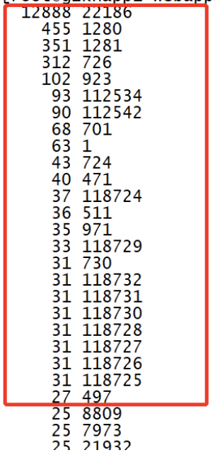

（Too many open files）

### 一、排查问题原因

---

#### 1.1 查看linux最大句柄数

```bash
ulimit -a

core file size          (blocks, -c) 0
data seg size           (kbytes, -d) unlimited
scheduling priority             (-e) 0
file size               (blocks, -f) unlimited
pending signals                 (-i) 31693
max locked memory       (kbytes, -l) 64
max memory size         (kbytes, -m) unlimited
open files                      (-n) 1024
pipe size            (512 bytes, -p) 8
POSIX message queues     (bytes, -q) 819200
real-time priority              (-r) 0
stack size              (kbytes, -s) 8192
cpu time               (seconds, -t) unlimited
max user processes              (-u) 4096
virtual memory          (kbytes, -v) unlimited
file locks                      (-x) unlimited
```

其中open files就是linux设置的最大句柄数（默认1024）。

也可以直接使用`ulimit -n`

#### 1.2 查询句柄数是被哪个进程占了

使用如下命令列出当前系统中每个进程打开文件的数量，并按照数量从大到小进行排序，并通过分页显示一部分结果。

```bash
lsof -n|awk '{print $2}'|sort|uniq -c|sort -nr|more
```

> 1. `lsof -n`：用来列出当前系统中打开的文件列表。选项`-n`表示在显示结果时不将IP地址转换为主机名，以加快执行速度。
> 2. `|`：这个符号表示将前一个命令的输出传递给下一个命令作为输入。
> 3. `awk '{print $2}'`：awk命令用来对输入进行处理，'{print $2}'表示打印出每一行的第二个字段。在这里，lsof输出的结果中，第二个字段是进程ID（PID）。
> 4. `sort`：用来对输入进行排序，默认按照字典顺序进行排序。这里没有指定具体的排序字段，所以会按照第一个字段进行排序。
> 5. `uniq -c`：用来去除连续重复的行，并且`-c`选项用来在输出中显示每行重复出现的次数。
> 6. `sort -nr`：这里再次使用sort命令对前面uniq命令的输出进行排序，但是这次使用了`-nr`选项，`-n`表示按照数值大小进行排序，`-r`表示逆序排列。
> 7. `more`：用来分页显示结果，一页一页地显示输出结果，如果输出超过一页，可以通过按键盘上的空格键来逐页显示。



#### 1.3 查看占用句柄数最高的应用

```bash
ps -ef | grep 22186
```


### 二、句柄泄漏问题解决方案

#### 2.1 句柄数确实不够用

增大文件句柄数。这种方式能及时解决问题，但是不能够彻底的解决问题，可以为彻底解决问题提供一定的时间保证。那么如何增大文件句柄数数呢？

如修改文件句柄数为65535：

```bash
ulimit -n 65535
```

**将ulimit 值添加到/etc/profile文件中(适用于有root权限登录的系统)**

为了每次系统重新启动时，都可以获取更大的ulimit值，将ulimit 加入到/etc/profile 文件底部。

```bash
echo ulimit -n 65535 >>/etc/profile

source /etc/profile #加载修改后的profile

ulimit -n #显示65535，修改完毕！
```

到此为止，你以为大功告成了么，其实不然，突然发现自己再次登录进来的时候，ulimit的值还是1024，这是为什么呢？ 用户登录的时候执行sh脚本的顺序：

```bash
/etc/profile.d/file

/etc/profile

/etc/bashrc

/mingjie/.bashrc

/mingjie/.bash_profile
```

由于ulimit -n的脚本命令加载在第二部分，用户登录时由于权限原因在第二步还不能完成ulimit的修改，所以ulimit的值还是系统默认的1024。所以想彻底改变这种问题，就必须做如下操作：**修改/etc/security/limits.conf**

里面有很详细的注释，比如

* soft nofile 2048

* hard nofile 32768

就可以将文件句柄限制统一改成软2048，硬32768。硬限制是实际的限制，而软限制，是warnning限制，只会做出warning。这样就实际地增大了文件句柄数。

#### 2.2 检查代码中未关闭的连接或IO流