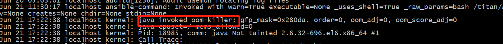
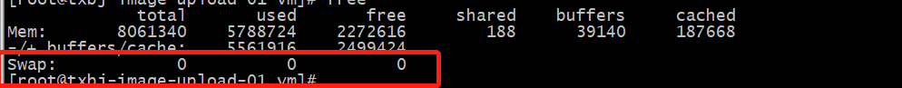
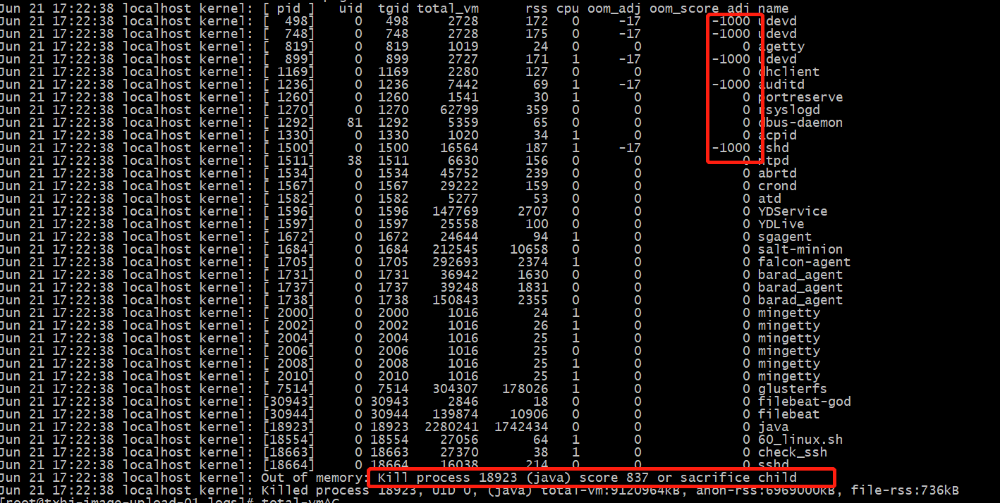

### 一、现象

---

服务器，java进程不存在。


### 二、原因

---

操作系统内存不足，oom killer进程将java进程自动杀死。


### 三、排查过程

---

#### 3.1 服务器信息

物理内存8G，java启动参数为：JAVA_OPTS=" -server -Xmx6g -Xms6g -Xss256k -XX:MaxMetaspaceSize=512M -XX:MetaspaceSize=256M -XX:+UseG1GC ，除java进程外还有filebeat、facon等进程。

那么判断进程被干掉的原因如下：

1. 机器重启了

   通过`uptime`看机器并未重启。

   ```bash
   
   ```

2. 程序存在问题

   通过查询程序的error log，并未发现异常。

3. 被其他进程kill

#### 3.2 排查信息

```bash
cat /var/log/messages
```

```bash
# 或者
dmesg | grep omm-killer
```





发现是java进程申请内存的时候，而物理内存已经不足，同时系统禁用了申请swap区内存，无内存资源可用的情况下，java进程触发了oom killer，导致操作系统kill掉进程。



oom_score_adj通常为0;较低的数字表示当调用OOM杀手时，进程将不太可能死亡。


### 四、解决方案

---

1. 限制java进程的max heap，并且降低java程序的worker数量，从而降低内存使用。
2. 发现系统没有开启swap，给系统加了8G的swap空间。