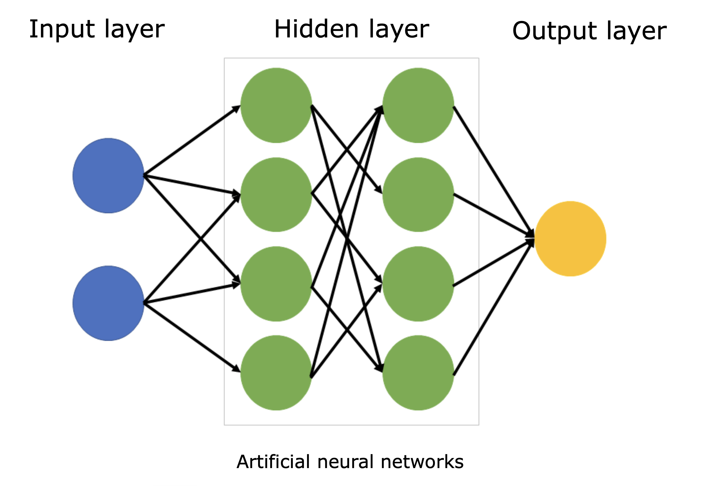
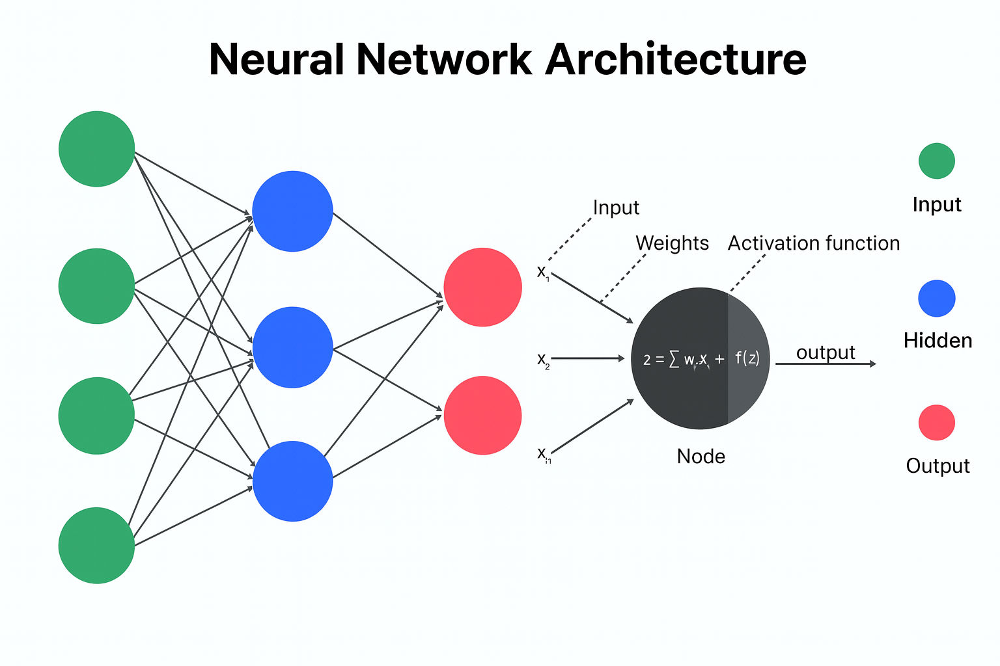
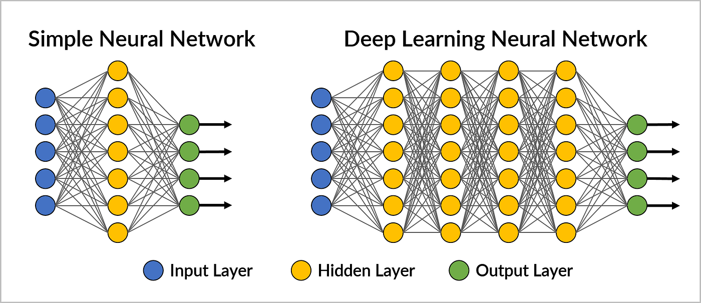
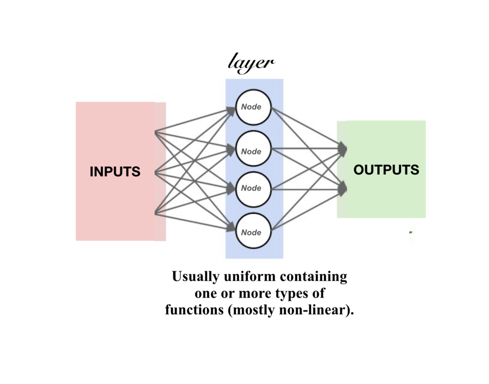
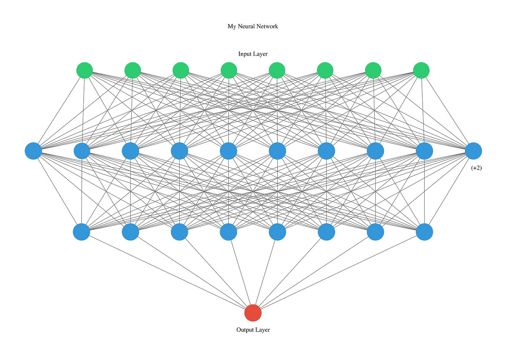
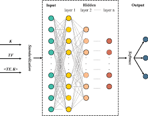

### 一、AI体系

---

```css
人工智能（AI）
 ├── 机器学习（ML）
 │    ├── 监督学习
 │    ├── 无监督学习
 │    └── 强化学习
 └── 深度学习（DL）
      └── 神经网络
```


### 二、AI 在学的是什么

---

举个例子：
 你怎么知道一封邮件是不是垃圾邮件？

- 见多了
- 有经验（关键词、发件人、格式）
- 慢慢形成“感觉”

**AI 学的也是这个，只不过是用数据学。**


### 三、机器学习是核心

---

机器学习 = 不写死规则，而是让机器从数据中自己总结规律。

| 方式     | 输入        | 输出         |
| -------- | ----------- | ------------ |
| 传统程序 | 数据 + 规则 | 结果         |
| 机器学习 | 数据 + 结果 | 规则（模型） |


### 四、三种最重要的学习方式

---

#### 4.1 监督学习（最常见）

> 有标准答案，照着学

例子：

- 已标注的垃圾邮件 / 正常邮件
- 已知价格的房子 → 预测新房价

特点：

- 输入：特征（x）
- 输出：标签（y）

现在接触到的 **90% AI 应用都在用它**。

#### 4.2 无监督学习

> 没有答案，让机器自己分组

例子：

- 用户分群
- 行为模式分析

机器只知道：

> “这些数据长得像，那些不太像”

#### 4.3 强化学习

> 做对了给奖励，做错了给惩罚

例子：

- 下棋 AI
- 游戏 AI
- 自动驾驶决策

逻辑很像：

> “多试 → 记住好结果 → 少犯错”


### 五、模型是什么（非常关键）

---

模型 = 学到的经验本身

可以理解为：

- 一个复杂的数学函数
- 一个“黑盒判断器”

```txt
数据 → 训练 → 模型 → 预测
```

模型不是代码逻辑，而是**参数集合**。


### 六、深度学习

---













#### 6.1 神经网络是什么

灵感来自人脑，但本质是：

- 多层计算
- 每层做一点点判断
- 最后综合结果

可以想成

> 超级复杂的 if-else 自动生成器

深度学习 = 层数很多的神经网络

- 层越多 -> 能理解越复杂的模式
- 代价：更吃数据 & 算力


### 七、chatgpt 属于哪一类

- [x] 深度学习
- [x] 神经网络
- [x] 大语言模型

本质在做一件事：

>根据上下文，预测“下一个最合理的词”。

 

### 八、几个常见的误解

---

❌ AI 会思考
 ✅ AI 只是在算概率

❌ AI 懂业务
 ✅ AI 只懂你给它的数据分布

❌ AI 自己会变聪明
 ✅ 没有新训练，就不会真正进化