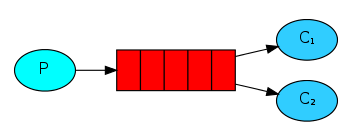

#### simple简单模式

---

一对一的消息模式，生产者往同一个队列里生产，只供一个消费者。

消费者监听(while)消息队列，如果队列中有消息，就消费掉，消息被拿走后，自动从队列中删除。

隐患：消息可能没有被消费者正确处理，已经从队列中消失，造成消息的丢失。

应用场景：聊天。（中间有一个过渡的服务器，P端，C端）

#### work工作模式（资源的竞争）

---

一对多的消息模式，生产者网同一个队列里生产，供多个消费者（不会重复）。

应用场景：红包；大项目中的资源调度（任务分配系统不需知道哪一个任务执行系统在空闲，直接将任务扔到消息队列中，空闲的系统自动争抢）。

#### publish/subscribe发布/订阅模式（共享资源）

---

生产者生产数据，供多个消息者消费相同数据，**由交换机把消息发布至所有消息队列中**。

应用场景：邮件群发，群聊天，广播（广告）。

#### routing路由模式

---

因publish/subscribe发布订阅模式中消息，由**交换机**打到所有消息队列中不存在差异性，**生产数据时带有type**根据type打到不同的消息队列中。

1. 根据业务功能定义路由字符串
2. 从系统的代码逻辑中获取对应的功能字符串，将消息任务扔到对应的队列中业务场景：error通知；EXCEPTION；错误通知的功能；传统意义的错误通知；客户通知；利用key路由，可以将程序中的错误封装成消息传入到消息队列中，开发者可以自定义消费者，实时接收错误。

#### topic主题模式（路由模式的一种）

---

路由模式的升级版，增加了通配符。

1. `*`，`#`代表通配符；
2. `*`代表多个单词，`#`代表一个单词；
3. 路由功能添加模糊匹配；
4. 消息生产者生产消息，把消息交给交换机；
5. 交换机根据key的规则模糊匹配到对应的队列，由队列的监听消费者接收消息消费。

#### Publisher Confirm发布确认模式

---

在默认情况下，生产者把消息发送出去后，broker是不会返回任何消息给生产者的。也就是说生产者也不知道消息有没有正确到达。如果消息到达前broker发生宕机，或者消息写入磁盘前宕机，消息就发生丢失。消息持久化机制是没有办法解决这个问题的，RabbitMQ提供两种办法解决这种情况，第一种是AMQP的**事务机制**，二是**把信道设置成确认模式**。

发送方确认模式是rabbitmq对AMQP协议的拓展实现，**把信道设置成确认模式后，该信道上发布的所有消息都会分配一个唯一的id**，一旦消息投递到所匹配的队列中，信道就会向生产者发送确认消息。从而让生产者知道消息已经到达目的队列。发送方确认模式最大的优势就是**异步**，生产者发送一条消息后可以继续发送下一条消息，生产者收到确认消息后调用回调方法处理。轻便并且性能影响小。