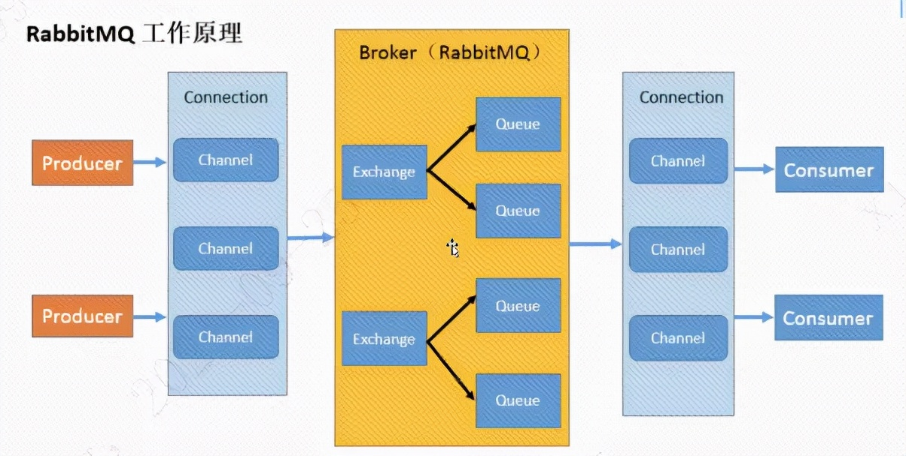

### 一、Broker

---

**接收和分发消息**的应用，**RabbitMQ Server**就是**Message  Broker**。

### 二、Vitual host

---

出于多租户和安全因素设计的，把 AMQP 的基本组件划分到一个虚拟的分组中，类似于网络中的 namespace 概念。当多个不同的用户使用同一个 RabbitMQ server 提供的服务时，可以划分出多个 vhost，**每个用户在自己的 vhost 创建 exchange／queue 等**。

### 三、Connection

---

publisher／consumer 和 broker 之间的 **TCP 连接**。

### 四、Channel

---

如果每一次访问RabbitMQ都建立一个Connecction，在消息量大的时候建立TCP Connection 的开销将是巨大的，效率也较低。**Channel 是在 connection 内部建立的逻辑连接**，如果应用程序支持多线程，通常每个 thread 创建单独的 channel 进行通讯，AMQP method 包含了 channel id 帮助客户端和 message broker 识别 channel，所以 **channel 之间是完全隔离**的。Channel 作为轻量级的Connection 极大减少了操作系统建立 TCP connection 的开销。

### 五、Exchange

---

message 到达 broker 的第一站，根据分发规则，匹配查询表中的 routing key，分发消息到 queue 中去。常用的类型有：direct (point-to-point)，topic (publish-subscribe) and fanout (multicast)。

### 六、Queue

---

消息最终被送到这里等待consumer取走。

### 七、Binding

---

exchange和queue之间的虚拟连接，binding中可以包含routing key，**Binding信息被保存到exchange中的查询表中**，用于message的分发依据。

