为什么一个普通的方法加上@RabbitListener注解就能接收消息了呢？

先总结来说，有一个 `BeanPostProcessor` 来处理这个注解，把注解相关的内容取出来，封装成一个 RabbitListenerEndPoint。然后给每个Endpoint创建一个MessageListenerContainer，在这个container中注册一个MessageListener，在这个MessageListener中创建了一个HandlerAdapter，这个**adapter与rabbitmq broker建立一个connection，接收rabbitmq broker push过来的message，放到一个blocking queue中**。至此完成消息的接收。

接下来是消息的处理。adapter把我们用@RabbitListener注解的普通方法通过反射的方式还原出来，**从blocking queue中poll出一个一个的message，进行处理**。


### RabbitListenerAnnotationBeanPostProcessor

---

由@RabbitListener的注释得知处理器为RabbitListenerAnnotationBeanPostProcessor。

该处理器实现 BeanPostProcessor 接口，实现了postProcessAfterInitialization方法，当bean初始化完成后，执行这个方法。

```java
@Override
public Object postProcessAfterInitialization(final Object bean, final String beanName) throws BeansException {
  Class<?> targetClass = AopUtils.getTargetClass(bean);
  // 去执行buildMetadata方法，找出所有加了@RabbitListener注解的方法
  final TypeMetadata metadata = this.typeCache.computeIfAbsent(targetClass, this::buildMetadata);
  for (ListenerMethod lm : metadata.listenerMethods) {
    for (RabbitListener rabbitListener : lm.annotations) {
      processAmqpListener(rabbitListener, lm.method, bean, beanName);
    }
  }
  if (metadata.handlerMethods.length > 0) {
    processMultiMethodListeners(metadata.classAnnotations, metadata.handlerMethods, bean, beanName);
  }
  return bean;
}
```

之后执行processAmqpListener：

```java
protected void processAmqpListener(RabbitListener rabbitListener, Method method, Object bean, String beanName) {
  Method methodToUse = checkProxy(method, bean);
  MethodRabbitListenerEndpoint endpoint = new MethodRabbitListenerEndpoint();
  endpoint.setMethod(methodToUse);
  processListener(endpoint, rabbitListener, bean, methodToUse, beanName);
}
```

> 还可以通过**在类上加@RabbitListener注解，然后在方法上加@RabbitHandler注解**，如果采用这种方式会使用processMultiMethodListeners()方法来处理这些方法。

之后调用processListener方法，==读取@RabbitListener注解中的值，设置到endpoint中去==。获取配置的RabbitListenerContainerFactory bean，然后调用RabbitListenerEndpointRegistrar类的registerEndpoint()方法。

RabbitListenerContainerFactory可以是默认的，也可以自定义。可以是这样在代码里面以@Bean来指定的：

```java
@Bean("autoAckContainerFactory")
public RabbitListenerContainerFactory<SimpleMessageListenerContainer> autoAckContanierFactory(ConnectionFactory connectionFactory) {
  SimpleRabbitListenerContainerFactory factory = new SimpleRabbitListenerContainerFactory();
  factory.setConnectionFactory(connectionFactory);
  factory.setMessageConverter(jsonMessageConverter());
  factory.setAcknowledgeMode(AcknowledgeMode.AUTO);
  factory.setConcurrentConsumers(5);
  factory.setMaxConcurrentConsumers(10);
  return factory;
}
```

使用时指定containerFactory

```java
@RabbitListener(
  queues = "rabbitmq.simple.queue",
  containerFactory = "autoAckContainerFactory"
)
public void onSimpleQueueMessage(Message message, Channel channel) {
  String msg = new String(message.getBody());
  log.info(">>>>>>>>>接收到消息：{}", msg);
}
```


### RabbitListenerEndpointRegistrar

---

RabbitListenerEndpointRegistrar 类的 registerEndpoint() 方法。

```java
public void registerEndpoint(RabbitListenerEndpoint endpoint,
                             @Nullable RabbitListenerContainerFactory<?> factory) {
  Assert.notNull(endpoint, "Endpoint must be set");
  Assert.hasText(endpoint.getId(), "Endpoint id must be set");
  Assert.state(!this.startImmediately || this.endpointRegistry != null, "No registry available");
  // factory可能为空，在实际创建容器之前推迟解析
  AmqpListenerEndpointDescriptor descriptor = new AmqpListenerEndpointDescriptor(endpoint, factory);
  synchronized (this.endpointDescriptors) {
    if (this.startImmediately) { // 立即注册并开始
      this.endpointRegistry.registerListenerContainer(descriptor.endpoint, // NOSONAR 永远不会为空
                                                      resolveContainerFactory(descriptor), true);
    }
    else {
      this.endpointDescriptors.add(descriptor);
    }
  }
}
```

这里根据startImmediately看是否需要立刻注册endpoint，或者先将其添加到一个List，稍后统一注册。

对于统一注册的实现，RabbitListenerAnnotationBeanPostProcessor类除了实现BeanPostProcessor以外，还实现了SmartInitializingSingleton接口，所以当RabbitListenerAnnotationBeanPostProcessor这个bean实例化完成之后会调用它的afterSingletonsInstantiated()方法。

```java
@Override
public void afterSingletonsInstantiated() {
  this.registrar.setBeanFactory(this.beanFactory);

  if (this.beanFactory instanceof ListableBeanFactory) {
    Map<String, RabbitListenerConfigurer> instances =
      ((ListableBeanFactory) this.beanFactory).getBeansOfType(RabbitListenerConfigurer.class);
    for (RabbitListenerConfigurer configurer : instances.values()) {
      configurer.configureRabbitListeners(this.registrar);
    }
  }

  if (this.registrar.getEndpointRegistry() == null) {
    if (this.endpointRegistry == null) {
      Assert.state(this.beanFactory != null,
                   "BeanFactory must be set to find endpoint registry by bean name");
      this.endpointRegistry = this.beanFactory.getBean(
        RabbitListenerConfigUtils.RABBIT_LISTENER_ENDPOINT_REGISTRY_BEAN_NAME,
        RabbitListenerEndpointRegistry.class);
    }
    this.registrar.setEndpointRegistry(this.endpointRegistry);
  }

  if (this.defaultContainerFactoryBeanName != null) {
    this.registrar.setContainerFactoryBeanName(this.defaultContainerFactoryBeanName);
  }

  // 设置配置程序解析后的自定义处理程序方法工厂
  MessageHandlerMethodFactory handlerMethodFactory = this.registrar.getMessageHandlerMethodFactory();
  if (handlerMethodFactory != null) {
    this.messageHandlerMethodFactory.setMessageHandlerMethodFactory(handlerMethodFactory);
  }

  // 注册所有监听器
  this.registrar.afterPropertiesSet();

  // 清除缓存—原型bean将被重新缓存
  this.typeCache.clear();
}
```

因为之前已经将所有的endpoint添加到了RabbitListenerEndpointRegistrar类中的一个List中了，所以这里调用RabbitListenerEndpointRegistrar类的afterPropertiesSet()方法进行统一注册：

```java
@Override
public void afterPropertiesSet() {
  registerAllEndpoints();
}

protected void registerAllEndpoints() {
  Assert.state(this.endpointRegistry != null, "No registry available");
  synchronized (this.endpointDescriptors) {
    for (AmqpListenerEndpointDescriptor descriptor : this.endpointDescriptors) {
      this.endpointRegistry.registerListenerContainer(
        descriptor.endpoint, resolveContainerFactory(descriptor));
    }
    this.startImmediately = true;  // 触发立即启动
  }
}
```

这里就是一个简单的for循环，一个一个注册，具体是怎么注册的，再跟踪registerListenerContainer()方法。


### RabbitListenerEndpointRegistry

---

关键代码：

```java
MessageListenerContainer container = createListenerContainer(endpoint, factory);
this.listenerContainers.put(id, container);
```

可见，注册endpoint，实际上就是RabbitListenerContainerFactory将每一个endpoint都创建成MessageListenerContainer（具体创建过程，由RabbitListenerContainerFactory类自己去完成），然后根据startImmediately参数判断是否调用startIfNecessary()方法立即启动MessageListenerContainer。

**实际接收消息是由这个MessageListenerContainer来做的**，而MessageListenerContainer接口中有一个接口方法来设置MessageListener。

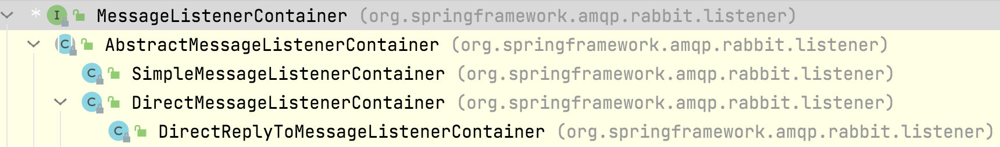


### AbstractMessageListenerContainer

---

```java
public void setMessageListener(MessageListener messageListener) {
  this.messageListener = messageListener;
  this.isBatchListener = messageListener instanceof BatchMessageListener
    || messageListener instanceof ChannelAwareBatchMessageListener;
}
```

**MessageListener：用于接收AMQP消息的异步传递。**

```java
@FunctionalInterface
public interface MessageListener {

  /**
	 * 传递单个消息
	 */
  void onMessage(Message message);

  /**
	 * 由容器调用以通知侦听器其ack模式
	 */
  default void containerAckMode(AcknowledgeMode mode) {
    // NOSONAR - empty
  }

  /**
	 * 发送批量消息
	 */
  default void onMessageBatch(List<Message> messages) {
    throw new UnsupportedOperationException("This listener does not support message batches");
  }
}
```

**ChannelAwareBatchMessageListener：如果容器支持，则用于接收批量消息。**

```java
public interface ChannelAwareBatchMessageListener extends ChannelAwareMessageListener {

  @Override
  default void onMessage(Message message, Channel channel) throws Exception {
    throw new UnsupportedOperationException("Should never be called by the container");
  }

  @Override
  void onMessageBatch(List<Message> messages, Channel channel);

}
```

这样接收并处理消息的所有工作就完成了。

如果不立即启动MessageListenerContainer，RabbitListenerEndpointRegistry也实现了SmartLifecycle接口，所以在spring context refresh的最后一步会去调用start()方法：

```java
@Override
public void start() {
  for (MessageListenerContainer listenerContainer : getListenerContainers()) {
    startIfNecessary(listenerContainer);
  }
}
```

```java
/**
 * 启动特定的MessageListenerContainer，如果它需要在启动时被开启，或是启动后显式调用
 */
private void startIfNecessary(MessageListenerContainer listenerContainer) {
  if (this.contextRefreshed || listenerContainer.isAutoStartup()) {
    listenerContainer.start();
  }
}
```

可以看到这里统一启动了所以的MessageListenerContainer。

所谓启动MessageListenerContainer其实就是调用MessageListenerContainer的start()方法。这也是SmartLifecycle的一个接口方法，它的实现必须保证调用了这个start()方法之后MessageListenerContainer将能够接受到消息。


### @RabbitListener实现流程总结

---

- @RabbitListener注解的方法所在的类首先是一个bean，因此，实现BeanPostProcessor接口对每一个初始化完成的bean进行处理。
- 遍历bean中由用户自定义的所有的方法，找出其中添加了@RabbitListener注解的方法（也可以是@RabbitHandler注解）
- 读取上面找出的所有方法上@RabbitListener注解中的值，并为每一个方法创建一个RabbitListenerEndpoint，保存在RabbitListenerEndpointRegistrar类中。
- 在所有的bean都初始化完成，即所有@RabbitListener注解的方法都创建了endpoint之后，**由我们配置的RabbitListenerContainerFactory将每个endpoint创建MessageListenerContainer**。
- 最后启动上面创建的MessageListenerContanier。
- 至此，全部完成，MessageListenerContainer启动后将能够接受到消息，再将消息交给它的MessageListener处理消息。

1. RabbitListenerContainerFactory只是个接口，它不会自己创建MessageListenerContainer，所以需要一个RabbitListenerContainerFactory实现类，它必须能创建MessageListenerContainer

2. MessageListenerContainer也只是一个接口，它不会自己接收消息，所以需要一个MessageListenerContainer实现类，它必须做到在启动后能够接收消息，同时它必须能设置MessageListener，用以处理消息。

3. MessageListener（或ChannelAwareMessageListener）也只是一个接口，所以还需要一个MessageListener实现类，它必须能调用我们加了@RabbitListener注解的方法，这样才实现了消息的处理

   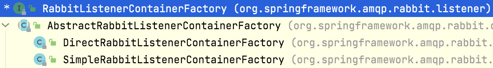

通过SimpleRabbitListenerContainerFactory创建MessageListenerContainer。


#### MessageListenerContainer的创建

之前的关键代码 RabbitListenerEndpointRegistry的registerListenerContainer方法MessageListenerContainer listenerContainer = factory.createListenerContainer(endpoint);

createListenerContainer跟踪进去，会进入到AbstractRabbitListenerContainerFactory的createListenerContainer方法中，其关键代码：

```java
endpoint.setupListenerContainer(instance);
initializeContainer(instance, endpoint);
```

initializeContainer这个方法里面，进入到SimpleRabbitListenerContainerFactory类中，会做一些它独有的属性设置。

```java
@Override
protected void initializeContainer(SimpleMessageListenerContainer instance, RabbitListenerEndpoint endpoint) {
  super.initializeContainer(instance, endpoint);

  JavaUtils javaUtils = JavaUtils.INSTANCE
    .acceptIfNotNull(this.batchSize, instance::setBatchSize);
  String concurrency = null;
  if (endpoint != null) {
    concurrency = endpoint.getConcurrency();
    javaUtils.acceptIfNotNull(concurrency, instance::setConcurrency);
  }
  javaUtils
    .acceptIfCondition(concurrency == null && this.concurrentConsumers != null, this.concurrentConsumers,
                       instance::setConcurrentConsumers)
    .acceptIfCondition((concurrency == null || !(concurrency.contains("-")))
                       && this.maxConcurrentConsumers != null,
                       this.maxConcurrentConsumers, instance::setMaxConcurrentConsumers)
    .acceptIfNotNull(this.startConsumerMinInterval, instance::setStartConsumerMinInterval)
    .acceptIfNotNull(this.stopConsumerMinInterval, instance::setStopConsumerMinInterval)
    .acceptIfNotNull(this.consecutiveActiveTrigger, instance::setConsecutiveActiveTrigger)
    .acceptIfNotNull(this.consecutiveIdleTrigger, instance::setConsecutiveIdleTrigger)
    .acceptIfNotNull(this.receiveTimeout, instance::setReceiveTimeout);
  if (Boolean.TRUE.equals(this.consumerBatchEnabled)) {
    instance.setConsumerBatchEnabled(true);
    instance.setDeBatchingEnabled(true);
  }
}

```

setupListenerContainer方法执行结束，MessageListener就设置到MessageListenerContainer里面去了，可以跟踪这个方法。

```java
@Override
public void setupListenerContainer(MessageListenerContainer listenerContainer) {
  AbstractMessageListenerContainer container = (AbstractMessageListenerContainer) listenerContainer;

  boolean queuesEmpty = getQueues().isEmpty();
  boolean queueNamesEmpty = getQueueNames().isEmpty();
  if (!queuesEmpty && !queueNamesEmpty) {
    throw new IllegalStateException("Queues or queue names must be provided but not both for " + this);
  }
  if (queuesEmpty) {
    Collection<String> names = getQueueNames();
    container.setQueueNames(names.toArray(new String[names.size()]));
  }
  else {
    Collection<Queue> instances = getQueues();
    container.setQueues(instances.toArray(new Queue[instances.size()]));
  }

  container.setExclusive(isExclusive());
  if (getPriority() != null) {
    Map<String, Object> args = new HashMap<String, Object>();
    args.put("x-priority", getPriority());
    container.setConsumerArguments(args);
  }

  if (getAdmin() != null) {
    container.setAmqpAdmin(getAdmin());
  }
  setupMessageListener(listenerContainer);
}
```

一直到AbstractRabbitListenerEndpoint类的下面这个方法：

```java
private void setupMessageListener(MessageListenerContainer container) {
  MessageListener messageListener = createMessageListener(container);
  Assert.state(messageListener != null, () -> "Endpoint [" + this + "] must provide a non null message listener");
  container.setupMessageListener(messageListener);
}
```

可以看到在这个方法里创建了MessageListener，并将其设置到MessageListenerContainer里面去。createMessageListener()方法有两个实现，实际调用的是MethodRabbitListenerEndpoint类里面的实现：

```java
@Override
protected MessagingMessageListenerAdapter createMessageListener(MessageListenerContainer container) {
  Assert.state(this.messageHandlerMethodFactory != null,
               "Could not create message listener - MessageHandlerMethodFactory not set");
  MessagingMessageListenerAdapter messageListener = createMessageListenerInstance();
  messageListener.setHandlerAdapter(configureListenerAdapter(messageListener));
  String replyToAddress = getDefaultReplyToAddress();
  if (replyToAddress != null) {
    messageListener.setResponseAddress(replyToAddress);
  }
  MessageConverter messageConverter = getMessageConverter();
  if (messageConverter != null) {
    messageListener.setMessageConverter(messageConverter);
  }
  if (getBeanResolver() != null) {
    messageListener.setBeanResolver(getBeanResolver());
  }
  return messageListener;
}
```

看到setHandlerMethod(configureListenerAdapter(messageListener))这一行，这里创建并设置了一个HandlerAdapter，这个HandlerAdapter能够调用我们加了@RabbitListener注解的方法。

```java
protected HandlerAdapter configureListenerAdapter(MessagingMessageListenerAdapter messageListener) {
  InvocableHandlerMethod invocableHandlerMethod =
    this.messageHandlerMethodFactory.createInvocableHandlerMethod(getBean(), getMethod());
  return new HandlerAdapter(invocableHandlerMethod);
}
```

#### SimpleMessageListenerContainer接收消息的实现

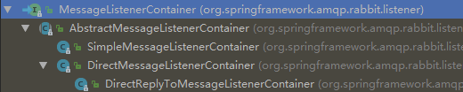

SimpleRabbitListenerContainerFactory创建的MessageListenerContainer是SimpleMessageListenerContainer类，下面看它是怎么在启动后就能接收消息的。

RabbitListenerEndpointRegistry类通过调用MessageListenerContainer的start()方法类启动这个MessageListenerContainer。

SimpleMessageListenerContainer类本身并没有实现start()方法，在它继承的抽象父类里面。进入AbstractMessageListenerContainer抽象类找到start()方法的实现。

MessageListenerContainer 继承了 SmartLifecycle

SmartLifecycle 继承了 Lifecycle

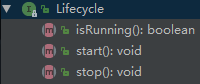

而AbstractMessageListenerContainer 实现了 MessageListenerContainer

```java
/**
 * Start this container.
 * @see #doStart
 */
@Override
public void start() {
  if (isRunning()) {
    return;
  }
  if (!this.initialized) {
    synchronized (this.lifecycleMonitor) {
      if (!this.initialized) {
        afterPropertiesSet();
      }
    }
  }
  try {
    logger.debug("Starting Rabbit listener container.");
    configureAdminIfNeeded();
    checkMismatchedQueues();
    doStart();
  }
  catch (Exception ex) {
    throw convertRabbitAccessException(ex);
  }
  finally {
    this.lazyLoad = false;
  }
}
```

真正的启动方法是doStart()，所以去SimpleMessageListenerContainer类中找这个类的doStart()实现：doStart()这里就涉及到多态了，子类执行子类override的方法。

关键代码1：

```java
int newConsumers = initializeConsumers();
```

```java
protected int initializeConsumers() {
  int count = 0;
  synchronized (this.consumersMonitor) {
    if (this.consumers == null) {
      this.cancellationLock.reset();
      this.consumers = new HashSet<BlockingQueueConsumer>(this.concurrentConsumers);
      for (int i = 0; i < this.concurrentConsumers; i++) {
        BlockingQueueConsumer consumer = createBlockingQueueConsumer();
        this.consumers.add(consumer);
        count++;
      }
    }
  }
  return count;
}
```

这个方法创建了BlockingQueueConsumer，数量等于concurrentConsumers参数的配置。

关键代码2：

```java
for (BlockingQueueConsumer consumer : this.consumers) {
  AsyncMessageProcessingConsumer processor = new AsyncMessageProcessingConsumer(consumer);
  processors.add(processor);
  getTaskExecutor().execute(processor);
  if (getApplicationEventPublisher() != null) {
    getApplicationEventPublisher().publishEvent(new AsyncConsumerStartedEvent(this, consumer));
  }
}
```

另一个方法是getTaskExecutor().execute(processor)，前面用BlockingQueueConsumer创建了AsyncMessageProcessingConsumer（实现了Runnable接口），这里获取到Executor来执行，每一个MessageListenerContainer都有各自的Executor。

在AsyncMessageProcessingConsumer类的run()方法里需要注意两个地方。

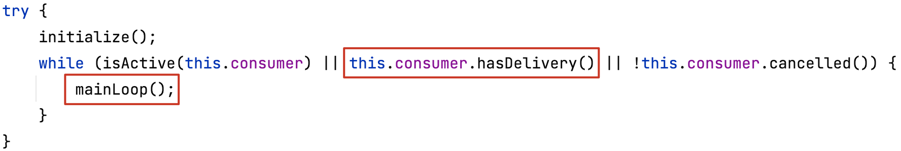

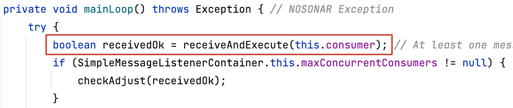

所以SimpleMessageListenerContainer接收消息的实现方案是：用一个BlockingQueue保存rabbitmq发过来还未来得及处理的消息，然后向Executor提交执行Runnable，Runnable中循环从BlockingQueue里面取消息。

#### BlockingQueueConsumer获取Message

从BlockingQueueConsumer来看

先找this.queue.put，找到方法handleDelivery

```java
@Override
public void handleDelivery(String consumerTag, Envelope envelope, AMQP.BasicProperties properties,
                           byte[] body) {
  if (logger.isDebugEnabled()) {
    logger.debug("Storing delivery for consumerTag: '"
                 + consumerTag + "' with deliveryTag: '" + envelope.getDeliveryTag() + "' in "
                 + BlockingQueueConsumer.this);
  }
  try {
    if (BlockingQueueConsumer.this.abortStarted > 0) {
      if (!BlockingQueueConsumer.this.queue.offer(
        new Delivery(consumerTag, envelope, properties, body, this.queueName),
        BlockingQueueConsumer.this.shutdownTimeout, TimeUnit.MILLISECONDS)) {

        Channel channelToClose = super.getChannel();
        RabbitUtils.setPhysicalCloseRequired(channelToClose, true);
        // Defensive - should never happen
        BlockingQueueConsumer.this.queue.clear();
        if (!this.canceled) {
          RabbitUtils.cancel(channelToClose, consumerTag);
        }
        try {
          channelToClose.close();
        }
        catch (@SuppressWarnings("unused") TimeoutException e) {
          // no-op
        }
      }
    }
    else {
      BlockingQueueConsumer.this.queue
        .put(new Delivery(consumerTag, envelope, properties, body, this.queueName));
    }
  }
  catch (@SuppressWarnings("unused") InterruptedException e) {
    Thread.currentThread().interrupt();
  }
  catch (Exception e) {
    BlockingQueueConsumer.logger.warn("Unexpected exception during delivery", e);
  }
}
```

其override的这个方法是InternalConsumer in BlockingQueueConsumer。

看其start方法中的setQosAndreateConsumers()方法：

```java
private void setQosAndreateConsumers() {
  if (!this.acknowledgeMode.isAutoAck() && !cancelled()) {
    try {
      this.channel.basicQos(this.prefetchCount);
    }
    catch (IOException e) {
      this.activeObjectCounter.release(this);
      throw new AmqpIOException(e);
    }
  }

  try {
    if (!cancelled()) {
      for (String queueName : this.queues) {
        if (!this.missingQueues.contains(queueName)) {
          consumeFromQueue(queueName);
        }
      }
    }
  }
  catch (IOException e) {
    throw RabbitExceptionTranslator.convertRabbitAccessException(e);
  }
}
```

可以通过 “channel.basicQos(10)” 这个方法来设置当前channel的prefetch count。

举个例子，比如你要是设置为10的话，那么意味着当前这个channel里，unack message的数量不能超过10个，以此来避免消费者服务实例积压unack message过多。

**默认的prefetchCount为250**。

再看consumeFromQueue()方法：

```java
private void consumeFromQueue(String queue) throws IOException {
  InternalConsumer consumer = new InternalConsumer(this.channel, queue);
  String consumerTag = this.channel.basicConsume(queue, this.acknowledgeMode.isAutoAck(),
                                                 (this.tagStrategy != null ? this.tagStrategy.createConsumerTag(queue) : ""), this.noLocal,
                                                 this.exclusive, this.consumerArgs,
                                                 consumer);

  if (consumerTag != null) {
    this.consumers.put(queue, consumer);
    if (logger.isDebugEnabled()) {
      logger.debug("Started on queue '" + queue + "' with tag " + consumerTag + ": " + this);
    }
  }
  else {
    logger.error("Null consumer tag received for queue " + queue);
  }
}
```

**spring-amqp是broker push模式。**

继续看，把读到的消息放到consumer tag里面。

在handleDelivery中

```java
BlockingQueueConsumer.this.queue.put(new Delivery(consumerTag, envelope, properties, body));
```

就把consumerTag中的内容放到queue里面，这样当执行nextMessage的时候就能获取到了。

那么handleDelivery什么时候调用呢？

看Consumer接口是如何写的

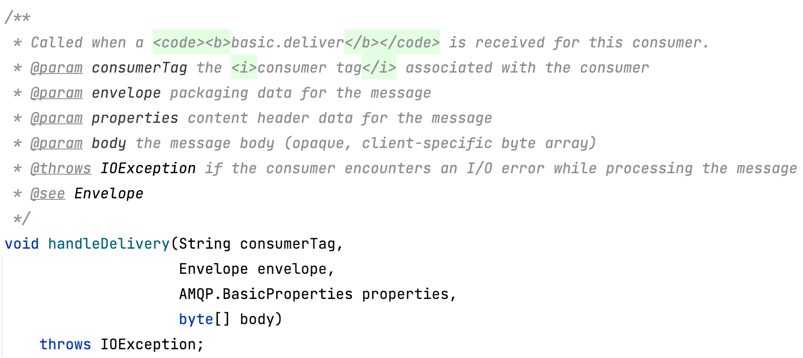

当一个basic.deliver被consumer接收到了，就调用。

这里涉及到rabbitmq broker与rabbitmq consumer之间的连接等一些内容，补充一下。

如果你写好了一个消费者服务的代码，让他开始从RabbitMQ消费数据，这时这个消费者服务实例就会自己注册到RabbitMQ。

所以，RabbitMQ其实是知道有哪些消费者服务实例存在的。

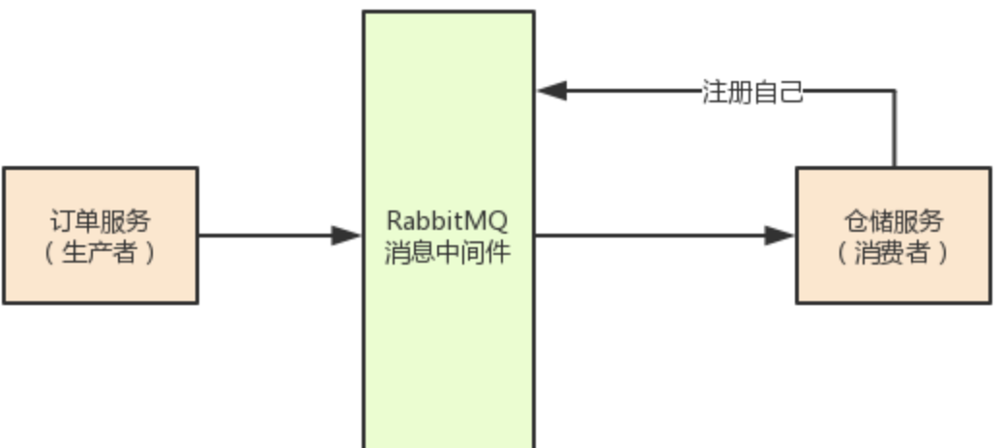

接着，RabbitMQ就会通过自己内部的一个“basic.delivery”方法来投递消息到仓储服务里去，让他消费消息。

而rabbitmq broker内部的basic.delivery其实是被consumer感知的，会调用handleDelivery。

那么可能就是前面consumerFromQueue的时候，执行this.channel.basicConsumer的时候，调用ConsumerDecorator的delivery方法，传入this.consumer，就是InternalConsumer，并赋值给delegate，然后delegate再调用handleDelivery，放到this.queue里面。

#### SimpleMessageListenerContainer处理消息的实现

上面的receiveAndExecute()方法接收消息的同时也将其处理了，关键代码executeListener(channel, message)方法中的doExecuteListener方法，其中可以看到invokeListener()方法，

```java
protected void invokeListener(Channel channel, Object data) {
  this.proxy.invokeListener(channel, data);
}
```

这个proxy是由actualInvokeListener()方法创建的匿名类。这个方法里可以看到doInvokeListener()方法，已经差不多接近我们的@RabbitListener注解的方法了。

```java
protected void doInvokeListener(MessageListener listener, Object data) {
  Message message = null;
  try {
    if (data instanceof List) {
      listener.onMessageBatch((List<Message>) data);
    }
    else {
      message = (Message) data;
      listener.onMessage(message);
    }
  }
  catch (Exception e) {
    throw wrapToListenerExecutionFailedExceptionIfNeeded(e, data);
  }
}
```

进入MessagingMessageListenerAdapter类的onMessage()方法：

```java
@Override
public void onMessage(org.springframework.amqp.core.Message amqpMessage, Channel channel) throws Exception { // NOSONAR
  Message<?> message = toMessagingMessage(amqpMessage);
  invokeHandlerAndProcessResult(amqpMessage, channel, message);
}
```

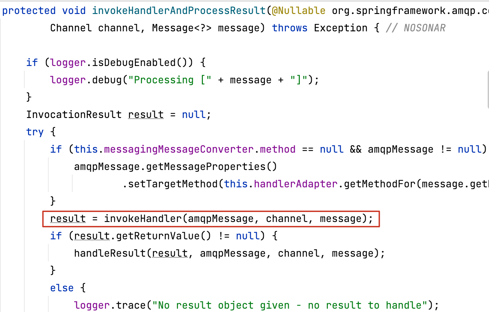

这里通过invokHandler()方法消费获取到的message，然后在catch里面处理异常，进入invokeHandler()方法。

```java
private InvocationResult invokeHandler(@Nullable org.springframework.amqp.core.Message amqpMessage, Channel channel,
                                       Message<?> message) {

  try {
    return this.handlerAdapter.invoke(message, amqpMessage, channel);
  }
  catch (MessagingException ex) {
    throw new ListenerExecutionFailedException(createMessagingErrorMessage("Listener method could not " +
                                                                           "be invoked with the incoming message", message.getPayload()), ex, amqpMessage);
  }
  catch (Exception ex) {
    throw new ListenerExecutionFailedException("Listener method '" +
                                               this.handlerAdapter.getMethodAsString(message.getPayload()) + "' threw exception", ex, amqpMessage);
  }
}
```

在这里可以看到catch了所有的异常，只要是消费消息的方法里面抛出的异常都会被包装成ListenerExecutionFailedException，并且这个Exception里面把消息也放进去了。 

这里的this.handlerMethod其实就是上面提到的HandlerAdapter。

跟踪它的invoke()方法，看它是怎么调用我们@RabbitListener注解的方法的，看它是怎么调用@RabbitListener注解的方法的。

```java
public InvocationResult invoke(Message<?> message, Object... providedArgs) throws Exception { // NOSONAR
  if (this.invokerHandlerMethod != null) {
    return new InvocationResult(this.invokerHandlerMethod.invoke(message, providedArgs),
                                null, this.invokerHandlerMethod.getMethod().getGenericReturnType(),
                                this.invokerHandlerMethod.getBean(),
                                this.invokerHandlerMethod.getMethod());
  }
  else if (this.delegatingHandler.hasDefaultHandler()) {
    // Needed to avoid returning raw Message which matches Object
    Object[] args = new Object[providedArgs.length + 1];
    args[0] = message.getPayload();
    System.arraycopy(providedArgs, 0, args, 1, providedArgs.length);
    return this.delegatingHandler.invoke(message, args);
  }
  else {
    return this.delegatingHandler.invoke(message, providedArgs);
  }
}
```

```java
public Object invoke(Message<?> message, Object... providedArgs) throws Exception {
  Object[] args = getMethodArgumentValues(message, providedArgs);
  if (logger.isTraceEnabled()) {
    logger.trace("Arguments: " + Arrays.toString(args));
  }
  return doInvoke(args);
}
```

```java
protected Object doInvoke(Object... args) throws Exception {
  ReflectionUtils.makeAccessible(getBridgedMethod());
  try {
    return getBridgedMethod().invoke(getBean(), args);
  }
  catch (IllegalArgumentException ex) {
    assertTargetBean(getBridgedMethod(), getBean(), args);
    String text = (ex.getMessage() != null ? ex.getMessage() : "Illegal argument");
    throw new IllegalStateException(formatInvokeError(text, args), ex);
  }
  catch (InvocationTargetException ex) {
    // Unwrap for HandlerExceptionResolvers ...
    Throwable targetException = ex.getTargetException();
    if (targetException instanceof RuntimeException) {
      throw (RuntimeException) targetException;
    }
    else if (targetException instanceof Error) {
      throw (Error) targetException;
    }
    else if (targetException instanceof Exception) {
      throw (Exception) targetException;
    }
    else {
      throw new IllegalStateException(formatInvokeError("Invocation failure", args), targetException);
    }
  }
}
```

这里通过getBridgedMethod()方法拿到的就是@RabbitListener注解的方法了，这是在刚开始处理@RabbitListener注解时就已经保存下来的，然后就可以利用反射来调用这个方法，这样就完成了接收并处理消息的整个流程。

#### RabbitTemplate也是使用broker push的方式

如果使用RabbitTemplate来接收message，也是broker push的方式。从RabbitTemplate中只有queueName入参的方法开始：

```java
@Override
public Message receive(String queueName) {
  if (this.receiveTimeout == 0) {
    return doReceiveNoWait(queueName);
  }
  else {
    return receive(queueName, this.receiveTimeout);
  }
}
```

receiveTimeOut参数为0，直接获取消息，不等待，获取不到返回null；否则会等待一段时间。

```java
@Override
public Message receive(final String queueName, final long timeoutMillis) {
  Message message = execute(channel -> {
    Delivery delivery = consumeDelivery(channel, queueName, timeoutMillis);
    if (delivery == null) {
      return null;
    }
    else {
      if (isChannelLocallyTransacted(channel)) {
        channel.basicAck(delivery.getEnvelope().getDeliveryTag(), false);
        channel.txCommit();
      }
      else if (isChannelTransacted()) {
        ConnectionFactoryUtils.registerDeliveryTag(getConnectionFactory(), channel,
                                                   delivery.getEnvelope().getDeliveryTag());
      }
      else {
        channel.basicAck(delivery.getEnvelope().getDeliveryTag(), false);
      }
      return buildMessageFromDelivery(delivery);
    }
  });
  logReceived(message);
  return message;
}
```

看到Message是通过调用execute方法得到的，进到execute方法：

```java
@SuppressWarnings(UNCHECKED)
private <T> T execute(final ChannelCallback<T> action, final ConnectionFactory connectionFactory) {
  if (this.retryTemplate != null) {
    try {
      return this.retryTemplate.execute(
        (RetryCallback<T, Exception>) context -> doExecute(action, connectionFactory),
        (RecoveryCallback<T>) this.recoveryCallback);
    }
    catch (RuntimeException e) { // NOSONAR catch and rethrow needed to avoid next catch
      throw e;
    }
    catch (Exception e) {
      throw RabbitExceptionTranslator.convertRabbitAccessException(e);
    }
  }
  else {
    return doExecute(action, connectionFactory);
  }
}
```

这里能看到配置RetryTemplate的作用，具体就不管了，找到doExecute方法，Message是从这里得到的。

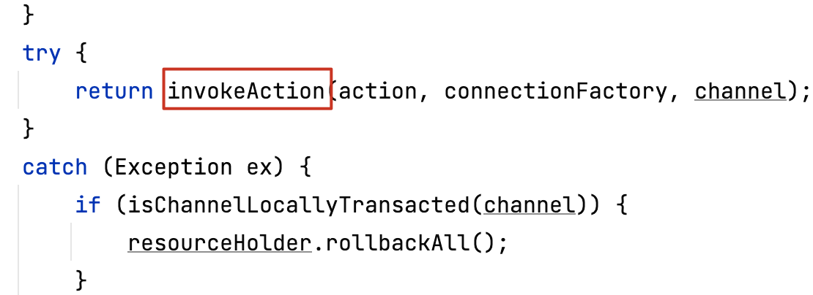

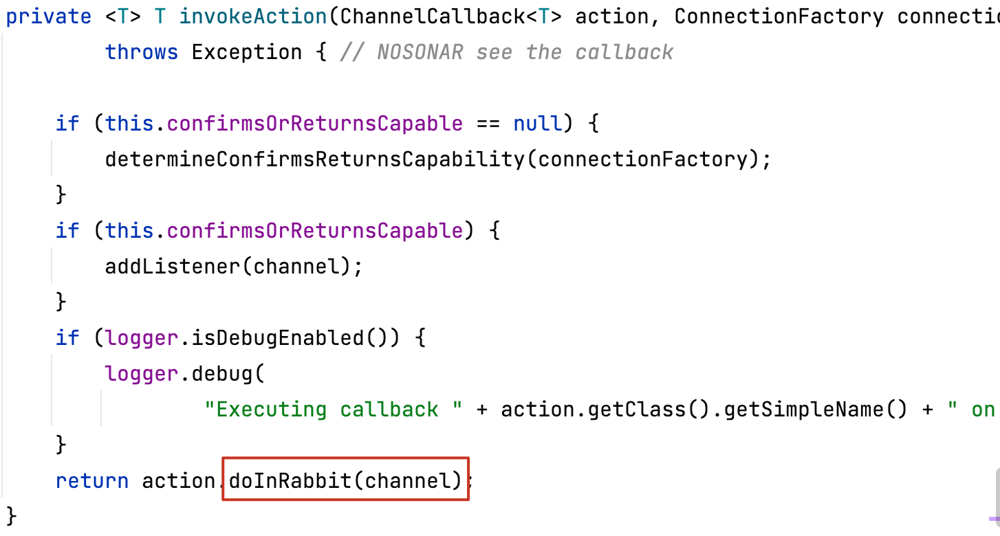

创建了Connection和Channel，执行action.doInRabbit()方法得到Message，关闭Channel和Connection。

当然，这里Connection和Channel的创建和关闭都不一定是真的创建和关闭，与具体的实现有关，比如CachingConnectionFactory，它的实现就是有缓存的。

action.doInRabbit()方法的实现逻辑就要再回到上面的receive方法，这里的action就是在那个receive方法传入的一个ChannelCallback的匿名内部实现类。

action为这个匿名内部类：

```java
channel -> {
   Delivery delivery = consumeDelivery(channel, queueName, timeoutMillis);
   if (delivery == null) {
      return null;
   }
   else {
      if (isChannelLocallyTransacted(channel)) {
         channel.basicAck(delivery.getEnvelope().getDeliveryTag(), false);
         channel.txCommit();
      }
      else if (isChannelTransacted()) {
         ConnectionFactoryUtils.registerDeliveryTag(getConnectionFactory(), channel,
               delivery.getEnvelope().getDeliveryTag());
      }
      else {
         channel.basicAck(delivery.getEnvelope().getDeliveryTag(), false);
      }
      return buildMessageFromDelivery(delivery);
   }
}
```

可以看到最后返回的消息是从Delivery中得到的，那么看下Delivery是怎么来的。

```java
private Delivery consumeDelivery(Channel channel, String queueName, long timeoutMillis)
  throws IOException {

  Delivery delivery = null;
  RuntimeException exception = null;
  CompletableFuture<Delivery> future = new CompletableFuture<>();
  ShutdownListener shutdownListener = c -> {
    if (!RabbitUtils.isNormalChannelClose(c)) {
      future.completeExceptionally(c);
    }
  };
  channel.addShutdownListener(shutdownListener);
  ClosingRecoveryListener.addRecoveryListenerIfNecessary(channel);
  DefaultConsumer consumer = null;
  try {
    consumer = createConsumer(queueName, channel, future,
                              timeoutMillis < 0 ? DEFAULT_CONSUME_TIMEOUT : timeoutMillis);
    if (timeoutMillis < 0) {
      delivery = future.get();
    }
    else {
      delivery = future.get(timeoutMillis, TimeUnit.MILLISECONDS);
    }
  }
  catch (ExecutionException e) {
    Throwable cause = e.getCause();
    this.logger.error("Consumer failed to receive message: " + consumer, cause);
    exception = RabbitExceptionTranslator.convertRabbitAccessException(cause);
    throw exception;
  }
  catch (InterruptedException e) {
    Thread.currentThread().interrupt();
  }
  catch (TimeoutException e) {
    RabbitUtils.setPhysicalCloseRequired(channel, true);
  }
  finally {
    if (consumer != null && !(exception instanceof ConsumerCancelledException) && channel.isOpen()) {
      cancelConsumerQuietly(channel, consumer);
    }
    try {
      channel.removeShutdownListener(shutdownListener);
    }
    catch (Exception e) {
      // NOSONAR - channel might have closed.
    }
  }
  return delivery;
}
```

看到future.get()，显然这是一个阻塞式的等待返回结果，receive方法中传入的receiveTimeout参数也正是在这里用到的。那么future数据自然是在createConsumer()方法中产生的。

createConsumer方法可以看到：

```java
private DefaultConsumer createConsumer(final String queueName, Channel channel,
                                       CompletableFuture<Delivery> future, long timeoutMillis) throws IOException, TimeoutException,
InterruptedException {

  channel.basicQos(1);
  final CountDownLatch latch = new CountDownLatch(1);
  DefaultConsumer consumer = new TemplateConsumer(channel) {

    @Override
    public void handleCancel(String consumerTag) {
      future.completeExceptionally(new ConsumerCancelledException());
    }

    @Override
    public void handleConsumeOk(String consumerTag) {
      super.handleConsumeOk(consumerTag);
      latch.countDown();
    }

    @Override
    public void handleDelivery(String consumerTag, Envelope envelope, BasicProperties properties, byte[] body) {
      future.complete(new Delivery(consumerTag, envelope, properties, body, queueName));
    }

  };
  channel.basicConsume(queueName, consumer);
  if (!latch.await(timeoutMillis, TimeUnit.MILLISECONDS)) {
    if (channel instanceof ChannelProxy) {
      ((ChannelProxy) channel).getTargetChannel().close();
    }
    future.completeExceptionally(
      new ConsumeOkNotReceivedException("Blocking receive, consumer failed to consume within "
                                        + timeoutMillis + " ms: " + consumer));
    RabbitUtils.setPhysicalCloseRequired(channel, true);
  }
  return consumer;
}
```

关键代码

```java
channel.basicQos(1);
channel.basicConsume(queueName, consumer);
```

于是可以看到RabbitTemplata使用broker push方式。

`channel.basicConsume(queueName, consumer)`是rabbitmq的api。

整体上的方式与@RabbitListener在BlockingQueueConsumer获取Message方式是一样的
