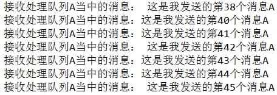
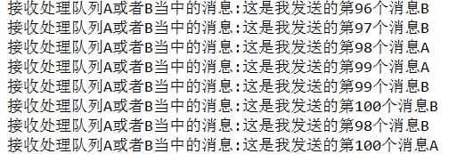
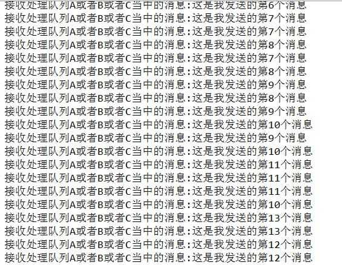

### 一、引入起步依赖

---

```xml
<dependency>
    <groupId>org.springframework.boot</groupId>
    <artifactId>spring-boot-starter-amqp</artifactId>
</dependency>
```


### 二、RabbitMQ基本配置

---

```yaml
spring:
  rabbitmq:
    host: 127.0.0.1
    port: 5672
    username: guest
    password: guest
    virtual-host: vhost
```


### 三、编写RabbitConfig类

---

设置多个EXCHANGE，QUEUE，ROUTINGKEY，为了接下来的不同使用场景。

```java
@Configuration
public class RabbitConfig {

  @Value("${spring.rabbitmq.host}")
  private String host;
  @Value("${spring.rabbitmq.port}")
  private int port;
  @Value("${spring.rabbitmq.username}")
  private String username;
  @Value("${spring.rabbitmq.password}")
  private String password;
  @Value("${spring.rabbitmq.virtual-host}")
  private String vhost;

  /**
   * Exchange 消息交换机：指定消息按什么规则，路由到那些个队列
   */
  public static final String EXCHANGE_A = "exchange_a";
  public static final String EXCHANGE_B = "exchange_b";
  public static final String EXCHANGE_C = "exchange_c";

  /**
   * Routing Key 路由关键字：exchange根据这个关键字进行消息投递
   */
  public static final String ROUTING_KEY_A = "ROUTING_KEY_A";
  public static final String ROUTING_KEY_B = "ROUTING_KEY_B";
  public static final String ROUTING_KEY_C = "ROUTING_KEY_C";

  @Bean
  public ConnectionFactory connectionFactory() {
    CachingConnectionFactory connectionFactory = new CachingConnectionFactory();
    connectionFactory.setUsername(username);
    connectionFactory.setPassword(password);
    connectionFactory.setVirtualHost(vhost);
    return connectionFactory;
  }

  /**
   * 设置为 prototype 类型
   */
  @Bean
  @Scope(ConfigurableBeanFactory.SCOPE_PROTOTYPE)
  public RabbitTemplate rabbitTemplate() {
    return new RabbitTemplate(connectionFactory());
  }
}
```

>rabbitTemplate是线程安全的，主要是channel不能共用，在rabbitTemplate源码里channel是 threadlocal的，所以singleton没问题。但是rabbitTemplate要设置回调类，如果是singleton，回调类就只能有一个，所以**如果想要设置不同的回调类，就要设置为prototype的scope**。


### 四、编写消息的生产者

---

>通过实现 ConfirmCallback 接口，**消息发送到 Broker 后触发回调**，确认消息是否到达 Broker 服务器，也就是只确认是否正确到达 Exchange 中。

```java
@Component
public class MsgProducer implements RabbitTemplate.ConfirmCallback {

  private final Logger logger = LoggerFactory.getLogger(MsgProducer.class);

  /**
   * 由于rabbitTemplate的scope属性设置为ConfigurableBeanFactory.SCOPE_PROTOTYPE，所以不能自动注入
   */
  private RabbitTemplate rabbitTemplate;

  /**
   * 构造方法注入rabbitTemplate
   */
  @Autowired
  public MsgProducer(RabbitTemplate rabbitTemplate) {
    this.rabbitTemplate = rabbitTemplate;
    // rabbitTemplate如果为单例的话，那回调就是最后设置的内容
    rabbitTemplate.setConfirmCallback(this);
  }

  public void sendMsg(String exchange, String routingKey, String content) {
    CorrelationData correlationData = new CorrelationData(UUID.randomUUID().toString());
    // 把消息放入routingKey对应的队列当中去
    rabbitTemplate.convertAndSend(exchange, routingKey, content, correlationData);
  }

  /**
   * 消息发送到 Broker 后触发回调，确认消息是否到达 Broker 服务器，也就是只确认是否正确到达 Exchange 中
   */
  @Override
  public void confirm(CorrelationData correlationData, boolean ack, String cause) {
    logger.info(">>>>>>>>回调id：{}", correlationData);
    if (ack) {
      logger.info(">>>>>>>>message send successful");
    } else {
      logger.info(">>>>>>>>message send failure:{}", cause);
    }
  }
}
```


### 五、交换机、队列通过路由关键字进行绑定

---

>针对消费者配置
>
>1）设置交换机类型
>
>2）将队列绑定到交换机
>
> * FanoutExchange：将消息分发到所有的绑定队列，无routingkey的概念
> * HeadersExchange：通过添加属性key-value匹配
> * DirectExchange：按照routingkey分发到指定队列
> * TopicExchange：多关键字匹配

```java
/**
 * 交换机
 */
@Bean
public DirectExchange defaultExchange() {
  return new DirectExchange(EXCHANGE_A);
}

/**
 * 队列A
 */
@Bean
public Queue queueA() {
  return new Queue("QUEUE_A", true);
}

/**
 * 队列B
 */
@Bean
public Queue queueB() {
  return new Queue("QUEUE_B", true);
}

/**
 * 一个交换机可以绑定多个消息队列，即消息通过一个交换机，可以分发到不同的队列当中去
 */
@Bean
public Binding binding() {
  return BindingBuilder.bind(queueA()).to(defaultExchange()).with(RabbitConfig.ROUTING_KEY_A);
}

@Bean
public Binding bindingB() {
  return BindingBuilder.bind(queueB()).to(defaultExchange()).with(RabbitConfig.ROUTING_KEY_B);
}

@Bean
public ConnectionFactory connectionFactory() {
  CachingConnectionFactory connectionFactory = new CachingConnectionFactory();
  connectionFactory.setUsername(username);
  connectionFactory.setPassword(password);
  connectionFactory.setVirtualHost(vhost);
  return connectionFactory;
}
```


### 六、编写消息的消费者

---

这一步是最复杂的，因为可以编写除很多不同的需求出来，写法也有很多不同。

#### 6.1 一个生产者，一个消费者

```java
@Component
@RabbitListener(queues = "QUEUE_A")
public class MsgReceiver {

    private final Logger logger = LoggerFactory.getLogger(MsgReceiver.class);

    @RabbitHandler
    public void process(String content) {
        logger.info(">>>>>>>>接收处理队列A当中的消息：{}", content);
    }
}
```



#### 6.2 一个生产者，多个消费者

可以写多个消费者，并且他们的分发是负载均衡的。

```java
@Component
@RabbitListener(queues = "QUEUE_A")
public class MsgReceiverTwo {

  private final Logger logger = LoggerFactory.getLogger(MsgReceiverTwo.class);

  @RabbitHandler
  public void process(String content) {
    logger.info(">>>>>>>>接收处理队列A当中的消息：{}", content);
  }
}
```


#### 6.3 另外一种消息处理机制

在RabbitMQConfig类里面增加bean：

```java
@Bean
public SimpleMessageListenerContainer messageContainer() {
  //加载处理消息A的队列
  SimpleMessageListenerContainer container = new SimpleMessageListenerContainer(connectionFactory());
  //设置接收多个队列里面的消息，这里设置接收队列A
  container.setQueues(queueA());
  container.setExposeListenerChannel(true);
  //设置最大的并发的消费者数量
  container.setMaxConcurrentConsumers(10);
  //最小的并发消费者的数量
  container.setConcurrentConsumers(1);
  //设置确认模式手工确认
  container.setAcknowledgeMode(AcknowledgeMode.MANUAL);
  container.setMessageListener((ChannelAwareMessageListener) (message, channel) -> {
    // 通过basic.qos方法设置prefetch_count=1，这样RabbitMQ就会使得每个Consumer在同一个时间点最多处理一个Message，
    // 换句话说,在接收到该Consumer的ack前,它不会将新的Message分发给它
    channel.basicQos(1);
    byte[] body = message.getBody();
    logger.info("接收处理队列A当中的消息:" + new String(body));
    // 为了保证永远不会丢失消息，RabbitMQ支持消息应答机制。
    // 当消费者接收到消息并完成任务后会往RabbitMQ服务器发送一条确认的命令，然后RabbitMQ才会将消息删除。
    channel.basicAck(message.getMessageProperties().getDeliveryTag(), false);
  });
  return container;
}
```

下面是当一个消费者，处理多个队列里面的信息打印的log：




### 七、Fanout Exchange

---

Fanout就是熟悉的广播模式，给Fanout交换机发送消息，绑定了这个交换机的所有队列都收到这个消息。

```java
@Bean
FanoutExchange fanoutExchange() {
    return new FanoutExchange(RabbitConfig.FANOUT_EXCHANGE);
}

//把所有的队列都绑定到这个交换机上去
@Bean
Binding bindingExchangeA(Queue queueA,FanoutExchange fanoutExchange) {
    return BindingBuilder.bind(queueA).to(fanoutExchange);
}
@Bean
Binding bindingExchangeB(Queue queueB, FanoutExchange fanoutExchange) {
    return BindingBuilder.bind(queueB).to(fanoutExchange);
}
@Bean
Binding bindingExchangeC(Queue queueC, FanoutExchange fanoutExchange) {
    return BindingBuilder.bind(queueC).to(fanoutExchange);
}
```

消息发送，这里不设置routing_key，因为设置了也无效，发送端的routing_key写任何字符都会被忽略。

```java
public void sendAll(String content) {
  rabbitTemplate.convertAndSend("fanoutExchange","", content);
}
```

消息处理的结果如下所示：

