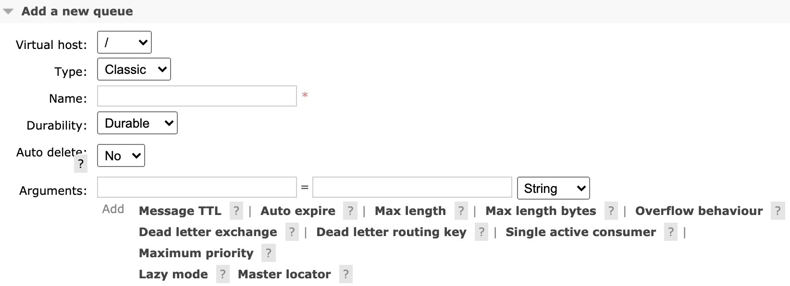
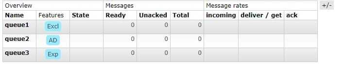

AMQP消息路由必须包含三部分，交换器、队列、绑定。如下图所示，生产者把消息发送给交换器，交换器再路由到符合条件的队列上，最终被消费者接收。绑定决定了消息如何从路由器路由到相应的队列。


### 相关概念



当新增队列的时候，需要定义以下4种属性：

- name：队列名称，不能用`amq.`开头。
- Durability：持久化，如果为`durable`，那么**broker重启不会丢失**；如果为`transient`，broker重启后会丢失。
- Auto delete：最后一个消费者退订时被自动删除。
- Arguments：队列的其他参数，比如消息的TTL等。

定义一个队列的方法如下，exclusive的参数，下面的临时队列会说明。

```java
com.rabbitmq.client.Channel#queueDeclare(java.lang.String, boolean, boolean, boolean, java.util.Map<java.lang.String,java.lang.Object>)
```


### 一、命名

---

在使用队列之前，需要先声明队列。如果不存在，则创建队列。如果已存在则不会创建，但是和已存在的队列属性不一致，则会有406(PRECONDITION_FAILED)的通道级异常。


### 二、参数设置

---

参数设置有2种，一种是通过==分组==（推荐，不需要修改和重新部署应用程序），一个是==一个个队列设置==。

| 参数                      | 描述                                              |
| ------------------------- | ------------------------------------------------- |
| x-message-ttl             | 消息的存活时间，单位为毫秒                        |
| x-expires                 | 队列的存活时间，单位为毫秒                        |
| x-max-length              | 队列的最大消息数                                  |
| x-max-length-bytes        | 消息的最大字节数                                  |
| x-overflow                | 消息达到最大数的策略，drop-head或者reject-publish |
| x-dead-letter-exchange    | 死信队列的交换器                                  |
| x-dead-letter-routing-key | 死信队列的路由键                                  |
| x-max-priority            | 消息的优先级设置                                  |
| x-queue-mode              | 消息的延迟                                        |
| x-queue-master-locator    | 用于主从                                          |


### 三、临时队列

---

当需要一个临时队列的时候，可以先定义队列，使用完再删除，或者直接定义Durability的属性为transient，等broker重启的时候就消失。使用后删除，如果客户端失败，这个队列就一直存在。我们可以用以下方法来自动删除：

- Exclusive：独占队列
- x-expires：设置队列的过期时间
- Auto delete：队列设置自动删除

```java
// 声明一个连接工厂
ConnectionFactory factory = new ConnectionFactory();
// 创建一个与rabbitmq服务器的连接
Connection connection = factory.newConnection();
// 创建一个Channel
Channel channel = connection.createChannel();
// 通过Channel定义队列

// 方式一：独占队列
channel.queueDeclare("queue1", false, true, false, null);

// 方式二：自动删除
channel.queueDeclare("queue2", false, false, true, null);
channel.basicConsume("queue2", true, null, consumerTag -> {
});

// 方式三：设置5秒的过期时间
Map<String, Object> arguments = new HashMap<String, Object>();
arguments.put("x-expires",5000);
channel.queueDeclare("queue3", false, false, false, arguments);
```

运行后如下图，五秒后queue3消失，停止程序运行，queue1和queue2消失。

需要注意的是，如果把queue2的basicConsume方法调用注释掉，由于没有消费者，队列并不会消失。

**独占队列只能由其声明连接使用**（从声明连接使用、清除、删除等）。其他队列如果想使用独占队列将导致通道级异常RESOURCE_LOCKED，该异常带有一条错误消息，表明无法获得对锁定队列的独占访问。




### 四、推模式和拉模式

---

消费者通过两种方式来接收消息：

1. 通过consume订阅，是队列往消费端推送消息。只要队列有消息，就可以持续收到。
2. 通过get获取消息，是消费者主动从队列拉取消息，每次只能获取一条，如果想获取更多消息，可以while循环，但是吞吐量相对较低。

先往队列里发送消息，其中queue1发送4条，queue2发送3条。可以通过`http://127.0.0.1:15672/`的web控制台来发送消息。

queue1是拉模式，queue2是推模式。

#### 4.1 拉模式

```java
@Test
void testBasicGet() throws IOException, TimeoutException {
  ConnectionFactory factory = new ConnectionFactory();
  Connection connection = factory.newConnection();
  Channel channel = connection.createChannel();

  channel.queueDeclare("queue1", false, false, false, null);
  GetResponse response = channel.basicGet("queue1", true);
  System.out.println("queue1 Received '" + new String(response.getBody()) + "'");
  GetResponse response2 = channel.basicGet("queue1", true);
  System.out.println("queue1 Received '" + new String(response2.getBody()) + "'");
}
```

调用get两次结果：

```
queue1 Received 'hello'
queue1 Received 'hello'
```

#### 4.2 推模式

```java
@Test
void testBasicConsume() throws IOException, TimeoutException {
  ConnectionFactory factory = new ConnectionFactory();
  Connection connection = factory.newConnection();
  Channel channel = connection.createChannel();

  channel.queueDeclare("queue2", false, false, false, null);
  // 异步回调处理
  DeliverCallback deliverCallback = (consumerTag, delivery) -> {
    String message = new String(delivery.getBody(), "UTF-8");
    System.out.println("queue2 Received '" + message + "'");
  };
  // 接收消息
  channel.basicConsume("queue2", true, deliverCallback, consumerTag -> {
  });
}
```

调用consume一次：

```
queue2 Received ’hello‘
queue2 Received ’hello‘
queue2 Received ’hello‘
```


### 五、多个消费者

---

上面的例子中，先把消息发送给队列，此时没有消费者，消息就会在队列里一直等。那如果有消费者，且有多个消费者，消息是如何发布的呢？

两个消费者时，整个步骤如下：

1. 消息A发送到queue2队列
2. rabbitmq把消息A发送给消费者1
3. 消费者1收到消息A并确认
4. rabbitmq把消息A从queue2队列删除
5. 消息B发送到queue2队列
6. rabbitmq把消息B发送给消费者2
7. 消费者2收到消息B并确认
8. rabbitmq把消息B从queue2队列删除


### 总结

**如果队列还没创建，生产者就开始往不存在的队列发送消息，消息就会丢失**。所以为了消息能够正确的到达队列，需要生产者和消费者都要尝试去创建队列，除非消息不那么重要，可以消费者来创建。
队列是AMQP是消息通信的基础模块：

- 为消息提供了住所，消息在此等待消费；
- 对于负载均衡来说，消息是绝佳方案。只需要一直增加消费者就可以；
- 队列是消息的终点。

