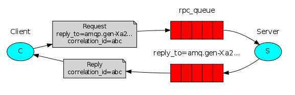
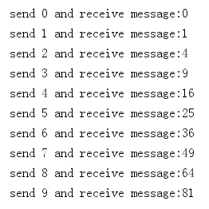
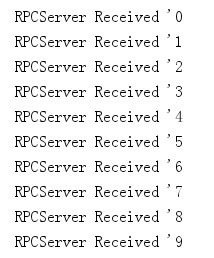

类似于[ActiveMQ - request/response](https://segmentfault.com/a/1190000022390579)，通过设置消息的属性来的。

### 一、消息的属性

---

| 属性值           | 描述                               |
| ---------------- | ---------------------------------- |
| Delivery mode    | 是否持久化，1为不持久化，2为持久化 |
| Type             | 应用程序特定的消息类型             |
| Headers          | 用户自定义的其他属性               |
| Content type     | 内容类型。比如application/json     |
| Content encoding | 内容编码,比如“gzip”                |
| Message ID       | 消息ID                             |
| Correlation ID   | 用于request/response               |
| Reply To         | 携带响应队列名称                   |
| Expiration       | 消息过期时间                       |
| Timestamp        | 消息的产生时间                     |
| User ID          | 用于验证发布消息的用户身份         |
| App ID           | 应用程序的名称                     |


### 二、request/response示例

---



大体步骤如下：

1. 客户端发携带两个参数，replyTo和correlationId。replyTo是具有exclusive属性的队列，用于处理消费者返回的数据。correlationId是为每个请求设置一个唯一的值。
2. 把请求发送给rpc队列
3. 服务端处理完数据，通过replyTo的队列把消息发给客户端。
4. 客户端通过correlationId消息，请求中的值相匹配，进行处理。


### 三、客户端

---

客户端发送从0到9的数字给服务端，服务端返回数字的平方，客户端获取到输出：

```java
public final static String requestQueueName = "rpc_queue";

public static void main(String[] args) throws IOException, TimeoutException, InterruptedException {
  for (int i = 0; i < 10; i++) {
    // 声明一个连接工厂
    ConnectionFactory factory = new ConnectionFactory();
    // 创建一个与rabbitmq服务器的连接
    // 创建一个Channel
    Connection connection = factory.newConnection();
    Channel channel = connection.createChannel();
    // 定义correlationId的值
    final String corrId = UUID.randomUUID().toString();
    // 定义临时队列，临时队列默认是exclusive的
    String replyQueueName = channel.queueDeclare().getQueue();
    // 消息携带的correlationId和replyTo
    AMQP.BasicProperties props = new AMQP.BasicProperties
      .Builder()
      .correlationId(corrId)
      .replyTo(replyQueueName)
      .build();
    String message = i + "";
    // 发送消息
    channel.basicPublish("", requestQueueName, props, message.getBytes("UTF-8"));
    // 根据临时队列的名称等待消息
    channel.basicConsume(replyQueueName, true, (consumerTag, delivery) -> {
      if (delivery.getProperties().getCorrelationId().equals(corrId)) {
        System.out.println("send " + message + " and receive message:" + new String(delivery.getBody(), "UTF-8"));
      }
    }, consumerTag -> {
    });
  }
  TimeUnit.SECONDS.sleep(10);
}
```


### 四、服务端

---

```java
public static void main(String[] args) throws IOException, TimeoutException {
  // 声明一个连接工厂
  ConnectionFactory factory = new ConnectionFactory();
  // 创建一个与rabbitmq服务器的连接
  Connection connection = factory.newConnection();
  // 创建一个Channel
  Channel channel = connection.createChannel();
  // 通过Channel定义队列
  channel.queueDeclare(RPCClient.requestQueueName, false, false, false, null);
  // 异步回调处理
  DeliverCallback deliverCallback = (consumerTag, delivery) -> {
    // 设置correlationId
    AMQP.BasicProperties replyProps = new AMQP.BasicProperties
      .Builder()
      .correlationId(delivery.getProperties().getCorrelationId())
      .build();
    String message = new String(delivery.getBody(), "UTF-8");
    System.out.println("RPCServer Received '" + message);
    String response = "" + Integer.valueOf(message) * Integer.valueOf(message);
    // 通过replyTo把消息发回客户端队列
    channel.basicPublish("", delivery.getProperties().getReplyTo(), replyProps, response.getBytes("UTF-8"));
    // 确认
    channel.basicAck(delivery.getEnvelope().getDeliveryTag(), false);
  };
  // 接收消息
  channel.basicConsume(RPCClient.requestQueueName, false, deliverCallback, consumerTag -> {
  });
}
```

客户端运行结果如下：



服务端运行结果如下：

