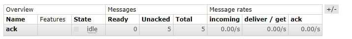
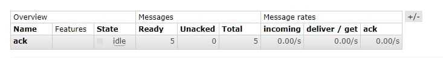
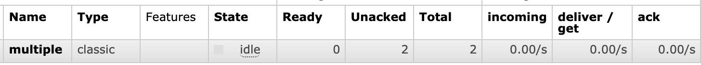
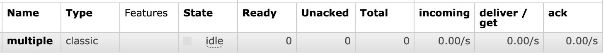

接收消息有两种方式：`consume`、`get`，

```java
String basicConsume(String queue, boolean autoAck, DeliverCallback deliverCallback, CancelCallback cancelCallback) throws IOException;

GetResponse basicGet(String queue, boolean autoAck) throws IOException;
```

这两个方法都有一个autoAck参数，**当设置true的时候，消费者会通过AMQP显式的向rabbitmq发送一个确认，rabbitmq自动视其确认了消息，然后把消息从队列中删除**。下面用consume的方式做些例子来理解autoAck的参数设置。


### 一、不确认

---

先往ack队列发送5条数据，可以看到ready是5，total是5。


运行一下代码，autoAck设置为false，且不对消息确认。

```java
ConnectionFactory factory = new ConnectionFactory();
Connection connection = factory.newConnection();
Channel channel = connection.createChannel();

channel.queueDeclare("ack", false, false, false, null);
// 异步回调处理
DeliverCallback deliverCallback = (consumerTag, delivery) -> {
  String message = new String(delivery.getBody(), "UTF-8");
  System.out.println("ack Received '" + message + "'" + delivery.getEnvelope().getDeliveryTag());
  //channel.basicAck(delivery.getEnvelope().getDeliveryTag(), false);
};
// 接收消息，autoAck设置为false
channel.basicConsume("ack", false, deliverCallback, consumerTag -> {
});
```

运行结果：

```
ack Received 'hello'1
ack Received 'hello'2
ack Received 'hello'3
ack Received 'hello'4
ack Received 'hello'5
```

在web控制台可以看出，ready是0，unacked是5，即未确认的消息数是5条。



应用关停后，即关闭消费者和rabbitmq的连接，unacked的5条数据回到了ready。



当autoAck为false时，消息分为两个部分，一个是未投放给消费者的（ready），一个是投放给消费者但未确认的（Unacked）。**如果未确认信息的消费者断开了连接，这部分消息会回到ready重新投递给消费者，确保了消息的可靠性**。需要注意的是，如果消费者一直没有断开连接，也没有进行确认，那这个消息会一直等待确认中。


### 二、确认

---

两种方式：

- **自动确认**：就是把autoAck设置为true。**当rabbitmq向消费者传递消息的时候，会带有一个deliveryTag的传递标识**，标记惟一地标识信道上的传递，交付标记的作用域是每个信道，所以必须在接收消息的信道上进行确认。交付标记是递增的正整数，所以我们看到是1，2，3这样的递增数字。

- **手动确认**：手动确认方法如下，第一个参数就是传递标记，第二个参数是是否批量确认。上面的例子打印结果输出了deliveryTag的值，从1到5。把注释删了再运行后，可以看到rabbitmq把确认后的消息删除。

  ```java
  // com.rabbitmq.client.Channel#basicAck
  void basicAck(long deliveryTag, boolean multiple) throws IOException;
  ```


### 三、批量确认

---

basicAck方法中，有个参数是`multiple`，是用来批量确认的。当设置为true的时候，RabbitMQ将确认所有未完成的传递标记，包括确认中指定的标记。与其他与确认相关的内容一样，这是按每个信道确定范围的。比如收到标记为1、2的没确认，标记为3的确认，那前面两个也会一起确认。如果multiple设置为false，则仅确认当前的消息。
如下面的例子，每处理三个消息确认一次。

```java
ConnectionFactory factory = new ConnectionFactory();
Connection connection = factory.newConnection();
Channel channel = connection.createChannel();

channel.queueDeclare("multiple", false, false, false, null);
// 异步回调处理
DeliverCallback deliverCallback = (consumerTag, delivery) -> {
  String message = new String(delivery.getBody(), "UTF-8");
  System.out.println("ack Received '" + message + "'" + delivery.getEnvelope().getDeliveryTag());
  // 每处理三个消息，手动确认一次
  if (delivery.getEnvelope().getDeliveryTag() % 3 == 0) {
    channel.basicAck(delivery.getEnvelope().getDeliveryTag(), true);
  }
};
// 接收消息，autoAck设置为false
channel.basicConsume("ack", false, deliverCallback, consumerTag -> {
});
```

启动后，发送两个消息，可以看到打印了两次，控制台显示未确认2个：



再发送一条数据，打印了第三个，此时web控制台看出，已经确认并删除了队列的消息。




### 四、使用哪种确认方式

---

- 自动确认，这种模式通常被称为“发了就忘“，当消费端处理异常时，则服务器发送的消息将得不到正确的处理。因此，自动消息确认应该被认为是不安全的。
- 手动确认模式中，通常使用消息预取，它限制了通道上未完成(“进行中”)交付的数量。但是，对于自动确认，没有这样的限制，所以消费者有可能由于处理消息太慢，导致内存积压、堆耗尽，导致程序无法运行。因此，**自动确认模式仅适用于能够高效、稳定地处理配送的消费者**。

