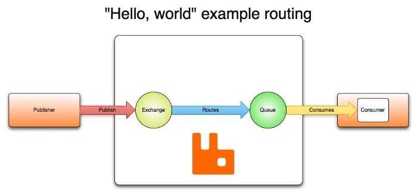
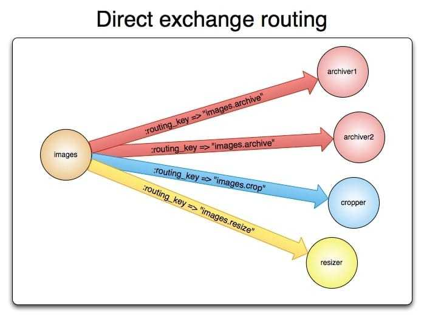

在Rabbitmq中，消息发送给交换器，交换器根据一定的规则把消息发给队列，broker再把消息发送给消费者，或者发送者主动从队列拉消息。




### 一、交换器

---

**交换器接收消息并将其路由到零个或多个队列**，支持四种交换类型：

- `Direct`
- `Fanout`
- `Topic`
- `Headers`

还声明了一些属性如：交换器的名称、交换器的类型、是否持久化、是否自动删除、参数。

是否持久化，决定了rabbitmq重启后，交换器是否存在。是否自动删除，决定了当最后一个队列被解除绑定时，交换器是否被删除。

```java
Exchange.DeclareOk exchangeDeclare(String exchange,
                                   BuiltinExchangeType type,
                                   boolean durable,
                                   boolean autoDelete,
                                   boolean internal,
                                   Map<String, Object> arguments) throws IOException;
```


### 二、默认的交换器

---

**默认的交换器名称为”“，即空字符串。当我们没有定义的时候，看起来就像消息直接发送到队列一样。**


### 三、direct

---

根据消息路由键将消息传递到队列。主要的步骤如下：

1. 通过路由键K把队列绑定到交换器
2. 当带有路由键R的新消息到达交换器时，如果K=R，交换器将其路由到队列



生产者代码，通过==channel.basicPublish==把带有路由键("images.archive", "images.crop", "images.resizer")的消息发送给交换器images。

```java
ConnectionFactory factory = new ConnectionFactory();
Connection connection = factory.newConnection();
Channel channel = connection.createChannel();
channel.exchangeDeclare(Constant.EXCHANGE_NAME, BuiltinExchangeType.DIRECT);
String[] routingKeys = {"images.archive", "images.crop", "images.resizer"};
for (int i = 0; i < routingKeys.length; i++) {
    channel.basicPublish(Constant.EXCHANGE_NAME, routingKeys[i], null, routingKeys[i].getBytes());
    channel.basicPublish(Constant.EXCHANGE_NAME, routingKeys[i], null, routingKeys[i].getBytes());
}
System.out.println("Sent complete");
```

ArchiveRec1消费者，通过==channel.queueBind==把交换器images、路由键images.archive、队列archive1绑定一起。

```java
ConnectionFactory factory = new ConnectionFactory();
Connection connection = factory.newConnection();
Channel channel = connection.createChannel();
// 通过Channel定义队列
// 这边声明队列，是因为可能在发布服务器之前启动消费者，所以在尝试使用队列中的消息之前确保队列存在
channel.queueDeclare(QUEUE_NAME, false, false, false, null);
// 绑定交换器、路由键、队列
channel.queueBind(QUEUE_NAME, Constant.EXCHANGE_NAME, "images.archive");
System.out.println("Waiting for messages.");
// 异步回调处理
DeliverCallback deliverCallback = (consumerTag, delivery) -> {
    String message = new String(delivery.getBody(), "UTF-8");
    System.out.println("ArchiveRec1 Received '" + message + "'");
};
// 接收消息
channel.basicConsume(QUEUE_NAME, true, deliverCallback, consumerTag -> {
});
```

ArchiveRec1消费者，通过channel.queueBind把交换器images、路由键images.archive、队列archive2绑定一起。除了队列名称，其他与上面代码雷同，就不贴了。
CropRec消费者，通过channel.queueBind把交换器images、路由键images.crop、队列cropper绑定一起。

```java
ConnectionFactory factory = new ConnectionFactory();
Connection connection = factory.newConnection();
Channel channel = connection.createChannel();
// 通过Channel定义队列
// 这边声明队列，是因为可能在发布服务器之前启动消费者，所以在尝试使用队列中的消息之前确保队列存在
channel.queueDeclare(QUEUE_NAME, false, false, false, null);
// 绑定交换器、路由键、队列
channel.queueBind(QUEUE_NAME, Constant.EXCHANGE_NAME, "images.crop");
System.out.println("Waiting for messages.");
// 异步回调处理
DeliverCallback deliverCallback = (consumerTag, delivery) -> {
    String message = new String(delivery.getBody(), "UTF-8");
    System.out.println("cropper Received '" + message + "'");
};
// 接收消息
channel.basicConsume(QUEUE_NAME, true, deliverCallback, consumerTag -> {
});
```

运行ArchiveRec1、ArchiveRec2各一次，运行CropRec两次。启动消费者后，再运行生产者DirectExchange。
运行结果如下，ArchiveRec1和ArchiveRec2各消费2条数据，两个CropRec一共消费2条数据，说明同一个队列两个消费者，他们是轮询消费的。

#### 4. fanout

==把消息发送给交换器所有的队列上==，忽略的路由键的影响。也就是说，当多个队列跟这个交换器绑定的时候，交换器每收到一条消息，就会群发给这些队列。虽然direct上面的例子中，也可以通过多个队列和路由键交换器绑定，达到部分群发的功能，但是fanout对于群发的功能还是更方便些。


#### 5. topic

通过通配符，来消费所要的消息。名称和activemq的发布订阅一样，但是特性和activemq的通配符差不多。
通配符有`#`和`*`。`#`是匹配一个或多个，`*`是匹配一个。

> AllRec用来接收images开头所有的消息，ArchiveRec用来接收images.archive开头所有的消息，ARec用来接收images开头a结尾的消息，CropRec用来接收images.cropRec开头所有的消息。
> 生产者分布向这三个路由键images.archive.a，images.archive.b，images.crop.a发送消息