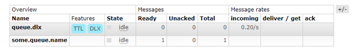

以下几种情况会把消息投递到死信队列：

- 消息被拒绝，且requeue设置为false。
- 消息过期（队列过期并不会把消息投递给死信队列）
- 由于超过了队列的消息最大数被抛弃

消息投递给死信队列的时候，也会经过交换器，这个交换器之间称之为死信交换器，但是他依然是一个正常的交换器。

要设置队列的死信交换，在声明队列时需要指定可选的x-dead-letter-exchange参数。主要是下面的代码：

```java
Map<String, Object> args = new HashMap<String, Object>();
args.put("x-dead-letter-exchange", "some.exchange.name");
```

示例：

```java
// 定义队列的名称
public final static String QUEUE_NAME = "queue.dlx";
// 定义交换器的名称
public final static String EXCHANGE_NAME = "exchange.dlx";
// 定义路由的名称
public final static String ROUTE_NAME = "route.dlx";
// 定义死信队列的名称
public final static String DLX_QUEUE_NAME = "some.queue.name";
// 定义死信交换器的名称
public final static String DLX_EXCHANGE_NAME = "some.exchange.name";
// 定义死信路由的名称
public final static String DLX_ROUTE_NAME = "some.route.name";

public static void main(String[] args) throws IOException, TimeoutException {
  // 声明一个连接工厂
  ConnectionFactory factory = new ConnectionFactory();
  // 创建一个与rabbitmq服务器的连接
  // 创建一个Channel
  try (Connection connection = factory.newConnection();
       Channel channel = connection.createChannel()) {
    // 定义交换器
    channel.exchangeDeclare(EXCHANGE_NAME, BuiltinExchangeType.DIRECT, false, false, null);
    Map<String, Object> arguments = new HashMap<String, Object>();
    arguments.put("x-dead-letter-exchange", "some.exchange.name");
    arguments.put("x-message-ttl", 2000);
    // 定义队列
    channel.queueDeclare(QUEUE_NAME, false, false, false, arguments);
    // 绑定队列
    channel.queueBind(QUEUE_NAME, EXCHANGE_NAME, ROUTE_NAME);
    // 定义死信交换器
    channel.exchangeDeclare(DLX_EXCHANGE_NAME, BuiltinExchangeType.DIRECT, false, false, null);
    // 定义死信队列
    channel.queueDeclare(DLX_QUEUE_NAME, false, false, false, null);
    // 绑定死信队列
    channel.queueBind(DLX_QUEUE_NAME, DLX_EXCHANGE_NAME, ROUTE_NAME);
    // 发送消息
    channel.basicPublish(EXCHANGE_NAME, ROUTE_NAME, true, null, "dlx".getBytes());
  }
}
```

流程是这样的：

1. 定义交换器“exchange.dlx”。
2. 定义死信交换器“some.exchange.name”。
3. 定义队列“queue.dlx”，以及指定死信交换器的参数配置。
4. 队列"queue.dlx"绑定了交换器"exchange.dlx"和路由键"route.dlx"。
5. 定义死信队列"some.queue.name"。
6. 死信队列"some.queue.name"绑定了交换器"some.exchange.name"和路由键"route.dlx"。

由于上面定义了队列的消息只有2秒的存在时间，所以2秒后就会进入死信队列。从web控制台可以看出，消息到了死信队列。对这个队列的消费，跟正常的队列没有什么区别。




### 一、指定路由

---

在上面的例子中，路由由于没指定，经死信交换器后，路由还是原来的路由，rabbitmq提供了一个参数，可以改变路由：

```java
args.put("x-dead-letter-routing-key", "some-routing-key");
```

完整代码如下：

```java
// 定义队列的名称
public final static String QUEUE_NAME = "queue.dlx";
// 定义交换器的名称
public final static String EXCHANGE_NAME = "exchange.dlx";
// 定义路由的名称
public final static String ROUTE_NAME = "route.dlx";
// 定义死信队列的名称
public final static String DLX_QUEUE_NAME = "some.queue.name";
// 定义死信交换器的名称
public final static String DLX_EXCHANGE_NAME = "some.exchange.name";
// 定义死信路由的名称
public final static String DLX_ROUTE_NAME = "some.route.name";

public static void main(String[] args) throws IOException, TimeoutException {
  // 声明一个连接工厂
  ConnectionFactory factory = new ConnectionFactory();
  // 创建一个与rabbitmq服务器的连接
  // 创建一个Channel
  try (Connection connection = factory.newConnection();
       Channel channel = connection.createChannel()) {
    // 定义交换器
    channel.exchangeDeclare(EXCHANGE_NAME, BuiltinExchangeType.DIRECT, false, false, null);
    Map<String, Object> arguments = new HashMap<String, Object>();
    arguments.put("x-dead-letter-exchange", "some.exchange.name");
    arguments.put("x-dead-letter-routing-key", DLX_ROUTE_NAME);
    arguments.put("x-message-ttl", 2000);
    // 定义队列
    channel.queueDeclare(QUEUE_NAME, false, false, false, arguments);
    // 绑定队列
    channel.queueBind(QUEUE_NAME, EXCHANGE_NAME, ROUTE_NAME);
    // 定义死信交换器
    channel.exchangeDeclare(DLX_EXCHANGE_NAME, BuiltinExchangeType.DIRECT, false, false, null);
    // 定义死信队列
    channel.queueDeclare(DLX_QUEUE_NAME, false, false, false, null);
    // 绑定死信队列
    channel.queueBind(DLX_QUEUE_NAME, DLX_EXCHANGE_NAME, DLX_ROUTE_NAME);
    // 发送消息
    channel.basicPublish(EXCHANGE_NAME, ROUTE_NAME, true, null, "dlx".getBytes());
  }
}
```

运行结果同上，注意的是，如果运行了上面的例子，需要先把队列从rabbitmq删除再运行这个例子，不然由于队列的配置不一样，会报错。
