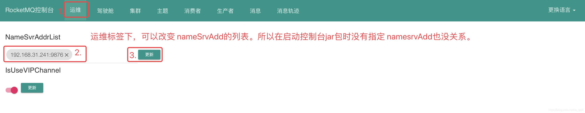
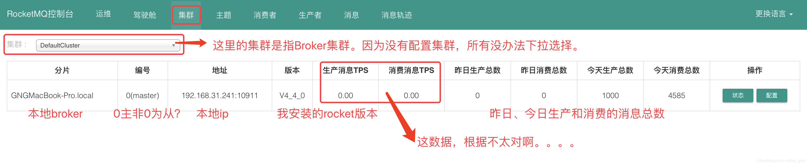
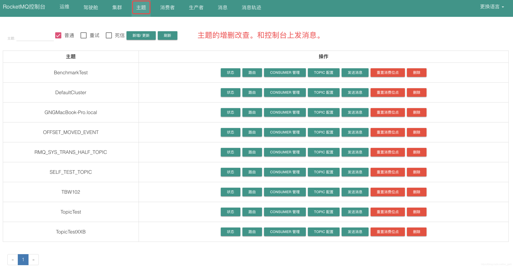
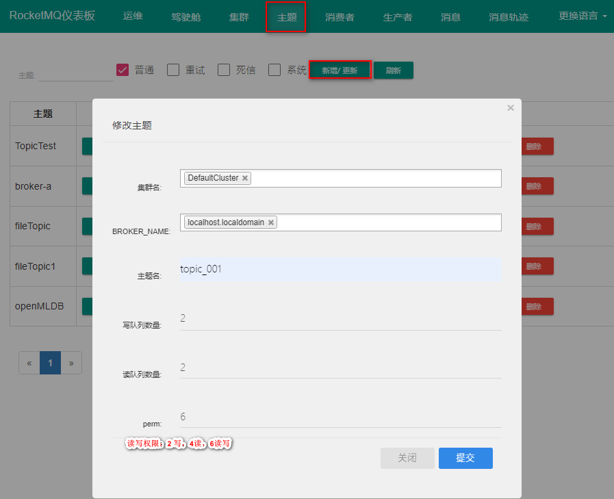
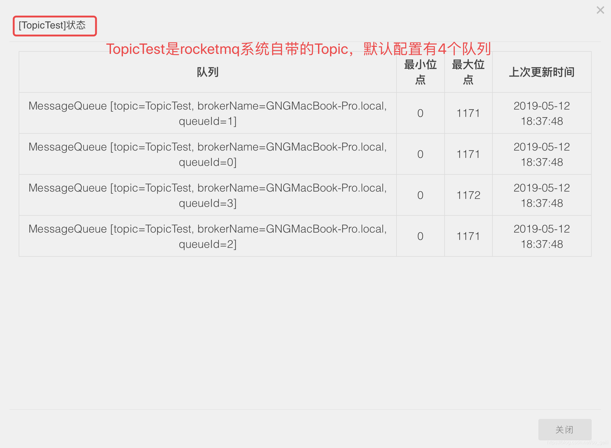
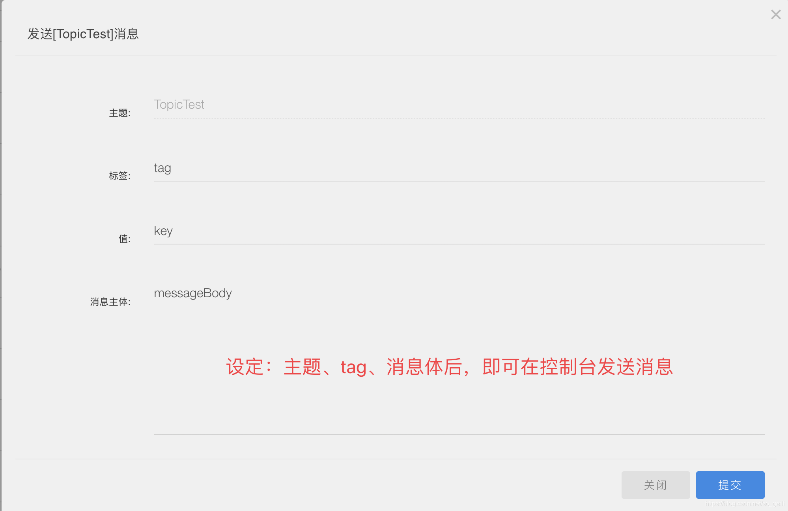
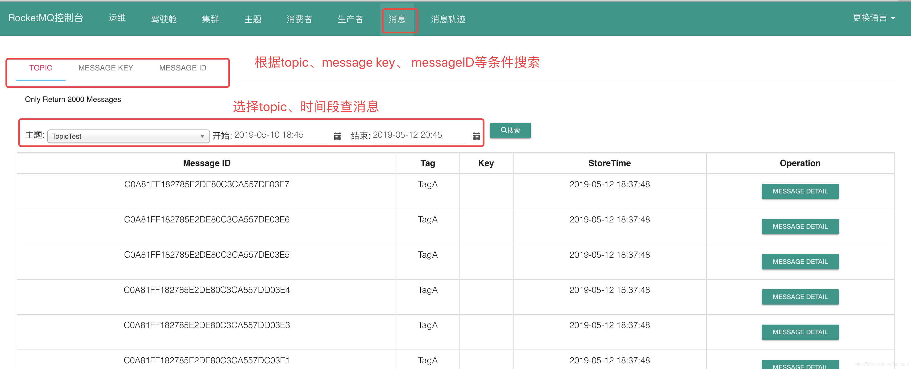

### 一、安装步骤

---

[下载源码包](https://www.apache.org/dyn/closer.cgi?path=rocketmq/4.8.0/rocketmq-all-4.8.0-source-release.zip)、解压安装包

```shell
unzip rocketmq-all-4.8.0-source-release.zip
```


### 二、启动name server

---

```shell
# 启动NameServer
nohup sh bin/mqnamesrv &
tail -f ~/logs/rocketmqlogs/namesrv.log
```

>可以看到 ：The Name Server boot success...表示启动成功。


###  三、启动broker

---

RocketMQ默认的虚拟机内存较大，启动broker如果因为内存不足失败，需要编辑如下两个配置文件，修改jvm内存大小。

```shell
vim runbroker.sh
JAVA_OPT="${JAVA_OPT} -server -Xms256m -Xmx256m -Xmn128m"
vim runserver.sh
JAVA_OPT="${JAVA_OPT} -server -Xms256m -Xmx256m -Xmn128m -XX:MetaspaceSize=128m -XX:MaxMetaspaceSize=320m"
```

开启acl，修改**conf/broker.conf**文件：

```properties
#开启用户认证
aclEnable=true
#指定认证配置文件
aclAccessResourcePath=/Users/chenyang/dev/rocketmq-all-5.3.0-bin-release/conf/plain_acl.yml
```

配置**conf/plain_acl.yml**文件：

```yaml

```

```shell
nohup sh bin/mqbroker -n localhost:9876 &
tail -f ~/logs/rocketmqlogs/broker.log 
```


### 四、测试发送&接收消息

---

在这之前，需要告诉客户单name server的位置。使用环境变量来实现。

- 发送消息：

```shell
export NAMESRV_ADD=localhost:9876
sh bin/tools.sh org.apache.rocketmq.example.quickstart.Producer
```

- 接收消息

```shell
export NAMESRV_ADD=localhost:9876
sh bin/tools.sh org.apache.rocketmq.example.quickstart.Consumer
```


### 五、关闭rocketmq

---

```shell
# 1.关闭NameServer
sh bin/mqshutdown namesrv
# 2.关闭broker
sh bin/mqshutdown broker
```


### 六、rocketmq-dashboard下载、部署

---

源码地址：[apache/rocketmq-dashboard](https://github.com/apache/rocketmq-dashboard)

下载并解压，切换至源码目录 `rocketmq-dashboard-master/`

1. 编译 `rocketmq-dashboard`

   ```shell
   $ mvn clean package -Dmaven.test.skip=true
   ```

2. 运行 `rocketmq-dashboard`

   ```shell
   $ java -jar target/rocketmq-dashboard-1.0.1-SNAPSHOT.jar
   ```

提示：**Started App in x.xxx seconds (JVM running for x.xxx)** 启动成功

浏览器页面访问：namesrv.addr:8088

**tips**：下载后的源码需要上传到 Linux 系统上编译，本地编译可能会报错。

#### 6.1 切换namesrvAdd



#### 6.2 集群



#### 6.3 主题





状态



发送消息：



#### 6.4 消息



