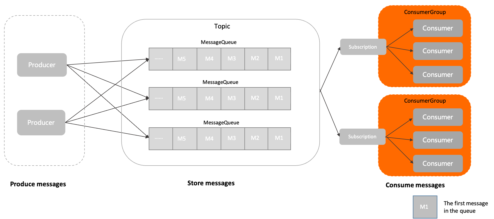

### 一、定义

---

消费者分组是 Apache RocketMQ 系统中承载多个消费行为一致的消费者的负载均衡分组。

和消费者不同，消费者分组并不是运行实体，而是一个逻辑资源。在 Apache RocketMQ 中，通过消费者分组内初始化多个消费者实现消费性能的水平扩展以及高可用容灾。

在消费者分组中，统一定义以下消费行为，同一分组下的多个消费者将按照分组内统一的消费行为和负载均衡策略消费消息。

- **订阅关系**：Apache RocketMQ 以消费者分组的粒度管理订阅关系，实现订阅关系的管理和追溯。
- **投递顺序性**：Apache RocketMQ 的服务端将消息投递给消费者消费时，支持顺序投递和并发投递，投递方式在消费者分组中统一配置。
- **消费重试策略**： 消费者消费消息失败时的重试策略，包括重试次数、死信队列设置等。

### 二、模型关系

---

1. 消息由生产者初始化并发送到Apache RocketMQ 服务端。
2. 消息按照到达Apache RocketMQ 服务端的顺序存储到主题的指定队列中。
3. 消费者按照指定的订阅关系从Apache RocketMQ 服务端中获取消息并消费。

### 二、内部属性

---

#### 2.1 消费者分组名称

消费者分组的名称，用于区分不同的消费者分组。集群内全局唯一。

- 取值：消费者分组由用户设置并创建。

#### 2.2 投递顺序性

消费者消费消息时，Apache RocketMQ 向消费者客户端投递消息的顺序。

根据不同的消费场景，Apache RocketMQ 提供顺序投递和并发投递两种方式。

- 取值：默认投递方式为并发投递。

#### 2.3 消费重试策略

消费者消费消息失败时，系统的重试策略。消费者消费消息失败时，系统会按照重试策略，将指定消息投递给消费者重新消费。

- 取值：重试策略包括：
  - 最大重试次数：表示消息可以重新被投递的最大次数，超过最大重试次数还没被成功消费，消息将被投递至死信队列或丢弃。
  - 重试间隔：Apache RocketMQ 服务端重新投递消息的间隔时间。 最大重试次数和重试间隔的取值范围及默认值。
- 约束：重试间隔仅在PushConsumer消费类型下有效。

### 三、行为约束

---

费者的管理通过消费者分组实现，同一分组内的消费者共同分摊消息进行消费。因此，为了保证分组内消息的正常负载和消费，

Apache RocketMQ 要求同一分组下的所有消费者以下消费行为保持一致：

- **投递顺序**
- **消费重试策略**