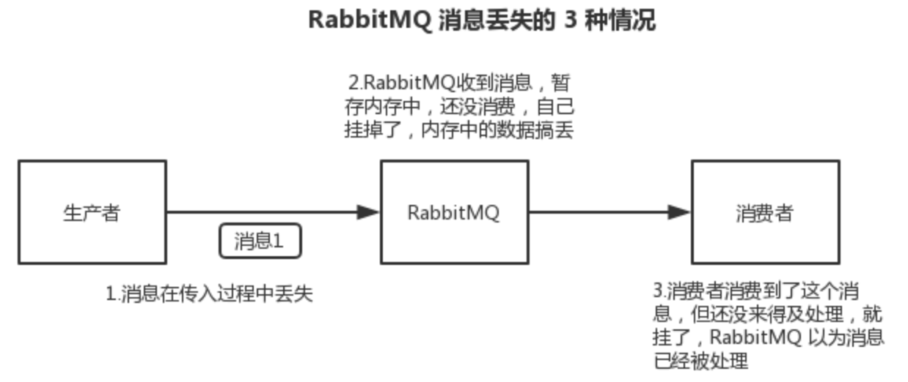
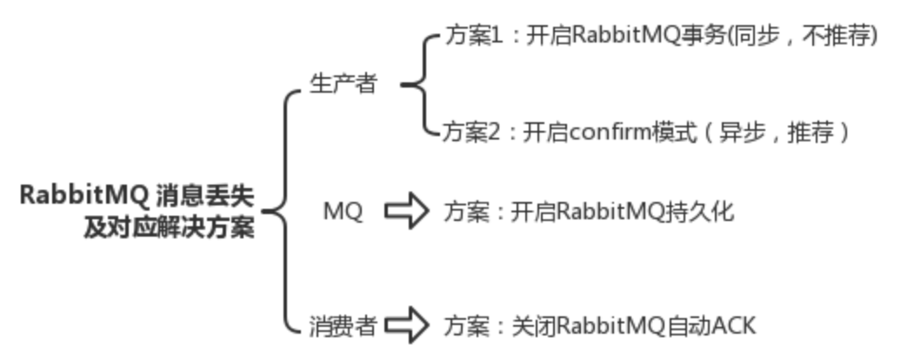

### 一、RabbitMQ

---



#### 1.1 生产者弄丢数据

生产者将数据发送到 RabbitMQ 的时候，可能数据就在半路给搞丢了，因为网络问题啥的，都有可能。

此时可以选择用 RabbitMQ 提供的事务功能，就是生产者**发送数据之前**开启 RabbitMQ 事务 `channel.txSelect()`，然后发送消息，如果消息没有成功被 RabbitMQ 接收到，那么生产者会收到异常报错，此时就可以回滚事务 `channel.txRollback()`，然后重试发送消息；如果收到了消息，那么可以提交事务 `channel.txCommit()`。

```java
try {
    // 通过工厂创建连接
    connection = factory.newConnection();
    // 获取通道
    channel = connection.createChannel();
    // 开启事务
    channel.txSelect();

    // 这里发送消息
    channel.basicPublish(exchange, routingKey, MessageProperties.PERSISTENT_TEXT_PLAIN, msg.getBytes());

    // 模拟出现异常
    int result = 1 / 0;

    // 提交事务
    channel.txCommit();
} catch (IOException | TimeoutException e) {
    // 捕捉异常，回滚事务
    channel.txRollback();
}
```

但是问题是，RabbitMQ 事务机制（同步）一搞，基本上**吞吐量会下来**，因为**太耗性能**。

所以一般来说，如果要确保写 RabbitMQ 的消息别丢，可以开启 `confirm` 模式，在生产者那里设置开启 `confirm` 模式之后，你每次写的消息都会分配一个唯一的 id，然后如果写入了 RabbitMQ 中，RabbitMQ 会给你回传一个 `ack` 消息，告诉你说这个消息 ok 了。如果 RabbitMQ 没能处理这个消息，会回调你的一个 `nack` 接口，告诉你这个消息接收失败，可以重试。而且可以结合这个机制自己在内存里维护每个消息 id 的状态，如果超过一定时间还没接收到这个消息的回调，那么可以重发。

所以一般在生产者这块**避免数据丢失**，都是用 `confirm` 机制的。

> 已经在 transaction 事务模式的 channel 是不能再设置成 confirm 模式的，即这两种模式是不能共存的。

客户端实现生产者 confirm 有 3 种方式：

1. **普通 confirm 模式**：每发一条消息后，调用 `waitForConfirms()` 方法，等待服务器端 confirm，如果服务端返回 false 或者在一段时间内都没返回，客户端可以进行消息重发。

   ```java
   channel.basicPublish(ConfirmConfig.exchangeName, ConfirmConfig.routingKey, MessageProperties.PERSISTENT_TEXT_PLAIN, ConfirmConfig.msg_10B.getBytes());
   if (!channel.waitForConfirms()) {
       // 消息发送失败
       // ...
   }
   ```

2. **批量 confirm 模式**：每发送一批消息后，调用 `waitForConfirms()` 方法，等待服务端 confirm。

   ```java
   channel.confirmSelect();
   for (int i = 0; i < batchCount; ++i) {
       channel.basicPublish(ConfirmConfig.exchangeName, ConfirmConfig.routingKey, MessageProperties.PERSISTENT_TEXT_PLAIN, ConfirmConfig.msg_10B.getBytes());
   }
   if (!channel.waitForConfirms()) {
       // 消息发送失败
       // ...
   }
   ```

3. **异步 confirm 模式**：提供一个回调方法，服务端 confirm 了一条或者多条消息后客户端会回调这个方法。

   ```java
   SortedSet<Long> confirmSet = Collections.synchronizedSortedSet(new TreeSet<Long>());
   channel.confirmSelect();
   channel.addConfirmListener(new ConfirmListener() {
       public void handleAck(long deliveryTag, boolean multiple) throws IOException {
           if (multiple) {
               confirmSet.headSet(deliveryTag + 1).clear();
           } else {
               confirmSet.remove(deliveryTag);
           }
       }
   
       public void handleNack(long deliveryTag, boolean multiple) throws IOException {
           System.out.println("Nack, SeqNo: " + deliveryTag + ", multiple: " + multiple);
           if (multiple) {
               confirmSet.headSet(deliveryTag + 1).clear();
           } else {
               confirmSet.remove(deliveryTag);
           }
       }
   });
   
   while (true) {
       long nextSeqNo = channel.getNextPublishSeqNo();
       channel.basicPublish(ConfirmConfig.exchangeName, ConfirmConfig.routingKey, MessageProperties.PERSISTENT_TEXT_PLAIN, ConfirmConfig.msg_10B.getBytes());
       confirmSet.add(nextSeqNo);
   }

#### 1.2 RabbitMQ 弄丢数据

设置持久化有**两个步骤**：

- **创建 queue 的时候将其设置为持久化**。这样就可以保证 RabbitMQ 持久化 queue 的元数据，但是它是不会持久化 queue 里的数据的。
- 发送消息的时候将消息的 `deliveryMode` 设置为 2。就是将消息设置为持久化的，此时 RabbitMQ 就会将消息持久化到磁盘上去。

必须要同时设置这两个持久化才行，RabbitMQ 哪怕是挂了，再次重启，也会从磁盘上重启恢复 queue，恢复这个 queue 里的数据。

注意，哪怕是你给 RabbitMQ 开启了持久化机制，也有一种可能，就是这个消息写到了 RabbitMQ 中，但是还没来得及持久化到磁盘上，结果很不巧，此时 RabbitMQ 挂了，就会导致内存里的一点点数据丢失。

#### 1.3 消费端弄丢了数据

RabbitMQ 如果丢失了数据，主要是因为你消费的时候，**刚消费到，还没处理，结果进程挂了**，比如重启了，那么就尴尬了，RabbitMQ 认为你都消费了，这数据就丢了。

这个时候得用 RabbitMQ 提供的 `ack机制` ，简单来说，就是你必须关闭 RabbitMQ 的 `自动ack` ，可以通过一个 api 来调用，然后每次代码里确保处理完的时候，再在程序里 `ack` 一把。这样的话，如果你还没处理完，不就没有 `ack` 了？那 RabbitMQ 就认为你还没处理完，这个时候 RabbitMQ 会把这个消费分配给别的 consumer 去处理，消息是不会丢的。

>为了保证消息从队列中可靠地到达消费者，RabbitMQ 提供了消息确认机制。**消费者在声明队列时，可以指定 noAck 参数，当 noAck=false，RabbitMQ 会等待消费者显式发回 ack 信号后，才从内存（和磁盘，如果是持久化消息）中移去消息**。否则，一旦消息被消费者消费，RabbitMQ 会在队列中立即删除它。




### 二、Kafka

---

#### 2.1 消费端弄丢了数据

唯一可能导致消费者弄丢数据的情况，就是消费到了这个消息，然后消费者那边**自动提交了 offset**，让 Kafka 以为你已经消费好了这个消息，但其实刚准备处理这个消息，此时服务挂了，这条消息就丢了。

Kafka 会自动提交 offset，那么只要**关闭自动提交** offset，在处理完之后自己手动提交 offset，就可以保证数据不会丢。但是此时确实还是**可能会有重复消费**，比如你刚处理完，还没提交 offset，结果自己挂了，此时肯定会重复消费一次，自己保证幂等性就好了。

生产环境碰到的一个问题，就是 Kafka 消费者消费到了数据之后是写到一个内存的 queue 里先缓冲一下，结果有的时候，你刚把消息写入内存 queue，然后消费者会自动提交 offset。然后此时我们重启了系统，就会导致内存 queue 里还没来得及处理的数据就丢失了。

#### 2.2 Kafka 弄丢了数据

比较常见的一个场景，就是 Kafka 某个 broker 宕机，然后重新选举 partition 的 leader。要是此时其他的 follower 刚好还有些数据没有同步，此时 leader 挂了，然后选举某个 follower 成 leader 之后，不就少了一些数据？这就丢了一些数据啊。

所以此时一般是要求起码设置如下 4 个参数：

- 给 topic 设置 `replication.factor` 参数：这个值必须大于 1，要求每个 partition 必须有至少 2 个副本。
- 在 Kafka 服务端设置 `min.insync.replicas` 参数：这个值必须大于 1，这个是要求一个 leader 至少感知到有至少一个 follower 还跟自己保持联系，没掉队，这样才能确保 leader 挂了还有一个 follower 吧。
- 在 producer 端设置 `acks=all` ：这个是要求每条数据，必须是**写入所有 replica 之后，才能认为是写成功了**。
- 在 producer 端设置 `retries=MAX` （很大很大很大的一个值，无限次重试的意思）：这个是**要求一旦写入失败，就无限重试**，卡在这里了。

生产环境按照上述要求配置之后，至少在 Kafka broker 端就可以保证在 leader 所在 broker 发生故障，进行 leader 切换时，数据不会丢失。

#### 2.3 生产者会不会弄丢数据

如果按照上述的思路设置了 `acks=all`，一定不会丢，要求是，你的 leader 接收到消息，所有的 follower 都同步到了消息之后，才认为本次写成功了。如果没满足这个条件。生产者会自动不断的重试，重试无限次。


### 三、RocketMQ

---

#### 3.1 消息丢失的场景

1. 生产者发送消息到 MQ 有可能丢失消息
2. MQ 收到消息后写入硬盘可能丢失消息
3. 消息写入硬盘后，硬盘坏了丢失消息
4. 消费者消费 MQ 也可能丢失消息
5. 整个 MQ 节点挂了丢失消息

#### 3.2 生产者发送消息时如何保证不丢失

解决发送时消息丢失的问题可以采用 RocketMQ 自带的**事务消息**机制。

事务消息原理：首先生产者会发送一个**half 消息**(对原始消息的封装)，该消息对消费者不可见，MQ 通过 ACK 机制返回消息接受状态， 生产者执行本地事务并且返回给 MQ 一个状态(Commit、RollBack 等)，如果是 Commit 的话 MQ 就会把消息给到下游， RollBack 的话就会丢弃该消息，状态如果为 UnKnow 的话会过一段时间回查本地事务状态，默认回查 15 次，一直是 UnKnow 状态的话就会丢弃此消息。

为什么先发一个 half 消息，作用就是先判断下 MQ 有没有问题，服务正不正常。

#### 3.3 MQ 收到消息后写入硬盘如何保证不丢失

数据存盘绕过缓存，改为同步刷盘，这一步需要修改 Broker 的配置文件，将 flushDiskType 改为 SYNC_FLUSH 同步刷盘策略，默认的是 ASYNC_FLUSH 异步刷盘，一旦同步刷盘返回成功，那么就一定保证消息已经持久化到磁盘中了。

#### 3.4 消息写入硬盘后，硬盘坏了如何保证不丢失

为了保证磁盘损坏导致丢失数据，RocketMQ 采用主从机构，集群部署，Leader 中的数据在多个 Follower 中都存有备份，防止单点故障导致数据丢失。

Master 节点挂了怎么办？Master 节点挂了之后 DLedger 登场：

- 接管 MQ 的 commitLog。
- 选举从节点。
- 文件复制 uncommited 状态 多半从节点收到之后改为 commited。

#### 3.5 消费者消费 MQ 如何保证不丢失

1. 如果是网络问题导致的消费失败可以进行重试机制，默认每条消息重试 16 次。
2. 多线程异步消费失败，MQ 认为已经消费成功但是实际上对于业务逻辑来说消息是没有落地的，解决方案就是按照 mq 官方推荐的先执行本地事务再返回成功状态。

#### 3.6 整个 MQ 节点挂了如何保证不丢失

这种极端情况可以消息发送失败之后先存入本地，例如放到缓存中，另外启动一个线程扫描缓存的消息去重试发送。