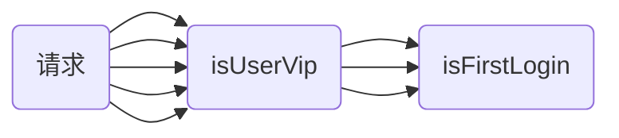
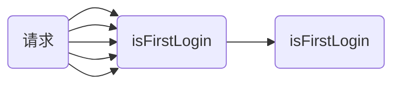
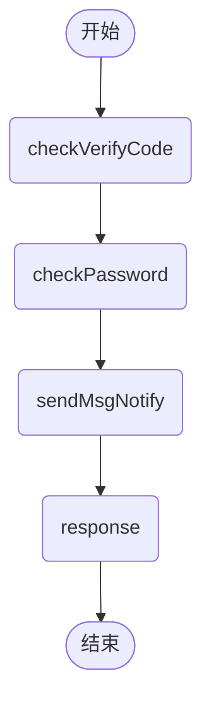
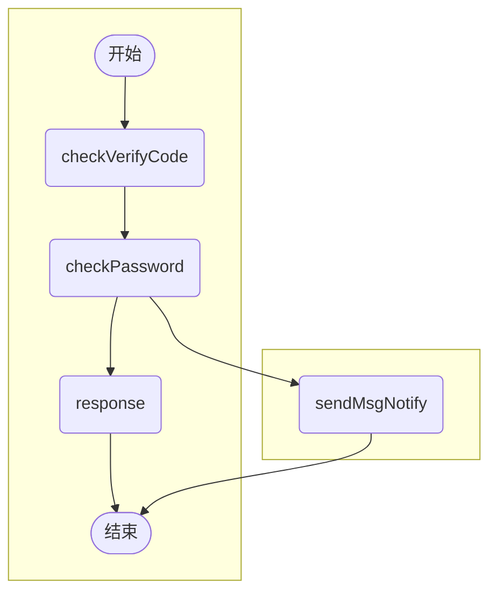

### 复杂的if逻辑条件，可以调整顺序，让程序更高效

---

#### 1.反例

如果用户是会员，并且第一次登陆时，需要发一条通知的短信。

```java
if(isUserVip && isFirstLogin){
  sendMsgNotify();
}
```

假设总共有5个请求进来，isUserVip通过的有3个请求，isFirstLogin通过的有1个请求。那么以上代码，isUserVip执行的次数为5次，isFirstLogin执行的次数也是3次，如下：



#### 2.正例

如果调整下isUserVip和isFirstLogin的顺序呢？

```java
if(isFirstLogin && isUserVip ){
  sendMsg();
}
```

isFirstLogin执行的次数是5次，isUserVip执行的次数是1次，如下：



如果你的isFirstLogin，判断逻辑只是select count 一下数据库表，isUserVip也是select count 一下数据库表的话，显然，把isFirstLogin放在前面更高效。


### 拒绝创建不必要的对象

---

如果变量，后面的逻辑判断，一定会被赋值；或者说，只是一个字符串变量，直接初始化字符串常量就可以了，没有必要愣是要new String()。

#### 1.反例

```java
String s = new String ("chance");
```

#### 2.正例

```java
String s = "chance";
```


### 初始化集合时，指定容量

假设需要map存储的元素个数是15个左右，最优写法如下：

```java
// initialCapacity = 15/0.75+1=21
Map map = new HashMap(21);

// 又因为hashMap的容量跟2的幂有关，所以可以取32的容量
Map map = new HashMap(32);
```


### catch异常，需要打印出具体的exception，方便定位问题

---

#### 1.反例

```java
try{
  // do something
}catch(Exception e){
  log.info("程序异常");
}
```

#### 2.正例

```java
try{
  // do something
}catch(Exception e){
  //把exception打印出来
  log.info("程序异常：",e);
}
```


### 日志打印时对象没有覆盖Object的toString的方法，直接把类名打印出来

---

```java
publick Response dealWithRequest(Request request){
   log.info("请求参数是：".request.toString)
}

// 输出：请求参数是：local.Request@49476842
```

所以一般对象(尤其作为传参的对象），覆盖重写toString()方法。

```java
class Request {

    private String age;

    private String name;

    @Override
    public String toString() {
        return "Request{" +
                "age='" + age + '\'' +
                ", name='" + name + '\'' +
                '}';
    }
}
```


### 一个方法拒绝过长的参数列表

---

假设有这么一个公有方法，形参有四个。

```
public void getUserInfo（String name,String age,String sex,String mobile){
  // do something ...
}
```

如果现在需要多传一个version参数进来，并且你的公有方法是类似dubbo这种对外提供的接口的话，那么你的接口是不是需要兼容老版本？

```
public void getUserInfo（String name,String age,String sex,String mobile){
  // do something ...
}

/**
 * 新接口调这里
 */
public void getNewUserInfo（String name,String age,String sex,String mobile，String version){
  // do something ...
}
```

所以呢，一般一个方法的参数，一般不宜过长。过长的参数列表，不仅看起来不优雅，并且接口升级时，可能还要考虑新老版本兼容。如果参数实在是多怎么办呢？可以用个DTO对象包装一下这些参数。

```
public void getUserInfo（UserInfoParamDTO userInfoParamDTO){
  // do something ...
}

class UserInfoParamDTO{
  private String name;
  private String age; 
  private String sex;
  private String mobile;
}
```

用个DTO对象包装一下，即使后面有参数变动，也可以不用动对外接口。


### 使用缓冲流，减少IO操作

---

#### 1.反例

```java
public class MainTest {
    public static void main(String[] args) throws FileNotFoundException {
        long begin = System.currentTimeMillis();
        try (FileInputStream input = new FileInputStream("C:/456.png");
             FileOutputStream output = new FileOutputStream("C:/789.png")) {
            byte[] bytes = new byte[1024];
            int i;
            while ((i = input.read(bytes)) != -1) {
                output.write(bytes,0,i);
            }
        } catch (IOException e) {
            log.error("复制文件发生异常",e);
        }
        log.info("常规流读写，总共耗时ms："+(System.currentTimeMillis() - begin));
    }
}
```

运行结果：

常规流读写，总共耗时ms:52。

使用`FileInputStream`、`FileOutputStream`实现文件读写功能，是没有什么问题的。但是呢，可以使用缓冲流`BufferedReader`、`BufferedWriter`、`BufferedInputStream`、`BufferedOutputStream`等，减少IO次数，提高读写效率。

>如果是不带缓冲的流，读取到一个字节或者字符的，就会直接输出数据了。而带缓冲的流，读取到一个字节或者字符时，先不输出，而是等达到缓冲区的最大容量，才一次性输出。

#### 2.正例

```java
public class MainTest {
  public static void main(String[] args) throws FileNotFoundException {
      long begin = System.currentTimeMillis();
      try (BufferedInputStream bufferedInputStream = new BufferedInputStream(new FileInputStream("C:/456.png"));
      BufferedOutputStream  bufferedOutputStream = new BufferedOutputStream(new FileOutputStream("C:/789.png"))) {
          byte[] bytes = new byte[1024];
          int i;
          while ((i = bufferedInputStream.read(bytes)) != -1) {
              bufferedOutputStream.write(bytes,0,i);
          }
      } catch (IOException e) {
          log.error("复制文件发生异常",e);
      }
      log.info("总共耗时ms"+(System.currentTimeMillis() - begin));
  }
}
```


### 优化程序逻辑，比如前面已经查到的数据，在后面的方法也用到的话，是可以往下传参的，减少方法调用/查表

---

#### 1.反例

```java
public Response dealRequest(Request request){
  UserInfo userInfo = userInfoDao.selectUserByUserId(request.getUserId);
   if(Objects.isNull(request)){
     return ;
   }
  
  insertUserVip(request.getUserId);
  
}

private int insertUserVip（String userId）{
    //又查了一次 
    UserInfo userInfo = userInfoDao.selectUserByUserId(request.getUserId);
    //插入用户vip流水
    insertUserVipFlow(userInfo);
    ....
}
```

很显然，以上程序代码，已经查到 userInfo，然后又把userId传下去，又多查了一次。实际上，可以把userInfo传下去的，这样可以省去一次查表操作，程序更高效。

#### 2.正例

```java
public Response dealRequest(Request request){
  UserInfo userInfo = userInfoDao.selectUserByUserId(request.getUserId);
  if(Objects.isNull(request)){
     return ;
   }

  insertUserVip(userInfo);
}

private int insertUserVip（UserInfo userInfo）{
    //插入用户vip流水
    insertUserVipFlow(userInfo);
    ....
}
```


### 不要为了方便直接在代码中用0,1等魔法值，用enum枚举代替

---

#### 1.反例

```java
if("0".equals(userInfo.getVipFlag)){
  //非会员，提示去开通会员
  tipOpenVip(userInfo);
}else if("1".equals(userInfo.getVipFlag)){
  //会员，加勋章返回
  addMedal（userInfo）;
}
```

#### 2.正例

```java
public enum UserVipEnum {

  NOT_VIP("0","非会员"),
  VIP("1","会员"), ;

  private String code; 
  private String desc;

  UserVipEnum(String code, String desc) {
      this.code = code;
      this.desc = desc;
  }
}
```

```java
if(UserVipEnum.NOT_VIP.getCode.equals(userInfo.getVipFlag)){
  //非会员，提示去开通会员
  tipOpenVip(userInfo);
}else if(UserVipEnum.VIP.getCode.equals(userInfo.getVipFlag)){
  //会员，加勋章返回
  addMedal（userInfo）;
}
```


### 当成员变量值不会改变时，优先定义为静态常量

---

#### 1.反例

```java
public class Task {
  private final long timeout = 10L;
  ...
}
```

#### 2.正例

```java
public class Task {
  private static final long TIMEOUT = 10L;
  ...
}
```

>因为如果定义为static，即类静态常量，在每个实例对象中，它只有一份副本。如果是成员变量，每个实例对象中，都各有一份副本。显然，如果这个变量不会变的话，定义为静态常量更好一些。


### 注意检验空指针，不要轻易相信业务，说正常逻辑某个参数不可能为空

---

NullPointerException 在我们日常开发中非常常见，我们代码开发过程中，一定要对空指针保持灵敏的嗅觉。

主要有这几类空指针问题：

- 包装类型的空指针问题
- 级联调用的空指针问题
- Equals方法左边的空指针问题
- ConcurrentHashMap 类似容器不支持 k-v为 null。
- 集合，数组直接获取元素
- 对象直接获取属性

#### 1.反例

```java
public class NullPointTest {
  public static void main(String[] args) {
      String s = null;
      if (s.equals("666")) { //s可能为空，会导致空指针问题
          ...
      }
  }
}
```


### 捕获到的异常，不能忽略它，至少打点日志

---

#### 1.反例

```java
public static void testIgnoreException() throws Exception {
  try {       
      // 搞事情
  } catch (Exception e) {    
      //捕获了异常，啥事情不做，日志也不打？？
  }
}
```

#### 2.正例

```java
public static void testIgnoreException() {
  try {
      // 搞事情
  } catch (Exception e) {     
      log.error("异常了",e); 
  }
}
```


### 采用Lambda表达式替换内部匿名类，使代码更优雅

---

JDK8出现了新特性-Lambda表达式。Lambda表达式不仅比匿名内部类更加优雅，并且在大多数虚拟机中，都是采用invokeDynamic指令实现，相对于匿名内部类，效率也更高。

#### 1.反例

```java
public void sortUserInfoList(List<UserInfo> userInfoList){
  userInfoList.sort(new Comparator<UserInfo>() {
    @Override
    public int compare(UserInfo user1, UserInfo user2) {
      Long userId1 = user1.getUserId();
      Long userId2 = user2.getUserId();
      return userId1.compareTo(userId2);
    }
  });
}
```

#### 2.正例

```java
public void sortUserInfoList(List<UserInfo> userInfoList){
  userInfoList.sort((user1, user2) -> {
    Long userId1 = user1.getUserId();
    Long userId2 = user2.getUserId();
    return userId1.compareTo(userId2);
  });
}
```


### 通知类（如发邮件，有短信）的代码，建议异步处理

---

假设业务流程这样：需要在用户登陆时，添加个短信通知它的粉丝。很容易想到的实现流程如下：



假设提供sendMsgNotify服务的系统挂了，或者调用sendMsgNotify失败了，那么用户登陆就失败了。。。一个通知功能导致了登陆主流程不可用，明显的捡了芝麻丢西瓜。那么有没有鱼熊掌兼得的方法呢？有的，给发短信接口捕获异常处理，或者另开线程异步处理，如下：



因此，添加通知类等不是非主要，可降级的接口时，应该静下心来考虑是否会影响主要流程，思考怎么处理最好。


### 处理java日期时，当心YYYY格式设置的时间

---

#### 1.反例

```java
Calendar calendar = Calendar.getInstance();
calendar.set(2019, Calendar.DECEMBER, 31);

Date testDate = calendar.getTime();

SimpleDateFormat dtf = new SimpleDateFormat("YYYY-MM-dd");
System.out.println("2019-12-31 转 YYYY-MM-dd 格式后 " + dtf.format(testDate));
```

运行结果：

```
2019-12-31 转 YYYY-MM-dd 格式后 2020-12-31
```

>YYYY是基于周来计算年的，它指向当天所在周属于的年份，一周从周日开始算起，周六结束，只要本周跨年，那么这一周就算下一年的了。正确是使用yyyy格式。


### 如果一个类确定不会被继承，不会拿来搞AOP骚操作，可以指定final修饰符，如用final修饰一个工具类

---

#### 1.正例

```java
public final class Tools {
  public static void testFinal(){
      System.out.println("工具类方法");
  }
}
```

一个类指定了final修饰符，它不会被继承了，并且其所有方法都是final的了。Java编译器会找机会内联所有的final方法，提升了Java运行效率。


### static静态变量不要依赖spring实例化变量，可能会导致初始化出错

---

静态变量依赖于spring容器的bean。

```java
private static SmsService smsService = SpringContextUtils.getBean(SmsService.class);
```

这个静态的smsService有可能获取不到的，因为类加载顺序不是确定的，而以上的代码，静态的smsService初始化强制依赖spring容器的实例了。正确的写法可以这样，如下：

```java
private static SmsService  smsService =null;
 
//使用到的时候采取获取
public static SmsService getSmsService(){
  if(smsService==null){
    smsService = SpringContextUtils.getBean(SmsService.class);
  }
  return smsService;
}
```


### 与类成员变量无关的方法，应当声明成静态方法

---

有些方法，与实例成员变量无关，就可以声明为静态方法。这一点，工具类用得很多。

#### 1.反例

```java
/**
 * BigDecimal的工具类
 */
public class BigDecimalUtils {

  public  BigDecimal ifNullSetZERO(BigDecimal in) {
    return in != null ？ in : BigDecimal.ZERO;
  }

  public BigDecimal sum(BigDecimal ...in){
    BigDecimal result = BigDecimal.ZERO;
    for (int i = 0; i < in.length; i++){
      result = result.add(ifNullSetZERO(in[i]));
    }
    return result;
  }
}
```

因为BigDecimalUtils工具类的方法都没有static修饰，所以，你要使用的时候，每次都要new一下啦,那不就耗资源去**反复创建对象**。

```java
BigDecimalUtils bigDecimalUtils = new BigDecimalUtils（）;
bigDecimalUtils.sum(a,b);
```

所以可以声明成静态变量，使用的方法，直接类名.方法调用即可，正例如下：

```java
public class BigDecimalUtils {

  public static  BigDecimal ifNullSetZERO(BigDecimal in) {
    return in != null ？ in : BigDecimal.ZERO;
  }

  public static BigDecimal sum(BigDecimal ...in){
    BigDecimal result = BigDecimal.ZERO;
    for (int i = 0; i < in.length; i++){
      result = result.add(ifNullSetZERO(in[i]));
    }
    return result;
  }
}
```


### 不要用一个Exception捕捉所有可能得异常

---

#### 1.反例

```java
public void test(){
  try{
    //…抛出 IOException 的代码调用
    //…抛出 SQLException 的代码调用
  }catch(Exception e){
    //用基类 Exception 捕捉的所有可能的异常，如果多个层次都这样捕捉，会丢失原始异常的有效信息哦
    log.info(“Exception in test,exception:{}”, e);
  }
}
```

#### 2.正例

```java
public void test(){
  try{
    //…抛出 IOException 的代码调用
    //…抛出 SQLException 的代码调用
  }catch(IOException e){
    //仅仅捕捉 IOException
    log.info(“IOException in test,exception:{}”, e);
  }catch(SQLException e){
    //仅仅捕捉 SQLException
    log.info(“SQLException in test,exception:{}”, e);
  }
}
```


### 函数不要过度封装

---

#### 1.反例

```java
public void test(){
  try{
    //…抛出 IOException 的代码调用
    //…抛出 SQLException 的代码调用
  }catch(IOException e){
    //仅仅捕捉 IOException
    log.info(“IOException in test,exception:{}”, e);
  }catch(SQLException e){
    //仅仅捕捉 SQLException
    log.info(“SQLException in test,exception:{}”, e);
  }
}
```

#### 2.正例

```java
boolean isVip = Boolean.TRUE.equals(user.getUserVip());
```

函数不要过度封装，把意思表达清楚即可。并且，**方法调用会引起入栈和出栈，导致消耗更多的CPU和内存，过度封装，会损耗性能！**


### 如果变量的初值一定会被覆盖，就没有必要给变量赋初值

---

#### 1.反例

```java
List<UserInfo> userList = new ArrayList<>();
if (isAll) {
  userList = userInfoDAO.queryAll();
} else {
  userList = userInfoDAO.queryActive();
}
```

#### 2.正例

```java
List<UserInfo> userList ;
if (isAll) {
  userList = userInfoDAO.queryAll();
} else {
  userList = userInfoDAO.queryActive();
}
```


### 金额数值计算要使用BigDecimal

---

浮点数计算的例子：

```java
public class DoubleTest {
  public static void main(String[] args) {
    System.out.println(0.1+0.2);
    System.out.println(1.0-0.8);
    System.out.println(4.015*100);
    System.out.println(123.3/100);

    double amount1 = 3.15;
    double amount2 = 2.10;
    if (amount1 - amount2 == 1.05){
      System.out.println("OK");
    }
  }
}
```

运行结果：

```
0.30000000000000004
0.19999999999999996
401.49999999999994
1.2329999999999999
```

> 因为计算机是以二进制存储数值的，对于浮点数也是。对于计算机而言，0.1无法精确表达，这就是为什么浮点数会导致精确度缺失的。因此，金额计算，一般都是用BigDecimal 类型。

```java
System.out.println(new BigDecimal(0.1).add(new BigDecimal(0.2)));
//output:0.3000000000000000166533453693773481063544750213623046875
```

其实，使用 BigDecimal 表示和计算浮点数，必须使用字符串的构造方法来初始化 BigDecimal，并且，还要关注BigDecimal的几位小数点，它有八种舍入模式等。


### 注意Arrays.asList的几个坑

---

>基本类型不能作为Arrays.asList方法的参数，否则会被当做一个参数。

```java
public class ArrayAsListTest {
  public static void main(String[] args) {
    int[] array = {1, 2, 3};
    List list = Arrays.asList(array);
    System.out.println(list.size());
  }
}
//运行结果1
```

>Arrays.asList 返回的 List 不支持增删操作。

```java
public class ArrayAsListTest {
  public static void main(String[] args) {
    String[] array = {"1", "2", "3"};
    List list = Arrays.asList(array);
    list.add("5");
    System.out.println(list.size());
  }
}

// 运行结果
//Exception in thread "main" java.lang.UnsupportedOperationException
// at java.util.AbstractList.add(AbstractList.java:148)
// at java.util.AbstractList.add(AbstractList.java:108)
// at object.ArrayAsListTest.main(ArrayAsListTest.java:11)
```

Arrays.asList 返回的 List 并不是我们期望的 java.util.ArrayList，而是 Arrays 的内部类ArrayList。内部类的ArrayList没有实现add方法，而是父类的add方法的实现，会抛出异常。

>使用Arrays.asLis的时候，对原始数组的修改会影响到我们获得的那个List。

```java
public class ArrayAsListTest {
  public static void main(String[] args) {
    String[] arr = {"1", "2", "3"};
    List list = Arrays.asList(arr);
    arr[1] = "4";
    System.out.println("原始数组"+Arrays.toString(arr));
    System.out.println("list数组" + list);
  }
}

//运行结果
//原始数组[1, 4, 3]
//list数组[1, 4, 3]
```


### 尽量使用函数内的基本类型临时变量

---

>- 在方法函数内，基本类型参数以及临时变量，都是保存在栈中的，访问速度比较快。
>- 对象类型的参数和临时变量的引用都保存在栈中，内容都保存在堆中，访问速度较慢。
>- 在类中，任何类型的成员变量都保存在堆（Heap）中，访问速度较慢。

```java
public class AccumulatorUtil {

  private double result = 0.0D;
  //反例
  public void addAllOne( double[] values) {
    for(double value : values) {
        result += value;
    }
  }
  //正例，先在方法内声明一个局部临时变量，累加完后，再赋值给方法外的成员变量
  public void addAl1Two(double[] values) {
    double sum = 0.0D;
    for(double value : values) {
      sum += value;
    }
    result += sum;
  }
}
```


### 数据库一次查询的数量过多，建议分页

---

#### 1.反例

```sql
select user_id,name,age from user_info ;
```

#### 2.正例

```sql
select user_id,name,age from user_info limit #{offset},#{pageSize};
```

>如果偏移量特别大的时候，查询效率就变得低下。可以这种方式优化：
>
>```sql
>-- 方案一 ：返回上次查询的最大记录(偏移量)
>select id，name from user_info where id>10000 limit #{pageSize}.
>
>-- 方案二：order by + 索引
>select id，name from user_info order by id  limit #{offset},#{pageSize}
>
>-- 方案三：在业务允许的情况下限制页数：


### 尽量减少对变量的重复计算

---


