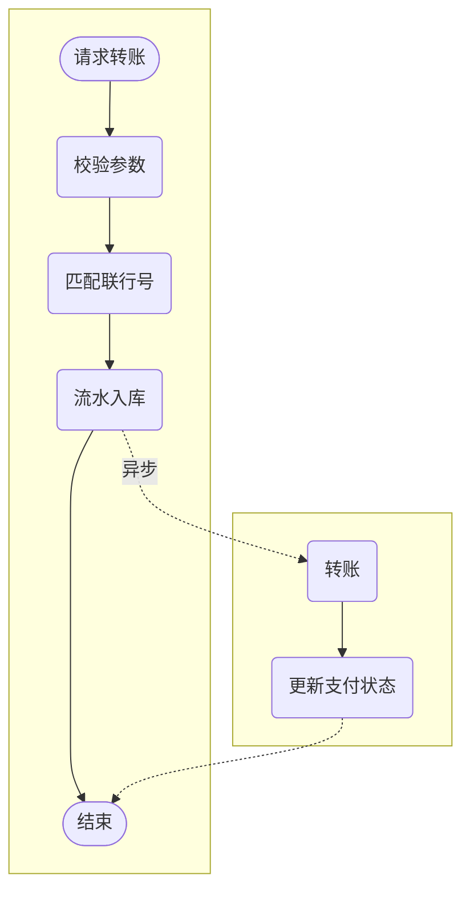
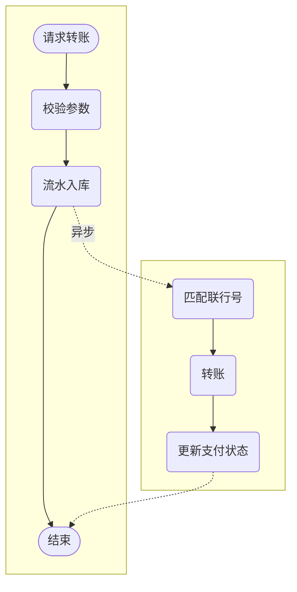
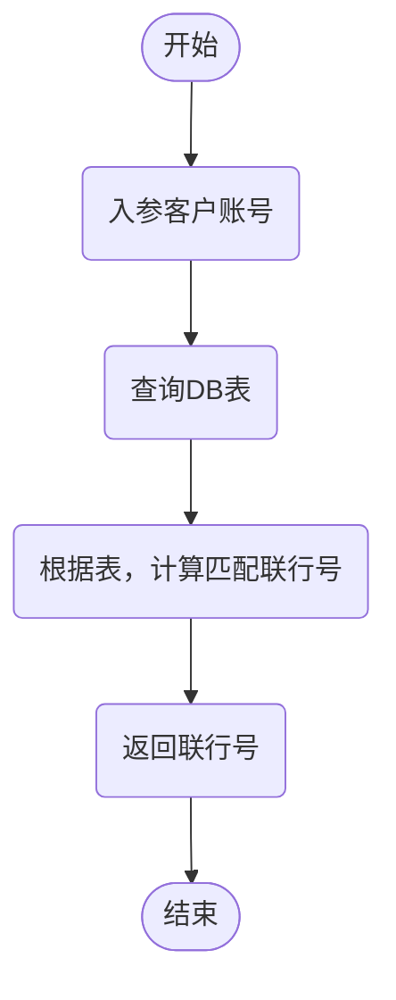
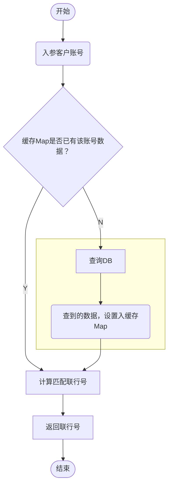
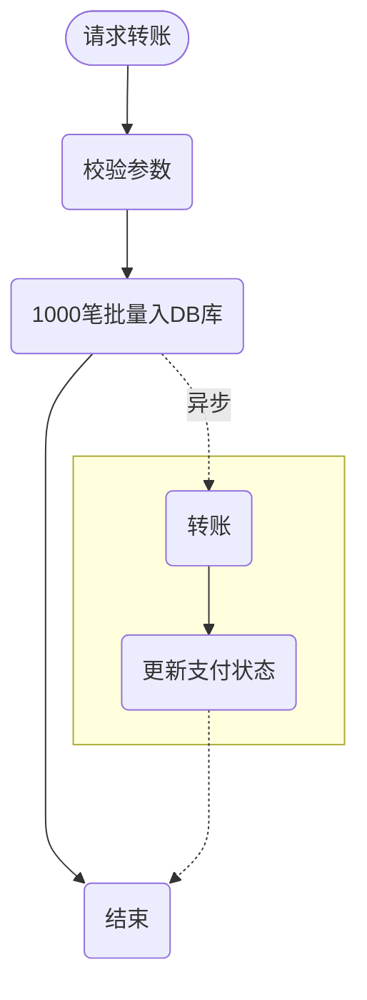
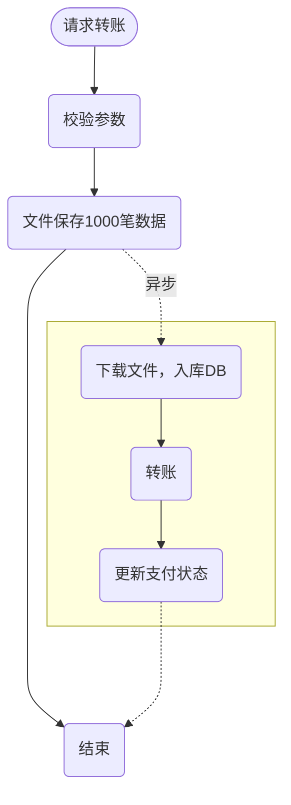

### 一、数据量较大，批量操作数据入库

---

#### 1.1 优化前

```java
// for 循环单笔入库
for (TransDetail detail: list) {
    insert(detail);
}
```

#### 1.2 优化后

```java
// 批量入库,mybatis demo实现
<insert id="insertBatch" parameterType="java.util.List">
insert into trans_detail( id,amount,payer,payee) values
 <foreach collection="list" item="item" index="index" separator=",">(
    #{item.id},	#{item.amount},
    #{item.payer},#{item.payee}
  )
</foreach>
</insert>
```

#### 1.3 性能对比

| 单位（ms） | for循环单笔入库 | 批量入库 |
| :--------- | :-------------- | :------- |
| 500条      | 1432            | 1153     |
| 1000条     | 1876            | 1425     |


### 二、耗时操作考虑异步处理

---

#### 2.1 优化前



#### 2.2 优化后

匹配联行号的操作异步处理。



#### 2.3 解析

-   因为联行号匹配比较耗时，放在异步处理的话，同步联机返回可以省掉这部分时间，大大提升接口性能，并且不会影响到转账主流程功能。
-   除了这个例子，平时类似功能，如用户注册成功后，短信邮件通知，也是可以异步处理的。
-   所以，太耗时的操作，在不影响主流程功能的情况下，可以考虑开子线程异步处理。


### 三、恰当使用缓存

---

在适当的业务场景，恰当地使用缓存，是可以大大提高接口性能的。这里的缓存包括：Redis，JVM本地缓存，memcached，或者Map等。

#### 3.1 优化前



#### 3.2 优化后

恰当使用缓存，代替查询DB表。



#### 3.3 解析

把热点数据放到缓存，不用每次查询都去DB拉取，节省了这部分查SQL的耗时。


### 四、优化程序逻辑、代码

---

比如优化查询次数，优化if逻辑，for循环，重复实例化。


### 五、优化SQL

---

-   加索引
-   避免返回不必要的数据
-   优化sql结构
-   分库分表
-   读写分离


### 六、压缩传输内容

---

压缩传输内容，文件变得更小，因此传输会更快啦。10M带宽，传输10k的报文，一般比传输1M的会快。

如果接口性能不好，然后传输报文比较大的话，这时候是可以考虑压缩文件内容传输的。


### 七、考虑文件/MQ等其他方式暂存数据，异步落地DB

---

#### 7.1 优化前



#### 7.2 优化后

先保存数据到文件，再异步下载下来，插入数据库，如下：



