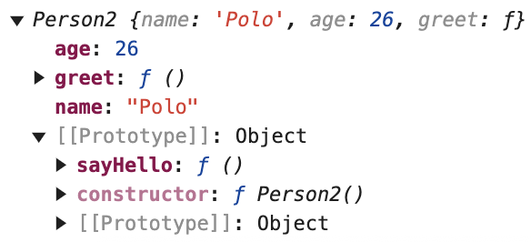

### 一、面向对象编程

---

#### 1.1 创建对象

1. 使用对象字面量：这是最简单和常用的方式，直接通过 `{}` 创建对象。

   ```javascript
   const person = {
       name: "Chance",
       age: 25,
       greet: function () {
           return `Hello, my name is ${this.name} and I am ${this.age} years old.`;
       }
   }
   ```

2. 使用构造函数：通过定义一个构造函数并使用 `new` 关键字来创建对象。

   ```javascript
   function Person2() {
       this.name = "Polo";
       this.age = 26;
       this.greet = function () {
           return `Hello, my name is ${this.name} and I am ${this.age} years old.`;
       }
   }
   const person2 = new Person2();
   person2.greet();
   ```

3. 使用Object.create()方法：通过 `Object.create()` 方法可以基于一个现有的对象创建新对象。

   ```javascript
   const personPrototype = {
       greet: function () {
           console.log(`Hello, my name is ${this.name}`);
       }
   };
   const alice = Object.create(personPrototype);
   alice.name = "Alice";
   alice.age = 25;
   alice.greet();

4. 使用类（ES6+）

   ```javascript
   class Person3 {
       constructor(name, age) {
           this.name = name;
           this.age = age;
       }
   
       greet() {
           console.log(`Hello, my name is ${this.name}`);
       }
   }
   const amy = new Person3("Amy", 27);
   amy.greet();
   ```

5. 工厂函数：通过定义一个返回对象的函数来创建对象。

   ```javascript
   function createPerson(name, age) {
       return {
           name: name,
           age: age,
           greet: function () {
               console.log(`Hello, my name is ${this.name}`);
           }
       };
   }
   const alice = createPerson("Alice", 25);
   alice.greet();
   ```

6. 动态属性添加：可以先创建一个空对象，然后动态地添加属性和方法。

   ```javascript
   const lucy = {};
   lucy.name = "Lucy";
   lucy.age = 25;
   lucy.greet = function () {
       console.log(`Hello, my name is ${this.name}`);
   };
   
   lucy.greet(); 
   ```

#### 1.2 对象的属性操作

- 访问属性：

  - 可以通过点语法（对象.属性名）

  - 括号语法（对象['属性名']）来访问对象的属性。

    ```javascript
    console.log(person.name);
    console.log(person['age']);
    ```

- 添加属性：直接给对象添加新的属性即可。

  ```javascript
  lucy.gender = '男';
  ```

- 删除属性：使用`delete`操作符。

  ```javascript
  delete lucy.age;


### 二、构造函数与原型

---

#### 2.1 构造函数

- 构造函数是一种特殊的函数，用于创建和初始化对象。它的名字通常首字母大写，以区别于普通函数。
- 构造函数内部通过 `this` 关键字来定义对象的属性和方法。
- 每个构造函数都有一个 `prototype` 属性，这个属性是一个对象，**用于共享属性和方法给所有通过该构造函数创建的实例**。

#### 2.2 原型链

- 当试图访问一个对象的属性或方法时，如果对象本身没有这个属性或方法，就会沿着原型链向上查找。
- 原型链的顶端是 `Object.prototype`，所有对象最终都会继承自它。
- 理解原型链对于理解 JavaScript 的继承机制非常重要。

#### 2.3 原型方法的添加

**可以通过构造函数的 prototype 属性来添加方法，这些方法会被所有实例共享。**

```javascript
Person2.prototype.sayHello = function () {
    console.log('Hello');
};
// 调用共享方法
person2.sayHello();
```




### 三、面向对象的三大特性

---

#### 3.1 封装

- 封装是指将对象的属性和方法包装在一个抽象的屏障内，防止外部直接访问和修改对象内部的状态。

- 通过在构造函数内部定义变量和函数，并只提供公共的接口（方法）来操作这些内部成员，可以实现封装。

```javascript
function BankAccount(initialBalance) {
    // 封装的属性
    let balance = initialBalance;
    // 公共接口
    this.getBalance = function () {
        return balance;
    };
    this.deposit = function (amount) {
        if (amount > 0) {
            balance += amount;
        }
    };
    this.withdraw = function (amount) {
        if (amount > 0 && amount <= balance) {
            balance -= amount;
        }
    };
}
const account = new BankAccount(1000);
account.deposit(500);
console.log(account.getBalance());
// 无法直接访问 balance 属性
// console.log(account.balance); // undefined
```

#### 3.2 继承

- JavaScript 中的继承主要是通过原型链来实现的。

- 一个对象可以继承另一个对象的属性和方法，子对象在继承的基础上可以添加自己的属性和方法。

- 继承的实现方式：

  - **借用构造函数（经典继承）** ：在子类的构造函数中调用父类的构造函数，实现对父类属性的继承。

    ```javascript
    function Animal(name) {
        this.name = name;
    }
    Animal.prototype.sayName = function () {
        console.log(this.name);
    }
    function Dog(name, breed) {
        // 借用父类构造函数
        Animal.call(this, name);
        this.breed = breed;
    }
    // 设置原型链
    Dog.prototype = Object.create(Animal.prototype);
    // 修正 constructor 指针
    Dog.prototype.constructor = Dog;
    Dog.prototype.sayBreed = function () {
        console.log(this.breed);
    };
    const dog = new Dog('汪汪', '金毛');
    // 继承父类方法
    dog.sayName();
    // 子类自己的方法
    dog.sayBreed();
    ```

  - **原型式继承（寄生组合式继承）**：通过创建一个中间的过渡原型对象，来继承父类的原型，同时借用父类的构造函数来继承父类的属性。

    ```javascript
    ```

    


