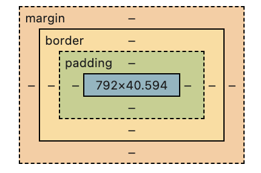

- CSS引入方式
- 选择器与优先级
- 盒模型
- 实战：美化简历页面

### 一、CSS引入方式

---

#### 1.1 行内样式（慎用）

```html
<h1 style="color: blue; font-size: 24px;">标题</h1>
```

#### 1.2 内部样式表

```html
<head>
  <style>
    h1 {
      color: #333;
      margin: 20px 0;
    }
  </style>
</head>
```

#### 1.3 外部样式表（推荐）

```html
<link rel="stylesheet" href="styles.css">
```

#### 1.4 导入方式（不推荐）

```css
@import url('reset.css');
```


### 二、选择器与优先级

---

#### 2.1 基础选择器

```css
/* 元素选择器 */
p { line-height: 1.6; }

/* 类选择器 */
.text-red { color: red; }

/* ID选择器 */
#main-title { font-size: 2em; }

/* 通配符选择器 */
* { box-sizing: border-box; }
```

#### 2.2 组合选择器

```css
/* 后代选择器 */
nav a { text-decoration: none; }

/* 子元素选择器 */
ul > li { list-style: square; }

/* 相邻兄弟选择器 */
h2 + p { margin-top: 0; }

/* 群组选择器 */
h1, h2, h3 { font-family: 'Arial'; }
```

#### 2.3 属性选择器

```css
input[type="text"] { border: 1px solid #ccc; }
a[href^="https"]::after { content: "🔒"; }
```

#### 2.4 优先级计算

**权重等级**（从高到低）：

1. `!important`
2. 行内样式（1000）
3. ID选择器（100）
4. 类/伪类/属性选择器（10）
5. 元素/伪元素选择器（1）

**计算示例**：

```css
#nav .item:hover {} /* 100 + 10 + 10 = 120 */
div#header a.active {} /* 1 + 100 + 1 + 10 = 112 */
```


### 三、盒模型

在 CSS 中，所有的元素都被一个个的“盒子”包围着，理解这些“盒子”的基本原理，是我们使用 CSS 实现准确布局、处理元素排列的关键。

#### 3.1 CSS标准盒模型

假设一个盒子的 CSS 如下：

```css
.box {
  width: 350px;
  height: 150px;
  margin: 10px;
  padding: 25px;
  border: 5px solid black;
}
```

方框*实际*占用的空间宽为 410px（350 + 25 + 25 + 5 + 5），高为 210px（150 + 25 + 25 + 5 + 5）。

>**备注：** 外边距不计入盒子的实际大小——当然，它影响盒子在页面上所占的总空间，但只影响盒子外的空间。盒子的面积止于边框，不会延伸到外边距中。

#### 3.2 CSS替代盒模型

任何宽度都是页面上可见方框的宽度。内容区域的宽度是该宽度减去填充和边框的宽度（见下图）。无需将边框和内边距相加，即可获得盒子的实际大小。

要为某个元素使用替代模型，可对其设置 `box-sizing: border-box`：

```css
.box {
  box-sizing: border-box;
}
```

假设一个盒子的CSS与上例相同：

```css
.box {
  width: 350px;
  inline-size: 350px;
  height: 150px;
  block-size: 150px;
  margin: 10px;
  padding: 25px;
  border: 5px solid black;
}
```

现在，盒子实际占用的空间在行向为350px，在块向为150px。

要在所有元素中使用替代方框模型（这是开发人员的常见选择），请在 `<html>` 元素上设置 `box-sizing` 属性，并将所有其他元素设置为继承该值：

```css
html {
  box-sizing: border-box;
}

*,
*::before,
*::after {
  box-sizing: inherit;
}
```

**盒模型可视化**：



1. 内容区（content）：盒子模型的核心部分，用于显示元素的实际内容，如文本、图片等。你可以通过`width`和`height`属性来定义内容区的大小。
2. 内边距（padding）：内边距是内容区与其边框之间的空间。内边距是透明的，其主要作用是扩展内容区与边框之间的距离，从而为内容提供“呼吸空间”。可以通过`padding`属性设置，它可以分别设置上(`padding-top`)、右(`padding-right`)、下(`padding-bottom`)、左(`padding-left`)的内边距。
3. 边框（border）：边框围绕在内边距之外，是元素的边界线。边框有三个属性可以设置：宽度(`border-width`)、样式(`border-style`)和颜色(`border-color`)。边框不仅限于直线，还可以设置成不同的样式，比如点线、虚线等。
4. 外边距（margin）：外边距位于边框之外，是元素与其他元素之间的空间。外边距同样是透明的，主要用于控制元素之间的间距。`margin`属性可以用来设置元素的外边距，同样支持分别设置上下左右四个方向的值。

#### 3.2 常用调试代码

```css
/* 临时边框调试 */
* {
    outline: 1px solid red !important;
}

/* 背景色辅助 */
.debug {
    background: rgba(255, 0, 0, 0.1);
}
```

#### 3.3 学习资源

- MDN CSS教程：https://developer.mozilla.org/zh-CN/docs/Web/CSS
- CSS Diner选择器练习：https://flukeout.github.io/
- 盒模型可视化工具：https://box-model.com/


### 四、实战：简历美化

```html
<section class="experience">
  <h2>工作经历</h2>
  <div class="job">
    <h3>前端开发工程师 - ABC公司</h3>
    <p class="duration">2020-2023</p>
    <ul class="responsibilities">
      <li>负责核心系统前端架构设计</li>
      <li>主导性能优化项目</li>
    </ul>
  </div>
</section>
```

css美化：

```css
/* 基础重置 */
* {
    margin: 0;
    padding: 0;
    box-sizing: border-box;
}

.experience {
    background: #f8f9fa;
    padding: 2rem;
    margin-bottom: 2rem;
    border-radius: 8px;
    box-shadow: 0 2px 4px rgba(0, 0, 0, 0.1);
}

.job {
    border-left: 3px solid #4a90e2;
    padding-left: 1.5rem;
    margin: 1.5rem 0;
}

.job h3 {
    color: #2c3e50;
    margin-bottom: 0.5rem;
    font-size: 1.25rem;
}

.duration {
    color: #7f8c8d;
    font-size: 0.9rem;
    margin-bottom: 1rem;
}

.responsibilities {
    line-height: 1.6;
    padding: 0.5rem 0;
    border-bottom: 1px dashed #eee;
}

.responsibilities li:last-child {
    border-bottom: none;
}

/* 悬停效果 */
.job:hover {
    transform: translateX(10px);
    transition: transform 0.3s ease;
}
```
