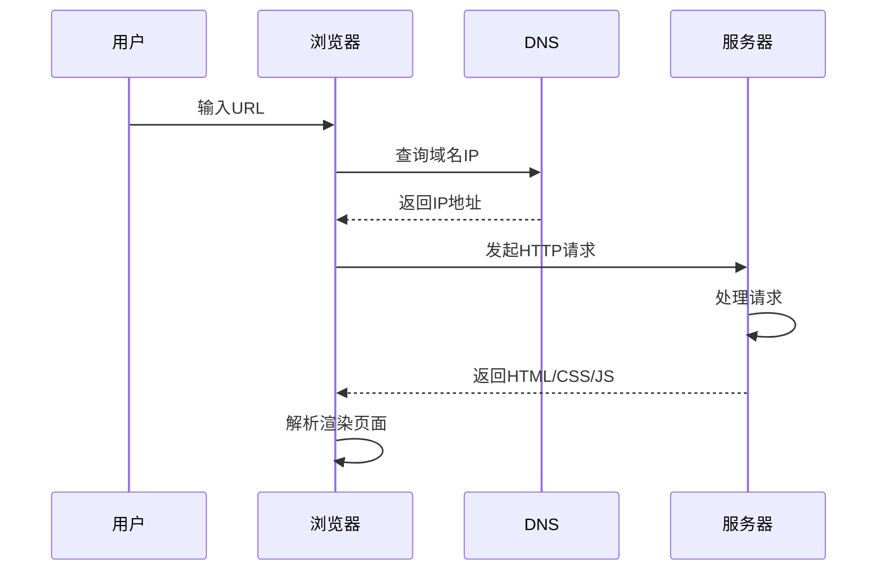

### 学习内容

- 了解Web工作原理
- HTML文档结构
- 常用标签：标题、段落、列表、图片、链接
- 实战：创建个人简历页面

### 一、Web工作原理

---



**Web工作原理**是理解前端开发的基础，它描述了用户通过浏览器访问网站时，数据如何在全球网络中传输和呈现。以下是核心要点解析。

#### 1.1 基础架构模型（客户端-服务器模型）

1. **客户端（Client）**
   - 用户使用的设备（如浏览器、手机APP）
   - 发起请求（Request）：例如输入`https://www.google.com`
   - 负责渲染和展示内容
2. **服务器（Server）**
   - 存储网站文件和数据的高性能计算机
   - 处理请求并返回响应（Response）
   - 常见服务器类型：Web服务器、数据库服务器

#### 1.2 关键工作流程（以访问网页为例）

1. 输入URL
   用户在浏览器地址栏输入网址（如 `https://www.example.com`）

2. DNS解析

   - 浏览器向DNS服务器查询域名对应的IP地址
   - 过程：浏览器缓存 → 系统缓存 → 路由器缓存 → ISP DNS服务器 → 递归查询
   - 最终获取目标服务器IP（如 `93.184.216.34`）

3. 建立TCP连接

   - 浏览器通过IP地址与服务器建立**TCP连接**（传输控制协议），确保可靠传输。

   - **三次握手**：
     1. 客户端发送 `SYN（Synchronize，同步）` 包。
     2. 服务器返回 `SYN-ACK（Synchronize Acknowledge，同步确认）` 包。
     3. 客户端确认 `ACK（Acknowledge，确认）` 包，连接建立。

4. 发送HTTP请求

   - 浏览器通过TCP连接发送**HTTP请求**。

     ```http
     GET /index.html HTTP/1.1
     Host: www.example.com
     User-Agent: Mozilla/5.0
     ```

   - 请求包含：
     - **方法**（GET、POST等）。
     - **请求头**（浏览器类型、语言、Cookie等）。
     - **请求体**（POST请求的数据）。

5. 服务器处理请求

   - **Web服务器**（如Nginx、Apache）接收请求，根据路径定位资源。
   - **静态资源**（HTML、图片）直接返回。
   - **动态资源**（如PHP、Python脚本）交由后端程序处理，生成HTML。

   - 可能涉及数据库查询、API调用等操作。

6. 服务器返回HTTP响应，包含：

   ```http
   HTTP/1.1 200 OK
   Content-Type: text/html
   <!DOCTYPE html>
   <html>...</html>
   ```

   - **状态码**（如 `200 OK` 成功，`404 Not Found` 未找到）。

   - **响应头**（内容类型、缓存策略等）。

   - **响应体**（HTML、JSON等数据）。

7. 浏览器解析与渲染

   1. **解析HTML**：构建DOM（文档对象模型）树。
   2. **解析CSS**：生成CSSOM（CSS对象模型）树。
   3. **合并为渲染树**：结合DOM和CSSOM，确定页面布局。
   4. **绘制（Paint）**：将像素渲染到屏幕上。
   5. **执行JavaScript**：可能修改DOM/CSSOM，触发重新渲染（重排/重绘）。

8. 断开TCP连接

   - 数据传输完成后，通过**四次挥手**释放TCP连接：
     1. 客户端发送 `FIN（Finish，结束）` 包。
     2. 服务器确认 `ACK（Acknowledge，确认）`。
     3. 服务器发送 `FIN（Finish，结束）` 包。
     4. 客户端确认 `ACK（Acknowledge，确认）`，连接关闭。

#### 1.3 核心协议与技术

1. **HTTP/HTTPS协议**

   - **HTTP方法**：GET（获取）、POST（提交）、PUT（更新）、DELETE（删除）
   - **状态码**：
     - 2xx（成功）：200 OK
     - 3xx（重定向）：301 永久重定向
     - 4xx（客户端错误）：404 找不到页面
     - 5xx（服务器错误）：500 服务器内部错误
   - **HTTPS**：通过SSL/TLS加密传输（端口443）

2. **URL结构**

   ```
   https           :// www.example.com  :   443    /path/to/file                 ? name=value            #fragment
   └─协议─┘   └───域名───┘└端口┘└────路径────┘ └──查询参数──┘└锚点┘
   ```

3. **缓存机制**

   - 浏览器缓存（强缓存/协商缓存）
   - CDN（内容分发网络）
   - 缓存头：Cache-Control、ETag、Last-Modified

4. **HTML/CSS/JavaScript**：构建网页内容、样式和交互。

5. **CDN（内容分发网络）**：缓存静态资源，加速访问。

#### 1.4 关注重点

1. **网络请求优化**
   - 减少HTTP请求数量（雪碧图、文件合并）
   - 使用CDN加速静态资源
   - 压缩资源（Gzip/Brotli）
2. **安全机制**
   - CORS（跨域资源共享）
   - CSRF/XSS防御
   - HTTPS强制部署
3. **现代Web特性**
   - HTTP/2多路复用
   - WebSocket实时通信
   - Service Worker离线缓存

### 二、HTML文档结构

---

```html
<!DOCTYPE html>
<html lang="zh-CN">
<head>
    <!-- 元数据区域 -->
    <meta charset="UTF-8">
    <meta name="viewport" content="width=device-width, initial-scale=1.0">
    <meta name="description" content="网站描述">
    <title>页面标题</title>
    <link rel="stylesheet" href="styles.css">
    <script src="script.js" defer></script>
</head>
<body>
    <!-- 可见内容区域 -->
    <header>
        <h1>网站主标题</h1>
        <nav>
            <a href="#home">首页</a>
            <a href="#about">关于</a>
        </nav>
    </header>
    
    <main>
        <article>
            <h2>文章标题</h2>
            <p>段落内容...</p>
            
        </article>
    </main>

    <footer>
        <p>&copy; 2023 版权所有</p>
    </footer>
</body>
</html>
```

#### 2.1 文档类型声明

```html
<!DOCTYPE html>
```

- 必须位于文档最顶端
- 声明使用HTML5标准
- 避免浏览器进入怪异模式

#### 2.2 根元素

```html
<html lang="zh-CN">
```

- 包裹所有HTML内容
- `lang`属性声明主要语言（SEO优化关键）

#### 2.3 头部区域

| 元素                 | 作用说明                              | 必备性   |
| :------------------- | :------------------------------------ | :------- |
| `<meta charset>`     | 定义文档字符编码（推荐UTF-8）         | 必需     |
| `<title>`            | 浏览器标签页标题/SEO重要指标          | 必需     |
| `<meta viewport>`    | 移动端适配关键设置                    | 强烈推荐 |
| `<meta description>` | 搜索引擎结果展示描述                  | 推荐     |
| `<link>`             | 引入外部CSS文件                       | 按需     |
| `<script>`           | 引入JavaScript文件（建议加defer属性） | 按需     |

#### 2.4 主体区域

- **语义化标签**（HTML5新增）：

  ```html
  <header>   <!-- 页眉 -->
  <nav>      <!-- 导航 -->
  <main>     <!-- 主内容 -->
  <article>  <!-- 独立内容块 -->
  <section>  <!-- 主题分区 -->
  <aside>    <!-- 侧边栏 -->
  <footer>   <!-- 页脚 -->
  ```

- 内容呈现顺序建议：

  ```
  1.页眉导航
  2.主要内容区
  3.辅助内容区
  4.页脚信息
  ```

  #### 2.5 实践指南

  1. **编码规范**

     - 统一使用小写标签
     - 属性值使用双引号
     - 自闭合标签无需闭合（``、`<meta>`）

  2. **移动优先**

     ```html
     <meta name="viewport" content="width=device-width, initial-scale=1.0">
     ```

  3. SEO优化

     ```html
     <meta name="keywords" content="关键词1,关键词2">
     <meta property="og:title" content="社交分享标题">
     ```

  4. 性能优化

     ```html
     <!-- 预加载关键资源 -->
     <link rel="preload" href="critical.css" as="style">
     
     <!-- 异步加载非关键JS -->
     <script src="analytics.js" async></script>
     ```


### 三、常用标签

**手动转义字符**：你可以将HTML标签中的特殊字符转换成它们对应的HTML实体。例如：

- `<` 转换为 `&lt;`
- `>` 转换为 `&gt;`
- `&` 转换为 `&amp`

#### 3.1 标题标签`<h1>-<h6>`

```html
<h1>主标题</h1>  <!-- 一个页面建议只出现一次 -->
<h2>二级标题</h2>
<h3>三级标题</h3>
<!-- ...依此类推到h6 -->
```

>**特性**：
>
>- 浏览器会自动地在标题的前后添加空行。
>- 搜索引擎使用标题为您的网页的结构和内容编制索引。因为用户可以通过标题来快速浏览您的网页，所以用标题来呈现文档结构是很重要的。应该将 h1 用作主标题（最重要的），其后是 h2（次重要的），再其次是 h3，以此类推。

#### 3.2 段落标签`<p>`

```html
<p>这是一个段落文本，包含多个句子。HTML会合并连续空格，保留换行需要特殊处理。</p>
```

>**特性**：
>
>- 浏览器会自动地在段落的前后添加空行。（`</p>` 是块级元素）
>- 自动上下边距（默认1em）
>- 空白折叠现象：连续空格/换行显示为单个空格
>- 禁止嵌套块级元素（如div、h1等）
>
>**保留格式技巧**：
>
>```html
><pre> <!-- 预格式化文本 -->
>  保留空格
>  和换行
></pre>
><p>使用&nbsp;强制空格<br>换行标签</p>
>```

#### 3.3 列表

无序列表`<ul>`

```html
<ul>
  <li>列表项1</li>
  <li>列表项2</li>
</ul>
```

>**应用场景**：
>
>- 导航菜单
>- 功能列表
>- 商品特征展示

有序列表`<ol>`

```html
<ol type="A" start="3">
  <li>步骤一</li>
  <li>步骤二</li>
</ol>
```

>**属性控制**：
>
>- `type`：编号类型（1/a/A/i/I）
>- `start`：起始编号
>- `reversed`：倒序排列

#### 3.4 图片标签``

```html

```

>**关键属性**：
>
>| 属性           | 作用说明                        | 必需性   |
>| :------------- | :------------------------------ | :------- |
>| `src`          | 图片资源路径                    | 必需     |
>| `alt`          | 替代文本（SEO与无障碍访问关键） | 强烈推荐 |
>| `width/height` | 显示尺寸（建议CSS控制样式）     | 可选     |
>| `loading`      | 懒加载设置（lazy/eager）        | 可选     |
>| `srcset`       | 响应式图片源                    | 可选     |
>| `sizes`        | 媒体查询尺寸匹配                | 可选     |

#### 3.5 超链接标签`<a>`

```html
<a 
  href="https://example.com" 
  target="_blank" 
  rel="noopener noreferrer"
  download="filename.pdf"
>
  访问示例网站
</a>
```

>**属性详解**：
>
>- `href` 取值类型：
>
>  ```html
>  <a href="#section2">页面锚点</a>
>  <a href="tel:13800138000">拨打电话</a>
>  <a href="mailto:contact@example.com">发送邮件</a>
>  <a href="javascript:void(0)">伪链接（慎用）</a>
>  ```
>
>- `target` 行为控制：
>
>  - `_blank`：新标签页打开
>  - `_self`：当前页面（默认）
>  - 自定义命名窗口
>
>**安全实践**：
>
>```html
><!-- 防止钓鱼攻击 -->
><a href="external.com" rel="noopener">外部链接</a>
>```

#### 3.6 开发注意事项

1. **语义化优先**：
   - 避免用div代替语义标签
   - 正确嵌套标签（如p标签内不放div）
2. **可访问性**：
   - 为所有img添加有效alt描述
   - 使用ARIA标签增强交互元素
3. **SEO优化**：
   - 重要内容使用h标签包裹
   - 合理设置锚文本内容


### 四、创建个人简历页面

```html
```


