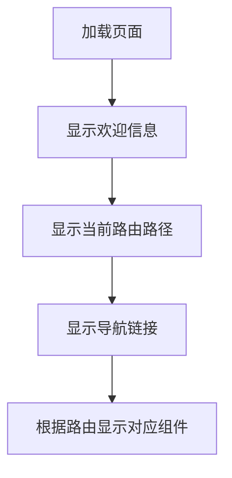

Vue Router 是 Vue 官方的客户端路由解决方案。

客户端路由的作用是在单页应用 (SPA) 中将浏览器的 URL 和用户看到的内容绑定起来。当用户在应用中浏览不同页面时，URL 会随之更新，但页面不需要从服务器重新加载。

Vue Router 基于 Vue 的组件系统构建，你可以通过配置**路由**来告诉 Vue Router 为每个 URL 路径显示哪些组件。


### 一、示例

---

#### 1.1 安装vue router组件

```bash
npm install vue-router
```

#### 1.2 根组件App.vue



```vue
<template>
  <h1>Hello App!</h1>
  <p>
    <strong>Current route path:</strong> {{ $route.fullPath }}
  </p>
  <nav>
    <router-link to="/">去首页</router-link>
    <router-link to="/about">去关于</router-link>
  </nav>
  <main>
    <router-view />
  </main>
</template>
```

在这个template中使用了两个由Vue Router提供的组件：`router-link` 和 `router-view`。

**使用组件 `router-link` 来创建链接。这使得 Vue Router 能够在不重新加载页面的情况下改变 URL，处理 URL 的生成、编码和其他功能。**

`router-view` 组件可以使 Vue Router 知道你想要在哪里渲染当前 URL 路径对应的**路由组件**。它不一定要在 `App.vue` 中，你可以把它放在任何地方，但它需要在某处被导入，否则 Vue Router 就不会渲染任何东西。

上述示例还使用了 `{{ $route.fullPath }}` 。可**以在组件模板中使用 `$route` 来访问当前的路由对象**。

#### 1.3 创建路由器实例

配置vue router，创建一个router目录，在该目录下创建一个index.js文件，并在其中配置你的路由。

```js
import { createRouter, createWebHistory } from 'vue-router'
import HomeView from '../components/HomeView.vue'
import AboutView from '../components/AboutView.vue'
import NotFoundView from '@/components/NotFoundView.vue'

// 定义路由配置数组，包含不同路径对应的组件
const routes = [
    {
        path: '/',
        name: 'Home',
        component: HomeView
    },
    {
        path: '/about',
        name: 'About',
        component: AboutView
    },
    {
        path: '/:pathMatch(.*)*', // 通配符路由，捕获所有未定义的路径
        name: 'NotFound',
        component: NotFoundView
    }
]

let router;
try {
    // 创建路由器实例，使用HTML5的history API来维护路由状态
    router = createRouter({
        history: createWebHistory(process.env.BASE_URL),
        routes
    })
} catch (error) {
    console.error('Failed to create router:', error)
    // 可以根据需求决定如何处理这个错误，比如显示一个默认页面或提示用户
}

// 导出路由器实例，以便在应用程序中使用
export default router
```

> 路由器实例是通过调用 `createRouter()` 函数创建的。
>
> `routes` 选项定义了一组路由，把 URL 路径映射到组件。其中，由 `component` 参数指定的组件就是先前在 `App.vue` 中被 `<router-view>` 渲染的组件。这些路由组件通常被称为视图，但本质上它们只是普通的 Vue 组件。
>
> 这里的 `history` 选项控制了路由和 URL 路径是如何双向映射的。通常应该使用 `createWebHistory()` 或 `createWebHashHistory()`。

#### 1.4 注册路由器插件

创建了路由器实例后，我们需要将其注册为插件，这一步骤可以通过调用use()来完成。

在main.js中使用router。

```js
import { createApp } from 'vue'
import App from './App.vue'
import router from './router'

createApp(App)
.use(router)
.mount('#app')
```

和大多数的 Vue 插件一样，`use()` 需要在 `mount()` 之前调用。

这个插件的职责包括：

1. [全局注册](https://cn.vuejs.org/guide/components/registration.html#global-registration) `router-view` 和 `router-link` 组件。
2. 添加全局 `$router` 和 `$route` 属性。
3. 启用 `useRouter()` 和 `useRoute()` 组合式函数。
4. 触发路由器解析初始路由。

#### 1.5 访问路由器和当前路由

你很可能想要在应用的其他地方访问路由器。

如果你是从 ES 模块导出路由器实例的，你可以将路由器实例直接导入到你需要它的地方。在一些情况下这是最好的方法，但如果我们在组件内部，那么我们还有其他选择。

**在组件模板中，路由器实例将被暴露为 `$router`。这与同样被暴露的 `$route` 一样。**

如果我们使用选项式 API，我们可以在 JavaScript 中如下访问这两个属性：`this.$router` 和 `this.$route`。在演练场示例中的 `HomeView.vue` 组件中，路由器就是这样获取的。

如果我们使用选项式 API，我们可以在 JavaScript 中如下访问这两个属性：`this.$router` 和 `this.$route`。

```vue
<template>
    <h2>HomeView</h2>
    <button @click="goToAbout">Go to About</button>
</template>

<script>
export default {
    methods: {
        goToAbout() {
            this.$router.push('/about')
        },
    },
}
</script>
```

这里调用了 `push()`，这是用于[编程式导航](https://router.vuejs.org/zh/guide/essentials/navigation.html)的方法。

对于组合式API，不能通过this访问组件实例，vue router提供了一些组合式函数。

```vue
<template>
    <h2>AboutView</h2>
    <label>
        Search: <input v-model.trim="search" maxlength="20">
    </label>
</template>

<script setup>
import { computed } from 'vue'
import { useRoute, useRouter } from 'vue-router'

const router = useRouter()
const route = useRoute()

const search = computed({
    get() {
        return route.query.search ?? ''
    },
    set(search) {
        router.replace({ query: { search } })
    }
})
</script>
```

选项式：

```vue
<script>
import { computed } from 'vue'
import { useRoute, useRouter } from 'vue-router'

export default {
    setup() {
        const router = useRouter()
        const route = useRoute()

        const search = computed({
            get() {
                return route.query.search ?? ''
            },
            set(newSearch) {
                router.replace({ query: { search: newSearch } })
            }
        })

        return {
            search
        };
    }
}
</script>
```

可以通过 `useRouter()` 和 `useRoute()` 来访问路由器实例和当前路由。

#### 1.6 下一步

如果你想要在 Vite 中使用完整的示例，你可以使用 [create-vue](https://github.com/vuejs/create-vue) 工具，它提供了在项目加入 Vue Router 的选项：

```bash
npm create vue@latest
```

```bash
yarn create vue
```

```bash
pnpm create vue
```


### 二、约定

---

#### 2.1 单文件组件

Vue Router 经常在配合打包工具 (如 Vite) 和**单文件组件**(即 `.vue` 文件) 的应用中使用。但是 Vue Router 本身并不要求你使用构建工具或单文件组件。

例如，若你要使用 [Vue](https://cn.vuejs.org/guide/quick-start.html#using-vue-from-cdn) 和 [Vue Router](https://router.vuejs.org/zh/installation.html#Direct-Download-CDN) 的全局构建版本，这些库将被暴露为全局对象，而不是导入：

```js
const { createApp } = Vue
const { createRouter, createWebHistory } = VueRouter
```

#### 2.2 组件 API 风格

Vue Router可以使用组合式API或选项式API。组合式 API 通常会使用 `<script setup>`，而不是显式的 `setup` 函数。

#### 2.3 router 和route

我们常常以 `router` 作为路由器实例提及。即由 `createRouter()` 返回的对象。在应用中，访问该对象的方式取决于上下文。例如，在组合式 API 中，它可以通过调用 `useRouter()` 来访问。在选项式 API 中，它可以通过 `this.$router` 来访问。

类似地，当前路由会以 `route` 被提及。基于不同 API 风格的组件，它可以通过 `useRoute()` 或 `this.$route` 来访问。

#### 2.4 router-view 和 router-link

组件 `RouterView` 和 `RouterLink` 都是[全局注册](https://cn.vuejs.org/guide/components/registration.html#global-registration)的，因此它们不需要在组件模板中导入。但你也可以通过局部导入它们，例如 `import { RouterLink } from 'vue-router'`。

在模板中，组件的名字可以是 PascalCase 风格或 kebab-case 风格的。Vue 的模板编译器支持两种格式，因此 `<RouterView>` 和 `<router-view>` 通常是等效的。此时应该遵循你自己项目中使用的约定。

如果使用 DOM 内模板，那么需要[注意](https://cn.vuejs.org/guide/essentials/component-basics.html#in-dom-template-parsing-caveats)：组件名字必须使用 kebab-case 风格且不支持自闭合标签。因此你不能直接写 `<RouterView />`，而需要使用 `<router-view></router-view>`。
