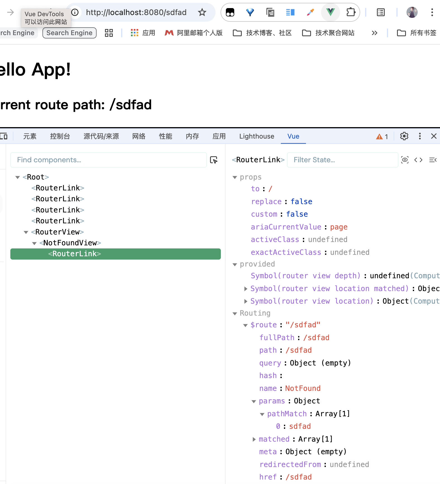

### 一、带参数的动态路由匹配

---

很多时候，我们需要将给定匹配模式的路由映射到同一个组件。例如，我们可能有一个 `User` 组件，它应该对所有用户进行渲染，但用户 ID 不同。在 Vue Router 中，可以在路径中使用一个动态字段来实现，称之为路径参数：

```js
import User from '@/views/user.vue'

// 这些都会传递给 `createRouter`
const routes = [
  // 动态字段以冒号开始
    {
        path: '/user/:username/:id',
        name: 'User',
        component: User
    },
]
```

现在像 `/users/chance/1` 和 `/users/wcy/2` 这样的 URL 都会映射到同一个路由。

**路径参数用冒号 `:` 表示**。当一个路由被匹配时，它的 `params` 的值将在每个组件中以 `route.params` 的形式暴露出来。可以通过更新 `User` 的模板来呈现当前的用户名称和id。

```vue
<!-- user.vue -->
<template>
    <div>
        <!-- 当前路由可以通过 $route 在模板中访问 -->
        User {{ $route.params.username }} with id {{ $route.params.id }}
    </div>
</template>
```

可以在同一个路由中设置有多个路径参数，它们会映射到 `$route.params` 上的相应字段。例如：

| 匹配模式                       | 匹配路径                 | route.params                           |
| :----------------------------- | :----------------------- | :------------------------------------- |
| /users/:username               | /users/eduardo           | { username: 'eduardo' }                |
| /users/:username/posts/:postId | /users/eduardo/posts/123 | { username: 'eduardo', postId: '123' } |

除了 `route.params` 之外，`route` 对象还公开了其他有用的信息，如 `route.query`（如果 URL 中存在参数）、`route.hash` 等。


### 二、响应路由参数的变化

---

使用带有参数的路由时需要注意的是，当用户从 `/users/chance` 导航到 `/users/wcy` 时，**相同的组件实例将被重复使用**。因为两个路由都渲染同个组件，比起销毁再创建，复用则显得更加高效。**不过，这也意味着组件的生命周期钩子不会被调用**。

要对同一个组件中参数的变化做出响应的话，可以简单地 watch `$route` 对象上的任意属性，在这个场景中，就是 `$route.params` ：

```vue
<template>
    <div>
        <!-- 当前路由可以通过 $route 在模板中访问 -->
        User {{ $route.params.username }} with id {{ $route.params.id }}
    </div>
</template>

<script setup>
import { watch } from 'vue';
import { useRoute } from 'vue-router';

const route = useRoute();

watch(() => route.params.id, (newId, oldId) => {
    // 在这里执行一些逻辑，比如获取新用户的详细信息
    console.log(`User changed from ${oldId} to ${newId}`);
})
</script>
```

或者使用 `beforeRouteUpdate`，它还允许你取消导航：

```vue
onBeforeRouteUpdate((to, from) => {
    // 在这里执行一些逻辑，比如获取新用户的详细信息
    console.log(`User changed from ${from.params.id} to ${to.params.id}`);
})
```


### 三、捕获所有路由或404 Not found路由

---

常规参数只匹配 url 片段之间的字符，用 `/` 分隔。如果我们想匹配**任意路径**，我们可以使用自定义的**路径参数**正则表达式，在**路径参数**后面的括号中加入 正则表达式：

```js
const routes = [
  // 将匹配所有内容并将其放在 `route.params.pathMatch` 下
  { path: '/:pathMatch(.*)*', name: 'NotFound', component: NotFound },
  // 将匹配以 `/user-` 开头的所有内容，并将其放在 `route.params.afterUser` 下
  { path: '/user-:afterUser(.*)', component: UserGeneric },
]
```

>- `:` 表示这是一个动态路径参数。
>- **`pathMatch`** 是这个路径参数的名字。
>- `(.*)` 是一个正则表达式，表示匹配任意字符，包括 `/`。
>- **`/:pathMatch(.\*)`** 这一段的整体作用：会匹配所有可能的路径，包括 `/`, `/abc`, `/abc/def`, `/a/b/c/d/e` 等等。换句话说，任何传入的 URL 都将会被这个路由捕获，除非有其他更具体的路由被定义在它之前。
>- 当使用一个**通配符**时，$route.params 内会自动添加一个名为 pathMatch 参数。它包含了 URL 通过通配符被匹配的部分：
>
>

在这个特定的场景中，我们在括号之间使用了**自定义正则表达式**，并将`pathMatch` 参数标记为**可选可重复**。这样做是为了让我们在需要的时候，可以通过将 `path` 拆分成一个数组，直接导航到路由：

```js
router.push({
  name: 'NotFound',
  // 保留当前路径并删除第一个字符，以避免目标 URL 以 `//` 开头。
  params: { pathMatch: this.$route.path.substring(1).split('/') },
  // 保留现有的查询和 hash 值，如果有的话
  query: route.query,
  hash: route.hash,
})
```


### 四、高级匹配模式

---

Vue Router 使用自己的路径匹配语法，其灵感来自于 `express`，因此它支持许多高级匹配模式，如可选的参数，零或多个 / 一个或多个，甚至自定义的正则匹配规则。