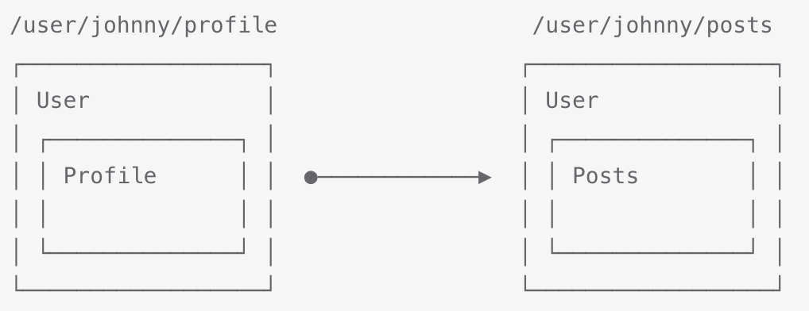

### 一、嵌套路由

---

一些应用程序的UI由多层嵌套的组件组成。在这种情况下，URL的片段通常对应于特定的嵌套组件结构，例如：



通过Vue Router，可以使用嵌套路由配置来表达这种关系。


### 二、示例

---

#### 2.1 App.vue

```vue
<template>
  <div id="app">
    <!-- 导航栏，包含多个路由链接 -->
    <nav>
      <router-link to="/">去首页</router-link>
      <router-link to="/about">去关于</router-link>
      <br />
      <router-link to="/user/chance">/users/chance</router-link>
      <br />
      <router-link to="/user/chance/profile">/users/chance/profile</router-link>
      <br />
      <router-link to="/user/chance/posts">/users/chance/posts</router-link>
    </nav>

    <!-- 显示当前路由的完整路径 -->
    <p>
      Current route path: {{ $route.fullPath }}
    </p>

    <!-- 主要内容区域，路由组件将渲染在此处 -->
    <main>
      <router-view />
    </main>
  </div>
</template>

<style>
p {
  font-size: 1.5em;
  font-weight: bold;
}
</style>
```

>这里的 `<router-view>` 是一个顶层的 `router-view`。它渲染顶层路由匹配的组件。同样地，一个被渲染的组件也可以包含自己嵌套的 `<router-view>`。例如，如果我们在 `User` 组件的模板内添加一个 `<router-view>`：

#### 2.2 User.vue

```vue
<template>
    <div class="user">
        <h2>User {{ $route.params.username }}</h2>
        <router-view></router-view>
    </div>
</template>
```

#### 2.3 UserHome.vue

>要将组件渲染到这个嵌套的 `router-view` 中，我们需要在路由中配置 `children`：

```vue
<template>
    <div>User Home</div>
</template>
```

#### 2.4 UserProfile.vue

```vue
<template>
    <div>Profile</div>
</template>
```

#### 2.5 UserPost.vue

```vue
<template>
    <div>Posts</div>
</template>
```

#### 2.6 定义路由配置

`router/index.js` 或 `router/index.ts`

```js
import { createRouter, createWebHistory } from 'vue-router'
import Home from '../components/Home.vue'
import About from '../components/About.vue'
import NotFound from '@/components/NotFound.vue'
import UserProfile from '@/views/UserProfile.vue'
import UserPosts from '@/views/UserPosts.vue'
import UserHome from '@/views/UserHome.vue'
import User from '@/views/User.vue'

// 定义路由配置数组，包含不同路径对应的组件
const routes = [
    {
        path: '/',
        name: 'Home',
        component: Home
    },
    {
        path: '/about',
        name: 'About',
        component: About
    },
    {
        path: '/user/:username',
        component: User,
        children: [
            {
                // UserHome将被渲染在User的<router-view>中
                //匹配/users/:username
                path: '',
                component: UserHome
            },
            {
                // 当 /user/:id/profile 匹配成功
                // UserProfile 将被渲染到 User 的 <router-view> 内部
                path: 'profile',
                component: UserProfile,
            },
            {
                // 当 /user/:id/posts 匹配成功
                // UserPosts 将被渲染到 User 的 <router-view> 内部
                path: 'posts',
                component: UserPosts,
            },
        ],
    },
    {
        path: '/:pathMatch(.*)*', // 通配符路由，捕获所有未定义的路径
        name: 'NotFound',
        component: NotFound
    },
    {
        // /:orderId -> 仅匹配数字
        path: '/:orderId(\\d+)'

    },
    {
        // /:productName -> 匹配其他任何内容
        path: '/:productName'
    },
    {
        // /:chapters ->  匹配 /one, /one/two, /one/two/three, 等
        path: '/:chapters+'
    },
    {
        // /:chapters -> 匹配 /, /one, /one/two, /one/two/three, 等
        path: '/:chapters*'
    },

]

let router;
try {
    // 创建路由器实例，使用HTML5的history API来维护路由状态
    router = createRouter({
        history: createWebHistory(process.env.BASE_URL),
        routes
    })

} catch (error) {
    console.error('Failed to create router:', error)
    // 可以根据需求决定如何处理这个错误，比如显示一个默认页面或提示用户
}

// 导出路由器实例，以便在应用程序中使用
export default router
```

>**注意，以 `/` 开头的嵌套路径将被视为根路径。这允许你利用组件嵌套，而不必使用嵌套的 URL。**
>
>如你所见，`children` 配置只是另一个路由数组，就像 `routes` 本身一样。因此，你可以根据自己的需要，不断地嵌套视图。
>
>此时，按照上面的配置，当你访问 `/user/chance` 时，在 `User` 的 `router-view` 里面什么都不会呈现，因为没有匹配到嵌套路由。也许你确实想在那里渲染一些东西。在这种情况下，你可以提供一个空的嵌套路径。


### 三、嵌套的命名路由

---

在处理命名路由时，**你通常会给子路由命名**：

```js
const routes = [
  {
    path: '/user/:id',
    component: User,
    // 请注意，只有子路由具有名称
    children: [{ path: '', name: 'user', component: UserHome }],
  },
]
```

这将确保导航到 `/user/:id` 时始终显示嵌套路由。

在一些场景中，你可能希望导航到命名路由而不导航到嵌套路由。例如，你想导航 `/user/:id` 而不显示嵌套路由。那样的话，你还可以**命名父路由**，但请注意**重新加载页面将始终显示嵌套的子路由**，因为它被视为指向路径`/users/:id` 的导航，而不是命名路由：

```js
const routes = [
  {
    path: '/user/:id',
    name: 'user-parent',
    component: User,
    children: [{ path: '', name: 'user', component: UserHome }],
  },
]
```


### 四、注意事项

---

- **children 数组：** 用于定义子路由，其元素是路由对象，配置方式与顶级路由相同。
- **<router-view> 组件：** 必须在父组件中使用 `<router-view>` 才能渲染匹配的子路由组件。
- **相对路径：** 子路由的 `path` 是相对于父路由的。例如，在上述例子中，访问 `/users/123` 时，Vue Router 会先匹配到 `/users`，然后在 `Users` 组件内部的 `<router-view>` 中渲染 `UserDetail` 组件。
- **默认子路由：** 当访问父路由但没有指定子路由时，会渲染 `path` 为空字符串的子路由。例如，访问 `/users` 会渲染 `UserList` 组件。
- **命名路由：** 使用 `name` 属性给路由命名，方便通过 `router-link` 的 `to` 属性或编程式导航进行跳转，避免硬编码路径。
- **动态路由参数：** 使用 `:` 符号定义动态路由参数，例如 `:id`。在组件内部，可以通过 `$route.params.id` 访问参数值。
- **绝对路径与相对路径：**
  - 子路由的 `path` 如果以 `/` 开头，则会被视为绝对路径，相对于根路径。例如，如果一个子路由的 `path` 是 `/profile`，那么无论其父路由是什么，访问路径都将是 `/profile`。
  - 子路由的 `path` 如果不以 `/` 开头，则会被视为相对路径，相对于父路由。这是推荐的用法，可以更好地维护路由结构。


### 五、更深层次的嵌套

---

嵌套路由可以多层嵌套，形成更复杂的层级结构。例如：

```javascript
const routes = [
  {
    path: '/admin',
    component: Admin,
    children: [
      {
        path: 'users', // 相对路径，实际路径为 /admin/users
        component: AdminUsers,
        children: [
          {
            path: ':id', // 相对路径，实际路径为 /admin/users/:id
            component: AdminUserDetail,
          },
        ],
      },
    ],
  },
];
```


### 六、忽略父组件(Vue Router 4.1+)

---

从 Vue Router 4.1 开始，可以利用路由的父子关系，但不一定需要嵌套路由组件。这对于将具有公共路径前缀的路由分组在一起或使用更高级的功能（例如路由独享的守卫或路由元信息）时很有用。

在这种情况下，父路由不需要 `component` 属性。当访问子路由时，顶级 `<router-view>` 将跳过父级并仅使用子路由组件。

```javascript
const routes = [
  {
    path: '/admin', // 父路由，没有 component
    children: [
      {
        path: 'dashboard', // 实际路径为 /admin/dashboard
        component: AdminDashboard,
      },
      {
        path: 'settings', // 实际路径为 /admin/settings
        component: AdminSettings,
      },
    ],
  },
];
```

在这个例子中，访问/admin/dashboard或/admin/settings时，只会渲染AdminDashboard或AdminSettings组件，而不会渲染任何父组件。


