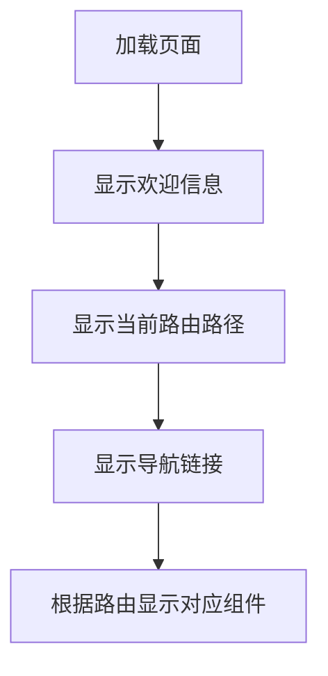

Vue Router 是 Vue 官方的客户端路由解决方案。

客户端路由的作用是在单页应用 (SPA) 中将浏览器的 URL 和用户看到的内容绑定起来。当用户在应用中浏览不同页面时，URL 会随之更新，但页面不需要从服务器重新加载。

Vue Router 基于 Vue 的组件系统构建，你可以通过配置**路由**来告诉 Vue Router 为每个 URL 路径显示哪些组件。


### 一、示例

---

1. 安装vue router组件

   ```bash
   npm install vue-router
   ```

2. 配置vue router，创建一个router目录，在该目录下创建一个index.js文件，并在其中配置你的路由。

   ```js
   import { createRouter, createWebHistory } from 'vue-router'
   import HomeView from '../components/HomeView.vue'
   import AboutView from '../components/AboutView.vue'
   import NotFoundView from '@/components/NotFoundView.vue'
   
   // 定义路由配置数组，包含不同路径对应的组件
   const routes = [
       {
           path: '/',
           name: 'Home',
           component: HomeView
       },
       {
           path: '/about',
           name: 'About',
           component: AboutView
       },
       {
           path: '/:pathMatch(.*)*', // 通配符路由，捕获所有未定义的路径
           name: 'NotFound',
           component: NotFoundView
       }
   ]
   
   let router;
   try {
       // 创建路由器实例，使用HTML5的history API来维护路由状态
       router = createRouter({
           history: createWebHistory(process.env.BASE_URL),
           routes
       })
   } catch (error) {
       console.error('Failed to create router:', error)
       // 可以根据需求决定如何处理这个错误，比如显示一个默认页面或提示用户
   }
   
   // 导出路由器实例，以便在应用程序中使用
   export default router
   ```

3. 在main.js中使用router

   ```js
   import { createApp } from 'vue'
   import App from './App.vue'
   import router from './router'
   
   createApp(App)
   // 使用路由实例，使应用能够根据 URL 路径动态加载不同的组件。
   .use(router)
   // 将应用挂载到 HTML 中 id 为 'app' 的元素上
   .mount('#app')
   ```

#### 1.1 根组件App.vue



```vue
<template>
  <h1>Hello App!</h1>
  <p>
    <strong>Current route path:</strong> {{ $route.fullPath }}
  </p>
  <nav>
    <router-link to="/">去首页</router-link>
    <router-link to="/about">去关于</router-link>
  </nav>
  <main>
    <router-view />
  </main>
</template>
```

在这个template中使用了两个由Vue Router提供的组件：`router-link` 和 `router-view`。

不同于常规的 `<a>` 标签，我们使用组件 `router-link` 来创建链接。这使得 Vue Router 能够在不重新加载页面的情况下改变 URL，处理 URL 的生成、编码和其他功能。我们将会在之后的部分深入了解 `router-link` 组件。

`router-view` 组件可以使 Vue Router 知道你想要在哪里渲染当前 URL 路径对应的**路由组件**。它不一定要在 `App.vue` 中，你可以把它放在任何地方，但它需要在某处被导入，否则 Vue Router 就不会渲染任何东西。

上述示例还使用了 `{{ $route.fullPath }}` 。你可以在组件模板中使用 `$route` 来访问当前的路由对象。


