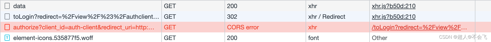

axios的请求必须配置 `axios.defaults.withCredentials = true` ，并且Response的Header需要有 `Access-Control-Allow-Credentials: true` 。


1. 配置axios

   ```vue
   // 创建axios实例
   const service = axios.create({
     baseURL: process.env.VUE_APP_BASE_API, // api的base_url
     timeout: 0, // 请求超时时间
     withCredentials: true
   })
   // 或者
   // axios.defaults.withCredentials = true;
   ```

   Response header中写返回了

   

   但却报跨域错误

   

   从console信息「The value of the ‘Access-Control-Allow-Origin’ header in the response must not be the wildcard '’ when the request’s credentials mode is ‘include’.」时说当请求是携带凭据模式（即Access-Control-Allow-Credentials: true、携带Cookie）时，Response的header “Access-Control-Allow-Origin” 的值不能是 '*' 通配符。

2. 修改后端配置

   ```java
   @Configuration
   @EnableWebSecurity
   @EnableGlobalMethodSecurity(prePostEnabled = true)
   public class WebSecurityConfiguration extends WebSecurityConfigurerAdapter implements InitializingBean {
   
     @Override
     protected void configure(HttpSecurity http) throws Exception {
       http.cors().configurationSource(httpServletRequest -> {
         final CorsConfiguration corsConfiguration = new CorsConfiguration();
         corsConfiguration.setAllowedOrigins(List.of("*"));
         corsConfiguration.setAllowedHeaders(List.of("*"));
         corsConfiguration.setAllowCredentials(true);
   
         return corsConfiguration;
       });
     }
   }
   ```


#### 总结

1. 跨域请求是携带Cookie ，需要配置axios.defaults.withCredentials = true;
2. 响应需要携带响应头 Access-Control-Allow-Credentials: true；
3. 响应头 Access-Control-Allow-Origin 不能是通配符“*” ，并且需要和请求头Origin 的值一致。