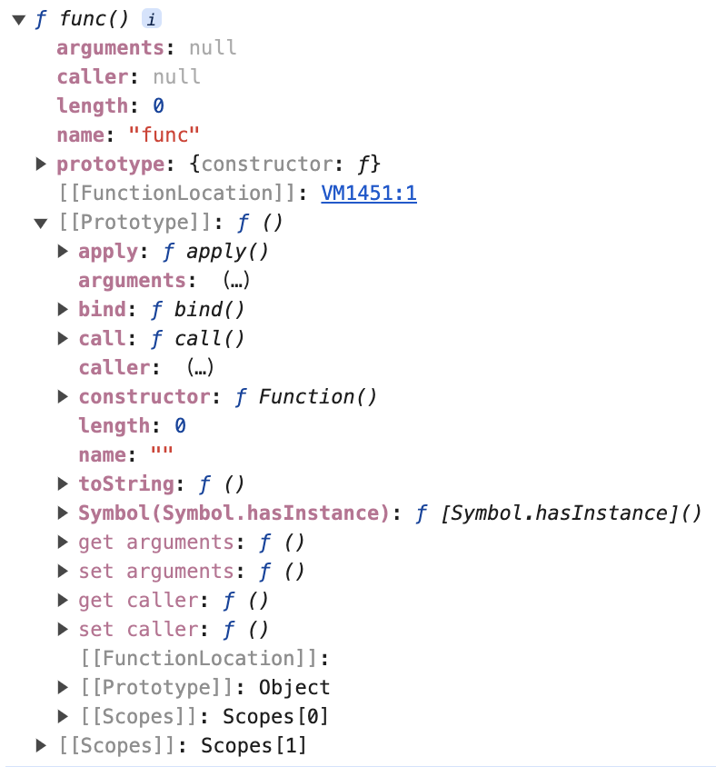

> 任何原型都源自Object.prototype；而 Function.prototype 是仅次于 Object.prototype 的存在，它是内置构造函数的创建者，任何构造函数都源自它。

所以Function的原型有一定的重要性，Function（构造函数）与Function.prototype（原型）又是相生相伴的关系，从构造函数层面，它已经比Array、String、Number等重要了，虽然比不上Object，但也是仅次于它的存在。

不仅如此，函数还能做很多事情。首先，它是个对象，所以它和对象一样，也有属性，也可以赋值给变量。除此之外，函数可以自身当作参数传递，也具有返回值的特性。

总之，对象能做的它都能做，它还有自身的特性，能做更多的事情（例如：能作为参数传递，有返回值）。


### 一、属性和方法

---

```js
function func() {
}
console.dir(func);
```



用函数声明的形式创建了一个普通函数 func，打印它。虽然我们没有对其进行任何的赋值操作，但它自身自带了各种属性，很显然，Function 是没有静态方法的，它只有实例属性和实例方法，都继承自 Function.prototype。函数 func 上有 `arguments`、`caller`、`length`、`name` ，这些都是继承自 Function.prototype，在 `func.__proto__` 中你能找到同样的属性，这其中的秘密是`Function.__proto__ === Function.prototype`。

#### 1.1 实例属性

- Function.prototype.arguments：对应传递给函数的参数数组。
- Function.prototype.constructor：指向构造函数。
- Function.prototype.length：参数数量。

#### 1.2 实例方法

- Function.prototype.apply(thisArg [, argsArray])：调用一个函数并将其 `this` 值设置为提供的传参，第二个参数以数组对象传入。
- Function.prototype.call(thisArg [, arg1, arg2, ...argN])：调用一个函数并将其 `this` 值设置为提供的传参，也可以选择传输新参数。
- Function.prototype.bind(thisArg[, arg1[, arg2[, ...argN]])：创建一个新函数，该函数在调用时，会将 this 设置为提供的`thisArg`。在调用新绑定的函数时，可选的参数序列（[, arg1[, arg2[, ...argN]]]）会被提前添加到参数序列中。
- Function.prototype.toString()：返回表示函数源码的字符串。覆盖了 `Object.prototype.toString` 方法。


### 二、创建函数

---

#### 2.1 函数构建函数

```js
// 最后一个参数为函数逻辑，之前都是参数
var add = new Function('x', 'y', 'return x + y')
```

#### 2.2 函数声明

```js
fuction add(x, y) {
  return x + y;
}
```

#### 2.3 函数表达式

```js
var add = function (x, y) {
  return x + y;
};
```

#### 2.4 箭头函数

```js
var add = (x, y) => x + y
```

#### 2.5 区别

在正常开发中，函数构造函数基本用不到。开发中用的比较多的是函数声明、函数表达式、箭头函数，那么三者有什么区别呢？

**函数声明**和**函数表达式**：

- 函数声明会引起函数提升（且优先级比变量提升高）

**箭头函数**与**普通函数**：

- 没有 this，函数体内的 this 需在外部词法环境中查找。
- 没有 arguments。
- 不可以当作构造函数。也就是说，箭头函数不能使用 new 命令，否则会抛出一个错误。
- 没有 super。
- 不可以使用 yield 命令，因此箭头函数不能用作 Generator 函数。
- 返回对象时必须在对象外面加上括号。


### 三、调用函数

---

#### 3.1 作为函数

```js
var func1 = function () {
  return 'foo';
};
console.log(func1); // foo
```

#### 3.2 作为方法

```js
即对象中的函数被称为方法
var obj1 = {
  func2: function () {
    return 'bar';
  },
};
console.log(obj1.func2()); // bar
```

#### 3.3 作为构造函数

```js
function Person() {
  this.name = 'johnny'
  this.age = 28;
  this.gender = 'female';
  this.getName = function () {
    return this.name;
  };
}
var cody = new Cody(); // 调用构造函数
console.log(cody);
```


