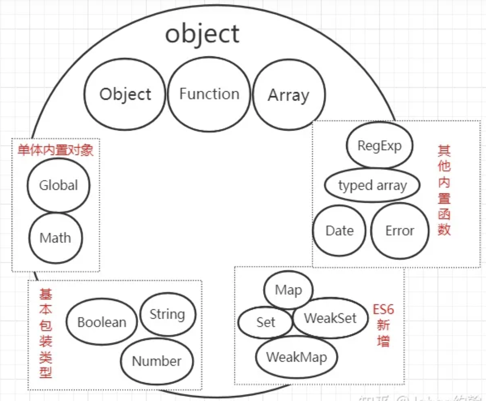

> 引用类型是 object（一组属性的集合）

而这个 object 包括什么，Function、Array 之流又属于什么？

这里引用两本书和MDN中的内容，并结合下给它下个定性：

按照《JavaScript 高级编程第四版》中的说法：

引用类型包括：Object、Array、定型数组（typed array）、Date、RegExp、Function、基本包装类型（String、Number、Boolean）、单体内置对象（Global、Math）、ES6新增引用类型（Map、WeakMap、Set 、WeakSet）

而在《JavaScript启示录》中，则给出 9 个原生（或内置）对象构造函数，String、Number、Boolean、Object、Array、Function、Date、RegExp、Error。

而 **[MDN](https://link.zhihu.com/?target=https%3A//developer.mozilla.org/zh-CN/docs/Web/JavaScript/Reference/Global_Objects)** 更全面，不仅有值属性（NaN、undefined）、函数属性（eval、isNaN、parseFloat、encodeURI）、基本对象（Object、Function、Boolean、Symbol）、错误对象（Error、TypeError、ReferenceError）、数字和日期对象（Number、BigInt、Math、Date）、字符串（String、RegExp）、可索引的集合对象（Array）、使用键的结合对象（Map、Set、WeakMap、WeakSet）、结构化数据（ArrayBuffer、JSON）、控制抽象对象（Promise、Generator）、放射（Reflect、Proxy）、国际化（Int1）、WebAssembly、arguments等等。

>**对象（object）是指内存中的可以被标识符引用的一块区域。**

ECMA-262 将对象定义为**一组属性的无序组合**。可以把 ECMAScript 的对象想象成一张散列表，其中的内存就是一组名/值对，值可以是数据或者函数。

所以 JavaScript 中的对象包含内置对象（或者说对象由**内置对象**和**自定义对象**组成）。

由于「原型」、「继承」等更底层的设计，对象是"始祖巨人"。基于它，String、Number、Boolean、Array、Function、Date、RegExp、Error 等等以各自特性成一构造函数，当然不知它们，还有很多其他的内置对象。



> 以下术语来区分三类 JavaScript 对象和两类属性：
>
> - 内置对象（native object）是由 ECMAScript 规范定义的对象或类。例如，数组、函数、日期和正则表达式都是内置对象。
> - 宿主对象（host object）是由 JavaScript 解释器所嵌入的宿主环境（比如 Web 浏览器）定义的。
> - 自定义对象（user-defined object）是由运行中的 JavaScript 代码创建的对象。
> - 自有属性（own property）是直接在对象中定义的属性。
> - 继承属性（inherited property）是在对象的原型对象中定义的属性。

所以说 JavaScript 中的「对象」很厉害，大多数元素都是基于「对象」构建。其中像 `Object`、`Function`、`Array` 之类比较重要，后续会对其介绍。单体内置对象、其他内置函数及ES6新增的 Map、Set、WeakMap、WeakSet 暂不做介绍，这里我们先讲讲基本包装类型。


### 一、基本包装类型

---

基本包装类型包括： String、Number、Boolean，它和基本类型中的 string、number、boolean 有什么区别

先看一下以下代码：

```js
var string1 = 'foo';
var string2 = String('foo');
var number1 = 10;
var number2 = Number('10');
var boolean1 = true;
var boolean2 = Boolean('true');

console.log(typeof string1, typeof string2); // 输出 'string, string'
console.log(typeof number1, typeof number2); // 输出 'number, number'
console.log(typeof boolean1, typeof boolean2); // 输出 'boolean, boolean'

// 如果使用创建对象的构造函数和new关键字
var myString = new String('male');
var myNumber = new Number(23);
var myBoolean = new Boolean(false);
console.log(typeof myString, typeof myNumber, typeof myBoolean);
// object, object, object
```

>- 如果使用字面量语法创建值，**数据类型的输出结果是基本类型**。
>- 如果使用 new 关键字创建 String()、Number()、Boolean() 值时，**创建的对象实际上是一个对象（引用类型）**。

无论是字面量创建值还是不带 new 调用基本包装类型，它们都会转换为其相对应的类型。

如下例子：

```js
let str = "Hello";

console.log(str.toUpperCase()); // HELLO
```

一个基本类型为什么会有 toUpperCase 这个方法，它既然是基本类型，那就是一个字符串，为什么会有方法呢？方法从何而来？

>高程四的解释是：
>
>在以读模式访问字符串值的任何时候，后台都会执行以下3步：
>
>1. 创建一个 String 类型的实例；
>2. 调用实例上的特定方法；
>3. 销毁实例。
>
>可以把这 3 步想象成执行了如下 3 行 ECMAScript 代码：
>```js
>let s1 = new String("some text")
>let s2 = s1.substring(2)
>s1 = null
>```

>JavaScript Info 给出的解答是：
>
>以下是 JavaScript 创建者面临的悖论：
>
>- 人们可能想对诸如字符串或数字之类的原始类型执行很多操作。最好使用方法来访问它们。
>- 原始类型必须尽可能的简单轻量。
>
>而解决方案看起来多少有点尴尬，如下：
>
>1. 原始类型仍然是原始的。与预期相同，提供单个值。
>2. JavaScript 允许访问字符串，数字，布尔值和 symbol 的方法和属性。
>3. 为了使它们起作用，创建了提供额外功能的特殊“对象包装器”，**使用后即被销毁**。
>
>“对象包装器”对于每种原始类型都是不同的，它们被称为 `String`、`Number`、`Boolean`、`Symbol` 和 `BigInt`。因此，它们提供了不同的方法。

在调用字符串、数字之类的基本类型类型时，ECMAScript 引擎会**以基本包装类型为构造函数，创建一个基于它的实例，调用完后，得到生成的结果，删除调用时的实例**。所以也解释了虽然它们是基本类型，却能调用各种原型方法。也体现了个别类型既要又要的特殊场景（既要轻量占内存小，又要有方便的方法），而这一切是为了提高性能。


### 二、JavaScript中一切都是对象？

---

不能说一切，但是基本不差。

JavaScript 按数据类型分，分为原始类型和引用类型。原始类型又被称为原始值，它包括 string，number，boolean，null，undefined，symbol，bigint；而引用类型则是对象，其对象分为内置对象、宿主对象、自定义对象。内置对象中有 Object、Array、定型数组（typed array）、Date、RegExp、Function、基本包装类型（String、Number、Boolean）、单体内置对象（Global、Math）、ES6新增引用类型（Map、WeakMap、Set 、WeakSet）等等，更详细的可查看 **[MDN](https://link.zhihu.com/?target=https%3A//developer.mozilla.org/zh-CN/docs/Web/JavaScript/Reference/Global_Objects)**。

你写的代码除了基本类型外，都是对象，而基本类型中的 string、number、boolean、symbol、bigInt 又和基本包装类型有了调用原型方法后删除实例的关系。简单来说，它们既享受了基本类型的轻量占内存小，又获得了调用内置构造函数的各种原型方法。

基本类型中，除了 null、undefined，其余的都与对象有关，而引用类型就是指对象，所以说 JavaScript 中的一切都是对象，大致上是正确的。