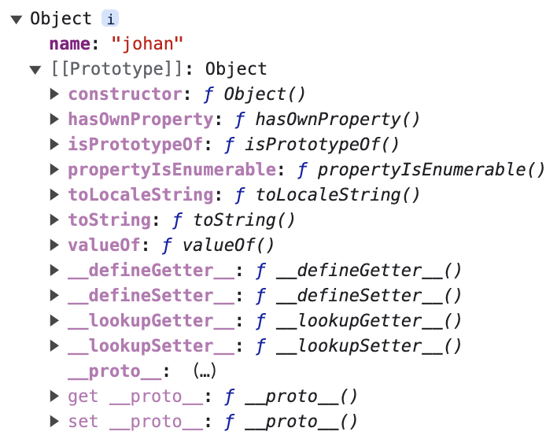
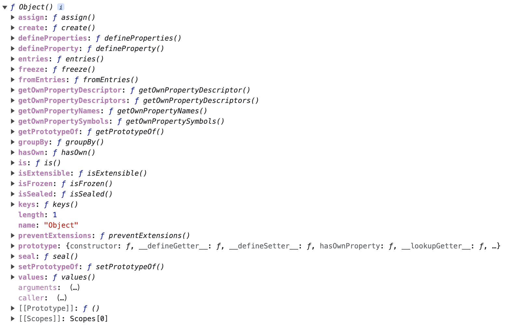
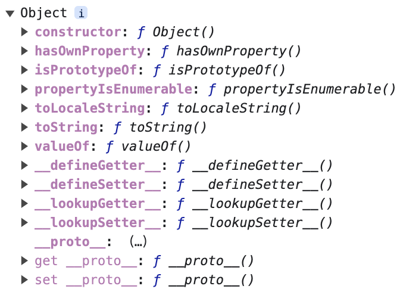

- 引用类型指的是 object。
- object 包括**内置对象**、**宿主对象**、**自定义对象**。
- 内置对象中有 Object、Function、Array、String、Number、Boolean 等原生对象构造函数。
- 在 JavaScript 中，一切皆对象（除 undefined、null 外）。

无论是内置对象，还是自定义对象，都是基于 Object 来创建，其中的原理是**原型继承**。

看看 Object 是什么，它能做什么，并将其扩展，连接 Object 相关的各个知识点。知识列表如下：

- 属性与方法
- 如何创建对象
- 如何拷贝对象
- 对象继承的秘密——原型
- 继承的九种方法


### 一、属性与方法

---

>JavaScript 对象可以从一个称为**原型**的对象里继承属性。对象的方法通常是继承的属性。这种”原型式继承“（prototypal inheritance）是 JavaScript 的核心特征。

```js
var johan = { name: 'johan' };
console.dir(johan);
```



使用对象字面量的方法创建了一个对象实例 johan，并赋予了一个属性 name，值为 johan，当打印日志时，发现多了一个对象`[[Prototype]]`，并且这个对象中有很多对象。

这是因为「对象字面量」创建的实例，在底层已经做了「隐式继承」的操作，它和 `new Object('johan')` 是一个意思，除此之外，如果使用 new ，会进行原型继承，`[[prototype]]` 正是继承 Object 的原型（即 Object.prototype）

这里，不妨多说一句，实例是继承 Object.prototype，而不是 Object，原型才会被继承，构造函数是个空壳。

`console.dir(Object)`如下图所示：



`console.dir(Object.prototype)`如下图所示：



johan 的 `[[prototype]]` 和 Object 的 prototype 的内容一致。

看以上例子，能发现 Object 的属性和方法不少，而且它的实例也有属性和方法，这里对其进行说明注解。

#### 1.1 静态方法

`Object.assign(target, ...sources)`：静态方法将一个或者多个源对象中所有可枚举的自有属性复制到目标对象，并返回修改后的目标对象。

>如果目标对象与源对象具有相同的键（属性名），则目标对象中的属性将被源对象中的属性覆盖，后面的源对象的属性将类似地覆盖前面的源对象的同名属性。
>
>只会拷贝源对象*可枚举的*的*自有属性*到目标对象。该方法在源对象上使用 `[[Get]]`，在目标对象上使用 `[[Set]]`，因此它会调用 getter 和 setter。故它对属性进行*赋值*，而不仅仅是复制或定义新的属性。如果合并源对象包含 getter 的新属性到原型中，则可能不适合使用此方法。

- Object.create()：使用指定的原型对象和属性创建一个新对象。
- Object.defineProperty()：给对象添加一个属性并指定该属性的配置。
- Object.defineProperties()：给对象添加多个属性并分别指定它们的配置。
- Object.entries()：返回给定对象自身可枚举属性的 `[key, value]` 数组。
- **Object.keys()**：返回一个包含所有给定对象自身可枚举属性名称的数组。
- Object.values()：返回给定对象自身可枚举值的数组。

#### 1.2 实例属性

- `Object.prototype.constrcutor`：一个引用值，指向Object构造函数。

  >`constructor` 属性没有受到保护，可以被重新赋值或被覆盖，因此在检测变量类型时，通常应避免使用它，而应该使用更不易出错的方法，如对于对象使用 `instanceof` 和 `Symbol.toStringTag`，对于基本类型使用 `typeof`。

#### 1.3 实例方法

- `Object.prototype.hasOwnProperty(prop)`：返回一个布尔值，表示对象自有属性（而不是继承来的属性）中是否具有指定的属性。

- >备注：
  >
  > 在支持 Object.hasOwn 的浏览器中，建议使用 `Object.hasOwn()`。
  >
  >**使用Object.create(null)创建的对象不从Object.prototype继承，使得hasOwnProperty()不可访问。**

- `Object.prototype.isPrototypeOf(object)`：用于检查一个对象是否存在于另一个对象的原型链中。

- `Object.prototype.toString()`：返回一个代表该对象的字符串。该方法旨在重写（自定义）派生类对象的类型转换的逻辑。

  ```js
  function Dog(name) {
    this.name = name;
  }
  
  const dog1 = new Dog('Gabby');
  
  Dog.prototype.toString = function dogToString() {
    return `${this.name}`;
  };
  
  console.log(dog1.toString());
  // Expected output: "Gabby"
  ```

- `Object.prototype.valueOf()`：返回指定对象的原始值。

  ```js
  function MyNumberType(n) {
    this.number = n;
  }
  
  MyNumberType.prototype.valueOf = function () {
    return this.number;
  };
  
  const object1 = new MyNumberType(4);
  
  console.log(object1 + 3);
  // Expected output: 7
  ```

  

### 二、创建对象

---

#### 2.1 对象直接量

创建一个新对象的最简单的方法，就是用对象直接量，就如使用以下语句：

```js
var obj = {};
```

`{}` 表示的 `new Object()`

#### 2.2 关键字new

使用 new 创建对象，一般要跟随一个函数调用。这里的函数称为构造函数（constructor），构造函数用以初始化一个新创建的对象。

```js
var obj = new Object();
```

#### 2.3 Object.create

此方法是 ECMAScript 5 定义了，它牵扯到原型、继承等方面的知识。简单来说，它创造了一个新对象，其中第一个参数就是这个对象的原型。而第二个可选参数，是对其属性的更多描述。

```js
var obj = Object.create({ name: 'johan', age: 23 }); // obj 继承了属性name 和 age
var obj2 = Object.create(null); // obj2 不继承任何属性和方法
var obj3 = Object.create(Object.prototype); // 与 {} 和 new Object() 一个意思
```

更多内容，可参考 [Object.create](https://zhuanlan.zhihu.com/p/559527875)。


### 三、如何拷贝对象

---

赋值是简单的，但赋值后的再赋值，就会引起源对象被修改。

```js
var o1 = { name: 'johan' };
var o2 = o1;
o2.name = 'elaine';
console.log(o1); // {name: 'elaine'}
console.log(o2); // {name: 'elaine'}
```

因为 Object 是引用类型，引用类型的拷贝拷贝的是引用地址，所以当 o2 被修改时，o1 也随之被修改。

针对如何拷贝对象，参考 [拷贝的秘密](https://zhuanlan.zhihu.com/p/560276058) 会对其进行说明。


### 四、对象继承的秘密——原型

---

要想解释 JavaScript 中为什么大多数元素都是对象，就必须先知道原型。JavaScript 是一门基于原型的语言——每个对象拥有一个原型对象，对象以其原型为模板、从原型继承方法和属性。原型对象也可能拥有原型，并从中继承方法和属性，一层一层，以此类推。这种关系常被称为原型链。

有关原型和原型链的知识，参考 [原型](https://zhuanlan.zhihu.com/p/561882773)。


### 五、继承的9种方法

---

原型是实现继承的方法之一，当然 JavaScript 还有其他的方法，总共九种

- 原型链继承

- 盗用构造函数

- 组合继承（原型链+盗用构造函数）

- 原型式继承

- - Object.create
  - Object.setPrototypeOf

- 寄生式继承

- 寄生式组合继承

- - Object.create + 盗用构造函数
  - Object.setPrototypeOf + 盗用构造函数

- 类继承

具体参考 [继承](https://zhuanlan.zhihu.com/p/562628436)。
