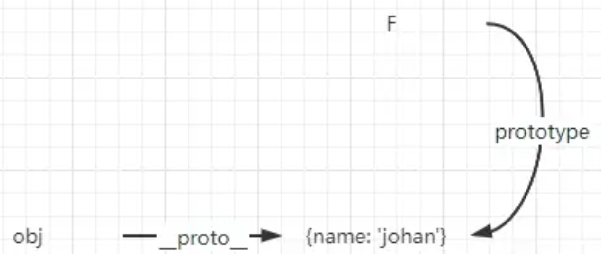

> 2006年，Douglas Grockford 写了一篇文章：**[《JavaScript 中的原型式继承》](https://link.zhihu.com/?target=https%3A//www.crockford.com/javascript/prototypal.html)**（”Prototypal Inheritance in JavaScript“）。这篇文章介绍了一种不涉及严格意义上构造函数的继承方法。他的出发点是即使不自定义类型也可以通过原型继承对象之间的信息共享。文章最终给出了一个函数：
>
> ```js
> function object(o) {
>   function F(){}
>   F.prototype = o
>   return new F()
> }
> ```
>
> 于是，《JavaScript 高级程序设计》中的 JavaScript 就多了一种——原型式继承。
>
> 于是，ECMAScript 5 新增了 Object.create() 方法将原型式继承的概念规范化。


### 一、用法

---

```js
var obj = Object.create({name: 'johan', age: 23}) // obj 继承了属性name 和 age
var obj2 = Object.create(null) // obj2 不继承任何属性和方法
var obj3 = Object.create(Object.prototype) // 与 {} 和 new Object() 一个意思
var obj4 = Object.create({}, {
  property1: {
    value: true,
    writable: true
  }
}) // 第二个参数与 Object.defineProperties() 一致
```


### 二、图解Object.create实现

---

```js
function create(proto) {
  function F(){}
  F.prototype = proto
  return new F()
}
```

第一步：` function F(){}`

即创建一个函数，因为**约定首字母大写，视为构造函数**，创建函数 F 时，F 构造函数与和它的原型对象就有了这一层的关系：

```js
F.prototype === F.prototype; // 假设你把F.prototype当作一个值
F.prototype.constructor === F;
```


第二步：`F.prototype = proto`

即将 F.prototype 赋值为传入的 proto，如此就打破了F.prototype = F.prototype 以及 F.prototype.constructor = F ，它们的关系为


第三步：`return new F()`

第三步的解读有点费解，因为这里涉及到 new 的操作，new 会创建一个对象，并将这个对象的隐式原型(`__proto__`) 指向构造函数的原型对象，并初始化构造函数，如果值则返回值。new 是隐式原型继承，Object.create 是显式原型继承

在这里，我们按实现 new 的方式来解读 `return new F()`。`new F` 后的实例的 `__proto__` 指向的是 F.prototype，而这个值已经在第二步时指给了传来的 proto，所以就有了`new F().__proto__ = proto`


或许不太清楚第三步，结合例子，就一目了然了

```js
var obj = Object.create({name: 'johan'})
```

第三步的图解就成了这样：



如此「原型式继承」就被传承下来了。其原理就是如此，简单来说，就是**创建空（构造）函数，关联它的原型（实现继承）**。


### 三、Object.create(null)

---

在阅读源码时，常会看到 `Object.create(null)` ，用此初始化一个新对象，至于为什么用这个方法而不用 new Object 或者 {}，是因为无论 new 还是字面量，都是继承自 Object 构造函数，而**使用Object.create(null) ，能得到一个没有任何继承痕迹的对象**。

```js
var obj = Object.create(null)
```

不信，你可以打印 obj 试试。