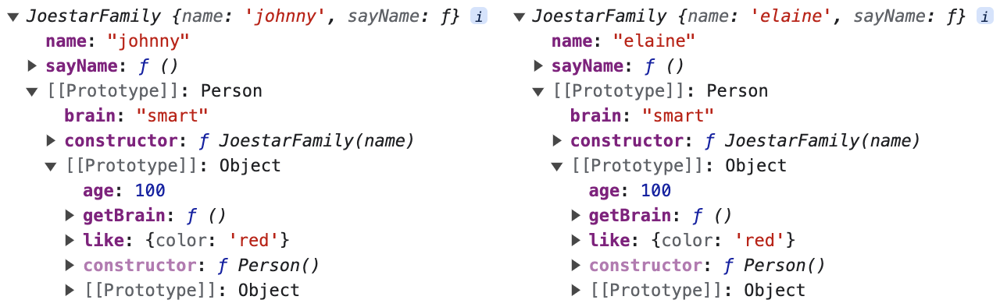
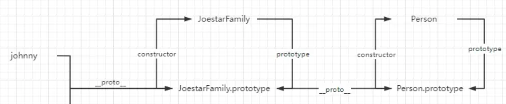
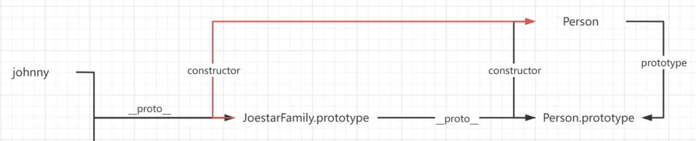
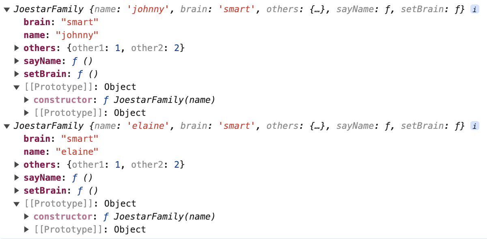
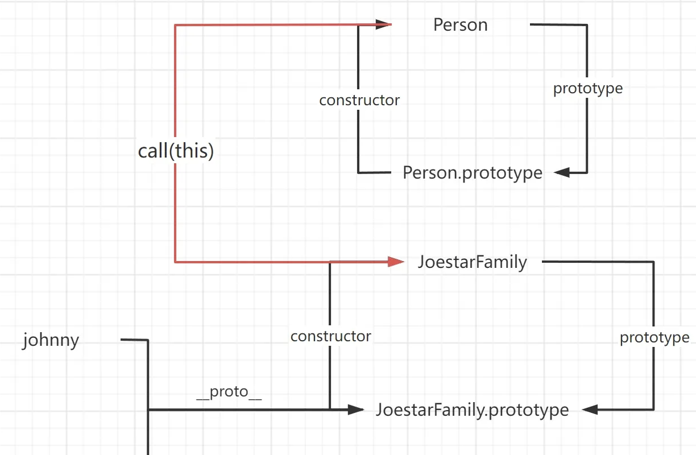
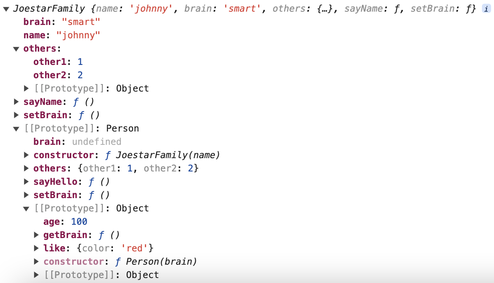
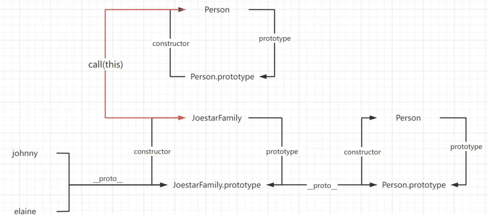

new 关键字所形成的原型链关系是：`实例.__proto__ === 构造函数.prototype`。


### 一、原型链继承

---

```js
function Person(){
  this.brain = 'smart'
}

Person.prototype.getBrain = function () {
  console.log(this.brain)
}

Person.prototype.age = 100;
Person.prototype.like = {
  color: 'red',
}

function JoestarFamily(name) {
  this.name = name
  this.sayName = function() {
    console.log(this.name)
  }
}

JoestarFamily.prototype = new Person()
// 等同于 JoestarFamily.prototype.__proto__ === 实例.__proto__ === Person.prototype
JoestarFamily.prototype.constructor = JoestarFamily; // 原型的 constructor 指回原来的构造函数
var johnny = new JoestarFamily('johnny')
// 等同于 johnny.__proto__ === JoestarFamily.prototype
// 也就是说 johnny.__proto__.__proto__ === Person.prototype
var elaine = new JoestarFamily('elaine')

console.log(johnny, elaine)
```



原型链继承使用 new 关键字，将 JoestarFamily 的原型指向 Person 的实例，即子类的原型指向父类的实例，等同于 `JoestarFamily.prototype === 实例.__proto__ === Person.prototype `，当它 `new JoestarFamily` 后，相当于 `johnny.__proto__ === JoestarFamily.prototype`，按照「等价交换原则」`JoestarFamily.prototype` 为共同值，换算后可以得出：`johnny.__proto__.__proto__ === Person.prototype`。

其原型链结构如下：



也许你会感到奇怪，怎么 JoestarFamily 无了，因为 `JoestarFamily.prototype` 直接赋值给了 `new Person`，其 `JoestarFamily.prototype` 上的 `constructor` 属性也没了。在原型链继承中，如果原型上有对象（如like对象），所有实例都会跟着修改：

```js
johnny.age = 1;
console.log(johnny) // 1
console.log(elaine.age) // 100

johnny.like.color = 'yellow';
console.log(johnny.like.color) // yellow
console.log(elaine.like.color) // yellow
```

#### 1.1 优缺点

优点：

- 父类/父类原型新增属性和方法，子类实例可访问。
- 简单，易于实现。

缺点：

- 无法实现多继承。
- 原型对象的引用属性都被多个实例共享，不管是私有还是共有属性。
- 创建子类实例，无法像父类构造函数传参。


### 二、原型为什么要指回构造器

---

为什么要加`JoestarFamily.prototype.constructor = JoestarFamily` 这句，加一段的目的是为了让 JoestarFamily.prototype 的构造器属性指回 JoestarFamily，因为之前`JoestarFamily.prototype = new Person()`，将 JoestarFamily.prototype 上默认的属性 constructor 弄没了，所以要指回来，不然它将无法调用 JoestarFamily.prototype 上的属性。

如果不加这句，其结构图是如下展示：




### 三、借用构造函数继承（经典继承）

---

此方法的关键在于，在子类的构造函数中通过 call/apply 之类的方法调用父类的构造函数。

其原理是 this 的应用

```js
function Person(brain) {
  this.brain = brain;

  this.others = {
    other1: 1,
    other2: 2
  };
  this.setBrain = function () {
    console.log("set brain");
  }
}

Person.prototype.getBrain = function () {
  console.log(this.brain)
}

Person.prototype.age = 100;
Person.prototype.like = {
  color: 'red',
}

function JoestarFamily(name) {
  this.name = name
  this.sayName = function() {
    console.log(this.name)
  }
  Person.call(this, "smart")
}

var johnny = new JoestarFamily('johnny')
var elaine = new JoestarFamily('elaine')

console.log(johnny, elaine)
```



所有的属性和方法都在实例上，Person 构造函数中的属性和方法和 JoestarFamily 上的属性和方法都作用在实例 johnny 和 elaine。

**借用构造函数继承**是一种「拿来主义」，JoestarFamily 和 Person 相互独立，JoestarFamily 只是那了（Call） Person 构造函数中的属性和方法。举个不恰当又突然想到想说的例子，这好比「代孕」，JoestarFamily 和 JestarFamily.prototype 连接，产生受精卵，通过 Person 生下，但是“孩子”（实例）不继承 Person 任何属性和方法。



call 也好， apply 也罢，它们的作用都是为了修改 this 的指向。在这里，构造函数JoestarFamily 中调用 `Person.call(this, "smart")`，意思就是：

```js
function JoestarFamily(name) {
  this.name = name
  this.sayName = function() {
    console.log(this.name)
  }

  this.brain = "smart";

  this.others = {
    other1: 1,
    other2: 2
  };
  this.setBrain = function () {
    console.log("set brain");
  }
}
```

如此一来，两个实例的属性互不干扰，就不存在修改原型链上的对象值而影响到其他实例。

```js
johnny.others.other1 = 123;
console.log(johnny.others.other1) // 123
console.log(elaine.others.other1 ) // 1
```

> 注意：所谓继承，是继承父类属性和方法。如果你在子类原型上添加对象属性，并修改对象属性中的某值，照样会影响所有的实例。

但子类实例 johnny 和 elaine 却无法继承 Person.prototype 上的属性和方法（毕竟没有继承，只是拿了 Person 中的属性和方法），如下：

```js
johnny.getBrain() // Uncaught TypeError: johnny.getBrain is not a function
johnny.age // undefined
```

#### 3.1 优缺点

优点：

- 解决了原型链中子类实例共享父类引用属性的问题。
- 创建子类实例，可以向父类传递参数。
- 可以实现多继承（call 多个父类对象）。

缺点：

- 实例并不是父类的实例，只是子类的实例

- - 即 `johnny instanceof JoestarFamily `为 true。
  - `johnny instanceof Person` 为 false。
  - 因为只是借用父类的函数和方法而非继承它。

- 只能继承父类的属性和方法，不能继承父类原型属性和方法。
- 占用内存，每个子类都有父类的属性和方法（一模一样），影响性能。


### 四、原型链+借用构造函数的组合继承

---

既想使用原型链（提取公共方法至原型上，减少内存开销），又想让实例调用原型对象属性时不影响其他实例。

怎么做呢？

```js
function Person(brain) {
  this.brain = brain;

  this.others = {
    other1: 1,
    other2: 2
  };
  this.setBrain = function () {
    console.log("set brain");
  }
}


Person.prototype.getBrain = function () {
  console.log(this.brain)
}

Person.prototype.age = 100;
Person.prototype.like = {
  color: 'red',
}

function JoestarFamily(name) {
  this.name = name
  this.sayName = function() {
    console.log(this.name)
  }
  Person.call(this, "smart")
}

JoestarFamily.prototype = new Person();
// 等同于 JoestarFamily.prototype  === 实例.__proto__ === Person.prototype
JoestarFamily.prototype.constructor = JoestarFamily; // 原型的 constructor 指回原来的构造函数

JoestarFamily.prototype.sayHello = function() {}

var johnny = new JoestarFamily('johnny')
var elaine = new JoestarFamily('elaine')

console.log(johnny, elaine)
```



它的原型链关系图如下：



如此，就看到了一个结构清晰的继承模式。

它与原型链继承比：因为在子类构造函数中调用 call 获取到父类构造函数中的属性（借用构造函数继承），所以实例化时会现在自身属性上找，这些值是独一份的；


