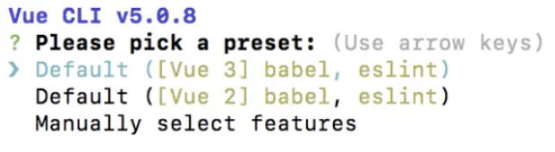

### 一、安装脚手架

---

```bash
npm install -g @vue/cli
```

检查安装成功与否：

```bash
vue -V
```


### 二、创建vue项目

---

```bash
vue create chance-vue-element-plus-learn
```



选择 vue3


### 三、安装依赖

- element-plus模块

  ```bash
  npm add element-plus
  ```

- vue-router模块

  ```bash
  npm add vue-router
  ```

- axios模块，用于前后端交互

  ```bash
  npm add axios
  ```


### 四、修改App.vue

---

```vue
<template>
  <div id="app">
    <router-view></router-view>
  </div>
</template>

<script>
export default {
  name: 'App',
  components: {},
}
</script>

<style>
#app {
  font-family: Avenir, Helvetica, Arial, sans-serif;
  -webkit-font-smoothing: antialiased;
  -moz-osx-font-smoothing: grayscale;
  text-align: center;
  color: #2c3e50;
  margin-top: 5px;
}
</style>
```


### 五、修改main.js

---


