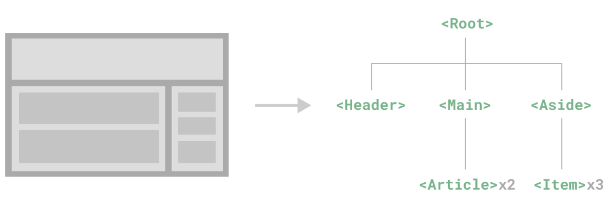
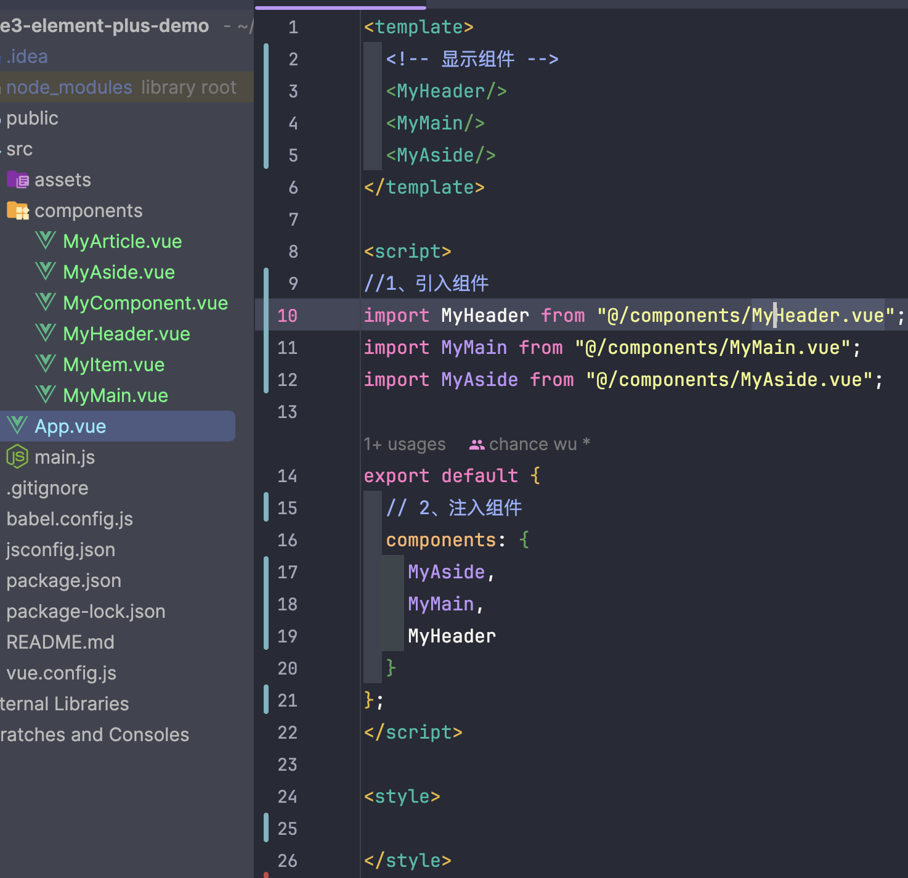
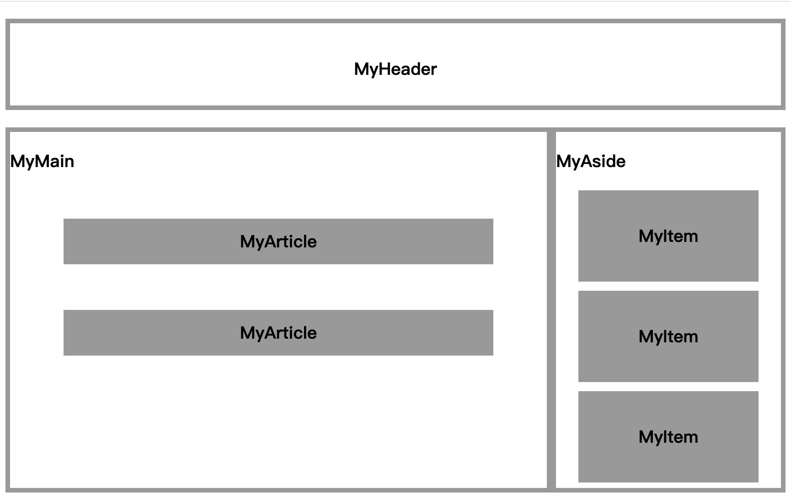

组件允许我们将 UI 划分为独立的、可重用的部分，并且可以对每个部分进行单独的思考。在实际应用中，组件常常被组织成层层嵌套的树状结构。



下面定义一些组件实现上述的树状嵌套关系，如下：





App.vue嵌入了MyHeader、MyMain、MyAside三个组件。

```vue
<template>
  <!-- 显示组件 -->
  <MyHeader/>
  <MyMain/>
  <MyAside/>
</template>

<script>
//1、引入组件
import MyHeader from "@/components/MyHeader.vue";
import MyMain from "@/components/MyMain.vue";
import MyAside from "@/components/MyAside.vue";

export default {
  // 2、注入组件
  components: {
    MyAside,
    MyMain,
    MyHeader
  }
};
</script>

<style>

</style>
```

MyHeader.vue

```vue
<script>

</script>

<template>
<h3>MyHeader</h3>
</template>

<style scoped>
h3{
  width: 100%;
  height: 100px;
  border: 5px solid #999 ;
  text-align: center;
  line-height: 100px;
  box-sizing: border-box;
}
</style>
```

 MyMain.vue嵌套了2个MyArticle

```vue
<script>
import MyArticle from "./MyArticle.vue";

export default {
  components: {
    MyArticle
  }
}
</script>

<template>
  <div class="myMain">
    <h3>MyMain</h3>
    <MyArticle/>
    <MyArticle/>
  </div>
</template>

<style scoped>
.myMain {
  float: left;
  width: 70%;
  height: 400px;
  border: 5px solid #999;
  box-sizing: border-box;
}
</style>
```

MyArticle.vue

```vue
<script>

</script>

<template>
  <h3>MyArticle</h3>
</template>

<style scoped>
h3 {
  width: 80%;
  margin: 0 auto;;
  text-align: center;
  line-height: 50px;
  box-sizing: border-box;
  margin-top: 50px;
  background: #999;
}
</style>
```

MyAside.vue嵌套了三个MyItem

```vue
<script>
import MyItem from "@/components/MyItem.vue";

export default {
  components: {
    MyItem
  }
}
</script>

<template>
  <div class="myAside">
    <h3>MyAside</h3>
    <MyItem/>
    <MyItem/>
    <MyItem/>
  </div>
</template>

<style scoped>
.myAside {
  float: right;
  width: 30%;
  height: 400px;
  border: 5px solid #999;
  box-sizing: border-box;
}
</style>
```

MyItem.vue

```vue
<script>
export default {
  name: "MyItem"
}
</script>

<template>
  <h3>MyItem</h3>
</template>

<style scoped>
h3 {
  width: 80%;
  margin: 0 auto;;
  text-align: center;
  line-height: 100px;
  box-sizing: border-box;
  margin-top: 10px;
  background: #999;
}
</style>
```

